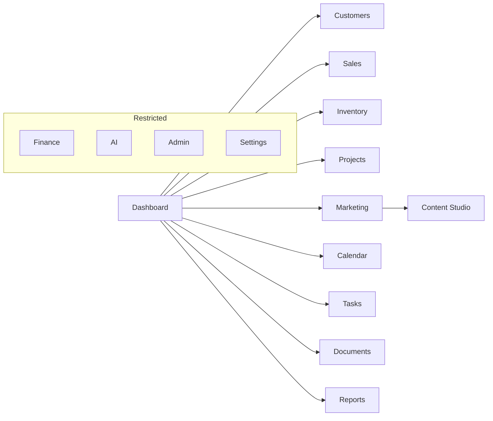

# 03 — Proposed Navigation

**UXR1 · Staff OS sidebar (target)**  
**Rule:** Hide technical platform modules from normal users.

---

## Primary navigation

```
INVESTHOME OS
────────────────────────────────
COMMAND
  Dashboard

WORK
  Customers
  Sales
  Inventory
  Projects

GROW
  Marketing
  Content Studio          → /dashboard/marketing/content

COORDINATE
  Calendar
  Tasks
  Documents
  Reports

────────────────────────────────
SECONDARY (role-gated)
  Finance
  AI
  Settings

ADMIN (admin only)
  Admin
  … (users, roles, platform — collapsed under Admin)
```

---

## Item → route → permission (proposal)

| Label | Route | Min permission (proposal) |
|-------|-------|---------------------------|
| Dashboard | `/dashboard` | authenticated |
| Customers | `/dashboard/customers` | customers/leads/investors view (unified) |
| Sales | `/dashboard/sales` | sales/leads view |
| Inventory | `/dashboard/inventory` | inventory view |
| Projects | `/dashboard/projects` | projects view |
| Marketing | `/dashboard/marketing` | marketing view |
| Content Studio | `/dashboard/marketing/content` | marketing content view |
| Calendar | `/dashboard/calendar` | calendar/tasks view |
| Tasks | `/dashboard/tasks` | tasks view |
| Documents | `/dashboard/documents` | documents/knowledge view |
| Reports | `/dashboard/reports` | reports or analytics view (narrow) |
| Finance | `/dashboard/finance` | finance view |
| AI | `/dashboard/ai` | AI workspace view |
| Settings | `/dashboard/settings` | settings/company view |
| Admin | `/dashboard/admin` | admin |

---

## Removed from normal nav (still exist)

CRM workspace rail, Marketing 30-item rail, BI explorer, Automation, Design Studio (product), Activity feed (optional under Dashboard), Onboarding/Training (Help menu), Company org tree, Executive as separate top item (fold into Dashboard for execs), Platform G15 children.

---

## Secondary rails

**Proposal:** Eliminate dual CRM/Marketing rails for normal users. Deep tools open as **in-page sections / tabs**, not a second sidebar. Power users may later get a “Advanced” toggle (post-approval).

---

## Mermaid IA


