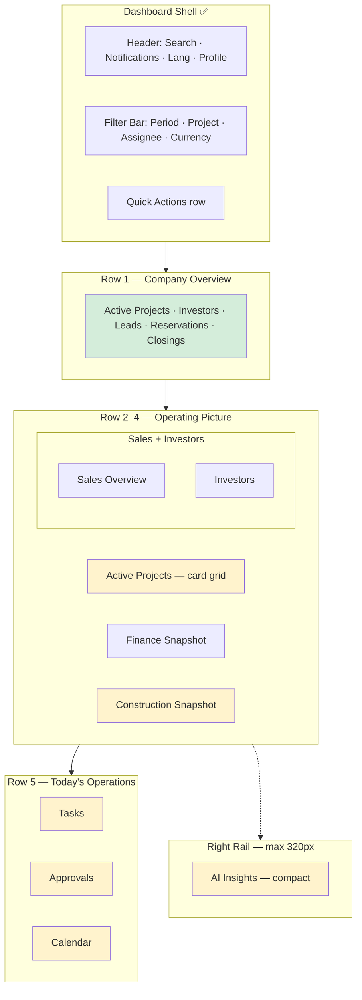
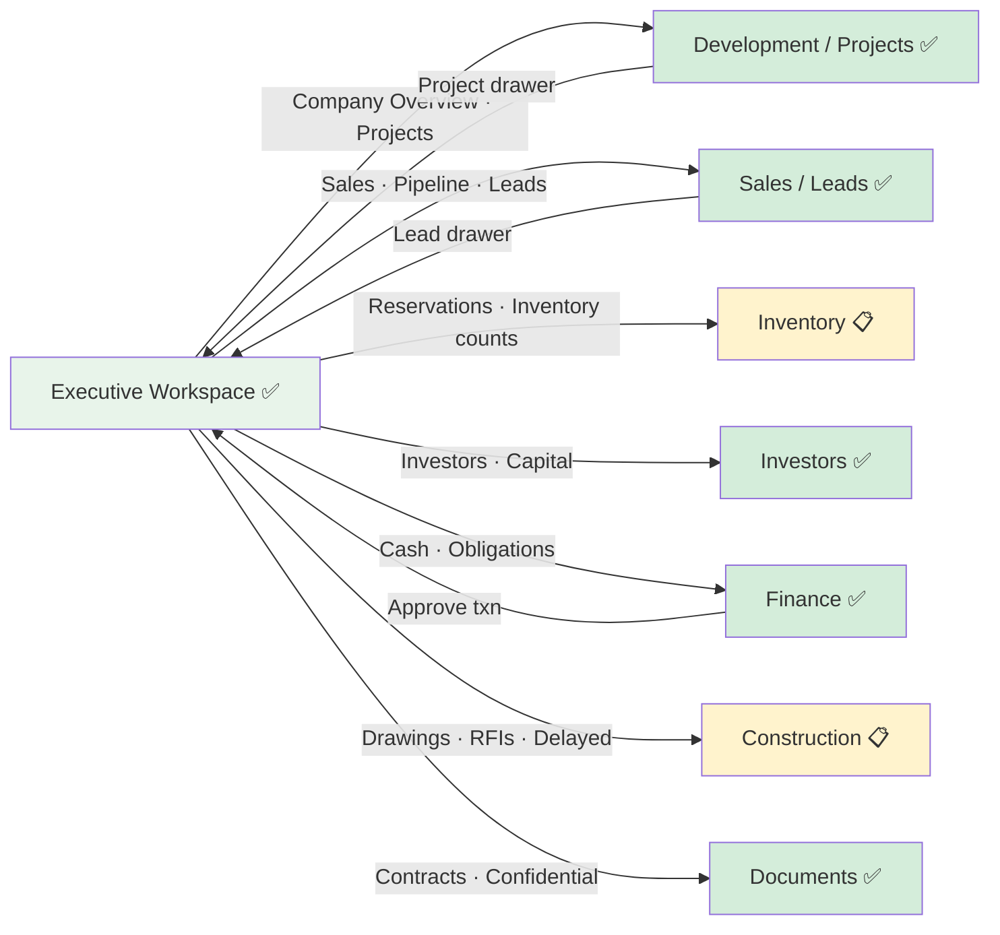

# Investhome OS — Executive Workspace

**Document type:** Product Design Sprint 3A deliverable  
**Last updated:** 2026-07-16  
**Audience:** Product, design, engineering, leadership  
**Status:** Target UX blueprint (with implementation honesty)

**Related governance:** [INFORMATION_ARCHITECTURE.md](./INFORMATION_ARCHITECTURE.md) · [HOME_EXPERIENCE.md](./HOME_EXPERIENCE.md) · [WORKSPACE_NAVIGATION.md](./WORKSPACE_NAVIGATION.md) · [WORKSPACE_FRAMEWORK.md](./WORKSPACE_FRAMEWORK.md) · [WORKSPACE_ARCHITECTURE.md](./WORKSPACE_ARCHITECTURE.md) · [PRODUCT_VISION.md](./PRODUCT_VISION.md) · [DOMAIN_MODEL.md](./DOMAIN_MODEL.md) · [PERMISSION_MODEL.md](./PERMISSION_MODEL.md) · [DESIGN_LANGUAGE.md](./DESIGN_LANGUAGE.md) · [ROADMAP.md](./ROADMAP.md) · [IMPLEMENTATION_STATUS.md](./IMPLEMENTATION_STATUS.md) · [UNITS_INVENTORY_BLUEPRINT.md](./UNITS_INVENTORY_BLUEPRINT.md)

> **Scope:** This document defines the **Executive Workspace** as a leadership **decision workspace** — not a passive reporting dashboard and not a duplicate of Home. Documentation only; no React implementation in Sprint 3A.

---

## Implementation Legend

| Marker | Meaning |
|--------|---------|
| ✅ **Implemented** | Route, API, and UI exist in repository |
| 🟡 **Partial** | Some surfaces exist; gaps documented |
| 📋 **Planned** | Target blueprint; no production widget yet |
| 🔵 **Blueprint** | Specification complete; zero code |

**Repository truth always overrides this document** — see [IMPLEMENTATION_STATUS.md](./IMPLEMENTATION_STATUS.md).

**Current route:** `/dashboard/executive` — `executive-workspace.tsx` ✅ with 8 API endpoints ✅

---

## SECTION 1 — Purpose

### Executive Workspace is NOT

| Misconception | Why it is wrong |
|---------------|-----------------|
| **A reporting dashboard** | Static KPI grids without action paths belong in BI tools. Executive must surface **decisions**, not just numbers. |
| **Home** | Home is the **personal command center** for every role ([HOME_EXPERIENCE.md](./HOME_EXPERIENCE.md) H7). Executive is **role-gated strategic operations** for leadership. |
| **A CRM or project list** | Lead tables and project CRUD live in Sales and Development workspaces. Executive **aggregates and routes** — it does not replace canonical lists. |
| **An AI-first screen** | AI assists in a compact side panel; it must not dominate layout or auto-execute mutations ([AI_PRINCIPLES.md](./AI_PRINCIPLES.md)). |

### Executive Workspace IS

The **Daily Operating Center for Leadership** — where CEO, COO, Executive Assistant, and Operations Director start each day to **decide what matters**, **approve what blocks progress**, and **drill into owning workspaces** with one click.

| Purpose | Description | Status |
|---------|-------------|--------|
| **Decision workspace** | Every section answers: *What needs my decision today? Where do I go next?* | 🟡 Attention + deadlines ✅; Tasks/Approvals/Calendar 📋 |
| **Portfolio pulse** | Cross-project view of sales, capital, construction, and treasury — permission-filtered | 🟡 Summary + financial + pipeline ✅ |
| **Risk surfacing** | Funding gaps, budget variance, inactive pipeline, overdue obligations — ranked by severity | 🟡 `build_attention_items` ✅ |
| **Action routing** | Cards and rows deep-link to Projects, Finance, Leads, Investors, Documents — never dead ends | 🟡 `moduleHref` links ✅; cross-workspace chips 📋 |
| **Compact AI assist** | Today's priorities, risks, opportunities — narrative, not a second dashboard | 📋 |

### Separation from Home and other workspaces

```
Login → Home (personal triage, all roles)     → Workspaces (deep work)
              ↓
        Executive (leadership decision center — executive.view only)
              ↓
        Entity drawer in owning workspace (Projects, Finance, Leads, …)
```

| Surface | Optimizes for | Primary user |
|---------|---------------|--------------|
| **Home** | Time-to-first-action (personal) | All authenticated users |
| **Executive** | Time-to-decision (portfolio) | `executive`, `partner`, `super_admin` |
| **Finance / Sales / …** | Time-to-completion (domain work) | Functional roles |

Aligns with IA principle P7 ([INFORMATION_ARCHITECTURE.md §13](./INFORMATION_ARCHITECTURE.md#section-13--ia-principles)) and Home principle H7 ([HOME_EXPERIENCE.md §18](./HOME_EXPERIENCE.md#section-18--home-design-principles)).

---

## SECTION 2 — Target Users

Primary personas and how the workspace adapts. All content is **permission-gated** via `executive.view` plus underlying entity read permissions ([PERMISSION_MODEL.md](./PERMISSION_MODEL.md)).

| Persona | Role code(s) | Daily emphasis | Prominent sections | Status |
|---------|--------------|----------------|-------------------|--------|
| **CEO** | `executive`, `partner` | Portfolio health, capital, closings, board prep | Company Overview, Finance, Investors, Approvals, AI Risks | 🟡 Overview ✅; Approvals 📋 |
| **COO** | `executive`, `operations` | Delivery, construction, project status | Active Projects, Construction, Tasks, Calendar | 🟡 Projects table ✅; Construction/Tasks/Calendar 📋 |
| **Executive Assistant** | `assistant` (future exec delegate) | Calendar, approvals queue, document uploads | Calendar, Approvals, Tasks, Quick Actions | 📋 |
| **Operations Director** | `operations`, `executive` | Pipeline, reservations, inspections, RFIs | Sales Overview, Construction, Tasks | 🟡 Sales pipeline ✅; Reservations/RFIs 📋 |

**Adaptation rule:** Widgets **hide entirely** when the user lacks permission to view underlying data — never show locked placeholders that leak entity existence across confidentiality boundaries (same rule as Home H10).

**Demo access today:** `executive` and `super_admin` demo logins ✅; `partner` role seeded but **no demo login** 🟡 ([IMPLEMENTATION_STATUS.md](./IMPLEMENTATION_STATUS.md)).

---

## SECTION 3 — Executive Layout

Ten content sections plus global shell. Layout follows [WORKSPACE_FRAMEWORK.md §2](./WORKSPACE_FRAMEWORK.md#section-2--universal-workspace-layout) regions: Header → Toolbar/Filters → Main Content → optional AI Panel.

### Section inventory (target)

| # | Section | Zone | Priority | Status |
|---|---------|------|----------|--------|
| 1 | **Company Overview** | Top — full width | T0 | 🟡 Summary cards ✅; reservations/closings 📋 |
| 2 | **Active Projects** | Main — hero cards | T1 | 🟡 Portfolio **table** today; **cards** 📋 |
| 3 | **Sales Overview** | Main — left column | T1 | 🟡 Pipeline chart ✅ |
| 4 | **Investors** | Main — right column | T1 | 🟡 Overview metrics ✅ |
| 5 | **Finance Snapshot** | Main — full width | T1 | 🟡 Cash + cash flow ✅ |
| 6 | **Construction Snapshot** | Main — half width | T2 | 📋 No construction entity data |
| 7 | **Tasks** | Main — quarter grid | T2 | 📋 Task entity not implemented |
| 8 | **Approvals** | Main — quarter grid | T1 | 📋 Unified queue not built |
| 9 | **Calendar** | Side rail / quarter | T2 | 📋 Event entity not implemented |
| 10 | **AI Insights** | Right panel — compact | T3 | 📋 No executive AI panel |

### Page structure (target layout)



### ASCII layout (desktop ≥1280px)

```
┌──────────┬────────────────────────────────────────────────────────────┬──────────┐
│          │ [⌘K] · Notifications · TR/EN · Profile                      │          │
│ SIDEBAR  ├────────────────────────────────────────────────────────────┤ AI Panel │
│          │ Executive · Daily decision center          [Quick Actions] │ (compact)│
│          │ [Period ▾] [Project ▾] [Assignee] [Currency]               │ 📋       │
│          ├────────────────────────────────────────────────────────────┤          │
│          │ COMPANY OVERVIEW — 5 KPI tiles                             │ Priorities│
│          ├────────────────────────────────────────────────────────────┤ Risks    │
│          │ ACTIVE PROJECTS — card grid (not table)                    │ Opps     │
│          ├──────────────────────────────┬─────────────────────────────┤          │
│          │ SALES OVERVIEW               │ INVESTORS                   │          │
│          ├──────────────────────────────┴─────────────────────────────┤          │
│          │ FINANCE SNAPSHOT                                           │          │
│          ├──────────────────────────────┬─────────────────────────────┤          │
│          │ CONSTRUCTION SNAPSHOT        │ (spacer / alerts)           │          │
│          ├──────────┬──────────┬────────┴─────────────────────────────┤          │
│          │ TASKS    │ APPROVALS│ CALENDAR                           │          │
│          └──────────┴──────────┴────────────────────────────────────┴──────────┘
```

### Current vs target layout

| Target section | Today (`executive-workspace.tsx`) | Gap |
|----------------|-----------------------------------|-----|
| Company Overview | 8 summary stat cards (broader KPI set) | Missing Active Reservations, Upcoming Closings; card keys differ |
| Active Projects | Portfolio **table** with health columns | Cards with construction/sales/financial status 📋 |
| Sales Overview | Leads pipeline bar chart | Missing dedicated Reservations + Closings sub-widgets 📋 |
| Investors | Text metric list | 🟡 Functional; card layout 📋 |
| Finance Snapshot | Cash metrics + cash flow chart | Missing Receivables/Payables labels; Expected Closings 📋 |
| Construction Snapshot | — | 📋 Entire section |
| Tasks | — | 📋 Entity + UI |
| Approvals | Attention items overlap partially | 📋 Unified approval types |
| Calendar | Deadlines list (partial surrogate) | 📋 Meetings; deadlines 🟡 |
| AI Insights | — | 📋 Side panel |

---

## SECTION 4 — Company Overview

Top-row KPI tiles — **at-a-glance portfolio counts** with drill-down links. Distinct from deep Financial Snapshot (Section 7).

### Widgets

| Widget | Metric | Drill-down | Data source | Status |
|--------|--------|------------|-------------|--------|
| **Active Projects** | Count of `ACTIVE_PROJECT_STATUSES` | `/dashboard/projects?status=active` | `build_executive_summary` → `active_projects` | ✅ |
| **Active Investors** | Non-archived investors in active statuses | `/dashboard/investors` | `active_investors` card | ✅ |
| **Active Leads** | Non-archived leads in pipeline | `/dashboard/leads` | `total_leads` card | ✅ |
| **Active Reservations** | Units on hold with unexpired reservation | `/dashboard/inventory?tab=reservations` | UnitReservation (planned) | 📋 Inventory module |
| **Upcoming Closings** | Leads `negotiation`/`won` + obligations due ≤30d | `/dashboard/leads` + Finance obligations | Leads + PaymentObligation | 🟡 Partial via deadlines |

### Interaction

- Each tile is a **linked card** ([DESIGN_LANGUAGE.md §6](./DESIGN_LANGUAGE.md#section-6--executive-components)) — click navigates to owning workspace with filter pre-applied.
- Period filter applies where metrics are period-scoped; counts like Active Projects use **current snapshot** regardless of period (document in UI tooltip).
- Comparison delta shown when API provides `comparison.change_available` 🟡 — many cards return `change_available: false` today.

### Current implementation mapping

Today’s summary grid includes **additional** cards not in the 3A target set: `qualified_leads`, `total_investment_capacity`, `total_portfolio_value`, `available_cash`, `remaining_funding_need`. **Sprint 3B** should reconcile: promote the five target widgets above the fold; move treasury cards to Finance Snapshot or collapse into overflow.

---

## SECTION 5 — Projects

**Project cards, not tables** — visual scan for leadership. Target replaces today’s portfolio health table.

### Card anatomy

```
┌─────────────────────────────────────────┐
│ [Health badge]  Project Name            │
│ Status · Completion %                   │
├─────────────────────────────────────────┤
│ Construction: [on_track | delayed | …]   │
│ Sales:        [available | reserved | …] │
│ Financial:    [on_track | gap | …]       │
├─────────────────────────────────────────┤
│ Completion target: 15 Mar 2027          │
│ [Quick Open →]                          │
└─────────────────────────────────────────┘
```

### Card fields

| Field | Source | Status |
|-------|--------|--------|
| **Name** | `Project.project_name` | ✅ |
| **Status** | `Project.status` | ✅ |
| **Completion** | `completion_target` + derived % (future: milestone rollup) | 🟡 Date only |
| **Construction Status** | Aggregate `Unit.construction_status` (planned) or project-level proxy | 📋 Units module |
| **Sales Status** | Aggregate `Unit.sales_status` / absorption | 📋 Units module |
| **Financial Status** | `health_status` from `build_project_portfolio` | ✅ |
| **Quick Open** | `/dashboard/projects?id={uuid}` | 🟡 Links to list; drawer deep link 📋 |

### Sort and filter

- Default sort: `health_status` severity (at_risk → attention → on_track), then `completion_target` ascending.
- Respect global project filter from filter bar ✅.
- Max **6 cards** visible; "View all projects" → Development workspace.

### Current state

🟡 **Partial** — `GET /executive/project-portfolio` returns `ProjectHealthRow[]` rendered as **table** in `executive-workspace.tsx`. Card grid UI and tri-status dimensions are **blueprint only**.

---

## SECTION 6 — Sales

Pipeline health, inventory holds, and revenue timing — without replacing the Sales workspace.

### Sub-widgets

| Widget | Content | Drill-down | Status |
|--------|---------|------------|--------|
| **Lead Pipeline** | Stages NEW → NEGOTIATION with counts + budget | `/dashboard/leads?status={stage}` | ✅ `PipelineChart` |
| **Reservations** | Active count, expiring ≤7d, by project | `/dashboard/inventory` reservations | 📋 |
| **Closings** | Won in period, obligations tagged closing, expected sale proceeds | Finance + Leads | 🟡 `won_in_period` in pipeline API |
| **Conversion Rate** | Qualified → Won % in period | — | 🟡 API returns `conversion_rate` — **not displayed in UI** |

### Interim path (until Inventory)

- **Reservations:** Hide widget or show honest empty state: "Reservations — available when Inventory ships" with link to [UNITS_INVENTORY_BLUEPRINT.md](./UNITS_INVENTORY_BLUEPRINT.md).
- **Closings:** Compose from Executive deadlines (`deadline_type` = obligation / commitment) 🟡 + leads WON count ✅.

---

## SECTION 7 — Finance

Treasury snapshot for leadership decisions — cash, receivables, payables, expected closings.

### Widgets

| Widget | Metric | API field (today) | Status |
|--------|--------|-------------------|--------|
| **Cash** | Available cash by currency | `financial.available_cash` | ✅ |
| **Receivables** | Income in period + outstanding receivable obligations | `income_in_period`; obligations filter 📋 | 🟡 |
| **Payables** | Expenses + upcoming + overdue payments | `expenses_in_period`, `upcoming_payments`, `overdue_payments` | 🟡 |
| **Expected Closings** | Sale proceeds / funding expected in period | Projected sale value + obligations 📋 | 📋 |

### Visualization

- **Cash Flow** dual-bar trend per period ✅ `.executive__cashflow`
- Currency filter from filter bar ✅ — **FX conversion not implemented** (TD-14)
- Hardcoded `USD` in several UI formatters 🟡 — align with user locale + record currency in Sprint 3B

### Drill-down

| Widget | Target route |
|--------|--------------|
| Cash | `/dashboard/finance?tab=accounts` |
| Receivables / Payables | `/dashboard/finance?tab=obligations` |
| Expected Closings | `/dashboard/finance?tab=transactions` |

---

## SECTION 8 — Construction

Site and delivery pulse — **blocked on Units & Inventory** and Construction workspace for full fidelity.

### Widgets

| Widget | Content | Data source | Status |
|--------|---------|-------------|--------|
| **Delayed Projects** | Projects past completion_target or `construction_status` delayed | Unit aggregates (planned) | 📋 |
| **Upcoming Inspections** | Scheduled inspections (Event entity) | Calendar / Construction | 📋 |
| **Open RFIs** | Request-for-information count by project | Construction workspace | 📋 |
| **Open Punch Items** | Snag list open count | Tasks / Construction | 📋 |

### Interim path (today)

| Widget | Surrogate | Status |
|--------|-----------|--------|
| Delayed Projects | Projects with `health_status=at_risk` + past `completion_target` | 🟡 Partial via portfolio |
| Upcoming Inspections | Executive **Deadlines** filtered by type | 🟡 |
| Open RFIs | — | 📋 |
| Open Punch Items | Drawing proposals pending (`documents.approve`) | 🟡 Via Documents |

Show section header with **"Limited data — Construction workspace coming soon"** badge ([WORKSPACE_NAVIGATION.md N13](./WORKSPACE_NAVIGATION.md#section-3--navigation-principles)).

---

## SECTION 9 — Tasks

Personal and org-wide action items for leadership — **Task entity not in domain model** ([DOMAIN_MODEL.md](./DOMAIN_MODEL.md)).

### Sub-sections

| Section | Content | Status |
|---------|---------|--------|
| **Today** | Due today, assigned to user or org | 📋 |
| **Overdue** | Past due — critical accent | 📋 |
| **Waiting** | Blocked on external party | 📋 |
| **Completed** | Last 7 days — collapsed | 📋 |

### Interim surrogates (until `/dashboard/tasks`)

| Signal | Source | Status |
|--------|--------|--------|
| Lead follow-ups | Notifications: inactive lead rules | 🟡 |
| Payment actions | Finance obligations due | ✅ |
| Drawing review | Notification: proposal pending | 🟡 |
| Executive attention | `GET /executive/attention` | ✅ |

**UX rule:** Show Tasks widget shell with honest empty state linking to Notifications + Attention — **never fake task rows** ([HOME_EXPERIENCE.md §12](./HOME_EXPERIENCE.md#section-12--tasks)).

---

## SECTION 10 — Approvals

Unified **pending approval queue** across domains — single list, typed rows, one-click navigate to approve.

### Approval types

| Type | Source | Approver permission | Deep link | Status |
|------|--------|---------------------|-----------|--------|
| **Price Changes** | `UnitPrice` history | `units.approve` (planned) | Unit drawer → pricing | 📋 Inventory |
| **Reservations** | `UnitReservation` | `units.approve` | Reservation manager | 📋 Inventory |
| **Ownership** | `UnitOwnership` transfers | `units.approve` / finance | Unit → ownership tab | 📋 Inventory |
| **Design Reviews** | Design studio review workflow | `design.approve` | `/dashboard/design?id=` | 🟡 Backend exists |
| **Documents** | Confidential review queue | `documents.view_confidential` | Document drawer | 🟡 |
| **Finance transactions** | Pending approve status | `finance.approve` | Finance transaction drawer | 🟡 |

*Note: Target spec lists Price Changes, Reservations, Ownership, Design Reviews, Documents. Finance approvals are included as they exist today.*

### Row layout

```
[Type icon] [Entity name] · [Context]          [Age badge]  [Review →]
```

### Sort order

1. Critical priority (mapped from notifications)
2. Oldest pending first (FIFO within tier)
3. Items assigned to current user before org-wide queue

### Overlap with Attention Required

Today **Attention Required** ✅ surfaces many of the same signals (overdue payments, funding gaps, inactive leads). **Sprint 3B** should split: **Approvals** = explicit human approve actions; **Attention** = awareness/risk without pending approve button.

**Status:** 📋 Unified Approvals widget not implemented; individual approve flows 🟡 exist in Finance and Documents.

---

## SECTION 11 — Calendar

Meetings and milestones — depends on **Event/Calendar entity** (not implemented).

### Sub-sections

| Section | Content | Status |
|---------|---------|--------|
| **Today's meetings** | Time, title, attendees, linked project/investor | 📋 |
| **This week's meetings** | Next 7 days beyond today | 📋 |

### Interim path

- **Executive Deadlines** ✅ — milestone dates, obligation due dates, commitment follow-ups — display under Calendar widget header as **"Upcoming deadlines"** with badge "Calendar coming soon" ([HOME_EXPERIENCE.md §11](./HOME_EXPERIENCE.md#section-11--meetings)).
- Settings → Integrations calendar provider placeholder 🟡 — no sync.

### Target integration

- Native Event entity or external calendar sync (MD-08 in [INFORMATION_ARCHITECTURE.md](./INFORMATION_ARCHITECTURE.md))
- Deep link: `/dashboard/calendar?id={event_id}`

---

## SECTION 12 — AI Panel

**Compact right rail** (280–320px) — supplementary, collapsible, never dominant ([DESIGN_LANGUAGE.md §8](./DESIGN_LANGUAGE.md#section-8--right-ai-panel), MD-12).

### Panel sections

| Section | Content | Max height | Status |
|---------|---------|------------|--------|
| **Today's priorities** | 3–5 ranked items with explainability | ~40% panel | 📋 |
| **Risks** | Narrative bullets from attention + anomalies | ~35% panel | 🟡 Data exists; narrative 📋 |
| **Opportunities** | Pipeline wins, funding headroom, absorption | ~25% panel | 📋 |

### Rules (Executive-specific)

| # | Rule |
|---|------|
| E-AI1 | Panel **collapsed by default** on viewports <1280px |
| E-AI2 | Panel **≤20% of content width** on desktop |
| E-AI3 | No auto-refresh more than once per 15 min without user action |
| E-AI4 | Footer: "L2 heuristic · Generated HH:MM" per [AI_PRINCIPLES.md](./AI_PRINCIPLES.md) |
| E-AI5 | Recommended actions link to Approvals or workspace — never one-click mutate |
| E-AI6 | Reuse `build_attention_items` + `build_deadlines` — do not duplicate logic ([HOME_EXPERIENCE.md REC-H9](./HOME_EXPERIENCE.md#deliverables-summary)) |

### Target API

```
GET /executive/ai-insights?date_from=&date_to=&project_id=
→ { priorities[], risks[], opportunities[], generated_at, ai_level }
```

**Status:** 📋 No endpoint or UI. Nearest: Attention list + Home AI Morning Brief spec (planned separately).

---

## SECTION 13 — Quick Actions

One-click entry to **create flows** in owning workspaces — Executive hosts links only ([INFORMATION_ARCHITECTURE.md G5](./INFORMATION_ARCHITECTURE.md#section-5--global-features)).

### Target actions

| Action | Target | Permission | Status |
|--------|--------|------------|--------|
| **New Lead** | `/dashboard/leads` → create modal | `leads.create` | 🟡 Link only; modal on navigate ✅ |
| **New Investor** | `/dashboard/investors` → create modal | `investors.create` | 🟡 Same |
| **New Project** | `/dashboard/projects` → create modal | `projects.create` | 🟡 Same |
| **New Task** | `/dashboard/tasks` → create | TBD `tasks.create` | 📋 |
| **Upload Document** | `/dashboard/documents` → upload panel | `documents.create` | 🟡 Route exists; not in exec quick actions today |

### Current quick actions (implemented)

Today `executive-workspace.tsx` shows: Add Lead, Add Investor, Add Project, Add Transaction, Add Payment Obligation, Add Funding Commitment — **finance-heavy** 🟡. Sprint 3B aligns to target five actions + preserves finance actions in overflow menu.

### Placement

- Toolbar row below filter bar, right-aligned on desktop
- Mobile: collapse to FAB or "Actions" dropdown ([INFORMATION_ARCHITECTURE.md §11](./INFORMATION_ARCHITECTURE.md#section-11--mobile-strategy))

---

## SECTION 14 — Navigation

Executive is a **hub** — every section must expose exit ramps to operational workspaces ([WORKSPACE_FRAMEWORK.md §10](./WORKSPACE_FRAMEWORK.md#section-10--related-records)).

### Navigation map



### Workspace routing table

| From Executive section | User intent | Target workspace | Route | Status |
|------------------------|-------------|------------------|-------|--------|
| Active Projects card | Open project detail | Development | `/dashboard/projects?id={uuid}` | 🟡 List link only |
| Sales pipeline stage | Review leads in stage | Sales | `/dashboard/leads?status={stage}` | ✅ |
| Reservations tile | Manage holds | Inventory | `/dashboard/inventory?tab=reservations` | 📋 |
| Investor metrics | Review commitments | Investors | `/dashboard/investors` | ✅ |
| Finance cash | Treasury detail | Finance | `/dashboard/finance?tab=accounts` | 🟡 Tab via manual nav |
| Construction delayed | Site status | Construction | `/dashboard/construction?project_id=` | 📋 |
| Approval row (document) | Review file | Documents | `/dashboard/documents?id={uuid}` | 🟡 |
| Attention item | Resolve risk | Entity-specific | `moduleHref(link_module, link_query)` | ✅ |

### Cross-workspace link pattern (target)

Per [WORKSPACE_NAVIGATION.md §8](./WORKSPACE_NAVIGATION.md#section-8--cross-workspace-navigation):

```typescript
// Target — documentation only
<CrossWorkspaceLink
  workspace="finance"
  href="/dashboard/finance?tab=obligations&project_id={id}"
  label={t('executive.openInFinance')}
/>
```

**Today:** Summary cards and attention items use `moduleHref()` ✅; portfolio project name links to projects list without drawer open 🟡.

### Global navigation (unchanged)

Executive users retain **Global Search** (`Ctrl+K`) ✅, **Notifications** ✅, **Activity** (`/dashboard/activity`) ✅, and sidebar workspace switcher ✅.

---

## SECTION 15 — Localization

All Executive strings ship **Turkish default, English supported** — same platform i18n model ([CODING_STANDARDS.md](./CODING_STANDARDS.md)).

| Aspect | Specification | Status |
|--------|---------------|--------|
| **Default locale** | Turkish (`tr`) | ✅ |
| **Fallback** | English merge-over-Turkish for missing keys | ✅ |
| **Namespace** | `executive.*` in `messages/tr.json` + `en.json` | 🟡 Exists; gaps for new widgets |
| **Attention i18n** | Server-driven `title_key` / `description_key` under `executive.attention.*` | ✅ |
| **Dates/numbers** | `tr-TR` / `en-US` via `formatShortDate`, `formatMoney` | 🟡 USD hardcoded in places |
| **Period presets** | `executive.filters.*` | ✅ |
| **New 3A widgets** | Add TR/EN before UI ships | 📋 Required in Sprint 3B |

### New keys required (Sprint 3B preview)

- `executive.companyOverview.*` — five tile labels
- `executive.projects.card.*` — construction/sales/financial status labels
- `executive.construction.*` — snapshot + empty states
- `executive.tasks.*`, `executive.approvals.*`, `executive.calendar.*`
- `executive.aiPanel.*` — priorities, risks, opportunities
- `executive.quickActions.uploadDocument`, `newTask`

---

## SECTION 16 — Acceptance Criteria

Measurable criteria for Executive Workspace **target state** (post Sprint 3B implementation).

### Layout and UX

| ID | Criterion | Measure |
|----|-----------|---------|
| EW-01 | Ten sections render in documented order | Visual QA checklist |
| EW-02 | Company Overview shows exactly five target KPI tiles | DOM / screenshot test |
| EW-03 | Active Projects render as **cards**, not primary table | Component audit |
| EW-04 | AI panel ≤320px and collapsible | CSS + responsive test |
| EW-05 | AI panel never exceeds 20% content width at 1280px | Layout measure |

### Data and honesty

| ID | Criterion | Measure |
|----|-----------|---------|
| EW-06 | Reservations widget hidden or empty until Inventory ships | Permission + feature flag test |
| EW-07 | Tasks widget shows honest "coming soon" without fake rows | UX audit |
| EW-08 | Calendar shows deadlines surrogate + "Calendar coming soon" badge | i18n + UI test |
| EW-09 | No fabricated numbers in AI panel when API fails | Error injection test |

### Navigation and permissions

| ID | Criterion | Measure |
|----|-----------|---------|
| EW-10 | Every card/row navigates to workspace with context | E2E link test |
| EW-11 | `executive.view` required; 403 without permission | API test ✅ exists |
| EW-12 | Underlying entity permission respected in aggregates | Integration test |
| EW-13 | Quick Actions hidden without `create` permission | Permission matrix QA |

### Performance

| ID | Criterion | Measure |
|----|-----------|---------|
| EW-14 | Shell + Company Overview paint <500ms | Performance trace |
| EW-15 | Independent section loading (skeleton per section) | 🟡 Pattern exists ✅ |
| EW-16 | AI insights lazy-load after T1 sections | Network waterfall |

### i18n and accessibility

| ID | Criterion | Measure |
|----|-----------|---------|
| EW-17 | All new strings in TR + EN | i18n audit |
| EW-18 | Health/severity not color-only | a11y audit |
| EW-19 | Keyboard reachable Quick Actions | a11y audit |

### API

| ID | Criterion | Measure |
|----|-----------|---------|
| EW-20 | Existing 8 endpoints remain backward compatible | Regression test ✅ |
| EW-21 | New endpoints documented: `/executive/approvals`, `/executive/ai-insights` | OpenAPI review |
| EW-22 | Filter params consistent across all endpoints | Contract test ✅ |

---

## DELIVERABLE: Page Structure

See **Section 3** mermaid and ASCII diagrams. Loading tier model extends [HOME_EXPERIENCE.md §16](./HOME_EXPERIENCE.md#section-16--performance):

| Tier | Sections | Target SLA |
|------|----------|------------|
| **T0** | Shell, filters, Company Overview skeleton | <200ms |
| **T1** | Company Overview data, Attention, Active Projects | <500ms |
| **T2** | Sales, Investors, Finance, Approvals | <800ms |
| **T3** | Construction, Tasks, Calendar, Activity | <2s |
| **T4** | AI Panel (on expand) | <2s |

---

## DELIVERABLE: Widget List (Comprehensive)

| Section | Widget | Priority | API / Source | Route / Link | Status |
|---------|--------|----------|--------------|--------------|--------|
| **Global** | Period + project filter bar | P0 | Client + all `/executive/*` | — | ✅ |
| **Global** | Quick Actions | P1 | — | Workspace create routes | 🟡 |
| **Global** | Notification summary | P2 | `/notifications/summary` | Notification drawer | ✅ |
| **Company Overview** | Active Projects count | P0 | `/executive/summary` | `/dashboard/projects` | ✅ |
| **Company Overview** | Active Investors count | P0 | `/executive/summary` | `/dashboard/investors` | ✅ |
| **Company Overview** | Active Leads count | P0 | `/executive/summary` | `/dashboard/leads` | ✅ |
| **Company Overview** | Active Reservations | P1 | Inventory API (planned) | `/dashboard/inventory` | 📋 |
| **Company Overview** | Upcoming Closings | P1 | Deadlines + leads WON | Leads + Finance | 🟡 |
| **Active Projects** | Project card grid | P0 | `/executive/project-portfolio` | `/dashboard/projects?id=` | 🟡 Table today |
| **Active Projects** | Health badge | P0 | `health_status` | — | ✅ |
| **Active Projects** | Construction status chip | P1 | Unit rollup | — | 📋 |
| **Active Projects** | Sales status chip | P1 | Unit rollup | — | 📋 |
| **Active Projects** | Financial status chip | P0 | `health_status` | — | ✅ |
| **Sales** | Lead pipeline chart | P0 | `/executive/leads-pipeline` | `/dashboard/leads?status=` | ✅ |
| **Sales** | Conversion rate | P1 | `conversion_rate` | — | 🟡 API only |
| **Sales** | Reservations summary | P1 | Inventory | `/dashboard/inventory` | 📋 |
| **Sales** | Closings summary | P1 | Pipeline + obligations | Finance | 🟡 |
| **Investors** | Capacity / committed / funded | P0 | `/executive/investor-overview` | `/dashboard/investors` | ✅ |
| **Investors** | Status breakdown | P2 | `by_status` | — | 🟡 API only |
| **Finance** | Available cash | P0 | `/executive/financial-overview` | Finance accounts | ✅ |
| **Finance** | Receivables | P1 | Income + obligations | Finance obligations | 🟡 |
| **Finance** | Payables | P1 | Upcoming + overdue | Finance obligations | 🟡 |
| **Finance** | Expected closings | P2 | Projected sales | Finance | 📋 |
| **Finance** | Cash flow trend | P1 | `cash_flow_trend` | — | ✅ |
| **Construction** | Delayed projects | P1 | Unit/project aggregates | Construction | 📋 |
| **Construction** | Upcoming inspections | P2 | Calendar/events | Construction | 📋 |
| **Construction** | Open RFIs | P2 | Construction workspace | Construction | 📋 |
| **Construction** | Open punch items | P2 | Tasks/construction | Construction | 📋 |
| **Tasks** | Today | P1 | `/tasks` (planned) | `/dashboard/tasks` | 📋 |
| **Tasks** | Overdue | P1 | Tasks API | — | 📋 |
| **Tasks** | Waiting | P2 | Tasks API | — | 📋 |
| **Tasks** | Completed | P3 | Tasks API | — | 📋 |
| **Approvals** | Price changes | P1 | Unit prices | Inventory | 📋 |
| **Approvals** | Reservations | P1 | Unit reservations | Inventory | 📋 |
| **Approvals** | Ownership | P1 | Unit ownership | Inventory | 📋 |
| **Approvals** | Design reviews | P2 | Design studio | `/dashboard/design` | 🟡 |
| **Approvals** | Documents | P2 | Document queue | Documents | 🟡 |
| **Approvals** | Finance transactions | P1 | Finance approve queue | Finance | 🟡 |
| **Calendar** | Today's meetings | P1 | Calendar API | `/dashboard/calendar` | 📋 |
| **Calendar** | This week's meetings | P1 | Calendar API | — | 📋 |
| **Calendar** | Deadlines surrogate | P1 | `/executive/deadlines` | Entity links | ✅ |
| **AI Panel** | Today's priorities | P2 | `/executive/ai-insights` | — | 📋 |
| **AI Panel** | Risks | P2 | Attention + heuristics | — | 📋 |
| **AI Panel** | Opportunities | P3 | Pipeline + funding | — | 📋 |
| **Embedded** | Attention required | P0 | `/executive/attention` | Entity links | ✅ |
| **Embedded** | Recent activity | P2 | `/executive/activity` | Activity links | ✅ |

**Count:** 52 widget slots — **18 ✅**, **16 🟡**, **18 📋**

---

## DELIVERABLE: Navigation Map

### Executive → Workspace (primary paths)

| # | User action | Destination |
|---|-------------|-------------|
| 1 | Tap Active Leads tile | `/dashboard/leads` |
| 2 | Tap pipeline stage bar | `/dashboard/leads?status={stage}` |
| 3 | Open project card | `/dashboard/projects?id={uuid}` |
| 4 | Review funding gap attention | `/dashboard/finance?project_id={uuid}` |
| 5 | Approve finance item | `/dashboard/finance?tab=transactions&id={uuid}` |
| 6 | Review investor commitment | `/dashboard/investors?id={uuid}` |
| 7 | Upload contract (quick action) | `/dashboard/documents` + upload |
| 8 | Reserve unit (future) | `/dashboard/inventory?unit={uuid}` |
| 9 | Review drawing approval | `/dashboard/documents?id={uuid}` → drawing tab |
| 10 | Full activity history | `/dashboard/activity` |

### Sidebar context (when leaving Executive)

Users switch via `sidebar-nav.tsx` ✅ — Executive remains available when `hasPermission(user, 'executive', 'view')` ([PERMISSION_MODEL.md](./PERMISSION_MODEL.md)).

---

## DELIVERABLE: Risks

| # | Risk | Severity | Mitigation |
|---|------|----------|------------|
| ER-01 | **Executive duplicates Home** for CEO persona | High | Enforce P7/H7 — Home personal; Executive portfolio decisions; no AI brief on both |
| ER-02 | **Inventory delay blocks** Reservations, Ownership approvals, sales status on cards | Critical | Prioritize Units S1 per [ROADMAP.md](./ROADMAP.md); honest empty states until shipped |
| ER-03 | **Tasks/Calendar delay** leaves Operations zone empty | High | Deadlines + notifications surrogates; "Coming soon" badges |
| ER-04 | **Table → card migration** breaks muscle memory for existing users | Medium | Ship cards as default with "Compact table" toggle for one release |
| ER-05 | **AI panel scope creep** dominates layout | Medium | E-AI2 width cap; collapsed default; separate from Home Morning Brief |
| ER-06 | **Attention vs Approvals overlap** confuses users | Medium | Clear split: approve actions vs awareness items (Section 10) |
| ER-07 | **USD hardcoding** misleads TR executives | Medium | Use record currency + locale formatters in Sprint 3B |
| ER-08 | **8 parallel API calls** on filter change | Medium | BFF `/executive/dashboard` aggregator endpoint (optional) |
| ER-09 | **Construction section with no data** erodes trust | Low | Show limited-data badge; link to Documents interim path |
| ER-10 | **Permission leakage** in aggregates | High | Server-side filtering already in services ✅; audit new endpoints |

---

## DELIVERABLE: Recommendations

| # | Recommendation | Priority | Rationale |
|---|----------------|----------|-----------|
| REC-E01 | Implement project **card grid** replacing portfolio table | P0 | Core 3A UX distinction |
| REC-E02 | Trim Company Overview to **five target KPIs** | P0 | Reduce clutter; move cash to Finance |
| REC-E03 | Add **Approvals** widget reusing finance + drawing + design queues | P1 | Decision workspace mandate |
| REC-E04 | Surface **conversion_rate** already in API | P1 | Quick win |
| REC-E05 | Add **Upload Document** + **New Task** quick actions (task disabled until entity) | P1 | Match spec |
| REC-E06 | Build **Construction Snapshot** shell with delayed-project surrogate | P2 | Honest partial data |
| REC-E07 | Lazy-load **AI panel** via new `/executive/ai-insights` | P2 | After E1 brief template |
| REC-E08 | Extend `moduleHref` to open **entity drawers** (`?id=`) | P1 | [WORKSPACE_NAVIGATION.md REC-N03](./WORKSPACE_NAVIGATION.md#deliverable-recommendations) |
| REC-E09 | Add **`CrossWorkspaceLink`** on project cards | P2 | Finance + Inventory handoff |
| REC-E10 | Register **`units.view`** before reservation widgets | P0 | Permission gate for Inventory |
| REC-E11 | Optional BFF **`GET /executive/dashboard`** | P2 | Reduce parallel fetches |
| REC-E12 | Add Executive tests beyond current 4 | P1 | Cover new endpoints |

---

## APPENDIX A — API ↔ Section Mapping

| Endpoint | Service function | Primary section | Status |
|----------|------------------|-----------------|--------|
| `GET /executive/summary` | `build_executive_summary` | Company Overview | ✅ |
| `GET /executive/attention` | `build_attention_items` | Attention / AI Risks input | ✅ |
| `GET /executive/leads-pipeline` | `build_leads_pipeline` | Sales Overview | ✅ |
| `GET /executive/investor-overview` | `build_investor_overview` | Investors | ✅ |
| `GET /executive/project-portfolio` | `build_project_portfolio` | Active Projects | ✅ |
| `GET /executive/financial-overview` | `build_financial_overview` | Finance Snapshot | ✅ |
| `GET /executive/deadlines` | `build_deadlines` | Calendar (surrogate) | ✅ |
| `GET /executive/activity` | `build_activity_feed` | Activity embed | ✅ |
| `GET /executive/approvals` | — | Approvals | 📋 |
| `GET /executive/ai-insights` | — | AI Panel | 📋 |

**Filter contract (all endpoints):** `date_from`, `date_to`, `project_id`, `assigned_to`, `currency` — `ExecutiveFilters` schema ✅

---

## APPENDIX B — Current Implementation Reference

| File | Purpose | Status |
|------|---------|--------|
| `apps/web/src/app/dashboard/executive/_components/executive-workspace.tsx` | Executive UI | ✅ |
| `apps/web/src/lib/api/executive.ts` | API client + formatters | ✅ |
| `apps/api/src/investhome_api/api/routes/executive.py` | 8 routes | ✅ |
| `apps/api/src/investhome_api/services/executive_service.py` | Aggregation logic | ✅ |
| `apps/api/src/investhome_api/schemas/executive.py` | Pydantic models | ✅ |
| `apps/api/src/investhome_api/config/executive_config.py` | Thresholds | ✅ |
| `apps/api/tests/test_executive.py` | API tests (4) | 🟡 |

---

## APPENDIX C — Governance Cross-Reference

| Topic | Document |
|-------|----------|
| Executive in IA | [INFORMATION_ARCHITECTURE.md §4.1](./INFORMATION_ARCHITECTURE.md#41-executive) |
| Home separation | [HOME_EXPERIENCE.md §1](./HOME_EXPERIENCE.md#section-1--purpose) |
| Workspace layout framework | [WORKSPACE_FRAMEWORK.md §2](./WORKSPACE_FRAMEWORK.md#section-2--universal-workspace-layout) |
| Executive IODL components | [DESIGN_LANGUAGE.md §6](./DESIGN_LANGUAGE.md#section-6--executive-components) |
| Inventory dependency | [UNITS_INVENTORY_BLUEPRINT.md](./UNITS_INVENTORY_BLUEPRINT.md) |
| Permissions | [PERMISSION_MODEL.md](./PERMISSION_MODEL.md) |
| AI behavior | [AI_PRINCIPLES.md](./AI_PRINCIPLES.md) |
| Delivery sequence | [ROADMAP.md](./ROADMAP.md) |
| Implementation truth | [IMPLEMENTATION_STATUS.md](./IMPLEMENTATION_STATUS.md) |

---

## END — Recommend Sprint 3B: Executive Workspace Implementation

**Goal:** Implement the Sprint 3A blueprint in the web app and API — transform Executive from an analytics dashboard into a **decision workspace** with card-based projects, unified approvals, and honest placeholders for Tasks, Calendar, and Inventory.

### Sprint 3B scope (recommended)

| Phase | Deliverable | Depends on |
|-------|-------------|------------|
| **3B-1 — Layout refactor** | Ten-section grid; Company Overview five tiles; project card component | IODL executive components |
| **3B-2 — Navigation** | `?id=` drawer opens from cards; `CrossWorkspaceLink` | [WORKSPACE_FRAMEWORK.md](./WORKSPACE_FRAMEWORK.md) |
| **3B-3 — Approvals API + widget** | `GET /executive/approvals`; finance + design + document queues | Existing approve permissions |
| **3B-4 — Surrogate widgets** | Tasks shell, Calendar + deadlines, Construction limited-data | — |
| **3B-5 — Quick Actions** | Align to spec; permission gates | — |
| **3B-6 — AI panel** | Collapsible rail; `/executive/ai-insights` heuristic v1 | Attention + deadlines APIs |
| **3B-7 — i18n + tests** | TR/EN keys; 10+ API tests; E2E smoke | — |

### Deferred (post Inventory S1)

- Reservations tile, ownership/price approval rows, construction/sales status on project cards
- Full Construction Snapshot (RFIs, punch items, inspections)

### Sprint 3B exit criteria

- EW-01 through EW-13 pass QA
- No regression on existing 8 executive endpoints
- [IMPLEMENTATION_STATUS.md](./IMPLEMENTATION_STATUS.md) Executive row updated to **PARTIAL → COMPLETE** for layout; honest 📋 labels remain for Inventory/Calendar/Tasks until those modules ship

---

*Product Design Sprint 3A — Executive Workspace Blueprint v1.0. Documentation only — no UI implementation in this sprint.*
