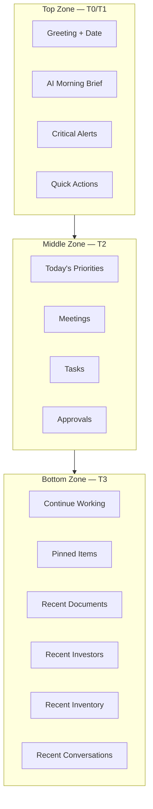

# Investhome OS — Home Experience

**Document type:** Product Design Sprint 1B deliverable  
**Last updated:** 2026-07-15  
**Audience:** Product, design, engineering  
**Status:** Target UX blueprint (with implementation honesty)

**Related governance:** [INFORMATION_ARCHITECTURE.md](./INFORMATION_ARCHITECTURE.md) · [WORKSPACE_ARCHITECTURE.md](./WORKSPACE_ARCHITECTURE.md) · [PRODUCT_VISION.md](./PRODUCT_VISION.md) · [DOMAIN_MODEL.md](./DOMAIN_MODEL.md) · [PERMISSION_MODEL.md](./PERMISSION_MODEL.md) · [AI_PRINCIPLES.md](./AI_PRINCIPLES.md) · [EVENT_MODEL.md](./EVENT_MODEL.md) · [ROADMAP.md](./ROADMAP.md) · [IMPLEMENTATION_STATUS.md](./IMPLEMENTATION_STATUS.md) · [UNITS_INVENTORY_BLUEPRINT.md](./UNITS_INVENTORY_BLUEPRINT.md)

---

## Implementation Legend

| Marker | Meaning |
|--------|---------|
| ✅ **Implemented** | Route, API, and UI exist in repository |
| 🟡 **Partial** | Some surfaces exist; gaps documented |
| 📋 **Planned** | Target UX; no production Home widget yet |
| 🔵 **Blueprint** | Specification complete; zero code |

**Repository truth always overrides this document** — see [IMPLEMENTATION_STATUS.md](./IMPLEMENTATION_STATUS.md).

**Current Home route:** `/dashboard` — static module launcher grid (`apps/web/src/app/dashboard/page.tsx`) 🟡

---

## SECTION 1 — PURPOSE

### Home is NOT

| Misconception | Why it is wrong |
|---------------|-----------------|
| **Dashboard** | KPI tiles, portfolio aggregates, and period filters belong in the **Executive workspace** (`/dashboard/executive`). Home must not duplicate revenue charts, pipeline funnels, or budget variance tables. See IA principle P7: *Home is not a dashboard* ([INFORMATION_ARCHITECTURE.md](./INFORMATION_ARCHITECTURE.md) §13). |
| **CRM** | Lead lists, pipeline stages, and investor commitment tables live in **Sales** and **Investors** workspaces. Home surfaces *your* follow-ups and shortcuts — not full CRM grids. |
| **Project List** | Project filtering, status management, and finance links belong in **Development** (`/dashboard/projects`). Home shows *resume context* for projects you recently touched — not the canonical project registry. |

### Home IS

Home is the **Daily Operating Center** — the first authenticated surface after login. Four interlocking purposes:

| Purpose | Description | Status |
|---------|-------------|--------|
| **Daily Operating Center** | One glance answers: *What needs my attention today? Where was I? What can I do in one click?* Aggregates actionable signals from notifications, obligations, approvals, and personal work queues — without replacing any workspace. | 📋 |
| **AI Morning Brief** | Role-aware natural-language digest of cash position, construction milestones, closings, risks, investor follow-ups, pending approvals, and deadlines. Summarizes; never auto-executes. Governed by [AI_PRINCIPLES.md](./AI_PRINCIPLES.md). | 📋 |
| **Personal Workspace Launcher** | Continue Working, Pinned Items, and Quick Actions route users into the correct workspace with entity context preserved (drawer deep links). Complements sidebar navigation — does not replace it. | 📋 |
| **Company Pulse** | Lightweight, permission-filtered signals of organizational health: critical alerts, approval backlog count, today's meetings, overdue tasks. *Pulse*, not *portfolio analytics* — detailed KPIs remain in Executive. | 🟡 Notifications only |

### Why this separation matters

Real estate development operators juggle **strategic oversight** (Executive), **deep work** (workspaces), and **daily triage** (Home). Collapsing these into one screen causes alert fatigue and hides personal productivity patterns. Home optimizes **time-to-first-action**; workspaces optimize **time-to-completion**; Executive optimizes **time-to-decision**.

```
Login → Home (triage + resume) → Workspace (deep work) → Entity drawer (detail)
              ↓
         Executive (when strategic KPIs needed — not default for all roles)
```

---

## SECTION 2 — TARGET USERS

Home adapts content by **role permissions** and **user preferences** — never by duplicating data. All widgets filter through `hasPermission(user, resource, 'view')` per [PERMISSION_MODEL.md](./PERMISSION_MODEL.md).

| Persona | Role code(s) | Home emphasis | Primary widgets | Status |
|---------|--------------|---------------|-----------------|--------|
| **Executive / Partner** | `executive`, `partner`, `super_admin` | Morning brief, critical alerts, portfolio pulse, approval queue | AI Brief, Critical Alerts, Approvals, Continue Working | 🟡 Alerts via notifications |
| **Sales** | `sales` | Today's follow-ups, pipeline movement, closings, lead tasks | Tasks, Continue Working (leads), Quick Actions (New Lead) | 📋 Tasks unimplemented |
| **Finance** | `finance` | Approval queue, obligations due, cash signals | Approvals, AI Brief (cash), Critical Alerts | 🟡 Finance approve exists |
| **Construction** | `construction` | Drawing approvals, site milestones, pending proposals | Approvals, Critical Alerts, Continue Working (drawings) | 🟡 Drawing intel in Documents |
| **Marketing** | `marketing` | Lead source movement, campaign collateral, available inventory | Recent Activity, Continue Working, Quick Actions | 📋 Marketing workspace unbuilt |
| **Investor Relations** | `investor_relations` | Commitment deadlines, investor comms, document analysis queue | AI Brief (investor follow-ups), Approvals, Recent Documents | 🟡 Partial via notifications |
| **Administration** | `super_admin` + admin flags | System health, user activity, integration readiness | Operational status ✅, Critical Alerts, Quick Actions (admin) | 🟡 Status in header |
| **Normal User** | `read_only`, `assistant`, `operations` | Read-only pulse, assigned items, search-first navigation | Continue Working, Search prompt, Recent Activity | 🟡 Activity workspace exists |

**Adaptation rule:** Widgets **hide entirely** when the user lacks permission — never show locked placeholders that leak entity existence across confidentiality boundaries.

---

## SECTION 3 — PAGE LAYOUT

Home occupies the main content region of the dashboard shell ([WORKSPACE_ARCHITECTURE.md](./WORKSPACE_ARCHITECTURE.md)). Header global actions (Search, Notifications, Language, Profile) remain unchanged ✅.

### Vertical information hierarchy

Priority flows **top → bottom**, **left → right** on desktop (≥1280px). Aligns with [INFORMATION_ARCHITECTURE.md](./INFORMATION_ARCHITECTURE.md) §3.

```
┌─────────────────────────────────────────────────────────────────────────────┐
│  SHELL HEADER (unchanged): Search · Lang · Notifications · Profile · Status│
├─────────────────────────────────────────────────────────────────────────────┤
│  TOP — Context + Intelligence                                                │
│  ┌─────────────────────────────────────────────────────────────────────────┐│
│  │ Greeting · Date · [Weather future] · Quick Command hint                  ││
│  ├─────────────────────────────────────────────────────────────────────────┤│
│  │ AI Morning Brief (collapsible summary card)                              ││
│  ├──────────────────────────────┬──────────────────────────────────────────┤│
│  │ Critical Alerts (max 5)      │ Quick Actions (role-aware chip row)       ││
│  └──────────────────────────────┴──────────────────────────────────────────┘│
├─────────────────────────────────────────────────────────────────────────────┤
│  MIDDLE — Today's Operating Rhythm                                           │
│  ┌──────────────┬──────────────┬──────────────┬──────────────┐              │
│  │ Today's      │ Meetings     │ Tasks        │ Approvals    │              │
│  │ Priorities   │ (today +     │ (today +     │ (unified     │              │
│  │ (AI-ranked)  │  upcoming)   │  overdue)    │  queue)      │              │
│  └──────────────┴──────────────┴──────────────┴──────────────┘              │
├─────────────────────────────────────────────────────────────────────────────┤
│  BOTTOM — Resume + Discovery                                                 │
│  ┌────────────────────────────┬────────────────────────────────────────────┐│
│  │ Continue Working (hero)    │ Pinned Items (user-curated grid)           ││
│  ├────────────────────────────┼────────────────────────────────────────────┤│
│  │ Recent Documents           │ Recent Investors                           ││
│  ├────────────────────────────┼────────────────────────────────────────────┤│
│  │ Recent Inventory (future)  │ Recent Conversations (future)              ││
│  └────────────────────────────┴────────────────────────────────────────────┘│
└─────────────────────────────────────────────────────────────────────────────┘
```

### Region specifications

| Zone | Widgets | Rationale | Status |
|------|---------|-----------|--------|
| **Top** | Greeting, Date, Weather, AI Summary, Critical Alerts, Quick Actions | Immediate context + highest-severity signals + one-click entry | 🟡 Greeting/date only (static title today) |
| **Middle** | Today's Priorities, Meetings, Tasks, Approvals | Operational rhythm — what must happen *today* | 📋 All planned |
| **Bottom** | Continue Working, Pinned, Recent Documents/Investors/Inventory/Conversations | Resume work + personal curation + passive discovery | 📋 Planned; 🟡 data queryable via search |

### Current vs target

| Today (`/dashboard`) | Target Home |
|----------------------|-------------|
| Static `MODULE_NAMES` card grid | Dynamic role-aware widget layout |
| Title: "Dashboard" / "Ana Panel" | Personalized greeting + date |
| No widgets | 14+ widget slots (personalizable) |
| Links only to workspace routes | Entity deep links + quick actions |
| No AI | AI Morning Brief slot |
| No alerts on page | Critical Alerts aggregation |

---

## SECTION 4 — AI MORNING BRIEF

The AI Morning Brief is a **read-only narrative digest** — not a data dashboard. It synthesizes permission-filtered signals into prose the user can scan in under 60 seconds. Governed by [AI_PRINCIPLES.md](./AI_PRINCIPLES.md): heuristic output today; external LLM when `FEATURE_EXTERNAL_AI` enabled; never auto-mutates state.

### Brief sections (experience design)

Each section appears only when the user has permission to view underlying data and relevant signals exist. Empty sections are omitted — no "No data" filler.

| Section | Content (experience) | Data sources (when built) | Status |
|---------|---------------------|---------------------------|--------|
| **Cash** | "Operating accounts total **X**; **N** obligations due this week totaling **Y**." | Finance accounts, payment obligations | 🟡 Data in Finance API |
| **Construction** | "**N** drawings await review; **M** unit proposals pending approval across **Project**." | Drawing analyses, proposals | 🟡 Documents/drawing intel |
| **Closings** | "**N** leads in negotiation; **M** funding commitments approaching deadline." | Leads pipeline, funding commitments | 🟡 Notification rules exist |
| **Risks** | "Budget variance alert on **Project**; funding gap **X**; inactive lead **Name** (14 days)." | Executive attention logic, notifications | 🟡 `build_attention_items` |
| **Investor Follow-ups** | "**N** investors with pending document signatures; **Name** commitment due Friday." | Investors, obligations, notifications | 🟡 Partial |
| **Approvals** | "You have **N** items awaiting approval: **breakdown by type**." | Finance approve, drawing proposals | 🟡 Backend exists |
| **Deadlines** | "**N** milestones this week: **bulleted list**." | Executive deadlines, project status | 🟡 Executive API |
| **Recommended Actions** | Numbered list: "1. Review drawing for Tower A · 2. Approve transaction #… · 3. Follow up lead …" | AI/heuristic ranking over above | 📋 |

### Interaction model

| Behavior | Specification |
|----------|---------------|
| **Default state** | Expanded on first visit of calendar day; collapsed to one-line summary on return visits |
| **Refresh** | Manual refresh button; auto-refresh on tab focus (max once per 15 min) |
| **Expand** | Click section heading → scroll to related widget (Approvals, Tasks) |
| **AI attribution** | Footer: "Generated from your permissions · Last updated HH:MM · L2 heuristic" (honest level per AI Principles) |
| **Regenerate** | 📋 Future — explicit user trigger; logs activity with `actor_type=ai` |
| **Language** | TR default, EN via locale — same as platform i18n |

### Safety rules

- No fabricated numbers — if API unavailable, section omitted with degradation message
- Confidential document content never included in brief text sent to external LLM
- Recommended actions that imply mutations link to confirmation flows — never one-click execute

**Status:** 📋 Planned — no Home brief API or UI. Nearest substitute: Executive summary endpoints (requires `executive.view`).

---

## SECTION 5 — QUICK COMMAND

Quick Command extends the Global Search palette ([INFORMATION_ARCHITECTURE.md](./INFORMATION_ARCHITECTURE.md) §8) into Home's primary keyboard entry point. Same overlay shell as `global-search-palette.tsx` ✅.

### Universal command bar

| Mode | Trigger | Behavior | Status |
|------|---------|----------|--------|
| **Search** | `Ctrl+K` / `⌘K` | Current global search ✅ | ✅ |
| **Command** | `>` or `/` prefix | Structured commands | 📋 |
| **NL / AI** | Free text + intent parse | Suggest navigation + actions | 📋 |

### Example commands

| Command | Intent | Result | Status |
|---------|--------|--------|--------|
| `Open Temple` | Navigate project | Projects → Temple drawer | 🟡 Search finds project ✅ |
| `Today's closings` | Filter obligations | Finance → due today | 📋 |
| `Create investor` | Mutation suggestion | Investors → create modal | 🟡 Navigate only today |
| `Show critical alerts` | Filter notifications | Notification drawer → critical | 🟡 Drawer exists; filter 📋 |
| `Approve drawing proposals` | Workflow | Documents/Construction → queue | 🟡 Documents interim |
| `Units available in Tower A` | Inventory query | Inventory → filtered list | 📋 Inventory unbuilt |
| `Summarize last board deck` | AI analysis | Documents → analysis tab | 🟡 Heuristic AI |
| `Go to executive` | Navigation | Route to `/dashboard/executive` | ✅ |
| `Switch to English` | Preference | Locale cookie change | ✅ |
| `Who owns unit 14B?` | Ownership lookup | Unit drawer → ownership | 📋 |
| `Pin Temple project` | Personalization | Add to Pinned Items | 📋 |
| `What needs my approval?` | Home intent | Scroll to Approvals widget | 📋 |

### Keyboard-first interaction

| Shortcut | Action | Status |
|----------|--------|--------|
| `Ctrl+K` / `⌘K` | Open palette | ✅ |
| `Ctrl+Shift+K` | Open AI command mode (target) | 📋 |
| `↑` `↓` | Navigate results | ✅ |
| `Enter` | Execute selected | ✅ |
| `Escape` | Close overlay | ✅ |
| `Tab` | Switch search ↔ command mode | 📋 |
| `/` (when Home focused) | Open palette in command mode | 📋 |

### Home-specific affordance

Below the greeting row, a subtle hint: **"Press ⌘K to search or type a command"** — links to command help overlay. On mobile: tap bar opens same palette.

---

## SECTION 6 — QUICK ACTIONS

One-click action chips in the top zone. Actions are **permission-gated** and open the owning workspace's create flow — Home never hosts CRUD forms ([INFORMATION_ARCHITECTURE.md](./INFORMATION_ARCHITECTURE.md) G5).

| Action | Target | Permission | Status |
|--------|--------|------------|--------|
| **New Investor** | `/dashboard/investors` → create modal | `investors.create` | ✅ Modal exists |
| **New Project** | `/dashboard/projects` → create modal | `projects.create` | ✅ |
| **New Inventory Asset** | `/dashboard/inventory` → unit create | `units.create` | 📋 Blueprint only |
| **Upload Documents** | `/dashboard/documents` → upload panel | `documents.create` | ✅ |
| **Create Task** | `/dashboard/tasks` → create (or inline) | TBD `tasks.create` | 📋 Entity not implemented |
| **Create Meeting** | `/dashboard/calendar` → create event | TBD | 📋 Calendar not implemented |
| **Generate Presentation** | Documents → export template | `documents.export` / future | 📋 |
| **Generate Report** | `/dashboard/reports` or Executive export | `reports.export` / `executive.export` | 🟡 Executive export ✅; Reports route 📋 |

### Role-aware visibility

| Role | Default visible actions (max 6 shown; "More" overflow) |
|------|--------------------------------------------------------|
| Executive | Generate Report, Upload Documents, Create Meeting, New Project |
| Sales | New Lead (via Leads), Upload Documents, Create Task, New Project |
| Finance | Upload Documents, Generate Report, Create Task |
| Construction | Upload Documents, Approve Drawings (link), Create Task |
| Investor Relations | New Investor, Upload Documents, Generate Report |
| Marketing | Upload Documents, New Project (read context) |
| Admin | Upload Documents, New Project, New Investor |

**Overflow pattern:** Show top 5–6 by role; "+N more" opens action picker searchable via Quick Command.

---

## SECTION 7 — CONTINUE WORKING

Resume the last meaningful work sessions with **one click to entity drawer** — lowest friction return path ([INFORMATION_ARCHITECTURE.md](./INFORMATION_ARCHITECTURE.md) §3 widget #3).

### Entity types tracked

| Type | Source | Deep link | Status |
|------|--------|-----------|--------|
| **Recent Projects** | Visit history | `/dashboard/projects?id=` | 📋 History not persisted |
| **Inventory Assets** | Visit history | `/dashboard/inventory?id=` | 📋 Module unbuilt |
| **Documents** | View/upload history | `/dashboard/documents?id=` | 🟡 Queryable; no history API |
| **Investors** | Visit history | `/dashboard/investors?id=` | 📋 |
| **Meetings** | Calendar attendance | `/dashboard/calendar?id=` | 📋 |
| **Reports** | Export/view history | `/dashboard/reports?id=` | 📋 |

### Ranking logic

Items scored and deduplicated; show top **5** (desktop) / **3** (mobile):

```
score = (recency_weight × hours_since_visit)
      + (interaction_weight × edit_count)
      + (pin_boost × 2.0 if pinned)
      - (staleness_penalty if archived)
```

| Factor | Weight | Notes |
|--------|--------|-------|
| **Recency** | 1.0 | Last opened timestamp — primary signal |
| **Interaction depth** | 0.3 per edit | Drawer edits weigh more than list view |
| **Pinned boost** | 2.0× | Pinned entities always appear in Continue Working |
| **Role relevance** | 0.5 | Sales: leads weighted; Finance: transactions |
| **Dedup** | — | Same entity keeps highest score only |

### Storage

| Phase | Mechanism |
|-------|-----------|
| **Sprint 2 (MVP)** | `localStorage` key `investhome.continue_working.{userId}` — client-side visit log |
| **Target** | Server-side `user_recent_entities` table — sync across devices |

### Empty state

"No recent items yet — explore a workspace or press ⌘K to search." with links to user's top 3 permitted workspaces.

**Status:** 📋 Planned — no visit tracking today.

---

## SECTION 8 — PINNED ITEMS

User-curated shortcuts persisting across sessions. Distinct from Continue Working (algorithmic) — Pinned is **explicit user intent**.

### Pinnable entity types

| Type | Example | Max per type | Status |
|------|---------|--------------|--------|
| **Pinned Projects** | "Temple Residences" | 10 | 📋 |
| **Pinned Investors** | "Atlas Capital Partners" | 10 | 📋 |
| **Pinned Buildings** | "Tower A" | 10 | 📋 Inventory |
| **Pinned Inventory (Units)** | "Unit 14B" | 20 | 📋 |
| **Pinned Reports** | "Monthly Board Pack" | 5 | 📋 |
| **Pinned Documents** | "Master SPA Template" | 10 | 📋 |
| **Saved Searches** | "Leads: qualified + Istanbul" | 10 | 📋 Search has no saved searches yet |

### Interactions

| Action | Behavior |
|--------|----------|
| **Pin** | Entity drawer header ··· menu → "Pin to Home"; Search result context menu |
| **Unpin** | Pinned card ··· → Unpin |
| **Reorder** | Drag handle on Pinned grid (desktop); long-press reorder (mobile) |
| **Open** | Click → workspace + drawer |

### Data model (target)

```text
user_pins: user_id, entity_type, entity_id, sort_order, pinned_at
saved_searches: user_id, name, query_json, sort_order
```

**Permission revalidation:** On Home load, pins referencing entities user can no longer view are hidden (not deleted).

**Status:** 📋 Planned — no pin API or UI.

---

## SECTION 9 — CRITICAL ALERTS

Aggregated **action-required signals** on Home — distinct from the notification drawer (which shows full history). Shows max **5** critical items; "View all" opens notification drawer filtered by priority.

### Priority model

Aligns with `NotificationPriority` in notification service ✅:

| Priority | Visual | Urgency | Home behavior | Examples |
|----------|--------|---------|---------------|----------|
| **Critical** | Red badge, top slot | Immediate action | Always shown; cannot dismiss from Home without action | Funding gap at risk; account balance critical; executive-only budget breach |
| **Warning** | Amber badge | Same day | Shown when Critical slots not full | Lead inactive 14 days; obligation due tomorrow; drawing pending 7+ days |
| **Info** | Blue badge | Awareness | Shown in expanded alerts only | Document processing complete; new lead assigned |
| **Success** | Green badge | Confirmation | Auto-dismiss after 24h | Transaction approved; drawing proposal accepted |

### Alert examples (from notification generator rules)

| Alert | Priority | Target user | Status |
|-------|----------|-------------|--------|
| Project funding gap exceeds threshold | Critical | Executive | ✅ Generator rule |
| Qualified lead waiting 7+ days | High | Sales assignee | ✅ |
| Payment obligation overdue | High | Finance | ✅ |
| Budget variance at risk | Critical | Executive | ✅ |
| Drawing unit proposal pending | Medium → Warning on Home | Construction | ✅ |
| Document processing failed | Medium | Uploader | ✅ |
| Reservation expiring (future) | Warning | Sales | 📋 Inventory module |

### Interaction

- Click alert → deep link to entity drawer or approval action
- Swipe dismiss (mobile) → marks read in notification system
- "Snooze 1 hour" (Warning/Info only) — 📋 Planned

**Status:** 🟡 Notifications exist in header drawer; Home aggregation widget 📋.

---

## SECTION 10 — APPROVAL CENTER

Unified Home widget surfacing **all pending approvals** across domains — single queue, typed rows, one-click navigate to approve.

### Approval types

| Type | Source | Approver permission | Deep link | Status |
|------|--------|---------------------|-----------|--------|
| **Price Changes** | Unit price history (Inventory) | `units.approve` (planned) | Unit drawer → pricing tab | 📋 |
| **Reservations** | Unit reservations | `units.approve` | Reservation manager | 📋 |
| **Ownership** | Ownership transfers | `units.approve` / finance | Unit → ownership tab | 📋 |
| **Documents** | Confidential review queue | `documents.view_confidential` | Document drawer | 🟡 |
| **Reports** | Scheduled report sign-off | `reports.approve` (planned) | Reports workspace | 📋 |
| **Automation** | n8n workflow gates | Role-specific | Automation inbox | 📋 |
| **AI Suggestions** | Drawing unit proposals, AI recommendations | `documents.approve` | Document → drawing tab | 🟡 Proposal API exists |

### Row layout

```
[Type icon] [Entity name] · [Context]          [Age badge]  [Review →]
```

### Sort order

1. Critical priority notifications mapped to approvals
2. Oldest pending first (FIFO within priority tier)
3. User's explicitly assigned items before org-wide queue

### Batch actions (future)

Select multiple → "Approve selected" only when same approval type and permission — governed by [AI_PRINCIPLES.md](./AI_PRINCIPLES.md) human-in-the-loop rules.

**Status:** 📋 Home widget planned; individual approval APIs 🟡 exist for finance and drawing proposals.

---

## SECTION 11 — MEETINGS

Calendar-driven widget for **today + next 48 hours**. Depends on Calendar/Event entity ([DOMAIN_MODEL.md](./DOMAIN_MODEL.md)) — **not implemented**.

### Sub-sections

| Section | Content | Status |
|---------|---------|--------|
| **Today's Meetings** | Time, title, attendees, linked project/investor | 📋 |
| **Upcoming** | Next 48h beyond today | 📋 |
| **AI Summaries** | Pre-meeting brief from linked documents/entities | 📋 |
| **Preparation** | Checklist: documents to review, open tasks | 📋 |

### Interim path (until Calendar ships)

- Executive **Deadlines** API surfaces milestone dates 🟡 — show as "Upcoming Deadlines" stub in Meetings widget slot with "Calendar coming soon" badge
- No fake meeting data

### Integration readiness

Settings → Integrations tab shows calendar provider placeholder 🟡 — Home widget hidden until native or synced events exist.

**Status:** 📋 Not implemented — widget slot reserved with honest empty state.

---

## SECTION 12 — TASKS

Personal and assigned action items. Task entity **not in domain model** ([DOMAIN_MODEL.md](./DOMAIN_MODEL.md)).

### Sub-sections

| Section | Content | Status |
|---------|---------|--------|
| **Today's Tasks** | Due today, assigned to current user | 📋 |
| **Overdue** | Past due — red accent | 📋 |
| **Waiting** | Blocked on external party | 📋 |
| **Blocked** | Dependency not met | 📋 |
| **Completed** | Last 7 days — collapsed by default | 📋 |
| **AI Prioritization** | Suggested order with rationale | 📋 |

### Interim path

Until Tasks module ships:

| Signal | Surrogate | Status |
|--------|-----------|--------|
| Lead follow-ups | Notifications: inactive lead, qualified waiting | 🟡 |
| Obligations | Finance payment obligations due | ✅ |
| Drawing review | Notification: proposal pending | 🟡 |

Home shows **"Tasks — Coming soon"** card with link to Notifications and Finance obligations as interim for Finance/Sales roles.

### Future entity links

Task → Project, Unit, Lead, Party, Document ([INFORMATION_ARCHITECTURE.md](./INFORMATION_ARCHITECTURE.md) §5).

**Status:** 📋 Not implemented.

---

## SECTION 13 — HOME PERSONALIZATION

Users customize layout within guardrails. Preferences stored server-side on `User` record extension or `user_home_preferences` table.

### Personalization dimensions

| Dimension | Options | Default | Locked | Status |
|-----------|---------|---------|--------|--------|
| **Widgets** | Toggle visibility per widget | Role template | Critical Alerts **always visible** | 📋 |
| **Order** | Drag reorder rows/zones | Role template | Top zone (Greeting + Alerts) fixed | 📋 |
| **Pinned Items** | User-managed | Empty | — | 📋 |
| **Default Workspace** | Post-login redirect option | Home (`/dashboard`) | — | 📋 Profile prefs |
| **Theme** | Light / Dark / System | System | — | 📋 Not implemented |
| **Language** | TR / EN | TR | — | ✅ Cookie + profile |

### Role templates (initial layout)

| Role | Hidden by default | Promoted widgets |
|------|-------------------|------------------|
| Executive | Recent Inventory | AI Brief, Approvals, Critical Alerts |
| Sales | AI Brief (cash section) | Tasks, Continue Working (leads) |
| Finance | Recent Investors | Approvals, AI Brief (cash) |
| Construction | Recent Investors | Approvals, Continue Working (documents) |
| Read-only | Quick Actions (mutations) | Recent Activity, Continue Working |

### Reset

"Reset to role default" in Home ··· menu.

**Critical rule:** Critical Alerts widget **cannot be removed** — only collapsed. Aligns with safety and [AI_PRINCIPLES.md](./AI_PRINCIPLES.md) approval visibility.

**Status:** 📋 Planned — profile today supports `preferred_language`, `timezone` only 🟡.

---

## SECTION 14 — ROLE ADAPTATION

Detailed per-role Home composition. Extends Section 2 with widget-level matrix.

### CEO / Executive (`executive`, `partner`)

| Widget | Prominence | Content focus |
|--------|------------|---------------|
| AI Morning Brief | Hero | Cash, risks, closings, investor follow-ups |
| Critical Alerts | Always visible | Funding gaps, budget variance |
| Approvals | High | Finance transactions, strategic documents |
| Today's Priorities | High | AI-ranked from Executive attention API 🟡 |
| Meetings | Medium | Board meetings, investor calls |
| Continue Working | Medium | Recent projects, board documents |
| Pinned | User-defined | Portfolio companies, key projects |

### Sales (`sales`)

| Widget | Prominence | Content focus |
|--------|------------|---------------|
| Tasks | Hero | Follow-ups, overdue leads |
| Continue Working | Hero | Recent leads, interested projects |
| Quick Actions | High | New lead flow, upload buyer docs |
| Critical Alerts | Medium | Assigned lead alerts |
| AI Brief | Low / collapsed | Pipeline movement summary only |
| Recent Investors | Hidden | — |

### Finance (`finance`)

| Widget | Prominence | Content focus |
|--------|------------|---------------|
| Approvals | Hero | Pending transactions |
| AI Brief | High | Cash, obligations |
| Critical Alerts | High | Overdue obligations, low balance |
| Tasks | Medium | Month-end checklist (future) |
| Recent Documents | Medium | Receipts, invoices |

### Construction (`construction`)

| Widget | Prominence | Content focus |
|--------|------------|---------------|
| Approvals | Hero | Drawing proposals |
| Continue Working | Hero | Recent drawings, projects |
| Critical Alerts | Medium | Pending review alerts |
| AI Brief | Low | Construction + milestones section only |
| Recent Inventory | Future | Units from approved proposals |

### Marketing (`marketing`)

| Widget | Prominence | Content focus |
|--------|------------|---------------|
| Recent Activity | Hero | Lead source changes |
| Continue Working | High | Campaign projects, collateral docs |
| Quick Actions | Medium | Upload collateral |
| AI Brief | Hidden by default | — |

### Assistant (`assistant`)

| Widget | Prominence | Content focus |
|--------|------------|---------------|
| Tasks | Hero | Assigned support tasks |
| Meetings | High | Executive calendar (when built) |
| Continue Working | Medium | Recent documents |
| Quick Actions | Low | Upload, search-first |
| Approvals | Hidden | No approve permissions |

---

## SECTION 15 — EMPTY STATES

First-day and zero-data experiences must **onboard, not intimidate**.

### Scenarios

| Scenario | Message (EN) | Actions |
|----------|--------------|---------|
| **No projects** | "Your portfolio starts here." | Quick Action: New Project · Link: Development workspace |
| **No tasks** | "No tasks yet — you're clear for deep work." | Quick Action: Create Task (disabled + tooltip if unimplemented) · Search |
| **No meetings** | "Your calendar is clear today." | Quick Action: Create Meeting (when built) · Executive deadlines link |
| **No investors** | "Track capital partners in one place." | Quick Action: New Investor |
| **No documents** | "Upload contracts, drawings, and agreements." | Quick Action: Upload Documents |
| **No pins** | "Pin projects and documents for quick access." | Hint on first entity drawer visit |
| **No alerts** | "All clear — no critical items." | Success tone; show AI Brief or Continue Working |
| **New user (first login)** | "Welcome to Investhome OS, {name}." | 3-step checklist: Complete profile · Explore workspace · Pin first project |

### Demo environment

When `is_demo` data present, show subtle banner (existing pattern ✅) — empty states suppressed if demo entities exist.

### Permission-empty

User with single workspace permission: Home emphasizes that workspace's Quick Actions and hides empty cross-domain widgets entirely.

**Status:** 📋 Planned — today Home always shows module grid regardless.

---

## SECTION 16 — PERFORMANCE

Home is the **most frequently loaded page** — optimize perceived speed.

### Loading strategy

| Tier | Widgets | Load timing | Target SLA |
|------|---------|-------------|------------|
| **T0 — Shell** | Greeting, date, layout skeleton | SSR with page | <100ms paint |
| **T1 — Critical** | Critical Alerts, Continue Working (localStorage) | Parallel fetch on mount | <300ms |
| **T2 — Primary** | Quick Actions, Approvals, AI Brief | Parallel after T1 | <800ms |
| **T3 — Secondary** | Pinned, Recent *, Meetings, Tasks | Lazy load / Intersection Observer | <2s |
| **T4 — Deferred** | AI Brief regeneration, weather | On user action only | — |

### API design (target)

```
GET /home/summary          → T1: alerts count, greeting context
GET /home/continue-working → T1: recent entities (server phase)
GET /home/approvals        → T2: unified queue
GET /home/brief            → T2: AI morning brief
GET /home/widgets/{id}     → T3: lazy widget data
```

Single **BFF-style** `/home` endpoint optional for mobile bandwidth.

### Caching

| Data | Cache |
|------|-------|
| AI Brief | 15 min server cache per user+role+locale |
| Critical Alerts | No cache — always fresh |
| Continue Working (local) | Immediate; sync background |
| Pinned | Session cache; invalidate on pin change |

### Skeleton UI

Each widget renders `WidgetSkeleton` matching final layout — no layout shift. Use `@investhome/ui` primitives when implemented 🟡.

**Status:** 📋 No Home API — current page is static SSR ✅ (fast but not useful).

---

## SECTION 17 — AI EVOLUTION

Home is the primary surface for **progressive AI capability** per [PRODUCT_VISION.md](./PRODUCT_VISION.md) Phase E and [AI_PRINCIPLES.md](./AI_PRINCIPLES.md).

### Roadmap phases

| Phase | Capability | Home manifestation | Status |
|-------|------------|---------------------|--------|
| **E0 — Today** | Heuristic document/drawing intelligence | No Home AI | 🟡 |
| **E1 — Brief v1** | Template brief from notification + executive rules | AI Morning Brief sections | 📋 |
| **E2 — Command NL** | Intent parse in search palette | Quick Command NL mode | 📋 |
| **E3 — Predictive priorities** | Rank Today's Priorities from activity + calendar + pipeline | Priorities widget | 📋 |
| **E4 — Daily/weekly planning** | "Plan my week" generates task suggestions (approval required) | Planning modal | 📋 |
| **E5 — Risk/opportunity detection** | Anomaly surfacing in Brief + Alerts | Critical Alerts enrichment | 📋 |
| **E6 — AI Brain** | Cross-entity context graph | Home ↔ AI workspace link | 📋 |

### Predictive priorities (E3)

Inputs: overdue notifications, lead inactivity rules, obligation due dates, user's Continue Working history, pinned items, role template weights.

Output: Ordered list with **explainability** — "Because: obligation due tomorrow + you viewed this project yesterday."

Never auto-create tasks without user confirmation ([AI_PRINCIPLES.md](./AI_PRINCIPLES.md)).

### Risk/opportunity detection (E5)

Leverage Executive `build_attention_items` 🟡 + future embeddings. Present as Brief narrative + optional Critical Alert escalation.

### Event bus integration

When `@investhome/events` wires ([EVENT_MODEL.md](./EVENT_MODEL.md)), Home subscribes to `*.requires_attention` events for real-time alert refresh — today notifications use sync DB scan 🟡.

---

## SECTION 18 — HOME DESIGN PRINCIPLES

Twenty governing principles for Home UX decisions. Extends [INFORMATION_ARCHITECTURE.md](./INFORMATION_ARCHITECTURE.md) §13 IA principles with Home-specific rules.

| # | Principle | Implication |
|---|-----------|-------------|
| H1 | **Home informs** | Every widget answers a question the user already has this morning |
| H2 | **Home never overwhelms** | Max 5 critical alerts visible; everything else collapsed or linked |
| H3 | **AI summarizes, humans decide** | Brief recommends; mutations require explicit approval |
| H4 | **Critical first** | T1 load tier for alerts; red badges before blue info |
| H5 | **One-click actions** | Quick Actions reach create flows in ≤2 clicks |
| H6 | **Everything searchable** | If it's on Home, it's in `Ctrl+K` ([IA P4](./INFORMATION_ARCHITECTURE.md)) |
| H7 | **Home ≠ Executive** | No KPI grids, period filters, or export on Home ([IA P7](./INFORMATION_ARCHITECTURE.md)) |
| H8 | **Resume over browse** | Continue Working outranks generic lists |
| H9 | **Personal by default** | Layout adapts to role + user pins — not org-wide dashboard |
| H10 | **Permission-first** | Hidden beats disabled; no leakage across confidentiality tiers |
| H11 | **Honest emptiness** | Empty states guide; never fake data or "Soon" widgets with mock numbers |
| H12 | **Keyboard-first** | Quick Command reachable without mouse from Home focus |
| H13 | **Drawer handoff** | Home links open entity drawers — preserve workspace context ([IA P13](./INFORMATION_ARCHITECTURE.md)) |
| H14 | **Bilingual always** | TR default, EN merge-fallback for all Home strings |
| H15 | **Desktop-first, mobile-compatible** | 4-column middle zone → 1-column stack <768px |
| H16 | **Alerts cannot hide** | Critical Alerts widget is non-removable ([§13](./HOME_EXPERIENCE.md)) |
| H17 | **Incremental widgets** | Ship Continue Working + Alerts before AI Brief ([ROADMAP.md](./ROADMAP.md)) |
| H18 | **Activity attribution** | Actions from Home record same audit trail ([EVENT_MODEL.md](./EVENT_MODEL.md)) |
| H19 | **No dead ends** | Every Home row links to workspace + related entities ([IA P12](./INFORMATION_ARCHITECTURE.md)) |
| H20 | **Workspace launcher, not replacement** | Sidebar remains canonical nav; Home complements |

---

## SECTION 19 — WIREFRAME

### Desktop (≥1280px)

```
┌──────────┬──────────────────────────────────────────────────────────────────┐
│          │ [⌘K Search or command...                              ] [🔔][👤]│
│ SIDEBAR  ├──────────────────────────────────────────────────────────────────┤
│          │ Good morning, Ayşe · Wednesday, 15 July 2026        [Customize]│
│ Executive│ ┌──────────────────────────────────────────────────────────────┐│
│ Leads    │ │ ☀ AI Morning Brief                                    [▼]   ││
│ Investors│ │ Cash: 3 obligations due this week ($1.2M)...                ││
│ Projects │ │ Risks: Temple budget variance · Lead Ahmet inactive 14d      ││
│ Finance  │ │ → Recommended: 1. Review drawing Tower A  2. Approve txn... ││
│ Documents│ └──────────────────────────────────────────────────────────────┘│
│ Activity │ ┌─────────────────────────┐ ┌──────────────────────────────────┐│
│          │ │ ⚠ CRITICAL ALERTS (2)   │ │ QUICK ACTIONS                    ││
│          │ │ • Funding gap Temple    │ │ [+Investor][+Project][↑Doc][Task]││
│          │ │ • Balance below thresh  │ └──────────────────────────────────┘│
│          │ └─────────────────────────┘                                     │
│          │ ┌────────────┬────────────┬────────────┬────────────┐           │
│          │ │ PRIORITIES │ MEETINGS   │ TASKS      │ APPROVALS  │           │
│          │ │ 1. ...     │ 09:00 Stand│ Overdue: 2 │ Finance: 3 │           │
│          │ │ 2. ...     │ 14:00 Board│ Today: 5   │ Drawings:1 │           │
│          │ └────────────┴────────────┴────────────┴────────────┘           │
│          │ ┌──────────────────────────────┬───────────────────────────────┐│
│          │ │ CONTINUE WORKING             │ PINNED                        ││
│          │ │ [Temple] [Unit 14B] [SPA]   │ [★ Tower A] [★ Atlas Capital]││
│          │ └──────────────────────────────┴───────────────────────────────┘│
│          │ ┌──────────────────────────────┬───────────────────────────────┐│
│          │ │ RECENT DOCUMENTS             │ RECENT INVESTORS              ││
│          │ └──────────────────────────────┴───────────────────────────────┘│
└──────────┴──────────────────────────────────────────────────────────────────┘
```

### Desktop layout (mermaid)



### Tablet (768–1279px)

| Change | Recommendation |
|--------|----------------|
| Middle zone | 2×2 grid (Priorities + Approvals top row; Meetings + Tasks bottom) |
| Bottom zone | Single column; Continue Working full width above Pinned |
| AI Brief | Collapsed by default — one-line summary |
| Quick Actions | Horizontal scroll chip row |
| Sidebar | Collapsed to icons ([IA §10](./INFORMATION_ARCHITECTURE.md)) 📋 |

### Mobile (<768px)

| Change | Recommendation |
|--------|----------------|
| Navigation | Bottom tab bar: Home, Workspaces, Search, Notifications, Profile ([IA §11](./INFORMATION_ARCHITECTURE.md)) |
| Layout | Strict single column |
| Widget order | Critical Alerts → Approvals → Continue Working → Tasks → Brief (collapsed) |
| Quick Actions | FAB menu (+ icon) |
| Pinned | Horizontal scroll cards |
| Meetings/Inventory | Hidden unless items exist |

---

## SECTION 20 — NEXT SPRINT

### Recommended Sprint 1C: Workspace Navigation (documentation only)

**Goal:** Produce navigation shell specs that complement Home — sidebar restructure, Global zone placement, mobile tab bar, and URL strategy for entity drawers. **No React implementation.**

| Deliverable | Description |
|-------------|-------------|
| **Sidebar restructure spec** | 5-zone top-level nav; 12 workspace ordering; collapsible groups; "Soon" badge rules |
| **Global zone spec** | Move Activity under header Global; Tasks/Calendar/Messages/Reports IA stubs |
| **Entity drawer URL strategy** | Resolve MD-11: `?entity=&id=` vs path segments; back-button behavior |
| **Mobile tab bar wireframe** | Bottom nav priorities; full-screen drawer rules |
| **Workspace Navigation doc** | `docs/WORKSPACE_NAVIGATION.md` — companion to this Home spec |
| **i18n nav catalog** | TR/EN for all planned workspace titles |
| **Decision log update** | Resolve MD-01–MD-04 from [INFORMATION_ARCHITECTURE.md](./INFORMATION_ARCHITECTURE.md) |

### Sprint 1C exit criteria

- Wireframes for sidebar states (expanded, collapsed, mobile)
- URL strategy ADR or IAD amendment for drawer deep links
- Engineering estimate for Sprint 2 Home widget slice

### Recommended Sprint 2 (first Home implementation — post 1C)

1. Home widget shell on `/dashboard` — replace module grid
2. **Continue Working** (localStorage MVP) + **Critical Alerts** (notification API aggregation)
3. **Quick Actions** row (permission-gated links to existing modals)
4. Greeting + date personalization from session user
5. TR/EN `home.*` message namespace

*Defer AI Morning Brief to Sprint 2B after `/home/brief` API design.*

---

## DELIVERABLES SUMMARY

### 1. UX Summary

Home transforms `/dashboard` from a static module launcher 🟡 into a **personal daily operating center** that triages attention, resumes work, and launches actions — without duplicating Executive KPIs or workspace CRUD. The experience is **role-adaptive**, **permission-first**, **AI-assisted** (not AI-driven), and **keyboard-first** via Quick Command extending existing Global Search ✅.

### 2. Widget Hierarchy

| Tier | Priority | Widgets |
|------|----------|---------|
| **T0** | Shell | Greeting, Date, Layout |
| **T1** | Critical path | Critical Alerts, Continue Working |
| **T2** | Daily rhythm | Quick Actions, Approvals, AI Brief, Today's Priorities |
| **T3** | Context | Meetings, Tasks, Pinned, Recent * |
| **Fixed** | Non-removable | Critical Alerts (collapsible only) |

Full catalog: 14 widget types across Top/Middle/Bottom zones (§3).

### 3. Personalization Model

- **Role templates** define default widget visibility and order
- **User overrides**: widget toggle, reorder, pins, saved searches
- **Locked**: Critical Alerts always present; top context row fixed
- **Storage**: server-side preferences (target); localStorage for Continue Working MVP
- **Profile integration**: language ✅, timezone ✅, default workspace 📋, theme 📋

### 4. Loading Strategy

- **4-tier progressive load** (T0–T4) — §16
- Critical widgets first (<300ms); AI Brief and Recent * lazy
- Skeleton UI per widget; no layout shift
- Target BFF `/home` endpoints; AI Brief cached 15 min

### 5. AI Strategy

- **Morning Brief**: heuristic/template first (E1), external LLM optional with confidentiality gates
- **Quick Command NL**: extends search palette — read commands immediate; mutations confirm
- **Predictive priorities**: explainable ranking; no auto-task creation
- **Evolution path**: E0→E6 through Brief, Command, Planning, Risk detection, AI Brain
- Governed by [AI_PRINCIPLES.md](./AI_PRINCIPLES.md) — human approval for all consequential actions

### 6. Risks

| # | Risk | Severity | Mitigation |
|---|------|----------|------------|
| HR1 | **Home duplicates Executive** | High | H7 principle; no KPI grids on Home |
| HR2 | **Widget overload** | Medium | H2 max visible alerts; role templates; collapse defaults |
| HR3 | **Tasks/Calendar delay blocks Middle zone** | High | Interim surrogates (notifications, obligations); honest empty states |
| HR4 | **Inventory delay blocks Recent Inventory + reservations** | High | Hide widget until `units.view` ships; [ROADMAP.md](./ROADMAP.md) priority |
| HR5 | **AI Brief fabrication** | High | Omit section if API fails; show AI level honestly |
| HR6 | **Continue Working privacy on shared devices** | Medium | localStorage scoped to userId; server sync with auth |
| HR7 | **Performance regression** | Medium | Tiered loading; lazy T3 widgets |
| HR8 | **Pin stale entities** | Low | Permission revalidation on load |

### 7. Recommendations

| # | Recommendation | Priority |
|---|----------------|----------|
| REC-H1 | Replace module grid with widget shell in Sprint 2 | P0 |
| REC-H2 | Ship Continue Working + Critical Alerts first — uses existing notification API | P0 |
| REC-H3 | Add `home.*` i18n namespace TR/EN before UI | P1 |
| REC-H4 | Design `/home` BFF endpoints before frontend widgets | P1 |
| REC-H5 | Implement localStorage visit log in entity drawers (minimal) | P1 |
| REC-H6 | Defer AI Morning Brief to Sprint 2B after E1 API spec | P2 |
| REC-H7 | Resolve MD-11 drawer URL strategy in Sprint 1C for Home deep links | P1 |
| REC-H8 | Add `user_pins` table in Sprint 2 or 3 — don't block MVP on server pins | P2 |
| REC-H9 | Use Executive attention/deadline APIs as Brief input — don't rebuild logic | P1 |
| REC-H10 | Proceed to Sprint 1C Workspace Navigation doc | P0 |

---

## APPENDIX — IMPLEMENTATION MATRIX

| Home feature | Target | Current | Marker |
|--------------|--------|---------|--------|
| Route `/dashboard` | Personal command center | Module card grid | 🟡 |
| Greeting + date | Personalized header | Static "Dashboard" title | 🟡 |
| AI Morning Brief | Narrative digest | — | 📋 |
| Quick Command | Search extension | Search only ✅ | 🟡 |
| Quick Actions | Role chip row | — | 📋 |
| Continue Working | Visit history | — | 📋 |
| Pinned Items | User pins | — | 📋 |
| Critical Alerts | Home aggregation | Notification drawer only | 🟡 |
| Approval Center | Unified queue | Per-module approve | 🟡 |
| Meetings | Calendar widget | — | 📋 |
| Tasks | Task lists | — | 📋 |
| Recent Documents | Home widget | Documents workspace | 🟡 |
| Recent Investors | Home widget | Investors workspace | 🟡 |
| Recent Inventory | Home widget | — | 📋 |
| Recent Conversations | Q&A threads | — | 📋 |
| Personalization | Widget prefs | Language/timezone only | 🟡 |
| Home API | `/home/*` BFF | — | 📋 |
| Weather | Header context | — | 📋 Future |

---

## GOVERNANCE CROSS-REFERENCE

| Topic | Document |
|-------|----------|
| Home in IA | [INFORMATION_ARCHITECTURE.md](./INFORMATION_ARCHITECTURE.md) §3, §8, §9 |
| Workspace handoff | [WORKSPACE_ARCHITECTURE.md](./WORKSPACE_ARCHITECTURE.md) |
| Entity types | [DOMAIN_MODEL.md](./DOMAIN_MODEL.md) |
| Permission gates | [PERMISSION_MODEL.md](./PERMISSION_MODEL.md) |
| AI behavior | [AI_PRINCIPLES.md](./AI_PRINCIPLES.md) |
| Notifications / events | [EVENT_MODEL.md](./EVENT_MODEL.md) |
| Inventory on Home | [UNITS_INVENTORY_BLUEPRINT.md](./UNITS_INVENTORY_BLUEPRINT.md) |
| Delivery sequence | [ROADMAP.md](./ROADMAP.md) |
| Implementation truth | [IMPLEMENTATION_STATUS.md](./IMPLEMENTATION_STATUS.md) |

---

*Product Design Sprint 1B — Home Experience v1.0. Documentation only — no UI implementation in this sprint.*
