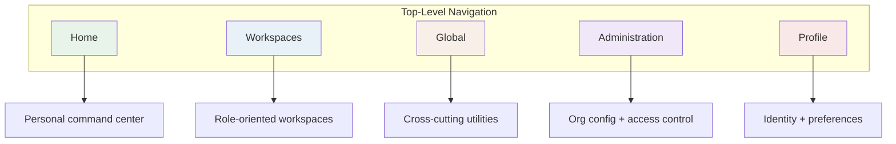
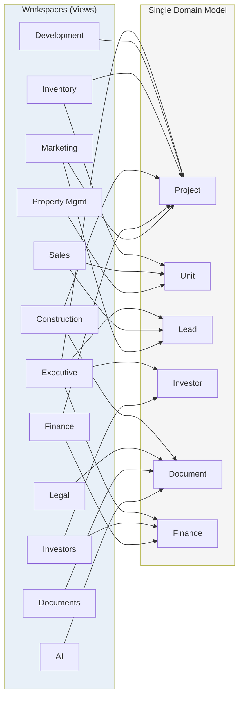

# Investhome OS — Information Architecture

**Document type:** Product Design Sprint 1A deliverable  
**Last updated:** 2026-07-15  
**Audience:** Product, design, engineering  
**Status:** Target IA (with implementation honesty)

**Related governance:** [WORKSPACE_ARCHITECTURE.md](./WORKSPACE_ARCHITECTURE.md) · [PRODUCT_VISION.md](./PRODUCT_VISION.md) · [DOMAIN_MODEL.md](./DOMAIN_MODEL.md) · [PERMISSION_MODEL.md](./PERMISSION_MODEL.md) · [ARCHITECTURE_DECISIONS.md](./ARCHITECTURE_DECISIONS.md) · [IMPLEMENTATION_STATUS.md](./IMPLEMENTATION_STATUS.md) · [UNITS_INVENTORY_BLUEPRINT.md](./UNITS_INVENTORY_BLUEPRINT.md)

---

## Implementation Legend

Throughout this document:

| Marker | Meaning |
|--------|---------|
| ✅ **Implemented** | Route, API, and UI exist in repository |
| 🟡 **Partial** | Some surfaces exist; gaps documented |
| 📋 **Planned** | Target IA; no production route yet |
| 🔵 **Blueprint** | Specification complete; zero code |

**Repository truth always overrides this document** — see [IMPLEMENTATION_STATUS.md](./IMPLEMENTATION_STATUS.md).

---

## SECTION 1 — PRODUCT PHILOSOPHY

### Workspace-based AI-native OS

Investhome OS is an **operating system for real estate development** — not a collection of disconnected modules. Users open **workspaces** that match their job responsibility (Executive, Sales, Finance, Construction) while all workspaces read and write the **same authoritative domain model** in PostgreSQL ([DOMAIN_MODEL.md](./DOMAIN_MODEL.md), [DATA_OWNERSHIP.md](./DATA_OWNERSHIP.md)).

AI is not a bolt-on feature. It is embedded globally: document intelligence, drawing detection, future morning briefs, semantic search, and a universal command bar. AI assists extraction and recommendations; consequential mutations require human approval ([AI_PRINCIPLES.md](./AI_PRINCIPLES.md)).

### Why Workspaces, not Modules

| Workspaces | Traditional modules |
|------------|---------------------|
| Organized by **user responsibility** | Organized by database tables |
| Multiple workspaces can surface the same entity | Duplicate CRUD screens per department |
| Permission-gated visibility | Often all-or-nothing module access |
| Composable daily workflows | Siloed navigation |
| Scale to new roles without schema forks | Require new "modules" per feature |

Workspaces are **derived views** — no `workspaces` table. They map to routes + permissions ([WORKSPACE_ARCHITECTURE.md](./WORKSPACE_ARCHITECTURE.md), IAD-006).

### One shared domain model

```
Company → Project → Building → Floor → Unit (Inventory Asset)
         ├── Party (Lead, Investor — unified Party planned)
         ├── Documents, Payments, Activity, Notifications
         └── Drawing/Design intelligence
```

Every workspace consumes the same entities. A sale in Sales updates inventory status (planned), finance transactions, documents, and executive aggregates — without copying data.

### AI globally available

| Surface | Today | Target |
|---------|-------|--------|
| Document drawer intelligence tabs | ✅ Partial | Expand to all entity drawers |
| Drawing unit proposals | ✅ Partial | Bridge to Units module |
| Global search | ✅ Implemented | + semantic / NL queries |
| AI Command Bar | 📋 Planned | Universal `Ctrl+K` superset |
| AI Morning Brief (Home) | 📋 Planned | Role-aware digest |
| AI Workspace dashboard | 📋 Planned | Centralized AI Brain |

### Users work by responsibility, not DB entities

A Construction Manager thinks in **drawings, approvals, and site progress** — not in `document_versions` rows. A Sales Rep thinks in **leads, units, and closings** — not in `financial_transactions`. IA routes users through responsibility lenses; entity detail drawers provide the shared drill-down layer.

---

## SECTION 2 — TOP LEVEL NAVIGATION

Five persistent top-level zones govern all navigation. Desktop renders them across **sidebar**, **header**, and **overlay** surfaces.



### Home

| Attribute | Value |
|-----------|-------|
| **Route (today)** | `/dashboard` ✅ — module launcher grid |
| **Route (target)** | `/dashboard` or `/dashboard/home` — personal command center |
| **Purpose** | Role-aware starting point; not a KPI dashboard |
| **Visibility** | All authenticated users |
| **Current state** | 🟡 Shows `MODULE_NAMES` cards only; widgets not built |

### Workspaces

| Attribute | Value |
|-----------|-------|
| **Surface** | Sidebar primary nav |
| **Purpose** | Deep work environments per business function |
| **Gate** | `hasPermission(user, resource, 'view')` per workspace |
| **Current state** | ✅ 5 core modules + Documents + Activity in sidebar; 6 future workspaces documented below |

**Sidebar order (target):**

1. Executive
2. Development (Projects)
3. Inventory
4. Sales (Leads)
5. Investors
6. Construction
7. Finance
8. Marketing
9. Legal
10. Property Management
11. Documents
12. AI

*Today sidebar shows: Executive, Leads, Investors, Projects, Finance, Documents, Activity, Settings, Admin.*

### Global

| Attribute | Value |
|-----------|-------|
| **Surface** | Header actions + overlays + future dedicated routes |
| **Purpose** | Utilities that span workspaces |
| **Gate** | Per-feature permission (`search.view`, `notifications.view`, etc.) |

| Global feature | Route / Surface | Status |
|----------------|-----------------|--------|
| Search | Overlay (`Ctrl+K` / `⌘K`) | ✅ Implemented |
| AI Command | Overlay extension of search | 📋 Planned |
| Notifications | Header bell → drawer | ✅ Implemented |
| Tasks | `/dashboard/tasks` | 📋 Not implemented |
| Calendar | `/dashboard/calendar` | 📋 Not implemented |
| Messages | `/dashboard/messages` | 📋 Not implemented |
| Reports | `/dashboard/reports` | 📋 Partial — `reports.view` permission exists; no UI route |
| Activity | `/dashboard/activity` | ✅ Implemented (also in sidebar today) |

*Note: Activity currently lives in sidebar; target IA moves it under Global with sidebar link retained as shortcut.*

### Administration

| Attribute | Value |
|-----------|-------|
| **Surface** | Sidebar section "Administration" + Settings link |
| **Purpose** | Org identity, access control, integrations |
| **Gate** | `settings.view` / `company.view` / `canViewAdmin` |

| Item | Route | Status |
|------|-------|--------|
| Settings (Company Foundation) | `/dashboard/settings` | ✅ 12 sections TR/EN |
| Users | `/dashboard/admin/users` | ✅ Implemented |
| Roles | `/dashboard/admin/roles` | ✅ Implemented |
| Permissions matrix | `/dashboard/admin/permissions` | ✅ Partial i18n |
| Integrations readiness | Settings → Integrations tab | 🟡 Placeholder status only |
| AI Providers | Settings → AI Providers | 🟡 Readiness UI |

### Profile

| Attribute | Value |
|-----------|-------|
| **Route** | `/dashboard/profile` |
| **Surface** | Header user name link |
| **Purpose** | Identity, password, locale, timezone, notification prefs |
| **Gate** | Authenticated session |
| **Current state** | ✅ Profile + password change; 🟡 prefs limited to `preferred_language`, `timezone` on user record |

---

## SECTION 3 — HOME

### Purpose

Home is the **personal command center** — where users resume work, see what needs attention, and invoke quick actions. It is **not** a replacement for the Executive workspace or a generic BI dashboard.

### Target users

| Persona | Home emphasis |
|---------|---------------|
| Executive / Partner | Morning brief, critical alerts, portfolio pulse |
| Sales | Today's tasks, pipeline follow-ups, closings |
| Investor Relations | Commitment deadlines, investor comms |
| Finance | Approval queue, obligation due dates |
| Construction | Drawing approvals pending, site milestones |
| All roles | Continue working, pinned items, quick actions |

### Information hierarchy

Priority flows top-to-bottom, left-to-right on desktop:

```
┌─────────────────────────────────────────────────────────────┐
│  Header: Search · Notifications · Language · Profile       │
├─────────────────────────────────────────────────────────────┤
│  Row 1 (highest priority)                                    │
│  ┌──────────────────┐  ┌──────────────────┐                 │
│  │ Quick Actions    │  │ Critical Alerts  │                 │
│  └──────────────────┘  └──────────────────┘                 │
│  Row 2                                                       │
│  ┌──────────────────┐  ┌──────────────────┐                 │
│  │ Continue Working │  │ AI Morning Brief │                 │
│  └──────────────────┘  └──────────────────┘                 │
│  Row 3                                                       │
│  ┌────────┬────────┬────────┬────────┐                      │
│  │ Pinned │ Recent │ Upcoming│ Today's│                      │
│  │ Items  │ Activity│ Meetings│ Tasks  │                      │
│  └────────┴────────┴────────┴────────┘                      │
│  Row 4                                                       │
│  ┌──────────────────┐  ┌──────────────────┐                 │
│  │ Recent Documents │  │ Favorites        │                 │
│  └──────────────────┘  └──────────────────┘                 │
└─────────────────────────────────────────────────────────────┘
```

### Widget catalog

| Priority | Widget | Rationale | Status |
|----------|--------|-----------|--------|
| 1 | **Quick Actions** | Reduces time-to-task; role-aware (create lead, upload doc, approve drawing) | 📋 Planned |
| 2 | **Pinned Items** | User-curated shortcuts to projects, units, investors — personal productivity | 📋 Planned |
| 3 | **Continue Working** | Last 3–5 visited entities with drawer deep links — lowest friction resume | 📋 Planned |
| 4 | **AI Morning Brief** | Role-aware digest: deadlines, approvals, pipeline movement | 📋 Planned |
| 5 | **Critical Alerts** | Unread `critical`/`high` notifications + finance approvals + drawing proposals | 🟡 Notifications exist; aggregation widget planned |
| 6 | **Recent Activity** | Cross-entity activity feed (filtered by user permissions) | 🟡 Activity workspace exists; Home embed planned |
| 7 | **Upcoming Meetings** | Calendar events next 48h | 📋 Calendar not implemented |
| 8 | **Today's Tasks** | Assigned action items due today | 📋 Tasks not implemented |
| 9 | **Recent Documents** | Last uploaded/viewed documents | 🟡 Queryable via search; Home widget planned |
| 10 | **Favorites** | Starred entities across workspaces | 📋 Planned |

### Current vs target

| Today (`/dashboard`) | Target Home |
|----------------------|-------------|
| Static grid of 5 module cards | Dynamic role-aware widgets |
| No personalization | Pinned items, continue working, favorites |
| No AI | Morning brief slot |
| Links only to workspaces | Quick actions + entity deep links |

---

## SECTION 4 — WORKSPACES

Each workspace is a **permission-gated route** under `/dashboard/{workspace}`. Workspaces own the **experience** (filters, KPIs, workflows) — not the data.

### Workspace relationship diagram



---

### 4.1 Executive

| Attribute | Value |
|-----------|-------|
| **Purpose** | Strategic portfolio oversight — revenue, pipeline, risk, deadlines |
| **Route** | `/dashboard/executive` ✅ |
| **Permission** | `executive.view` |
| **Primary users** | `executive`, `partner`, `super_admin` |
| **Primary entities** | Project, Investor, Lead, FinancialTransaction, PaymentObligation |
| **Primary KPIs** | Portfolio revenue, leads pipeline, investor commitments, project health, cash flow, attention items |
| **Status** | ✅ Implemented — 8 API endpoints, filters, period presets |

**Navigation (implemented):**

- Summary cards
- Financial overview
- Leads pipeline
- Investor overview
- Project portfolio / health
- Deadlines
- Attention required
- Recent activity (embedded)
- Notification summary (embedded)

**Typical daily workflow:**

1. Open Executive → review Attention + Deadlines
2. Filter by project or period
3. Drill into project via portfolio row → Projects workspace drawer
4. Export summary (`executive.export`)

**Required permissions:** `executive.view`; `executive.export` for exports; read access to underlying entities.

**Future AI features:** Natural-language portfolio queries; anomaly detection on cash flow; predictive deadline risk; AI-generated board brief.

---

### 4.2 Development

| Attribute | Value |
|-----------|-------|
| **Purpose** | Project lifecycle management — pipeline through delivery |
| **Route** | `/dashboard/projects` ✅ (IA name: **Development**; repo name: **Projects**) |
| **Permission** | `projects.view` |
| **Primary users** | `executive`, `construction`, `finance`, `sales`, `marketing` |
| **Primary entities** | Project, Document, FinancialTransaction (linked), Building/Floor (planned) |
| **Primary KPIs** | Projects by status, total units (manual counters today), budget vs actual |
| **Status** | ✅ Implemented |

**Navigation:**

- Project list with filters (status, type, location)
- Stats bar
- Project detail drawer: overview, finance links, documents, activity
- Create/edit modal

**Typical daily workflow:**

1. Filter active projects
2. Open project drawer → review status, linked finance
3. Attach permit/drawing documents
4. Update status as milestones complete

**Required permissions:** `projects.view`; `projects.create`/`update` for mutations.

**Future AI features:** Project risk scoring from document analysis; milestone extraction from contracts; automatic unit counter rollup from Inventory.

---

### 4.3 Inventory

| Attribute | Value |
|-----------|-------|
| **Purpose** | Canonical sellable/leasable inventory — buildings, floors, units, pricing, reservations |
| **Route (target)** | `/dashboard/inventory` 📋 |
| **Permission (target)** | `units.view` 📋 — resource not in `RESOURCES` yet |
| **Primary users** | `sales`, `finance`, `construction`, `operations` |
| **Primary entities** | Building, Floor, Unit (Inventory Asset), UnitPrice, UnitReservation, UnitOwnership |
| **Primary KPIs** | Available vs sold units, absorption rate, avg price/sqm, reservations expiring |
| **Status** | 🔵 Blueprint complete — [UNITS_INVENTORY_BLUEPRINT.md](./UNITS_INVENTORY_BLUEPRINT.md); zero production code |

**Navigation (target — 14 UX screens from blueprint):**

- Portfolio inventory dashboard
- Project inventory view
- Building / floor explorer
- Unit list (filterable by 4 status dimensions)
- Unit detail drawer (12 tabs)
- Reservation manager
- Ownership registry
- Price history
- Import/export
- Drawing proposal inbox (bridge from Construction)

**Typical daily workflow:**

1. Open project inventory → review availability grid
2. Reserve unit for lead → set expiry
3. Update sales_status on contract signing
4. Link sale proceeds in Finance via `unit_id`

**Required permissions:** `units.view`, `units.create`, `units.update`, `units.export` (planned).

**Future AI features:** Drawing-to-unit auto-provisioning; pricing recommendations; absorption forecasting.

---

### 4.4 Sales

| Attribute | Value |
|-----------|-------|
| **Purpose** | Lead pipeline and acquisition funnel |
| **Route** | `/dashboard/leads` ✅ (IA name: **Sales**; repo/sidebar: **Leads**) |
| **Permission** | `leads.view` |
| **Primary users** | `sales`, `marketing` |
| **Primary entities** | Lead (Party), Project (interest), Unit/Reservation (planned), Document |
| **Primary KPIs** | Leads by status/source, conversion rate, assigned workload, estimated budget |
| **Status** | ✅ Implemented |

**Navigation:**

- Lead list + filters
- Stats
- Lead detail drawer: contact, notes, interested project, documents, activity
- Create/edit/archive modal

**Typical daily workflow:**

1. Review new leads + follow-up queue
2. Update status through pipeline stages
3. Link interested project
4. Upload buyer documents
5. (Future) Create unit reservation from lead

**Required permissions:** `leads.view`; `leads.create`/`update`/`archive` for mutations.

**Future AI features:** Lead scoring; auto-suggest interested units; email draft generation; follow-up task creation.

---

### 4.5 Investors

| Attribute | Value |
|-----------|-------|
| **Purpose** | Capital partners, funding commitments, investor relations |
| **Route** | `/dashboard/investors` ✅ |
| **Permission** | `investors.view` |
| **Primary users** | `investor_relations`, `executive`, `finance`, `partner` |
| **Primary entities** | Investor, FundingCommitment, Project, Document, FinancialTransaction |
| **Primary KPIs** | Total committed capital, funding by project, investor count by type |
| **Status** | ✅ Implemented |

**Navigation:**

- Investor list + filters
- Stats
- Investor detail drawer: profile, commitments, documents, activity
- Document intelligence + Q&A (via confidential docs)

**Typical daily workflow:**

1. Review commitment status
2. Upload subscription agreements
3. Run document analysis / Q&A
4. Cross-check finance funding records

**Required permissions:** `investors.view`; `documents.view_confidential` for sensitive agreements; `documents.analyze`/`ask` for AI.

**Future AI features:** Commitment extraction from agreements; investor portal sync; capital call predictions.

---

### 4.6 Construction

| Attribute | Value |
|-----------|-------|
| **Purpose** | Drawing review, approvals, site progress, construction coordination |
| **Route (target)** | `/dashboard/construction` 📋 |
| **Permission** | `construction.view` ✅ (in `RESOURCES`; no route) |
| **Primary users** | `construction` |
| **Primary entities** | Document (drawings), DrawingAnalysis, DrawingUnitProposal, Project, Unit (planned) |
| **Primary KPIs** | Drawings pending approval, proposals awaiting review, construction status by project |
| **Status** | 🟡 Permissions seeded; drawing intelligence in Documents drawer; dedicated workspace not built |

**Navigation (target):**

- Drawing inbox (filter: architectural, construction)
- Approval queue (unit proposals)
- Project construction dashboard
- Gantt / milestones (future)
- RFI / site photos (future)

**Typical daily workflow:**

1. Open drawing inbox → review new uploads
2. Inspect SVG preview + detections
3. Approve/reject unit proposals → creates Unit (when Inventory ships)
4. Track construction_status on units

**Required permissions:** `construction.view`; `documents.approve` for drawing proposals; `documents.view_analysis`.

**Future AI features:** Change detection between drawing versions; automatic BOQ extraction; schedule impact analysis.

---

### 4.7 Finance

| Attribute | Value |
|-----------|-------|
| **Purpose** | Treasury, transactions, budgets, obligations, investor funding |
| **Route** | `/dashboard/finance` ✅ |
| **Permission** | `finance.view` |
| **Primary users** | `finance`, `investor_relations`, `executive` |
| **Primary entities** | FinancialAccount, FinancialTransaction, PaymentObligation, FundingCommitment, ProjectBudget, Project, Investor |
| **Primary KPIs** | Cash position, income vs expense, obligations due, budget variance |
| **Status** | ✅ Implemented |

**Navigation (tabs):**

- Overview / stats
- Accounts
- Transactions (detail drawer)
- Payment obligations
- Funding commitments
- Budgets

**Typical daily workflow:**

1. Review obligations due this week
2. Record transactions → link project/investor
3. Approve pending items (`finance.approve`)
4. Export reports (`finance.export`, `reports.export`)

**Required permissions:** `finance.view`; `finance.approve` for approvals; `finance.create`/`update` for mutations.

**Future AI features:** Receipt OCR auto-posting; anomaly detection; cash flow forecasting; unit-level attribution.

---

### 4.8 Marketing

| Attribute | Value |
|-----------|-------|
| **Purpose** | Campaign performance, listing collateral, lead source analytics |
| **Route (target)** | `/dashboard/marketing` 📋 |
| **Permission** | `marketing.view` ✅ (in `RESOURCES`; no route) |
| **Primary users** | `marketing` |
| **Primary entities** | Lead (read), Project (read), Document (collateral), Unit (availability — planned) |
| **Primary KPIs** | Leads by source/campaign, collateral usage, available inventory for campaigns |
| **Status** | 📋 Permissions only; reads Leads + Projects today |

**Navigation (target):**

- Campaign dashboard
- Lead source analytics
- Collateral library (documents tagged `marketing`)
- Available units for promotion (Inventory integration)

**Typical daily workflow:**

1. Review lead source performance
2. Pull available units for campaign
3. Upload marketing collateral to Documents
4. Export lead analytics

**Required permissions:** `marketing.view`; `leads.view`; `projects.view`; `documents.view`.

**Future AI features:** Ad copy generation; image tagging; campaign ROI attribution.

---

### 4.9 Legal

| Attribute | Value |
|-----------|-------|
| **Purpose** | Contract review, compliance, confidentiality governance |
| **Route (target)** | `/dashboard/legal` 📋 (today: Documents + confidential permissions) |
| **Permission** | `documents.view_confidential`, `documents.view_highly_confidential` |
| **Primary users** | Legal counsel (future role), `executive`, `investor_relations` |
| **Primary entities** | Document, Project, Investor, Lead, PaymentObligation |
| **Primary KPIs** | Contracts pending review, expiring agreements, confidentiality distribution |
| **Status** | 🟡 Partial — Documents workspace with confidentiality tiers; no dedicated Legal route |

**Navigation (target):**

- Confidential document queue
- Contract registry by project
- Approval workflows
- Compliance calendar (deadlines)

**Typical daily workflow:**

1. Review highly confidential uploads
2. Run document analysis (no external AI on confidential by default)
3. Link contracts to projects/investors
4. Track obligation deadlines

**Required permissions:** `documents.view_confidential` / `view_highly_confidential`; `documents.view_analysis`.

**Future AI features:** Clause extraction; risk flagging; renewal reminders; redline comparison.

---

### 4.10 Property Management

| Attribute | Value |
|-----------|-------|
| **Purpose** | Post-sale operations — leasing, tenant relations, maintenance, HOA |
| **Route (target)** | `/dashboard/property-management` 📋 |
| **Permission (target)** | `property.view` or extend `units.view` with leasing scope 📋 |
| **Primary users** | `operations`, property managers (future role) |
| **Primary entities** | Unit (leasing_status), Party (tenant), Document (leases), Payment (rent) |
| **Primary KPIs** | Occupancy rate, lease expirations, open maintenance, rent collection |
| **Status** | 📋 Not implemented — `leasing_status` dimension defined in Units blueprint |

**Navigation (target):**

- Portfolio occupancy dashboard
- Lease registry
- Tenant directory
- Maintenance requests (future Tasks integration)
- Rent roll

**Typical daily workflow:**

1. Review expiring leases
2. Update leasing_status on units
3. Record rent payments in Finance
4. Attach lease documents

**Required permissions:** Planned — likely `units.view` + leasing-specific actions.

**Future AI features:** Lease abstraction; rent optimization; tenant communication drafts.

---

### 4.11 Documents

| Attribute | Value |
|-----------|-------|
| **Purpose** | Enterprise document center — upload, version, link, intelligence |
| **Route** | `/dashboard/documents` ✅ |
| **Permission** | `documents.view` |
| **Primary users** | All roles (with confidentiality gates) |
| **Primary entities** | Document, DocumentVersion, DocumentLink, DocumentAnalysis, DrawingAnalysis |
| **Primary KPIs** | Documents by type/confidentiality, processing status, pending analysis |
| **Status** | ✅ Implemented — 🟡 async processing blocked by worker runtime (TD-01) |

**Navigation:**

- Document list + filters
- Upload panel
- Document detail drawer: metadata, versions, links, intelligence tabs, drawing tab
- Entity document panels (reusable in other workspaces)

**Typical daily workflow:**

1. Upload contract/drawing
2. Set confidentiality level
3. Link to project/investor/lead/transaction
4. Review AI analysis / approve drawing proposals

**Required permissions:** `documents.view`; `documents.create`/`download`; `documents.analyze`/`ask` for AI; confidentiality tiers per [PERMISSION_MODEL.md](./PERMISSION_MODEL.md).

**Future AI features:** Full semantic search across corpus; batch reprocessing; auto-classification rules.

---

### 4.12 AI

| Attribute | Value |
|-----------|-------|
| **Purpose** | Centralized AI operations — provider status, usage, approvals, brain dashboard |
| **Route (target)** | `/dashboard/ai` 📋 |
| **Permission** | `documents.analyze`, `ai_providers.manage`, `documents.manage_ai` |
| **Primary users** | `investor_relations`, `super_admin`, power users |
| **Primary entities** | DocumentAnalysis, DrawingAnalysis, AI usage records, SystemPreference |
| **Primary KPIs** | Processing queue depth, AI usage by type, approval backlog, provider health |
| **Status** | 🟡 Embedded in Documents drawer + Settings providers; no standalone workspace |

**Navigation (target):**

- AI Brain dashboard
- Processing queue monitor
- Approval inbox (drawing proposals, AI recommendations)
- Provider configuration (link to Settings)
- Usage analytics
- Prompt / template library (future)

**Typical daily workflow:**

1. Check processing queue health
2. Review AI recommendations requiring approval
3. Monitor provider status
4. Trigger batch reprocess

**Required permissions:** `documents.manage_ai`; `ai_providers.manage` for configuration.

**Future AI features:** Cross-entity context engine; embedding index management; agent workflows with approval gates ([PRODUCT_VISION.md](./PRODUCT_VISION.md) Phase E).

---

## SECTION 5 — GLOBAL FEATURES

Global features are **available from every workspace** via header, keyboard shortcut, or overlay. They respect permissions and never bypass confidentiality.

### Interaction rules

| Rule | Description |
|------|-------------|
| **G1 — Context preservation** | Opening Search/Notifications does not navigate away; closing returns to same workspace state |
| **G2 — Permission-first** | Global features filter results by user's resource permissions |
| **G3 — Deep link handoff** | Global results open entity detail drawers in target workspace |
| **G4 — Keyboard priority** | `Ctrl+K`/`⌘K` opens search from anywhere; `Escape` closes overlays |
| **G5 — No duplicate CRUD** | Global surfaces preview and link; mutation happens in owning workspace |
| **G6 — Activity attribution** | Actions from global surfaces record same activity trail |
| **G7 — Bilingual** | All global UI strings via TR/EN message catalogs |

### Search ✅

- **Trigger:** Header button, `Ctrl+K` / `⌘K`
- **Permission:** `search.view`
- **Behavior:** Debounced query, grouped results, entity type filters, highlight snippets
- **16 entity types** indexed; 3 future chips (unit, construction, email) show "coming soon"
- **Special:** Notification results open notification drawer; activity results link to Activity workspace

### AI Command 📋

- **Trigger:** `Ctrl+K` with NL prefix, or dedicated `Ctrl+Shift+K` (target)
- **Extends:** Search palette with intent parsing
- **Examples:** "Open Temple project", "Create investor", "Today's closings"
- **Status:** Planned — search infrastructure exists as foundation

### Notifications ✅

- **Trigger:** Header bell
- **Permission:** `notifications.view`
- **Behavior:** Drawer with priority badges, mark read/dismiss, deep links to related entities
- **Sync:** Generated from DB state scans (not event bus)

### Tasks 📋

- **Route:** `/dashboard/tasks` (planned)
- **Permission:** TBD — likely new `tasks` resource
- **Behavior:** Personal + assigned task lists; link to Project, Unit, Lead, Party
- **Status:** Domain entity not implemented ([DOMAIN_MODEL.md](./DOMAIN_MODEL.md))

### Calendar 📋

- **Route:** `/dashboard/calendar` (planned)
- **Permission:** TBD
- **Behavior:** Month/week/day views; link Events to entities
- **Status:** Event entity not implemented; Executive deadlines are nearest equivalent today

### Messages 📋

- **Route:** `/dashboard/messages` (planned)
- **Permission:** TBD
- **Behavior:** Internal messaging / investor comms log
- **Status:** Not implemented; provider readiness only in Settings

### Reports 📋

- **Route:** `/dashboard/reports` (planned)
- **Permission:** `reports.view`, `reports.export` ✅ exist
- **Behavior:** Cross-workspace report builder + scheduled exports
- **Status:** Permission seeded; no UI. Executive export + finance export are partial substitutes.

### Activity ✅

- **Route:** `/dashboard/activity`
- **Permission:** `activity.view`
- **Behavior:** Global timeline/table, filters by entity type/action/source, detail panel
- **Also:** Entity-scoped timelines in detail drawers (`entity-activity-timeline.tsx`)

---

## SECTION 6 — ENTITY NAVIGATION

Users reach entities through **multiple logical paths**. Every entity detail view must offer **exit ramps** — no dead ends.

### Entity route map

| Entity | Primary workspace | Detail surface | Secondary paths |
|--------|-------------------|----------------|-----------------|
| **Project** | Development (`/dashboard/projects`) | Project detail drawer | Search, Executive portfolio, Finance project filter, Documents link, Activity |
| **Building** | Inventory (planned) | Building explorer | Project → Buildings tab, Search, Drawing approval |
| **Floor** | Inventory (planned) | Floor plan view | Building → Floors, Drawing SVG overlay |
| **Inventory Asset (Unit)** | Inventory (planned) | Unit detail drawer (12 tabs) | Sales reservation, Finance `unit_id`, Search, Drawing proposal |
| **Investor** | Investors | Investor detail drawer | Finance funding tab, Documents, Search, Executive overview |
| **Party (Lead)** | Sales (`/dashboard/leads`) | Lead detail drawer | Search, Documents, Activity; future: Party unified model |
| **Ownership** | Inventory (planned) | Ownership tab in Unit drawer | Investor profile, Finance closing |
| **Documents** | Documents | Document detail drawer | Any entity panel, Search, Notifications |
| **Events** | Calendar (planned) | Event detail popover | Executive deadlines (partial), Notifications |
| **Payments** | Finance | Transaction detail drawer | Project/investor links, Documents receipts, Search |
| **Tasks** | Tasks (planned) | Task detail drawer | Home widget, Notifications, entity tabs |
| **Meetings** | Calendar (planned) | Meeting detail | Home widget, Executive deadlines |

### Multi-path navigation principles

```
Path A (workspace-first):  Sidebar → Sales → Lead list → Lead drawer
Path B (search-first):     Ctrl+K → "Ahmet Yılmaz" → Lead drawer
Path C (context-first):    Project drawer → Linked leads → Lead drawer
Path D (activity-first):   Activity → filter leads → Lead record link
Path E (notification):     Bell → "Lead assigned" → Lead drawer
```

### No dead-end rule

Every detail drawer **must** expose:

1. **Related entities** — clickable chips (project, investor, documents)
2. **Activity timeline** — entity-scoped history
3. **Documents panel** — attach/view linked files
4. **Global escape** — Search, breadcrumb back to list, close drawer
5. **Cross-workspace link** — "Open in Finance" when finance records exist

*Today: Project, Lead, Investor, Transaction, Document drawers implement most of this pattern. Unit/Building/Floor drawers are planned in Units blueprint.*

---

## SECTION 7 — SEARCH

### Global Search architecture

Investhome implements **permission-aware universal search** (IAD-018). See `search_config.py` for entity registry.

| Capability | Status | Notes |
|------------|--------|-------|
| Quick search (typeahead) | ✅ | Debounce `SEARCH_DEBOUNCE_MS`, min 1 char |
| Entity type filters | ✅ | 16 implemented + 3 future chips |
| Highlight snippets | ✅ | `<mark>` in result text |
| Permission filtering | ✅ | `ENTITY_PERMISSION_RESOURCE` map |
| Confidentiality filtering | ✅ | Documents respect confidentiality tiers |
| Deep links | ✅ | `ENTITY_LINK_MODULES` + finance tab routing |
| Keyboard navigation | ✅ | Arrow keys, Enter, Escape |
| Keyboard shortcut | ✅ | `Ctrl+K` / `⌘K` |
| Recent searches | 📋 | Not persisted |
| Saved searches | 📋 | Not implemented |
| Natural language queries | 📋 | Planned via AI Command |
| AI-assisted results | 📋 | Planned — rank + summarize |
| Semantic / vector search | 📋 | pgvector not implemented |

### Implemented entity types (16)

`lead`, `investor`, `project`, `financial_transaction`, `financial_account`, `funding_commitment`, `payment_obligation`, `user`, `notification`, `activity`, `document`, `office`, `department`, `team`, `brand_asset`

### Future entity types (3)

`unit`, `construction`, `email` — UI shows "coming soon" in `FUTURE_SEARCH_ENTITY_TYPES`

### Search interaction model

1. User invokes `Ctrl+K` → overlay opens, input focused
2. User types query → debounced API call to `/search`
3. Results grouped by entity type, max 8 per type, 50 total
4. User selects result → navigate to workspace + open drawer (or notification drawer for notifications)
5. `Escape` closes overlay, preserves workspace

### Target enhancements

- **Recent searches:** localStorage per user, last 10 queries
- **Saved searches:** named filters stored server-side
- **NL mode:** prefix `/` or natural phrasing → AI intent parser
- **Preview pane:** right-rail entity preview without full navigation
- **Semantic readiness:** embedding index per document chunk (Phase E)

---

## SECTION 8 — AI COMMAND BAR

### Concept

The AI Command Bar is a **superset of Global Search** — same overlay shell (`global-search-palette.tsx`), extended with intent recognition and action execution suggestions.

### Interaction model

| Mode | Trigger | Behavior |
|------|---------|----------|
| **Search mode** | Default typing | Current search behavior ✅ |
| **Command mode** | `>` prefix or `/` | Structured commands |
| **NL mode** | Free text + AI | Parse intent → suggest actions |

### Keyboard

| Shortcut | Action |
|----------|--------|
| `Ctrl+K` / `⌘K` | Open palette (search) ✅ |
| `Ctrl+Shift+K` | Open AI command mode (target) 📋 |
| `↑` `↓` | Navigate results ✅ |
| `Enter` | Execute selected ✅ |
| `Escape` | Close ✅ |
| `Tab` | Switch search ↔ command mode (target) |

### Example commands (target)

| Command | Intent | Result |
|---------|--------|--------|
| `Open Temple` | Navigate project | Projects workspace → Temple drawer |
| `Today's closings` | Filter obligations | Finance → payments due today |
| `Create investor` | Mutation suggestion | Investors → create modal (prefilled if NL extracts name) |
| `Show critical alerts` | Notification filter | Notification drawer → critical only |
| `Approve drawing proposals` | Workflow | Construction/AI → approval queue |
| `Units available in Tower A` | Inventory query | Inventory → filtered unit list |
| `Summarize last board deck` | AI analysis | Documents → find + analysis tab |
| `Go to executive` | Navigation | Route to `/dashboard/executive` |
| `Switch to English` | Preference | Locale change |
| `Who owns unit 14B?` | Ownership lookup | Unit drawer → ownership tab |

### Safety rules

- **Read commands** execute immediately (navigation, search)
- **Mutation commands** show confirmation preview with permission check
- **AI suggestions** never auto-execute financial or inventory mutations
- **Confidential context** excluded from external AI per IAD-012

### Current state

🟡 Search palette exists with command-like navigation. Full NL parsing and mutation previews are **Sprint 2+ implementation**.

---

## SECTION 9 — USER FLOWS

### Flow diagram (key personas)

```mermaid
flowchart TD
    subgraph CEO["CEO Morning"]
        C1[Open Home] --> C2[AI Morning Brief]
        C2 --> C3[Critical Alerts]
        C3 --> C4[Executive Workspace]
        C4 --> C5{Attention item?}
        C5 -->|Yes| C6[Drill to Project/Finance]
        C5 -->|No| C7[Review Pipeline + Deadlines]
    end

    subgraph Sales["Sales Rep"]
        S1[Open Home] --> S2[Today's Tasks]
        S2 --> S3[Sales Workspace]
        S3 --> S4[Follow up leads]
        S4 --> S5{Ready to reserve?}
        S5 -->|Yes| S6[Inventory → Reserve unit]
        S5 -->|No| S7[Update lead status]
    end

    subgraph IR["Investor Relations"]
        I1[Notifications] --> I2[Commitment deadline]
        I2 --> I3[Investors Workspace]
        I3 --> I4[Upload agreement]
        I4 --> I5[Document AI analysis]
        I5 --> I6[Finance funding check]
    end
```



---

### 9.1 CEO Morning

| Step | Action | Surface | Status |
|------|--------|---------|--------|
| 1 | Login → land on Home | `/dashboard` | 🟡 Module grid today |
| 2 | Scan AI Morning Brief | Home widget | 📋 |
| 3 | Review Critical Alerts | Home + Notifications | 🟡 Notifications only |
| 4 | Open Executive workspace | `/dashboard/executive` | ✅ |
| 5 | Check Attention Required | Executive section | ✅ |
| 6 | Review Deadlines | Executive section | ✅ |
| 7 | Drill into at-risk project | → Project drawer | ✅ |
| 8 | Optional: Export board summary | Executive export | ✅ |

---

### 9.2 Sales Rep

| Step | Action | Surface | Status |
|------|--------|---------|--------|
| 1 | Open Home → Today's Tasks | Home | 📋 |
| 2 | Open Sales (Leads) workspace | `/dashboard/leads` | ✅ |
| 3 | Filter assigned leads | Lead list | ✅ |
| 4 | Open lead drawer → review notes | Detail drawer | ✅ |
| 5 | Update pipeline status | Edit modal | ✅ |
| 6 | Search interested project units | `Ctrl+K` | 🟡 Project yes; units coming soon |
| 7 | Create unit reservation | Inventory | 📋 |
| 8 | Upload buyer ID document | Entity documents panel | ✅ |
| 9 | Log activity automatically | Activity | ✅ |

---

### 9.3 Investor Relations

| Step | Action | Surface | Status |
|------|--------|---------|--------|
| 1 | Check notification for commitment due | Notification drawer | ✅ |
| 2 | Open Investors workspace | `/dashboard/investors` | ✅ |
| 3 | Open investor drawer | Detail drawer | ✅ |
| 4 | Upload subscription agreement | Documents panel | ✅ |
| 5 | Trigger document analysis | Intelligence tab | 🟡 Heuristic AI |
| 6 | Run Q&A on terms | Ask tab | 🟡 |
| 7 | Verify funding commitment in Finance | `/dashboard/finance` | ✅ |
| 8 | Record activity | Automatic | ✅ |

---

### 9.4 Construction Manager

| Step | Action | Surface | Status |
|------|--------|---------|--------|
| 1 | Open Construction workspace | `/dashboard/construction` | 📋 |
| 2 | Review drawing inbox | Documents (interim) | 🟡 |
| 3 | Open drawing → SVG preview | Document drawer | ✅ |
| 4 | Review detections + proposals | Drawing tab | ✅ |
| 5 | Approve unit proposal | Approval action | 🟡 Placeholder unit ID |
| 6 | Check project construction progress | Development workspace | ✅ |
| 7 | Update unit construction_status | Inventory | 📋 |

*Interim path: Documents workspace → filter architectural drawings → drawing tab.*

---

### 9.5 Finance Manager

| Step | Action | Surface | Status |
|------|--------|---------|--------|
| 1 | Open Home → approval queue | Home widget | 📋 |
| 2 | Open Finance workspace | `/dashboard/finance` | ✅ |
| 3 | Review payment obligations due | Obligations tab | ✅ |
| 4 | Open transaction → link project | Detail drawer | ✅ |
| 5 | Approve pending transaction | Approve action | ✅ |
| 6 | Check budget variance | Budgets tab | ✅ |
| 7 | Export monthly report | Export | 🟡 Finance export yes; Reports workspace no |
| 8 | Search for investor payment | `Ctrl+K` | ✅ |

---

### 9.6 Marketing

| Step | Action | Surface | Status |
|------|--------|---------|--------|
| 1 | Open Marketing workspace | `/dashboard/marketing` | 📋 |
| 2 | Review lead source analytics | Marketing dashboard | 📋 |
| 3 | Cross-check Leads workspace | `/dashboard/leads` (read) | ✅ |
| 4 | Pull project collateral | Documents | ✅ |
| 5 | Check available units | Inventory | 📋 |
| 6 | Export campaign report | Reports | 📋 |

*Interim: Leads + Projects + Documents with `marketing.view` permission.*

---

### 9.7 Legal

| Step | Action | Surface | Status |
|------|--------|---------|--------|
| 1 | Open Legal workspace | `/dashboard/legal` | 📋 |
| 2 | Filter confidential documents | Documents (interim) | ✅ |
| 3 | Review contract analysis | Intelligence tab | 🟡 |
| 4 | Link contract to project + investor | Document links | ✅ |
| 5 | Track obligation deadlines | Finance obligations | ✅ |
| 6 | Verify no external AI on highly confidential | Provider policy | ✅ |

*Interim: Documents workspace with `view_confidential` / `view_highly_confidential`.*

---

### 9.8 Property Manager

| Step | Action | Surface | Status |
|------|--------|---------|--------|
| 1 | Open Property Management | `/dashboard/property-management` | 📋 |
| 2 | Review occupancy dashboard | PM workspace | 📋 |
| 3 | Check expiring leases | Lease registry | 📋 |
| 4 | Update unit leasing_status | Inventory unit drawer | 📋 |
| 5 | Record rent payment | Finance transaction | ✅ |
| 6 | Attach lease amendment | Documents | ✅ |

---

## SECTION 10 — DESKTOP NAVIGATION

### Layout regions

```
┌──────────┬──────────────────────────────────────────────┬──────────┐
│          │  Header: Search · Lang · Notifications · User │          │
│          ├──────────────────────────────────────────────┤          │
│ Sidebar  │                                              │ AI Panel │
│ (240px)  │              Content Area                    │ (opt)    │
│          │         (workspace list / detail)            │          │
│          │                                              │          │
│          ├──────────────────────────────────────────────┤          │
│          │  Detail Drawer (slide-over, entity CRUD)     │          │
└──────────┴──────────────────────────────────────────────┴──────────┘
```

### Region specifications

| Region | Component | Behavior |
|--------|-----------|----------|
| **Sidebar** | `sidebar-nav.tsx` ✅ | Permission-gated links; brand header; admin section; collapsible (target) |
| **Header** | `dashboard-header-actions.tsx` ✅ | Global search, language, notifications, operational status, profile |
| **Content** | Workspace pages | List + filters + stats + primary actions |
| **AI Panel** | Future right rail | Contextual AI for open entity; docked Q&A |
| **Detail Drawers** | Per-entity slide-overs ✅ | Open over content; preserve list scroll position |
| **Dialogs** | Modals ✅ | Create/edit forms; confirmation |

### Navigation persistence

| State | Persistence |
|-------|-------------|
| Sidebar active item | `pathname` derived ✅ |
| Workspace filters | `localStorage` (Executive ✅; pattern for others) |
| Drawer open | URL query param `?id=` (target) — today: component state |
| Search overlay | Ephemeral ✅ |
| Locale | Cookie `investhome.locale` ✅ |

### Responsive behavior (desktop-first)

| Breakpoint | Behavior |
|------------|----------|
| ≥1280px | Full sidebar + content + optional AI panel |
| 1024–1279px | Sidebar collapses to icons (target) |
| 768–1023px | Sidebar → hamburger overlay (target) |
| <768px | See Section 11 — Mobile |

*Today: Desktop layout works; collapsible sidebar not implemented.*

---

## SECTION 11 — MOBILE STRATEGY

**Documentation only** — no redesign in Sprint 1A.

### Mobile priorities (ordered)

1. **Notifications** — approve/review alerts on-site
2. **Search** — find project, lead, document instantly
3. **Sales (Leads)** — update lead status, call notes
4. **Documents** — view/download; photo upload
5. **Inventory** — check unit availability (when built)
6. **Finance** — approve obligations (when mobile auth hardened)
7. **Executive** — read-only KPIs

### Navigation differences

| Desktop | Mobile |
|---------|--------|
| Persistent sidebar | Bottom tab bar: Home, Workspaces, Search, Notifications, Profile |
| Detail drawers (wide) | Full-screen entity pages |
| Multi-column stats | Stacked cards, swipe between sections |
| AI Panel | FAB → AI command overlay |

### Workspace limitations on mobile

| Workspace | Mobile scope |
|-----------|--------------|
| Executive | Read-only dashboards |
| Finance | Approvals + obligation list only |
| Documents | View/download/upload; no drawing SVG editing |
| Construction | View drawings; approve with caution |
| Inventory | Availability lookup; no bulk import |
| Admin | User list view only; no permissions matrix |
| AI | Queue status read-only |

### Offline readiness (target)

- Cache last-viewed entity summaries
- Queue document uploads for sync
- Read-only notification history
- Not implemented today

### Quick actions (mobile)

- "Call lead" (tel: link from drawer)
- "Upload photo" (camera → document)
- "Approve" (swipe on notification)
- "Scan search" (QR on unit signage — future)

---

## SECTION 12 — EXPANSION RULES

How to add a new workspace without breaking IA. Canonical checklist in [WORKSPACE_ARCHITECTURE.md](./WORKSPACE_ARCHITECTURE.md).

### Rules

| # | Rule |
|---|------|
| E1 | **One workspace = one primary responsibility** — no mixed-purpose workspaces |
| E2 | **Do not duplicate entity ownership** — workspace is a view; SSOT in services |
| E3 | **Register permission resource** before route (`permissions_config.py`) |
| E4 | **Grant roles explicitly** in `DEFAULT_ROLE_PERMISSIONS` — no inheritance |
| E5 | **Add sidebar link** with `hasPermission` check |
| E6 | **Register in search** (`SEARCH_ENTITY_TYPES`, `ENTITY_PERMISSION_RESOURCE`, `ENTITY_LINK_MODULES`) |
| E7 | **Register in activity** (`ENTITY_RESOURCE_MAP`) |
| E8 | **Add TR/EN labels** in `messages/tr.json` + `en.json` under `navigation.modules.{code}` |
| E9 | **Add to `MODULE_NAMES`** in `@investhome/shared` if core module |
| E10 | **Update IMPLEMENTATION_STATUS** and this document |

### Naming conventions

| Element | Pattern | Example |
|---------|---------|---------|
| Route slug | kebab-case, singular concept | `/dashboard/property-management` |
| Permission resource | snake_case, plural | `units`, `construction` |
| i18n key | `navigation.modules.{code}.title` | `navigation.modules.inventory.title` |
| Icon | Lucide-style, single metaphor | Grid for Inventory, HardHat for Construction |

### Navigation order

1. Strategic (Executive)
2. Core operations (Development, Inventory, Sales)
3. Capital (Investors, Finance)
4. Execution (Construction, Marketing)
5. Governance (Legal, Property Management)
6. Platform (Documents, AI)
7. Global shortcuts (Activity — moving to Global zone)

New workspaces insert by **business priority**, not alphabetically.

### Permissions

Minimum: `{resource}.view` to show in sidebar. Mutations require `create`/`update`/`approve` as appropriate.

### Localization

All workspace titles and descriptions must ship in **TR + EN** simultaneously ([CODING_STANDARDS.md](./CODING_STANDARDS.md)). Default locale: Turkish.

---

## SECTION 13 — IA PRINCIPLES

Twenty governing principles for all navigation and information design decisions:

| # | Principle | Implication |
|---|-----------|-------------|
| P1 | **Users navigate by responsibility** | Sidebar organized by workspace role, not database tables |
| P2 | **One entity, many workspaces** | Same project appears in Executive, Development, Finance, Documents |
| P3 | **No duplicate navigation** | One canonical list view per entity type per workspace |
| P4 | **Everything searchable** | If user can view it, it appears in Global Search |
| P5 | **AI always available** | Command bar + entity AI panels; never hidden per workspace |
| P6 | **Global command first** | `Ctrl+K` before hunting through menus |
| P7 | **Home is not a dashboard** | Home = personal command center; Executive = strategic dashboard |
| P8 | **Workspace owns experience, not data** | No workspace-local databases; SSOT in API services |
| P9 | **SSOT** | One authoritative record per entity ([DATA_OWNERSHIP.md](./DATA_OWNERSHIP.md)) |
| P10 | **Future-ready navigation** | Routes and permissions planned before UI ships |
| P11 | **Permission-first visibility** | Hide nav items user cannot access; filter search results |
| P12 | **No dead-end screens** | Every detail view links to related entities and activity |
| P13 | **Drawer-over-navigation** | Prefer drawers for entity detail; preserve list context |
| P14 | **Honest implementation labels** | Show "Soon" badge for unimplemented workspaces (existing pattern ✅) |
| P15 | **Bilingual by default** | TR default, EN merge-fallback for all nav labels |
| P16 | **Desktop-first, mobile-compatible** | Design for 1280px+; degrade gracefully |
| P17 | **Incremental delivery** | Ship workspace shell before all tabs populated |
| P18 | **Activity everywhere** | Entity timelines in every detail drawer |
| P19 | **Documents attach anywhere** | Polymorphic DocumentLink pattern |
| P20 | **Confidentiality follows the document** | Nav does not bypass `view_confidential` gates |

---

## SECTION 14 — SITE MAP

### Complete navigation tree

```
Investhome OS
├── Auth
│   └── /login ✅
│
├── Home
│   └── /dashboard ✅ (target: personal command center; today: module launcher)
│
├── Workspaces
│   ├── Executive          /dashboard/executive ✅
│   ├── Development        /dashboard/projects ✅
│   ├── Inventory          /dashboard/inventory 📋
│   ├── Sales              /dashboard/leads ✅
│   ├── Investors          /dashboard/investors ✅
│   ├── Construction       /dashboard/construction 📋
│   ├── Finance            /dashboard/finance ✅
│   ├── Marketing          /dashboard/marketing 📋
│   ├── Legal              /dashboard/legal 📋
│   ├── Property Mgmt      /dashboard/property-management 📋
│   ├── Documents          /dashboard/documents ✅
│   └── AI                 /dashboard/ai 📋
│
├── Global
│   ├── Search             Overlay (Ctrl+K) ✅
│   ├── AI Command         Overlay extension 📋
│   ├── Notifications      Header drawer ✅
│   ├── Tasks              /dashboard/tasks 📋
│   ├── Calendar           /dashboard/calendar 📋
│   ├── Messages           /dashboard/messages 📋
│   ├── Reports            /dashboard/reports 📋
│   └── Activity           /dashboard/activity ✅
│
├── Administration
│   ├── Settings           /dashboard/settings ✅
│   │   ├── Company Profile
│   │   ├── Offices
│   │   ├── Brand
│   │   ├── Organization
│   │   ├── System Preferences
│   │   ├── AI Providers (readiness)
│   │   ├── Storage (readiness)
│   │   └── Integrations (readiness)
│   ├── Users              /dashboard/admin/users ✅
│   ├── Roles              /dashboard/admin/roles ✅
│   └── Permissions        /dashboard/admin/permissions ✅
│
└── Profile
    └── /dashboard/profile ✅
        ├── Identity
        ├── Password
        └── Preferences (target: notifications, default workspace)
```

### Mermaid site map

```mermaid
flowchart TD
    Root[Investhome OS]

    Root --> Home["/dashboard"]
    Root --> WS[Workspaces]
    Root --> GL[Global]
    Root --> AD[Administration]
    Root --> PR[Profile]

    WS --> E["/executive ✅"]
    WS --> D["/projects ✅"]
    WS --> INV["/inventory 📋"]
    WS --> SA["/leads ✅"]
    WS --> IR["/investors ✅"]
    WS --> CO["/construction 📋"]
    WS --> FI["/finance ✅"]
    WS --> MK["/marketing 📋"]
    WS --> LE["/legal 📋"]
    WS --> PM["/property-management 📋"]
    WS --> DOC["/documents ✅"]
    WS --> AI["/ai 📋"]

    GL --> SR["Search overlay ✅"]
    GL --> AC["/activity ✅"]
    GL --> NT["Notifications ✅"]
    GL --> TK["/tasks 📋"]
    GL --> CA["/calendar 📋"]
    GL --> MS["/messages 📋"]
    GL --> RP["/reports 📋"]

    AD --> ST["/settings ✅"]
    AD --> US["/admin/users ✅"]
    AD --> RO["/admin/roles ✅"]
    AD --> PE["/admin/permissions ✅"]

    PR --> PF["/profile ✅"]
```



---

## SECTION 15 — NEXT DESIGN SPRINT

### Recommended Sprint 1B (documentation/design only)

**Goal:** Produce high-fidelity navigation specs and wireframes from this IA — **no React implementation**.

| Deliverable | Description |
|-------------|-------------|
| **Home wireframe** | All 10 widgets with responsive breakpoints; role variants for Executive vs Sales |
| **Sidebar restructure spec** | Migrate to 5-zone top-level nav; workspace ordering; collapsible behavior |
| **Inventory workspace wireframes** | 14 screens from [UNITS_INVENTORY_BLUEPRINT.md](./UNITS_INVENTORY_BLUEPRINT.md) with nav integration |
| **Global features spec** | Tasks, Calendar, Messages, Reports — domain model + IA stubs |
| **AI Command Bar spec** | Intent taxonomy, command grammar, confirmation flows |
| **Entity drawer pattern guide** | Standardize tabs, related entities, cross-workspace links |
| **Mobile tab bar spec** | Bottom nav, full-screen drawers, priority workspaces |
| **i18n nav catalog** | Complete TR/EN for all planned workspaces including "Soon" badges |
| **URL strategy doc** | Query params for drawer state (`?entity=unit&id=`) |
| **Design tokens alignment** | Map `@investhome/ui` primitives to shell regions |

### Sprint 1B exit criteria

- Figma-equivalent wireframes (or structured markdown mocks) for Home + 3 new workspaces (Inventory, Construction, AI)
- Decision log resolving all items in **Missing Decisions** below
- Updated IA v1.1 with route slug finalization
- Engineering estimate for Sprint 2 (first IA implementation slice)

### Recommended Sprint 2 (first implementation — post 1B)

1. Home widget shell (Continue Working + Critical Alerts — uses existing APIs)
2. Sidebar restructure with planned workspace stubs + "Soon" badges
3. Inventory workspace route stub linking to blueprint
4. Activity moved under Global zone in header dropdown (sidebar shortcut retained)

---

## DELIVERABLE: MISSING DECISIONS

Items requiring formal IAD or product decision before implementation:

| # | Decision | Options | Current state |
|---|----------|---------|---------------|
| MD-01 | **Route slug: Inventory** | `/inventory` vs `/units` | Blueprint uses `units` API prefix; nav label "Inventory" |
| MD-02 | **Sales workspace naming** | Rename sidebar "Leads" → "Sales" vs keep "Leads" | i18n key `navigation.modules.leads` today |
| MD-03 | **Development vs Projects** | Rename to "Development" vs keep "Projects" | `MODULE_NAMES` uses `projects` |
| MD-04 | **Activity placement** | Global zone only vs sidebar + Global | Currently in sidebar |
| MD-05 | **Property Management permission** | New `property` resource vs extend `units` | Neither defined |
| MD-06 | **Legal workspace** | Dedicated route vs Documents sub-filter | Partial via confidential permissions |
| MD-07 | **Tasks domain model** | Standalone `tasks` table vs extend notifications | Not in DOMAIN_MODEL |
| MD-08 | **Calendar / Events** | Integrate external provider vs native entity | Provider readiness only |
| MD-09 | **Messages scope** | Internal chat vs email log vs WhatsApp integration | Not decided |
| MD-10 | **Reports workspace** | Built-in builder vs export-only hub | `reports.view` exists |
| MD-11 | **Drawer URL state** | Query params vs sessionStorage vs none | Component state today |
| MD-12 | **AI Panel layout** | Right rail vs bottom sheet vs overlay | Not designed |
| MD-13 | **Home route** | Keep `/dashboard` vs `/dashboard/home` | `/dashboard` is module grid |
| MD-14 | **Investor portal** | Separate app vs workspace vs subdomain | IAD-022 TBD |
| MD-15 | **Multi-company nav** | Company switcher in header vs subdomain | Schema-ready; runtime single-company |
| MD-16 | **Semantic search** | pgvector in PostgreSQL vs external index | IAD-025 TBD |

**Count: 16 missing decisions**

---

## DELIVERABLE: RISKS

| # | Risk | Severity | Mitigation |
|---|------|----------|------------|
| R1 | **IA–implementation naming drift** (Leads/Sales, Projects/Development) | High | Decide MD-02/MD-03 in Sprint 1B; align i18n + routes |
| R2 | **Sidebar overcrowding** with 12 workspaces | Medium | Collapsible groups; role-based default visibility |
| R3 | **Home competes with Executive** dashboard | Medium | P7 principle — clear widget vs KPI separation |
| R4 | **Unbuilt Global features** (Tasks, Calendar) block user flows | High | Document interim paths (done here); stub routes in Sprint 2 |
| R5 | **Inventory delay blocks** Sales→Unit and Construction→Unit flows | Critical | Prioritize Units S1 per [ROADMAP.md](./ROADMAP.md) |
| R6 | **Search monolith** (`search_service.py` 1,114 lines) | Medium | Extract entity providers before adding unit/search types |
| R7 | **Permission matrix i18n gaps** | Low | Sprint 1B i18n catalog |
| R8 | **Mobile scope creep** | Medium | Strict priority list (Section 11); read-only first |
| R9 | **AI Command safety** | High | Mutation confirmation; permission check before preview |
| R10 | **Multi-company retrofit** | Medium | Design company switcher now; implement later (IAD-013) |

---

## DELIVERABLE: RECOMMENDATIONS

| # | Recommendation | Priority | Rationale |
|---|----------------|----------|-----------|
| REC-01 | Resolve MD-01 through MD-03 (naming) in Sprint 1B | P0 | Unblocks i18n, search chips, and sidebar |
| REC-02 | Implement Home "Continue Working" + "Critical Alerts" as first widgets | P1 | Uses existing APIs; high user value |
| REC-03 | Add sidebar stubs for Inventory, Construction, Marketing, AI with "Soon" badges | P1 | Sets user expectations; matches permission gates |
| REC-04 | Move Activity to Global zone in header; keep sidebar shortcut | P2 | Aligns with 5-zone top-level nav |
| REC-05 | Adopt `?entity=&id=` URL pattern for drawers | P2 | Enables shareable links and back-button |
| REC-06 | Begin Units & Inventory S1 immediately after infra fixes | P0 | Unblocks 4 workspaces' core flows |
| REC-07 | Design AI Command as search overlay extension, not new shell | P1 | Reuses `global-search-palette.tsx` |
| REC-08 | Create `tasks` resource + minimal domain model before Calendar | P2 | Tasks referenced in 6 user flows |
| REC-09 | Add `navigation.modules.*` i18n for all 12 workspaces now | P1 | TR/EN ready before routes ship |
| REC-10 | Document Legal as Documents sub-workspace until MD-06 resolved | P2 | Avoid empty route |

---

## APPENDIX A — ROUTE ↔ IMPLEMENTATION MATRIX

| IA workspace | Target route | Current route | Permission | Impl |
|--------------|-------------|---------------|------------|------|
| Home | `/dashboard` | `/dashboard` | Auth | 🟡 |
| Executive | `/dashboard/executive` | `/dashboard/executive` | `executive.view` | ✅ |
| Development | `/dashboard/projects` | `/dashboard/projects` | `projects.view` | ✅ |
| Inventory | `/dashboard/inventory` | — | `units.view` (planned) | 📋 |
| Sales | `/dashboard/leads` | `/dashboard/leads` | `leads.view` | ✅ |
| Investors | `/dashboard/investors` | `/dashboard/investors` | `investors.view` | ✅ |
| Construction | `/dashboard/construction` | — | `construction.view` | 📋 |
| Finance | `/dashboard/finance` | `/dashboard/finance` | `finance.view` | ✅ |
| Marketing | `/dashboard/marketing` | — | `marketing.view` | 📋 |
| Legal | `/dashboard/legal` | — (Documents) | `documents.view_confidential` | 🟡 |
| Property Mgmt | `/dashboard/property-management` | — | TBD | 📋 |
| Documents | `/dashboard/documents` | `/dashboard/documents` | `documents.view` | ✅ |
| AI | `/dashboard/ai` | — (Documents tabs) | `documents.analyze` | 🟡 |
| Activity | `/dashboard/activity` | `/dashboard/activity` | `activity.view` | ✅ |
| Settings | `/dashboard/settings` | `/dashboard/settings` | `settings.view` | ✅ |
| Admin Users | `/dashboard/admin/users` | `/dashboard/admin/users` | `canViewAdmin` | ✅ |
| Admin Roles | `/dashboard/admin/roles` | `/dashboard/admin/roles` | `canViewAdmin` | ✅ |
| Admin Permissions | `/dashboard/admin/permissions` | `/dashboard/admin/permissions` | `canViewAdmin` | ✅ |
| Profile | `/dashboard/profile` | `/dashboard/profile` | Auth | ✅ |
| Tasks | `/dashboard/tasks` | — | TBD | 📋 |
| Calendar | `/dashboard/calendar` | — | TBD | 📋 |
| Messages | `/dashboard/messages` | — | TBD | 📋 |
| Reports | `/dashboard/reports` | — | `reports.view` | 📋 |

---

## APPENDIX B — GOVERNANCE CROSS-REFERENCE

| Topic | Document |
|-------|----------|
| Workspace concept | [WORKSPACE_ARCHITECTURE.md](./WORKSPACE_ARCHITECTURE.md) |
| Entity relationships | [DOMAIN_MODEL.md](./DOMAIN_MODEL.md) |
| Permission gates | [PERMISSION_MODEL.md](./PERMISSION_MODEL.md) |
| Search implementation | IAD-018, `search_config.py` |
| AI behavior | [AI_PRINCIPLES.md](./AI_PRINCIPLES.md) |
| Units detail screens | [UNITS_INVENTORY_BLUEPRINT.md](./UNITS_INVENTORY_BLUEPRINT.md) |
| Implementation truth | [IMPLEMENTATION_STATUS.md](./IMPLEMENTATION_STATUS.md) |
| Delivery sequence | [ROADMAP.md](./ROADMAP.md) |

---

*Product Design Sprint 1A — Information Architecture v1.0. No UI implementation in this sprint.*
