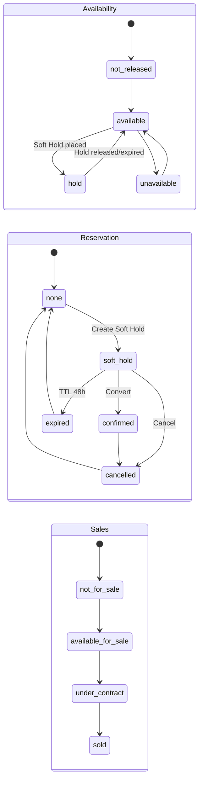
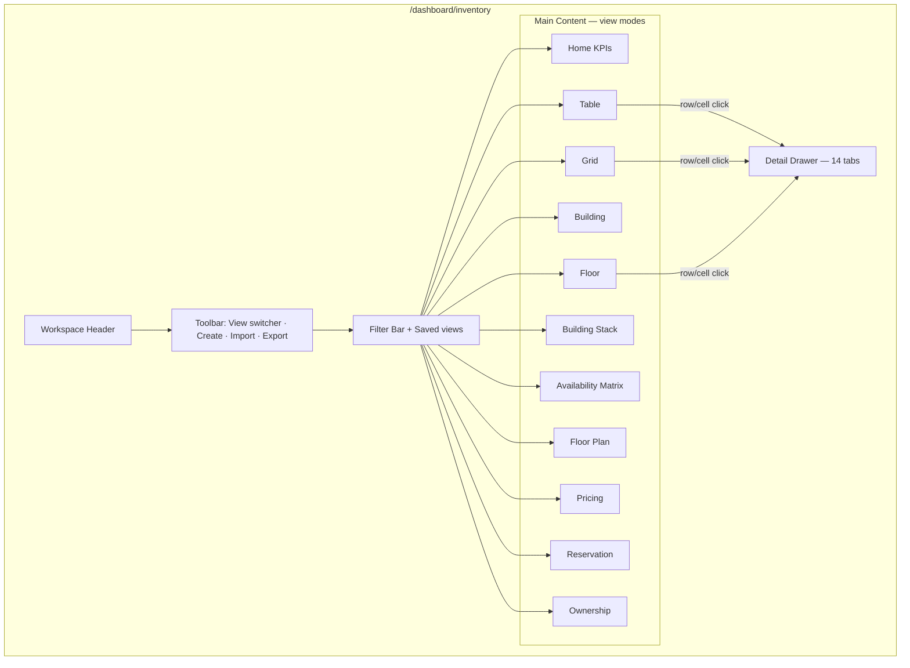

# Investhome OS — Inventory Workspace Blueprint

**Document version:** 1.0  
**Sprint:** 4A — Documentation only  
**Status:** BLUEPRINT COMPLETE  
**Audit date:** 2026-07-16  
**Repository:** `investhome-os`  
**Audience:** Product, design, engineering

**Related governance:** [UNITS_INVENTORY_BLUEPRINT.md](./UNITS_INVENTORY_BLUEPRINT.md) (domain/module spec) · [WORKSPACE_FRAMEWORK.md](./WORKSPACE_FRAMEWORK.md) · [WORKSPACE_NAVIGATION.md](./WORKSPACE_NAVIGATION.md) · [EXECUTIVE_WORKSPACE.md](./EXECUTIVE_WORKSPACE.md) · [DOMAIN_MODEL.md](./DOMAIN_MODEL.md) · [DATA_OWNERSHIP.md](./DATA_OWNERSHIP.md) · [PERMISSION_MODEL.md](./PERMISSION_MODEL.md) · [EVENT_MODEL.md](./EVENT_MODEL.md) · [ARCHITECTURE_DECISIONS.md](./ARCHITECTURE_DECISIONS.md) · [ROADMAP.md](./ROADMAP.md) · [IMPLEMENTATION_STATUS.md](./IMPLEMENTATION_STATUS.md)

> **Scope:** This document defines the **Inventory Workspace UX and operational experience** — how users manage sellable and leasable inventory day-to-day. It **extends** [UNITS_INVENTORY_BLUEPRINT.md](./UNITS_INVENTORY_BLUEPRINT.md) with workspace-specific views, flows, and reconciled domain decisions. **No React, migrations, routes, or production business logic** in Sprint 4A.

---

## Reconciliation with UNITS_INVENTORY_BLUEPRINT.md

The module blueprint (`UNITS_INVENTORY_BLUEPRINT.md` v1.0) remains the **domain and API foundation**. This workspace blueprint **supersedes UX-only conflicts** below and **defers schema detail** to an updated module spec in Sprint 4B1.

| Topic | UNITS_INVENTORY_BLUEPRINT (v1.0) | Inventory Workspace (approved) | Resolution |
|-------|----------------------------------|-------------------------------|------------|
| Route | `/dashboard/units` | `/dashboard/inventory` | **Workspace route:** `/dashboard/inventory` per [WORKSPACE_NAVIGATION.md §2.3](./WORKSPACE_NAVIGATION.md#23-inventory). API prefix may remain `/units` or alias `/inventory` — engineering choice in 4B1. |
| Entity naming | `Unit` table, `unit_category=accessory` for parking/storage | **Inventory Asset** parent; Unit / Parking / Storage as **independent asset types** | **Supersedes accessory model.** Parking and Storage are first-class inventory assets with optional assignment links — not child `unit_category=accessory` rows. |
| Identifiers | Single `unit_code` | **Display ID**, **System Code**, **Legal Identifier** (three fields) | **Supersedes** single-code model. System Code is unique per project; Display ID is marketing-facing; Legal Identifier is deed/tapu reference (nullable until closing). |
| Status dimensions | Four: construction, sales, closing, leasing | **Six:** availability, reservation, sales, construction, closing, leasing | **Extends** module spec. Availability and reservation are **separate dimensions** — no overloaded `sales_status=reserved`. |
| Reservation | Generic hold; expiry configurable | **Soft Hold** — default **48 hours** | **Approved default.** Configurable per project via `SystemPreference` in 4B4. |
| Area storage | `*_sqm` fields only | **Canonical storage in square feet** (`sq ft`) with display conversion | **Extends** module spec. Store `interior_area_sqft`, etc.; display per company `AreaUnit` preference ([IAD-016](./ARCHITECTURE_DECISIONS.md#iad-016-company-foundation-as-centralized-orgbrandsettings)). |
| Ownership | `UnitOwnership` with `released_at`; DELETE endpoint | **Immutable append-only ownership history** | **Supersedes** mutable/delete pattern. Corrections via new history row + `ownership_correction` activity — never hard delete. |
| Price types | `list`, `asking`, `contract`, `appraisal`, `internal` | Adds `original`, `promotional`, `negotiated`, `final_sale`, `estimated_rent` | **Extends** enum; see §9. |
| Party link | `investor_id` / `lead_id` on reservation | **Party master** (conceptual) — Lead/Investor FKs today | **Aligned with** [DOMAIN_MODEL.md](./DOMAIN_MODEL.md). Workspace UI shows unified "Party" picker backed by Lead ∪ Investor search until unified `parties` table ships. |
| Detail tabs | 12 tabs | **14 tabs** | **Extends** drawer spec — see §6. |
| Migration ID | `0014_units_inventory` | Design Studio occupies `0014`–`0016` in repo | **Conflict documented.** Next inventory migration is **`0017_inventory_assets`** (or renumber at 4B1 kickoff). Do not collide with design studio chain. |
| Implementation sprints | S0–S7 (module-centric) | **4B1–4B7** (workspace delivery track) | **This document owns 4B1–4B7.** Maps to module sprints in §22. |

---

## 1. PURPOSE

### Operational center for inventory

The **Inventory Workspace** is the canonical operational surface for all sellable and leasable inventory across projects. It is workspace #3 in [WORKSPACE_NAVIGATION.md](./WORKSPACE_NAVIGATION.md) — distinct from Development (project lifecycle), Sales (lead pipeline), and Finance (treasury).

Users come here to answer:

- What inventory exists, where is it, and what state is it in?
- What is available to sell or lease right now?
- Who holds a Soft Hold, who owns it, and what is the approved price?
- How do buildings and floors organize units for site and sales teams?

### Entity hierarchy — what each level means

| Level | Business meaning | Examples | Sellable? |
|-------|------------------|----------|-----------|
| **Project** | Development or investment **program** — aggregates inventory, finance, documents | "Marina Towers", "Retail Block B" | Indirectly (via assets) |
| **Building** | Physical **structure** or phase within a project | Tower A, Parking Garage P1, Retail Podium | Sometimes (whole-building sale — rare) |
| **Floor** | **Level** within a building — organizational and visualization layer | Floor 12, Basement B2, Roof terrace level | No (container) |
| **Inventory Asset** | **Authoritative inventory record** — anything tracked in inventory SSOT | (abstract parent — not shown alone in UI lists) | Depends on asset type |
| **Unit** | Primary **living or commercial space** | Apartment 12A, Retail Bay R-04, Office suite | Yes |
| **Parking** | **Parking asset** — independent lifecycle | Spot P-142, tandem P-143–144 | Yes (standalone or bundled) |
| **Storage** | **Storage locker / depot** — independent lifecycle | Locker S-22, basement storage cell | Yes (standalone or bundled) |

**Critical distinction:** Project and Building/Floor are **structural containers**. **Inventory Asset** is the domain parent type; **Unit**, **Parking**, and **Storage** are **asset types** with independent sales/reservation lifecycles. Assignment links (e.g., Parking → Unit) are **relationships**, not parent-child ownership in the data model.

### Three identifier roles

| Field | Purpose | Example | Unique scope |
|-------|---------|---------|--------------|
| **Display ID** | Marketing, brochures, sales conversations | "12A", "Shop 4", "P-142" | Unique per project (recommended) |
| **System Code** | Internal operations, imports, API keys | `MT-A-12-12A` | **Unique per project** (required) |
| **Legal Identifier** | Deed, tapu, registry reference | Tapu sheet 1234/56 | Nullable until legal closing; immutable once set |

---

## 2. TARGET USERS

| Persona | Role code(s) | Primary goals in Inventory | Typical views |
|---------|--------------|---------------------------|---------------|
| **Executive Leadership** | `executive`, `partner` | Portfolio absorption, revenue pipeline, expiring holds | Home KPIs, Availability Matrix, Pricing summary |
| **Sales** | `sales` | Find available units, place Soft Holds, advance to contract | Table, Grid, Reservation, Unit detail |
| **Investor Relations** | `investor_relations` | Ownership records, co-buyer linkage to investors | Ownership tab, Reservation (investor holds) |
| **Finance** | `finance` | Price approval, deposit linkage, closing alignment | Pricing view, Finance tab, closings KPI |
| **Construction** | `construction` | Construction status by floor/building, drawing linkage | Building, Floor, Building Stack, Drawing tab |
| **Operations** | `operations` | Cross-project inventory health, bulk status updates | Table, Building view, bulk actions (future) |
| **Marketing** | `marketing` | Available inventory for campaigns, Display IDs | Grid, Availability Matrix (read-only) |
| **Read-only** | `read_only`, `assistant` | Lookup inventory state | All views — read-only; no mutations |

**Permission gate:** Minimum `units.view` to enter workspace. Mutations require granular actions per §16.

---

## 3. WORKSPACE HOME

Inventory Home follows [WORKSPACE_FRAMEWORK.md §2](./WORKSPACE_FRAMEWORK.md#section-2--universal-workspace-layout) and [WORKSPACE_NAVIGATION.md §5.2](./WORKSPACE_NAVIGATION.md#52-required-widgets-by-workspace).

### KPI stat cards (target)

| KPI | Definition | Filter inheritance |
|-----|------------|-------------------|
| **Total inventory** | Count of active (non-archived) inventory assets — all types | Project, building, asset type |
| **Available** | `availability_status=available` | Same |
| **Soft Hold** | `reservation_status=soft_hold` (active, unexpired) | Same |
| **Reserved** | `reservation_status=confirmed` OR `sales_status=reserved` | Same |
| **Under contract** | `sales_status=under_contract` | Same |
| **Sold** | `sales_status=sold` | Same |
| **Closed** | `closing_status=closed` | Same |
| **Leased** | `leasing_status=leased` | Same |
| **Total list value** | Sum of current approved list price where `availability_status=available` | Same |
| **Closings (period)** | Count `closing_status=closed` with closing date in filter period | Period preset |
| **Expiring reservations** | Active Soft Holds expiring within **48h** (configurable warning window) | Same |

### Home layout

```
┌─────────────────────────────────────────────────────────────────┐
│ Inventory — Envanter                    [+ New Asset] [Import]    │
│ Subtitle: Canonical sellable & leasable inventory               │
│ [Project ▾] [Building ▾] [Asset type ▾]     [Period ▾]         │
├─────────────────────────────────────────────────────────────────┤
│ [Total] [Available] [Soft Hold] [Reserved] [Contract] [Sold] …  │
├─────────────────────────────────────────────────────────────────┤
│ Row 2: Absorption chart (by project) │ Expiring holds list      │
│ Row 3: Recent status changes         │ Quick links to views     │
└─────────────────────────────────────────────────────────────────┘
```

**Quick actions:** New inventory asset · Place Soft Hold · Open Pricing manager · Export (design) · Jump to Building view.

---

## 4. PRIMARY VIEWS

Ten primary views. View switcher lives in **Toolbar** ([WORKSPACE_FRAMEWORK.md §4](./WORKSPACE_FRAMEWORK.md#section-4--toolbar)). Default view: **Table**.

### 4.1 Table View

| Attribute | Specification |
|-----------|---------------|
| **Purpose** | Primary operational list — sort, filter, bulk select |
| **Primary users** | Sales, Operations, Finance, Executive |
| **Columns** | See §5 (full list) |
| **Filters** | See §5 |
| **Actions** | Open detail drawer · Place Soft Hold · Change status (dimension picker) · Export row · Archive |
| **Limitations** | No spatial context; floor/building columns may be empty for land/parking surface assets |

### 4.2 Grid View

| Attribute | Specification |
|-----------|---------------|
| **Purpose** | Visual card browse — marketing and sales floor friendly |
| **Primary users** | Sales, Marketing |
| **Cards show** | Display ID, asset type badge, project/building, interior sq ft, list price, availability + sales badges, primary photo thumbnail |
| **Filters** | Same as Table; card density toggle (compact/comfortable) |
| **Actions** | Click → detail drawer · Quick Soft Hold from card menu |
| **Limitations** | Pagination required >200 cards; no floor geometry |

### 4.3 Building View

| Attribute | Specification |
|-----------|---------------|
| **Purpose** | Select building → see summary + floor list + unit counts by status |
| **Primary users** | Construction, Sales, Operations |
| **Columns/cards** | Building code, name, type, floors count, units by availability, construction roll-up |
| **Filters** | Project, building type, construction status |
| **Actions** | Open floor list · Create floor · Open Building Stack |
| **Limitations** | **Requires** `building_id`; not applicable for land-only projects without buildings |

### 4.4 Floor View

| Attribute | Specification |
|-----------|---------------|
| **Purpose** | Single floor unit matrix — primary site coordination view |
| **Primary users** | Construction, Sales |
| **Columns/cards** | Grid of units on floor with status color chips |
| **Filters** | Building (required), floor, status dimensions |
| **Actions** | Click cell → drawer · Bulk status update (construction) |
| **Limitations** | Requires floor assignment; parking/storage may appear in "unassigned" lane |

### 4.5 Building Stack View

| Attribute | Specification |
|-----------|---------------|
| **Purpose** | Vertical section — all floors stacked with unit columns |
| **Primary users** | Sales, Executive, Construction |
| **Display** | Y-axis = floors; cells = units color-coded by selected dimension (default: availability) |
| **Filters** | Building (required), color dimension selector |
| **Actions** | Cell click → drawer · Legend toggle |
| **Limitations** | Performance cap ~500 cells; retail "single floor" may collapse to one band |

### 4.6 Availability Matrix View

| Attribute | Specification |
|-----------|---------------|
| **Purpose** | Cross-project availability heatmap for leadership |
| **Primary users** | Executive, Finance, Marketing |
| **Columns** | Projects (rows) × asset types or bedroom buckets (columns) — available count |
| **Filters** | Project multi-select, asset type, price band |
| **Actions** | Drill to Table filtered · Export |
| **Limitations** | Aggregates only — no unit-level edit |

### 4.7 Floor Plan View

| Attribute | Specification |
|-----------|---------------|
| **Purpose** | SVG/canvas overlay from drawing or design studio — spatial inventory |
| **Primary users** | Sales, Construction, Marketing |
| **Display** | Floor plan background; units colored by status; tooltip on hover |
| **Filters** | Floor (required), color dimension |
| **Actions** | Select unit → drawer · Link to Design Studio scene (if exists) |
| **Limitations** | **Requires** drawing geometry or design source plan; honest empty state when missing ([Visual Design Studio](./IMPLEMENTATION_STATUS.md) partial). Overlays `basic_overlay` mode when no room geometry. |

### 4.8 Pricing View

| Attribute | Specification |
|-----------|---------------|
| **Purpose** | Bulk price management and approval queue |
| **Primary users** | Finance, Executive |
| **Columns** | Display ID, System Code, project, current list price, pending approval, last change %, effective date |
| **Filters** | Pending approval, project, price type, change threshold |
| **Actions** | Approve/reject · Bulk adjust · Open price history |
| **Limitations** | Contract/final_sale prices require `units.approve` |

### 4.9 Reservation View

| Attribute | Specification |
|-----------|---------------|
| **Purpose** | Active holds pipeline — Soft Hold expiry management |
| **Primary users** | Sales, Operations, Executive |
| **Columns** | Asset, party, hold type, placed at, expires at, deposit, assigned rep |
| **Filters** | Hold status, expiring window, project, party |
| **Actions** | Extend · Convert to confirmed · Cancel · Open finance deposit |
| **Limitations** | Does not replace Sales CRM — party source remains Lead/Investor records |

### 4.10 Ownership View

| Attribute | Specification |
|-----------|---------------|
| **Purpose** | Closed/sold asset ownership registry and history access |
| **Primary users** | Finance, Investor Relations, Legal (read) |
| **Columns** | Asset, primary owner party, ownership type, % share, acquired date, closing status |
| **Filters** | Project, owner party, ownership role, date range |
| **Actions** | View immutable history · Add co-buyer (new history row) · Link documents |
| **Limitations** | **No delete** of history rows; corrections via superseding entries only |

---

## 5. INVENTORY TABLE

Full default column set for **Table View** and export design. Column visibility configurable per saved view.

### 5.1 Columns

| # | Column key | Label (EN) | Label (TR) | Notes |
|---|------------|------------|------------|-------|
| 1 | `display_id` | Display ID | Görünen Kod | Marketing identifier |
| 2 | `system_code` | System Code | Sistem Kodu | Required unique per project |
| 3 | `legal_identifier` | Legal ID | Yasal Kimlik | Nullable; lock icon when set |
| 4 | `asset_type` | Type | Tür | `unit`, `parking`, `storage` |
| 5 | `project_name` | Project | Proje | Denormalized for list perf |
| 6 | `building_code` | Building | Bina | Nullable |
| 7 | `floor_label` | Floor | Kat | Nullable |
| 8 | `unit_subtype` | Subtype | Alt Tür | e.g. residential, retail, office, tandem_parking |
| 9 | `bedrooms` | Beds | Yatak Odası | Units only |
| 10 | `bathrooms` | Baths | Banyo | Units only |
| 11 | `interior_area_sqft` | Interior (sq ft) | İç Alan (ft²) | Stored sq ft; display converts per prefs |
| 12 | `exterior_area_sqft` | Exterior (sq ft) | Dış Alan (ft²) | Terrace/balcony |
| 13 | `total_area_sqft` | Total (sq ft) | Toplam Alan (ft²) | Computed or stored |
| 14 | `orientation` | Orientation | Cephe | N, S, NE, … |
| 15 | `view_type` | View | Manzara | Sea, city, garden |
| 16 | `list_price` | List Price | Liste Fiyatı | Current approved list |
| 17 | `currency` | Currency | Para Birimi | ISO 4217 |
| 18 | `availability_status` | Availability | Müsaitlik | Separate dimension |
| 19 | `reservation_status` | Reservation | Rezervasyon | Includes `soft_hold` |
| 20 | `sales_status` | Sales | Satış | |
| 21 | `construction_status` | Construction | İnşaat | |
| 22 | `closing_status` | Closing | Kapanış | |
| 23 | `leasing_status` | Leasing | Kiralama | |
| 24 | `assigned_parking_count` | Parking | Otopark | Count of linked parking assets |
| 25 | `assigned_storage_count` | Storage | Depo | Count of linked storage assets |
| 26 | `active_party_name` | Hold/Owner Party | Taraf | Soft hold or primary owner |
| 27 | `reservation_expires_at` | Hold Expires | Hold Bitiş | When `soft_hold` active |
| 28 | `updated_at` | Updated | Güncellendi | |

### 5.2 Filters

| Filter | Type | Notes |
|--------|------|-------|
| Project | Single/multi select | Cascades building/floor |
| Building | Multi | Requires project |
| Floor | Multi | Requires building |
| Asset type | Multi | unit, parking, storage |
| Unit subtype | Multi | Conditional on asset type |
| Availability status | Multi | |
| Reservation status | Multi | Include "expiring in 48h" preset |
| Sales status | Multi | |
| Construction status | Multi | |
| Closing status | Multi | |
| Leasing status | Multi | |
| Price range | Min/max | On list price |
| Area range | Min/max sq ft | |
| Bedrooms / bathrooms | Range | Units only |
| Has Soft Hold | Boolean | |
| Has owner | Boolean | |
| Has legal identifier | Boolean | |
| Assigned parking/storage | Boolean | |
| Orientation / view | Multi | |
| Search text | Full-text | Display ID, System Code, Legal ID, notes |
| Include archived | Toggle | Default off |
| Demo only | Toggle | Admin |

### 5.3 Saved views (presets)

| View key | Filter preset |
|----------|---------------|
| `available_now` | `availability_status=available` |
| `soft_holds_expiring` | `reservation_status=soft_hold`, expires ≤48h |
| `sales_pipeline` | `sales_status` in (`reserved`, `under_contract`) |
| `ready_to_sell` | `availability_status=available`, `construction_status=ready` |
| `sold_closed` | `sales_status=sold`, `closing_status=closed` |
| `parking_available` | `asset_type=parking`, `availability_status=available` |
| `storage_unassigned` | `asset_type=storage`, no unit assignment link |
| `pending_price_approval` | Has unapproved price row |

---

## 6. INVENTORY DETAIL

Detail drawer follows [WORKSPACE_FRAMEWORK.md §7](./WORKSPACE_FRAMEWORK.md#section-7--detail-drawer) — **14 tabs**. Universal tabs (Documents, Activity) reuse shared primitives ✅.

| # | Tab | Content | Primary actions | Permission |
|---|-----|---------|-----------------|------------|
| 1 | **Overview** | Display ID, System Code, Legal ID, badges (all 6 dimensions), areas, price summary, quick actions | Edit identifiers · Place Soft Hold · Open in Floor Plan | `units.view` / `units.update` |
| 2 | **Status** | Six dimension pickers with governed transitions + timeline snippet | Change status per dimension (one at a time) | `units.update`; construction dim: `construction` role |
| 3 | **Pricing** | Current prices by type, pending approvals, history chart | Add price · Submit for approval · Approve/reject | `units.update` / `units.approve` |
| 4 | **Reservation** | Active/past holds, Soft Hold timer, party link | Create Soft Hold · Extend · Convert · Cancel | `units.update` |
| 5 | **Ownership** | Current owners + link to full immutable history | Add owner row · Record transfer (append) | `units.update`; approve for post-closing correction |
| 6 | **Assignments** | Linked parking, storage, bundled units | Link/unlink parking/storage assets | `units.update` |
| 7 | **Features** | Feature list (balcony, smart home, …) | Add/remove features | `units.update` |
| 8 | **Documents** | Entity document panel (`DocumentLink`) | Upload · link · view | `documents.view` + `units.view` |
| 9 | **Media** | Photos, renders, virtual tour | Add media · set primary | `units.update` |
| 10 | **Finance** | Linked transactions (`unit_id` FK) | Link transaction · create deposit draft | `finance.view` + `units.view` |
| 11 | **Drawing** | Source drawing preview, element highlight, proposal link | Open in Documents · Approve proposal (construction) | `documents.view` / `documents.approve` |
| 12 | **Design** | Linked Design Studio scenes/versions | Open Design Studio | `design.view` |
| 13 | **Related** | Project, building, floor, party, lead cross-links | Navigate cross-workspace | `units.view` |
| 14 | **Activity** | Entity timeline | — | `activity.view` + entity permission |

**Drawer rules:**

- D-1: Soft Hold timer visible on Overview + Reservation when active.
- D-2: Legal Identifier field shows confirmation modal on first set (immutable).
- D-3: Ownership tab **never** shows delete — only "Record correction" for authorized roles.

---

## 7. STATUS MODEL

Six **independent dimensions**. No single overloaded "status" field. Every change appends to `inventory_status_history` (extends `UnitStatusHistory` in module blueprint).

### 7.1 `availability_status`

| Status | EN | TR |
|--------|----|----|
| `not_released` | Not Released | Satışa Açılmadı |
| `available` | Available | Müsait |
| `unavailable` | Unavailable | Müsait Değil |
| `hold` | On Hold (internal) | Beklemede |

**Rules:** `available` required before Soft Hold. `unavailable` blocks new holds without override.

### 7.2 `reservation_status`

| Status | EN | TR |
|--------|----|----|
| `none` | None | Yok |
| `soft_hold` | Soft Hold | Ön Rezervasyon |
| `confirmed` | Confirmed Reservation | Kesin Rezervasyon |
| `expired` | Expired | Süresi Doldu |
| `cancelled` | Cancelled | İptal |

**Rules:** Only one active hold per asset. Soft Hold auto-expires at `expires_at` (default **now + 48h**).

### 7.3 `sales_status`

| Status | EN | TR |
|--------|----|----|
| `not_for_sale` | Not for Sale | Satılık Değil |
| `available_for_sale` | Available for Sale | Satışa Açık |
| `under_contract` | Under Contract | Sözleşme Altında |
| `sold` | Sold | Satıldı |

**Rules:** `sold` terminal — requires admin/`units.approve` override to revert. Distinct from availability — e.g. sold + unavailable.

### 7.4 `construction_status`

Same enum as [UNITS_INVENTORY_BLUEPRINT.md §5.1](./UNITS_INVENTORY_BLUEPRINT.md#51-construction_status) — `planned` through `delivered`, plus `on_hold`.

### 7.5 `closing_status`

Same enum as [UNITS_INVENTORY_BLUEPRINT.md §5.3](./UNITS_INVENTORY_BLUEPRINT.md#53-closing_status).

### 7.6 `leasing_status`

Same enum as [UNITS_INVENTORY_BLUEPRINT.md §5.4](./UNITS_INVENTORY_BLUEPRINT.md#54-leasing_status).

### Cross-dimension rules

| Rule | Description |
|------|-------------|
| XR-1 | Active Soft Hold ⇒ `reservation_status=soft_hold` AND `availability_status` ≠ `available` (typically `hold`) |
| XR-2 | `sales_status=sold` ⇒ `closing_status` ∈ {`scheduled`, `closed`} |
| XR-3 | `sales_status=sold` + `closing_status=closed` ⇒ ownership history must have ≥1 primary owner row |
| XR-4 | Expired Soft Hold ⇒ revert `reservation_status` to `expired`, restore `availability_status=available` unless `under_contract` |
| XR-5 | Parking/Storage may be `sold` independently of linked unit |

### Status transition diagram



---

## 8. RESERVATION EXPERIENCE

### Soft Hold (Ön Rezervasyon)

| Attribute | Value |
|-----------|-------|
| **Default duration** | **48 hours** from placement |
| **Configurable** | Per-project `SystemPreference` key `inventory.soft_hold_hours` (default 48) |
| **Max extensions** | 2 extensions; each +24h — requires `units.update` |
| **Party link** | Required — Lead and/or Investor (Party picker) |
| **Deposit** | Optional — links to finance draft transaction |

### Placement flow

1. User selects available asset → **Place Soft Hold**
2. System validates: `availability_status=available`, no active hold, `units.update`
3. Modal: Party search (Lead ∪ Investor), optional deposit amount, notes
4. On confirm:
   - Create `inventory_reservation` row (`reservation_type=soft_hold`)
   - Set `reservation_status=soft_hold`, `availability_status=hold`
   - Set `expires_at = now + 48h`
   - Emit activity `inventory.reservation.soft_hold_created`
   - Schedule notification at T-24h and T-4h

### Warnings

| Condition | UI behavior |
|-----------|-------------|
| Hold expires in <24h | Amber badge on row + Reservation view |
| Hold expires in <4h | Red badge + notification to `reserved_by_user_id` + sales role |
| Expired on read | Background job or lazy check releases hold |
| Asset under contract | Block new Soft Hold — show reason |
| Price pending approval | Warning banner — hold allowed but contract blocked until price approved |

### Finance linkage

- Optional deposit → draft `FinanceTransaction` with `category=unit_deposit`, `unit_id`, `party` reference
- Does not auto-post — finance user confirms in Finance workspace
- See [UNITS_INVENTORY_BLUEPRINT.md §17](./UNITS_INVENTORY_BLUEPRINT.md#17-finance-integration)

### Events

| Event | Activity | Notification |
|-------|----------|--------------|
| Soft Hold created | `inventory.reservation.soft_hold_created` | Info to assigned rep |
| Extended | `inventory.reservation.extended` | Info |
| Expiring soon | — | `inventory.reservation_expiring` |
| Expired | `inventory.reservation.expired` | `inventory.reservation_expired` at_risk |
| Converted to confirmed | `inventory.reservation.confirmed` | Sales + finance |
| Cancelled | `inventory.reservation.cancelled` | Info |

---

## 9. PRICING EXPERIENCE

### Price types (canonical enum)

| Type | Purpose | Approval required |
|------|---------|-------------------|
| `original` | Launch/original list | Initial set — log only |
| `list` | Current active list price | Decrease >10% → `units.approve` |
| `promotional` | Time-boxed campaign price | Yes if below list |
| `asking` | Internal asking floor | Optional |
| `negotiated` | Negotiation checkpoint | Yes |
| `contract` | Contract signing price | **Always** `units.approve` |
| `final_sale` | Closed transaction price | **Always** `units.approve` |
| `appraisal` | Third-party appraisal | Log |
| `internal` | Internal valuation | Log |
| `estimated_rent` | Leasing estimate | Decrease >10% → approve |

### History rules

- Append-only `inventory_prices` rows — never mutate past rows
- One `is_current=true` per `(asset_id, price_type)` pair
- Denormalized `list_price` on asset row refreshed on approval

### Approval workflow

1. User submits price → status `pending_approval`
2. Finance/Executive queue in **Pricing View** + Executive Approvals widget ([EXECUTIVE_WORKSPACE.md](./EXECUTIVE_WORKSPACE.md))
3. Approver: Approve → activates row, updates cache, activity `inventory.price.approved`
4. Reject → row marked rejected, activity with reason

### UI surfaces

- Detail **Pricing** tab — timeline chart, type filter
- **Pricing View** — bulk operations, approval queue
- AI may **recommend** price adjustments — human approval mandatory ([§15](#15-ai-support))

---

## 10. OWNERSHIP EXPERIENCE

### Party types on ownership records

Ownership links to **Party** (Lead/Investor FK today; unified Party future):

| `ownership_type` | Description |
|------------------|-------------|
| `buyer` | Primary buyer |
| `co_buyer` | Co-purchaser |
| `beneficial` | Beneficial owner |
| `nominee` | Nominee holder |
| `llc` | LLC entity (organization record) |
| `trust` | Trust |
| `lessor` | Lessor (lease context) |
| `lessee` | Lessee |

### Immutable history

- Table `inventory_ownership_history` — **append-only**
- Fields: asset_id, party_id, ownership_type, percentage, effective_from, effective_to (null = current), recorded_by, document_ref, notes
- **No DELETE.** Corrections append a new row with `correction_of_id` reference
- UI shows timeline with "superseded" styling on corrected rows

### Transfers

- On closing: auto-suggest ownership rows from contract party list
- Finance confirms closing → trigger ownership append + `sales_status=sold`
- Co-buyer percentages must sum to 100% (warning if not)

---

## 11. PARKING AND STORAGE

### Independent assets

Parking and Storage are **`asset_type=parking`** and **`asset_type=storage`** — **not** accessory sub-units.

| Capability | Unit | Parking | Storage |
|------------|------|---------|---------|
| Independent sales lifecycle | ✅ | ✅ | ✅ |
| Soft Hold | ✅ | ✅ | ✅ |
| Own pricing | ✅ | ✅ | ✅ |
| Floor assignment | Optional | Optional (surface lot null) | Optional |
| Link to unit | via assignment | via assignment | via assignment |

### Assignment model

- `inventory_asset_links` table: `source_asset_id`, `target_asset_id`, `link_type` ∈ {`parking_for`, `storage_for`, `bundled_with`}
- Selling unit may **include** linked parking/storage (bundle flag on transaction metadata)
- Unlinking requires `availability_status=available` on both sides

---

## 12. BUILDING AND FLOOR VIEWS

Conditional requirements by project/asset profile:

| Project profile | Building required? | Floor required? | Primary view |
|-----------------|-------------------|-------------------|--------------|
| **Condo / residential tower** | Yes | Yes | Building Stack + Floor Plan |
| **Retail podium** | Yes | Often single floor | Floor + Table |
| **Parking structure** | Yes (type=`parking_structure`) | Yes | Floor grid; asset type parking |
| **Land / plot** | No | No | Table + map pin (future) |
| **Villa cluster** | Optional per villa as building | Optional | Grid |
| **Industrial** | Yes | Yes | Floor + Availability Matrix |

**Empty states:** Honest messaging when hierarchy incomplete — "Assign building to enable Stack view."

---

## 13. BULK OPERATIONS

**Design only — not implemented Sprint 4A/4B1.**

| Operation | Design |
|-----------|--------|
| **Import** | CSV/XLSX wizard — validate → preview → commit; columns mirror §5.1 + status defaults |
| **Export** | Filtered export matching Table columns; permission `units.export` |
| **Bulk status** | Select rows → change one dimension with reason |
| **Bulk price** | Pricing view multi-select → % adjustment → approval batch |
| **Bulk assign** | Link parking/storage to units by System Code pairs |

Reference import column spec: [UNITS_INVENTORY_BLUEPRINT.md §20](./UNITS_INVENTORY_BLUEPRINT.md#20-import--export-specification) — updated for Display ID / System Code / sq ft in 4B7.

---

## 14. CROSS-WORKSPACE INTEGRATION

| Workspace | Integration | SSOT | Direction |
|-----------|-------------|------|-----------|
| **Sales (Leads)** | Soft Hold from lead context; party picker | Inventory owns hold | Bi-directional link |
| **Investors** | Ownership, funding context | Inventory owns ownership | Read + link |
| **Finance** | Deposits, sale proceeds, price approval | Finance owns transactions | Bi-directional `unit_id` |
| **Construction** | Drawing proposals → assets; construction status | Inventory owns status dim | Inbound create; status update |
| **Documents** | Deeds, plans, contracts | Documents owns files | DocumentLink |
| **Design Studio** | Floor plan coloring source | Design owns scenes | Read overlay |
| **Executive** | KPI widgets, approvals queue | Inventory owns counts | Read aggregates |
| **Property Management** | Leasing status, tenant party | Inventory owns leasing dim | Read + update lease fields |
| **Development (Projects)** | Project drawer Inventory tab; rollup counts | Inventory owns assets | Project reads rollups |
| **Marketing** | Available inventory feeds | Inventory owns availability | Read-only export |

**No duplicated inventory lists** in other workspaces — embed stats + deep links only ([DATA_OWNERSHIP.md](./DATA_OWNERSHIP.md)).

---

## 15. AI SUPPORT

Aligned with [IAD-011](./ARCHITECTURE_DECISIONS.md#iad-011-localheuristic-ai-with-honest-degradation) and [AI_PRINCIPLES.md](./AI_PRINCIPLES.md).

| Capability | Mode | Approval |
|------------|------|----------|
| Suggested list price from comparables | Recommend | Human must approve price row |
| Absorption forecast narrative | Inform | None — read-only insight |
| Soft Hold expiry prioritization | Rank | None — sorted list |
| Anomaly: status/price mismatch | Flag | Human confirms |
| Bulk import column mapping | Assist | Human confirms mapping |
| Auto-place Soft Hold | **Forbidden** | — |
| Auto-approve price | **Forbidden** | — |

AI actions log `actor_type=ai` in activity when user accepts a suggestion.

---

## 16. PERMISSIONS

Resource: **`units`** (add to `RESOURCES` in 4B1 — per module blueprint).

### Actions

| Action | Description |
|--------|-------------|
| `view` | Read all inventory views and detail |
| `create` | Create assets, buildings, floors |
| `update` | Edit fields, status, reservations, assignments |
| `archive` | Soft-archive assets |
| `delete` | Hard delete — `super_admin` only if enabled |
| `export` | Export inventory |
| `approve` | Price approvals, override sold status, ownership corrections |

### Role mappings

| Role | Grants |
|------|--------|
| `super_admin` | All |
| `executive` | `view`, `export`, `approve` (price) |
| `partner` | `view`, `export` |
| `sales` | `view`, `create`, `update`, `export` |
| `investor_relations` | `view`, `update` (ownership, reservations) |
| `finance` | `view`, `export`, `approve` |
| `construction` | `view`, `create`, `update` (construction_status, drawing bridge) |
| `marketing` | `view`, `export` |
| `operations` | `view`, `update` |
| `assistant` | `view` |
| `read_only` | `view` |

### Tab-level gates

| Tab | Minimum permission |
|-----|-------------------|
| Pricing (write/approve) | `units.update` / `units.approve` |
| Finance | `finance.view` |
| Documents | `documents.view` |
| Drawing approve | `documents.approve` |
| Design | `design.view` |
| Ownership correction | `units.approve` |

---

## 17. ACTIVITY, AUDIT, EVENTS

### Activity Log (authoritative audit — [IAD-008](./ARCHITECTURE_DECISIONS.md#iad-008-activity-log-as-business-audit-trail))

Entity types to add: `inventory_asset`, `building`, `floor`, `inventory_reservation`, `inventory_price`, `inventory_ownership`.

| Event key | Action | Trigger |
|-----------|--------|---------|
| `inventory.asset.created` | CREATED | Create, import, drawing approve |
| `inventory.asset.updated` | UPDATED | Field patch |
| `inventory.status_changed` | STATUS_CHANGED | Any dimension transition |
| `inventory.price.submitted` | UPDATED | Price pending |
| `inventory.price.approved` | APPROVED | Price approved |
| `inventory.reservation.soft_hold_created` | CREATED | Soft Hold |
| `inventory.reservation.expired` | STATUS_CHANGED | TTL |
| `inventory.ownership.recorded` | CREATED | New history row |
| `inventory.link.assigned` | UPDATED | Parking/storage link |

### Business events (future bus — [EVENT_MODEL.md](./EVENT_MODEL.md))

Publish after commit for: `inventory.soft_hold.expiring`, `inventory.sold`, `inventory.price.approved` — consumers: notifications, executive widgets, n8n.

### What goes where

| Data | Activity Log | Notification | Entity state |
|------|--------------|--------------|--------------|
| Status change | ✅ Full diff | If attention-worthy | ✅ Dimension fields |
| Price approval | ✅ | Finance queue | ✅ Price row |
| Soft Hold expiry | ✅ | ✅ Sales | ✅ Reservation + availability |
| Ownership transfer | ✅ Immutable row | Optional IR | ✅ History table |
| AI suggestion accepted | ✅ actor=ai | No | Depends on action |

---

## 18. NOTIFICATIONS

| Rule key | Condition | Audience | Severity |
|----------|-----------|----------|----------|
| `inventory.reservation_expiring` | Soft Hold expires ≤24h | Reserved by user + sales | attention |
| `inventory.reservation_expiring_critical` | ≤4h | Same | at_risk |
| `inventory.reservation_expired` | Past expires_at | Sales | at_risk |
| `inventory.price_pending` | Price submitted | Finance | attention |
| `inventory.price_approved` | Approved | Submitter | info |
| `inventory.sold` | sales_status→sold | Executive, finance | info |
| `inventory.construction_ready` | construction→ready | Sales, marketing | info |
| `inventory.closing_scheduled` | closing→scheduled | Finance | attention |
| `inventory.closing_fallen_through` | closing→fallen_through | Sales, executive | at_risk |

---

## 19. GLOBAL SEARCH

Enable entity type **`inventory_asset`** (alias **`unit`** chip in UI for familiarity).

### Indexed fields

`display_id`, `system_code`, `legal_identifier`, project name, building code, floor label, party names (owner/hold), status values, notes.

### Permissions

`ENTITY_PERMISSION_RESOURCE["inventory_asset"] = "units"` — per [IAD-018](./ARCHITECTURE_DECISIONS.md#iad-018-permission-aware-universal-search).

Move from `FUTURE_SEARCH_ENTITY_TYPES` in `search_config.py` at 4B6.

### Deep link

Search result → `/dashboard/inventory?id={uuid}` — opens Table + drawer ([WORKSPACE_NAVIGATION.md](./WORKSPACE_NAVIGATION.md) deep link pattern).

---

## 20. LOCALIZATION

**Default locale:** Turkish (`tr`) — [IAD-003](./ARCHITECTURE_DECISIONS.md#iad-003-nextjs-15-app-router-frontend).

Namespace: **`inventory`** (workspace) + reuse **`units`** for enum labels where aligned.

### Navigation

| Key | EN | TR |
|-----|----|----|
| `navigation.inventory` | Inventory | Envanter |
| `navigation.modules.inventory.title` | Inventory | Envanter |

### Natural Turkish inventory terms

| Concept | TR term (preferred) |
|---------|---------------------|
| Soft Hold | Ön Rezervasyon |
| Display ID | Görünen Kod / Bağımsız Bölüm No |
| System Code | Sistem Kodu |
| Legal Identifier | Tapu / Yasal Kimlik |
| Availability | Müsaitlik |
| Under contract | Sözleşme Altında |
| Closing | Tapu Devir / Kapanış |
| Parking | Otopark Yeri |
| Storage | Depo / Kiler |
| Absorption | Stok Erime Oranı |

Hook: `useInventoryLabels()` mirroring `useProjectLabels()`.

---

## 21. RESPONSIVE

**Desktop-first** — full 10 views, 14-tab drawer, Building Stack.

| Breakpoint | Behavior |
|------------|----------|
| **Desktop (≥1280px)** | All views; side-by-side filters; drawer 480px |
| **Tablet (768–1279px)** | Table, Grid, Reservation, Pricing only; Stack/Matrix simplified; drawer full-width overlay |
| **Mobile (<768px)** | **Lookup-only** — search + detail Overview/Status/Reservation tabs; no bulk, no Stack, no Floor Plan edit |

---

## 22. IMPLEMENTATION SPRINTS

Workspace delivery track **4B1–4B7** (documentation 4A complete). Depends on worker/migration head ≥ `0016` (design studio) before `0017_inventory_assets`.

| Sprint | Focus | Deliverables |
|--------|-------|--------------|
| **4B1** | Domain foundation | Migration `0017_inventory_assets`; Inventory Asset model; Building/Floor; six status dimensions; three identifiers; sq ft storage; API CRUD; permissions seed; activity entity types |
| **4B2** | Workspace shell | Route `/dashboard/inventory`; Home KPIs; Table view; filters §5; drawer shell; TR/EN `inventory` namespace; sidebar nav |
| **4B3** | Status + detail core | Status tab; governed transitions; Overview tab; Grid view; project drawer Inventory tab; rollups on `projects.total_units` |
| **4B4** | Reservations | Soft Hold 48h; Reservation view; notifications; party picker (Lead/Investor); finance deposit draft |
| **4B5** | Pricing + approval | Price types enum; Pricing tab + view; approval queue; executive widget handoff |
| **4B6** | Ownership + integrations | Immutable ownership history; Ownership view; parking/storage independent assets + Assignments tab; global search; finance `unit_id`; drawing approval bridge |
| **4B7** | Spatial views + bulk design | Building, Floor, Stack, Availability Matrix, Floor Plan (design/drawing overlay); import/export **design** implementation; acceptance testing |

### Mapping to UNITS_INVENTORY_BLUEPRINT S0–S7

| Module sprint | Workspace sprint |
|---------------|------------------|
| S1 Core schema | 4B1 |
| S2 Units + statuses | 4B1 + 4B3 |
| S3 Pricing | 4B5 |
| S4 Reservations + ownership | 4B4 + 4B6 |
| S5 Frontend workspace | 4B2 |
| S6 Finance + executive + search | 4B6 |
| S7 Import/export + drawing | 4B7 |

---

## 23. ACCEPTANCE CRITERIA

Measurable criteria for **Inventory Workspace v1** (end of 4B7):

- [ ] Route `/dashboard/inventory` gated by `units.view`
- [ ] Home displays all §3 KPIs with project filter
- [ ] Table view renders §5 columns; filters apply server-side
- [ ] Six status dimensions transition with 422 on illegal moves
- [ ] Soft Hold defaults to 48h; expiry restores availability
- [ ] Pricing approval requires `units.approve` for contract/final_sale
- [ ] Ownership history is append-only — API rejects DELETE
- [ ] Parking/storage sell independently; assignment link works
- [ ] Display ID, System Code, Legal ID visible and searchable
- [ ] Areas stored in sq ft; UI respects company area unit preference
- [ ] 14 drawer tabs present; permission-gated tabs hidden
- [ ] Global search returns inventory assets with permission filter
- [ ] Executive reservations + inventory KPI widgets populated
- [ ] Drawing approval creates real asset (not placeholder id)
- [ ] Activity log records all §17 events
- [ ] TR/EN labels for all enums and workspace chrome
- [ ] Minimum 40 API tests (CRUD, transitions, Soft Hold, permissions, ownership immutability)

---

## 24. OPEN DECISIONS

Genuine **owner/product decisions** only — IAD governance decisions are **not** reopened.

| # | Decision | Options | Recommendation |
|---|----------|---------|----------------|
| OD-1 | API route prefix | `/units` vs `/inventory` vs both alias | `/inventory` workspace + `/units` API alias for backward compat |
| OD-2 | Default building for land projects | Auto-create `BLD-LAND-01` vs require explicit | Require explicit — land stays flat Table view |
| OD-3 | Soft Hold deposit required? | Optional vs mandatory above price threshold | Optional v1; mandatory when `list_price > X` per project (4B4 config) |
| OD-4 | Bundle sale automation | Manual link vs auto-include parking on unit sale | Manual with "suggest bundled assets" prompt |
| OD-5 | Legal Identifier lock | Lock on first set vs editable until closing | **Lock on first set** (recommended) |
| OD-6 | Floor Plan data source priority | Drawing intelligence vs Design Studio vs both | Design Studio when scene exists; else drawing; else disabled |
| OD-7 | Combined/split units | Support in v1 vs defer | Defer to 4B7+ — document only in bulk §13 |

**Open decisions count: 7**

---

## DELIVERABLES

### Page structure diagram



### Navigation map

```mermaid
flowchart LR
    SB[Sidebar: Envanter] --> INV[/dashboard/inventory]
    INV --> V1[Table default]
    INV --> V2[Grid]
    INV --> V3[Building → Floor → Stack]
    INV --> V4[Availability Matrix]
    INV --> V5[Floor Plan]
    INV --> V6[Pricing]
    INV --> V7[Reservation]
    INV --> V8[Ownership]

    INV -->|?id=uuid| DRW[Detail Drawer]

    DRW -->|Party| SALES[/dashboard/leads]
    DRW -->|Investor| INVWS[/dashboard/investors]
    DRW -->|Transaction| FIN[/dashboard/finance]
    DRW -->|Drawing| DOC[/dashboard/documents]
    DRW -->|Design| DES[/dashboard/design]
    DRW -->|Project| PROJ[/dashboard/projects]
    DRW -->|KPI| EXEC[/dashboard/executive]

    EXEC -->|inventory KPI| INV
    SALES -->|Soft Hold| INV
```

### Risks

| Risk | Impact | Mitigation |
|------|--------|------------|
| Migration number collision with Design Studio | Blocked deploy | Use `0017_inventory_assets`; document in changelog |
| UNITS blueprint drift | Engineering confusion | Reconciliation table at top of this doc; update module blueprint in 4B1 |
| Six dimensions complexity | User error | Status tab shows one dimension at a time; cross-rule validation messages |
| Floor Plan without geometry | Broken UX | Honest empty states; link to Drawing/Design workflows |
| Party not unified | Duplicate picker logic | Single Party search component over Lead ∪ Investor |
| Worker jobs for hold expiry | Stale holds | Lazy expiry on read + ARQ scheduled sweep |
| Performance 1000+ assets | Slow Stack view | Pagination; building-scoped loads; indexes on status columns |
| sq ft vs sqm display bugs | Wrong areas | Store sq ft only; convert at UI boundary from company prefs |

### Recommendations

| # | Recommendation | Priority |
|---|----------------|----------|
| REC-1 | Update [UNITS_INVENTORY_BLUEPRINT.md](./UNITS_INVENTORY_BLUEPRINT.md) §4–§6 in 4B1 kickoff to match reconciliation table | P0 |
| REC-2 | Implement Party search component reusable by Sales + Inventory | P0 |
| REC-3 | Register `units` permission before any UI route | P0 |
| REC-4 | Pilot universal drawer shell (14 tabs) as framework reference | P1 |
| REC-5 | Executive inventory widgets in same sprint as 4B4 (reservations) | P1 |
| REC-6 | Design Studio → Floor Plan overlay contract documented in API | P1 |
| REC-7 | Do not implement bulk import until Table + Pricing stable | P2 |

---

## Repository Findings (Sprint 4A audit)

| Area | Finding |
|------|---------|
| Inventory code | **Zero** — no models, routes, or workspace |
| Module blueprint | [UNITS_INVENTORY_BLUEPRINT.md](./UNITS_INVENTORY_BLUEPRINT.md) v1.0 — domain-focused; accessory model **superseded** by this doc |
| IA / Navigation | Inventory workspace #3 defined; route `/dashboard/inventory`; permission `units.view` planned |
| Workspace framework | Inventory cited as Floor Stack + 12 tabs — **extended to 14 tabs** here |
| Executive workspace | Reservations/inventory widgets **blocked** until 4B4/4B6 |
| Design Studio | **Partial** — Sprint 1–2 complete; Floor Plan overlay viable |
| Drawing intelligence | Placeholder `created_unit_id = proposal.id` — bridge in 4B6 |
| Search | `unit` in `FUTURE_SEARCH_ENTITY_TYPES` |
| Permissions | `units` not in `RESOURCES`; `construction`, `marketing` exist |
| Project counters | Manual `total_units` — rollups in 4B3 |
| Finance | No `unit_id` FK yet |
| Migrations | Design Studio at `0014`–`0016`; inventory must use **`0017+`** |
| Company prefs | `AreaUnit` supports sq ft display — storage decision aligns |

---

*This blueprint is the canonical Inventory **Workspace** specification. Domain API details: [UNITS_INVENTORY_BLUEPRINT.md](./UNITS_INVENTORY_BLUEPRINT.md) (to be aligned in 4B1). Implementation tracking: [IMPLEMENTATION_STATUS.md](./IMPLEMENTATION_STATUS.md). Sprint tracking: [ROADMAP.md](./ROADMAP.md).*
