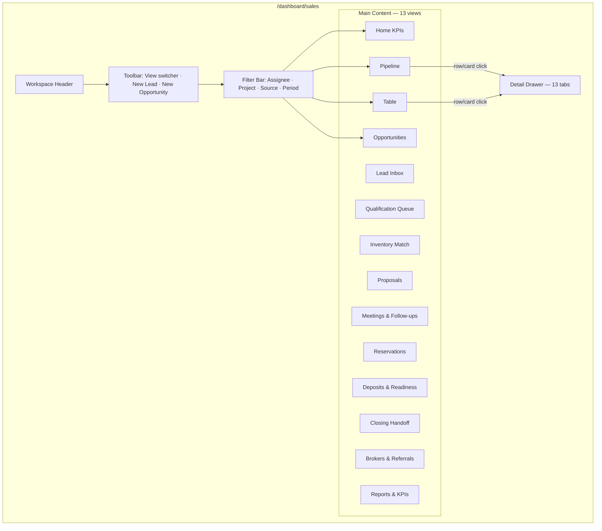

# Investhome OS — Sales Workspace Blueprint

**Document version:** 1.0  
**Sprint:** 5A blueprint · **5B1–5B8 implementation not started**  
**Status:** **BLUEPRINT COMPLETE (5A)** · **5B1–5B8 implementation not started**  
**Audit date:** 2026-07-16  
**Repository:** `investhome-os`  
**Audience:** Product, design, engineering

> **Scope:** This document defines the **Sales Workspace UX and operational experience** — the daily operating center for the commercial journey from lead through closing handoff. It **references** authoritative modules (Lead, Party, Inventory, Pricing, Reservation, Document, Finance) without duplicating their data. **No React, migrations, routes, or production business logic** in Sprint 5A.

**Related governance:** [WORKSPACE_FRAMEWORK.md](./WORKSPACE_FRAMEWORK.md) · [WORKSPACE_NAVIGATION.md](./WORKSPACE_NAVIGATION.md) · [INVENTORY_WORKSPACE_BLUEPRINT.md](./INVENTORY_WORKSPACE_BLUEPRINT.md) · [EXECUTIVE_WORKSPACE.md](./EXECUTIVE_WORKSPACE.md) · [DOMAIN_MODEL.md](./DOMAIN_MODEL.md) · [DATA_OWNERSHIP.md](./DATA_OWNERSHIP.md) · [PERMISSION_MODEL.md](./PERMISSION_MODEL.md) · [EVENT_MODEL.md](./EVENT_MODEL.md) · [ARCHITECTURE_DECISIONS.md](./ARCHITECTURE_DECISIONS.md) · [ROADMAP.md](./ROADMAP.md) · [IMPLEMENTATION_STATUS.md](./IMPLEMENTATION_STATUS.md)

---

## Reconciliation with existing modules

Sales Workspace is workspace #4 in [WORKSPACE_NAVIGATION.md §2.4](./WORKSPACE_NAVIGATION.md#24-sales). Today the repo ships a **Leads CRUD workspace** at `/dashboard/leads` — not the full commercial operating center defined here.

| Topic | Current repo | Sales Workspace (this blueprint) | Resolution |
|-------|--------------|-----------------------------------|------------|
| Route | `/dashboard/leads` ✅ | Target: `/dashboard/sales` (IA name) with `/dashboard/leads` alias | **Workspace route:** `/dashboard/sales` per IA; keep `/dashboard/leads` redirect/alias for bookmarks |
| Sidebar label | "Leads" | **Satış** / **Sales** | Rename sidebar to Sales; Leads remains entity name |
| Permission resource | `leads` only | `leads` + new `sales` actions (optional) | Extend `leads` resource with sales-specific actions in 5B1; avoid duplicate resource |
| Lead status | 8-value enum on `Lead.status` | Lead status = **acquisition funnel** only | **Split concerns:** Opportunity stage owns deal progression after qualification |
| Opportunity | **Does not exist** | New `Opportunity` entity (5B2) | Lead 1→N Opportunities; one active primary per lead recommended |
| Inventory | Authoritative in Inventory Workspace | **Read + action launch** only | Soft Hold / Reservation initiated from Sales; workflow owned by Inventory API |
| Pricing | Authoritative in Inventory | Display approved list price; request change | No duplicate price rows in Sales |
| Reservations | `InventoryReservation` with `lead_id` / `investor_id` | Sales surfaces linked reservations | Reuse existing reservation workflow |
| Documents | Document Engine | Upload/link proposals; **no generation engine** | Manual upload + brand template reference only |
| Finance deposits | Draft `FinanceTransaction` on deposit received | Checklist + link | Finance owns transaction; Sales shows readiness |
| Tasks / Calendar | **Not implemented** | Sales task queues + honest calendar empty states | Build on new Task domain (5B3) or defer calendar to integration sprint |
| Commission | **Not implemented** | Broker/referral readiness only | No Commission Engine in 5B track |
| Closing / legal completion | `ClosingStatus` on inventory asset | Sales **handoff panel** only | Never auto-mark legal closed from Sales |

---

## Commercial journey (end-to-end)

```
Lead → Qualification → Opportunity → Project & Inventory Matching → Meeting
  → Proposal → Soft Hold → Reservation → Deposit → Contract → Closing Handoff → Won | Lost
```

Each step maps to an **owning module**. Sales Workspace orchestrates navigation and human workflow; it does not become SSOT for inventory, finance, or legal state.

---

## 1. PURPOSE

### Operational center for commercial sales

The **Sales Workspace** is the daily operating center for acquisition and deal progression across projects. It is distinct from:

- **Inventory Workspace** — canonical sellable asset state, pricing approval, reservation mechanics
- **Finance Workspace** — treasury, transactions, deposit posting
- **Documents Workspace** — file storage, confidentiality, intelligence
- **Executive Workspace** — portfolio aggregates and leadership decisions

Users come here to answer:

- Who are my active prospects and what stage are they in?
- Which opportunities need follow-up today?
- What inventory matches this buyer's criteria?
- Where are we in proposal, hold, reservation, and deposit for each deal?
- What must happen before we hand off to legal/finance for closing?

### Design principles

| Principle | Implication |
|-----------|-------------|
| **No data duplication** | Lead, Investor, Inventory Asset, Reservation, Price, Document, Transaction remain authoritative in their modules |
| **Reference, don't copy** | Sales UI reads via API joins and deep links; cached display fields allowed for list performance only |
| **Human-in-the-loop** | Qualification, matching, and AI suggestions require explicit user approval |
| **Honest gaps** | Task, Calendar, Opportunity, Proposal entities missing today — UI shows empty states, not fake data |
| **TR default, EN supported** | User-facing labels localized; API enums and IDs remain language-neutral |
| **No discriminatory scoring** | Qualification uses structured checklist + human review; no protected-attribute inference |

### Target users

| Persona | Role code(s) | Primary goals in Sales |
|---------|--------------|------------------------|
| **Sales Representative** | `sales` | Pipeline, follow-ups, inventory match, holds |
| **Sales Manager** | `sales`, `operations` | Team pipeline, conversion, overdue items |
| **Marketing** | `marketing` | Lead source quality, campaign attribution (read-mostly) |
| **Investor Relations** | `investor_relations` | Overlap leads converting to investors |
| **Executive / Partner** | `executive`, `partner` | Pipeline KPIs (via Executive + Sales Home) |
| **Finance** | `finance` | Deposit readiness visibility (cross-link) |
| **Read-only** | `read_only`, `assistant` | Lookup pipeline state |

**Permission gate:** Minimum `leads.view` to enter workspace. Mutations require granular actions per §17.

---

## 2. WORKSPACE HOME

Sales Home follows [WORKSPACE_FRAMEWORK.md §2](./WORKSPACE_FRAMEWORK.md#section-2--universal-workspace-layout) and extends [WORKSPACE_NAVIGATION.md §5](./WORKSPACE_NAVIGATION.md) widget patterns.

### KPI stat cards (12 cards — grounded in stored data)

| # | KPI | Definition | Data source today | Filter inheritance |
|---|-----|------------|-------------------|-------------------|
| 1 | **Active leads** | Non-archived leads not in Won/Lost | `leads` table ✅ | Assignee, source, project |
| 2 | **New this period** | Leads with `created_at` in period | `leads` ✅ | Period preset |
| 3 | **Qualified pipeline** | Leads with `status=Qualified` + active Opportunities (future) | `leads` ✅; Opportunities 📋 | Assignee, project |
| 4 | **Meetings scheduled** | Leads `status=Meeting Scheduled` + future Meeting records (future) | Lead status ✅; Meeting entity 📋 | Assignee, period |
| 5 | **Open opportunities** | Active opportunities not Won/Lost | **NOT STORED** 📋 | Stage, project, assignee |
| 6 | **Proposals outstanding** | Opportunities in `proposal` stage or Lead `Proposal Sent` | Lead status ✅ (proxy); Proposal entity 📋 | Assignee |
| 7 | **Active soft holds** | Reservations `reservation_type=soft_hold`, status active | `inventory_reservations` ✅ | Project, assignee |
| 8 | **Pending reservations** | Reservations `status=requested` awaiting approval | `inventory_reservations` ✅ | Project |
| 9 | **Deposits pending** | Reservations `status=deposit_pending` or overdue `deposit_due_at` | `inventory_reservations` ✅ | Project |
| 10 | **Closing handoffs** | Opportunities in `closing_handoff` stage (future) + assets `closing_status=in_progress` | Inventory ✅ (partial); Opportunity 📋 | Project |
| 11 | **Won this period** | Leads/Opportunities marked Won in period | Lead `status=Won` ✅ | Period, project |
| 12 | **Conversion rate** | Won / (Won + Lost) in period | Computed from leads ✅ | Period, source |

**Honesty rule:** Cards 5, 6 (full), 10 (opportunity side), and Meeting counts beyond lead status proxy display **"—"** or **"Coming soon"** badge until entities ship. Cards 7–9 require `inventory.view` — hide entirely if user lacks permission.

### Home layout

```
┌─────────────────────────────────────────────────────────────────────────┐
│ Sales — Satış                          [+ New Lead] [+ Opportunity]     │
│ Subtitle: Daily commercial operating center                             │
│ [Assignee ▾] [Project ▾] [Source ▾] [Period ▾]                          │
├─────────────────────────────────────────────────────────────────────────┤
│ Row 1: [Active] [New] [Qualified] [Meetings] [Opportunities] [Proposals]│
│ Row 2: [Soft Holds] [Pending Resv] [Deposits] [Handoffs] [Won] [Conv %] │
├─────────────────────────────────────────────────────────────────────────┤
│ Row 3: Pipeline funnel chart          │ Today's follow-ups queue        │
│ Row 4: Expiring soft holds (from Inv) │ My tasks (honest empty → 5B3)  │
│ Row 5: Recent activity (sales-scoped) │ Quick links to primary views    │
└─────────────────────────────────────────────────────────────────────────┘
```

**Quick actions:** New Lead · New Opportunity (5B2+) · Schedule follow-up · Open Pipeline · Match inventory · Place Soft Hold (opens Inventory modal with party pre-filled).

---

## 3. PRIMARY SALES VIEWS

Thirteen primary views. View switcher in **Toolbar** ([WORKSPACE_FRAMEWORK.md §4](./WORKSPACE_FRAMEWORK.md#section-4--toolbar)). Default view: **Pipeline**.

### 3.1 Pipeline View

| Attribute | Specification |
|-----------|---------------|
| **Purpose** | Kanban-style deal flow — primary daily surface |
| **Primary users** | Sales, Sales Manager |
| **Data** | Leads (pre-qualification columns) + Opportunities (post-qualification columns) |
| **Columns (target)** | New → Contacted → Qualified → Discovery → Proposal → Negotiation → Won / Lost |
| **Filters** | Assignee, project, source, period, stage |
| **Actions** | Drag stage ( governed transitions §4) · Open detail drawer · Quick note · Schedule follow-up |
| **Permissions** | `leads.view`; stage change requires `leads.update` or `sales.manage_pipeline` (5B1) |
| **Cross-workspace** | Click inventory chip → Inventory drawer · Reservation → Inventory Reservation view |
| **Today** | **NOT IMPLEMENTED** — flat Leads table only |

### 3.2 Table View

| Attribute | Specification |
|-----------|---------------|
| **Purpose** | Sortable operational list — current Leads workspace behavior |
| **Primary users** | Sales, Marketing, Operations |
| **Data** | Lead records + joined primary Opportunity stage (future) |
| **Columns** | Name, contact, source, status, opportunity stage, project, budget, assignee, last activity, updated |
| **Filters** | Search, status, source, assignee, project |
| **Actions** | Open drawer · Edit · Archive · Convert to Opportunity |
| **Permissions** | `leads.view`, `leads.update`, `leads.archive` |
| **Cross-workspace** | Project name → Projects drawer · Documents count → Documents |
| **Today** | ✅ Implemented as `/dashboard/leads` table |

### 3.3 Opportunities View

| Attribute | Specification |
|-----------|---------------|
| **Purpose** | Deal-centric list after qualification |
| **Primary users** | Sales, Sales Manager, Finance (read) |
| **Data** | `Opportunity` entity (§5) with Lead/Investor party, project, stage, value |
| **Filters** | Stage, project, assignee, expected close, inventory linked |
| **Actions** | Open opportunity drawer · Change stage · Link inventory · Mark Won/Lost |
| **Permissions** | `leads.view` + `leads.update` (or `sales.opportunity.*` in 5B1) |
| **Cross-workspace** | Inventory match → Inventory · Deposit → Finance transaction |
| **Today** | **NOT IMPLEMENTED** — no Opportunity table |

### 3.4 Lead Inbox View

| Attribute | Specification |
|-----------|---------------|
| **Purpose** | Unassigned and new inbound leads requiring triage |
| **Primary users** | Sales Manager, Sales |
| **Data** | Leads `status=New`, `assigned_to` null or recent |
| **Filters** | Source, created date, project interest |
| **Actions** | Assign · Qualify · Archive spam · Convert |
| **Permissions** | `leads.update` |
| **Cross-workspace** | Source analytics → Marketing (future) |
| **Today** | Achievable via Table filter — dedicated view 📋 |

### 3.5 Qualification Queue View

| Attribute | Specification |
|-----------|---------------|
| **Purpose** | Leads awaiting structured qualification review |
| **Primary users** | Sales, Sales Manager |
| **Data** | Leads in Contacted/Qualified with incomplete qualification checklist |
| **Filters** | Assignee, waiting days, project |
| **Actions** | Open qualification tab · Approve · Return to Contacted · Disqualify |
| **Permissions** | `leads.update` |
| **Cross-workspace** | — |
| **Today** | **NOT IMPLEMENTED** |

### 3.6 Inventory Match View

| Attribute | Specification |
|-----------|---------------|
| **Purpose** | Match opportunities to available inventory |
| **Primary users** | Sales |
| **Data** | Opportunity criteria + Inventory Asset availability (read from Inventory API) |
| **Filters** | Project, building, type, bedrooms, budget range, availability |
| **Actions** | Add to shortlist · Compare · Favorite · Open Inventory detail · Place Soft Hold |
| **Permissions** | `leads.view` + `inventory.view` |
| **Cross-workspace** | All inventory actions → Inventory Workspace (authoritative) |
| **Today** | **NOT IMPLEMENTED** — Inventory Workspace exists separately |

### 3.7 Proposals View

| Attribute | Specification |
|-----------|---------------|
| **Purpose** | Track commercial proposals sent to buyers |
| **Primary users** | Sales, Marketing (read) |
| **Data** | Proposal records (§9) linked to Opportunity + Document |
| **Filters** | Status, project, assignee, sent date |
| **Actions** | Upload proposal doc · Mark sent · Mark accepted/declined · Revise |
| **Permissions** | `leads.view`, `documents.create` |
| **Cross-workspace** | Document → Documents drawer · Brand template → Settings |
| **Today** | Lead status `Proposal Sent` only — no Proposal entity |

### 3.8 Meetings & Follow-ups View

| Attribute | Specification |
|-----------|---------------|
| **Purpose** | Scheduled interactions and overdue follow-ups |
| **Primary users** | Sales |
| **Data** | Meeting/FollowUp records (§10) + notification rules |
| **Filters** | Type, date range, assignee, overdue only |
| **Actions** | Log meeting · Schedule follow-up · Mark complete · Reschedule |
| **Permissions** | `leads.update` |
| **Cross-workspace** | Calendar integration (future) — honest empty until provider connected |
| **Today** | **NOT IMPLEMENTED** — `lead.meeting_today` notification uses status proxy only |

### 3.9 Reservations View (Sales lens)

| Attribute | Specification |
|-----------|---------------|
| **Purpose** | Sales-facing reservation pipeline — holds through deposit |
| **Primary users** | Sales, Finance (read) |
| **Data** | `InventoryReservation` where `source` in (`sales`, `lead`) or linked to sales opportunities |
| **Filters** | Status, type (soft_hold/reservation), project, assignee, expiring |
| **Actions** | Extend hold · Request reservation · Cancel · Open Inventory detail |
| **Permissions** | `inventory.view`, `inventory.reserve`, `inventory.request_reservation` |
| **Cross-workspace** | Authoritative actions in Inventory Workspace |
| **Today** | ✅ Data exists — no Sales-filtered view |

### 3.10 Deposits & Contract Readiness View

| Attribute | Specification |
|-----------|---------------|
| **Purpose** | Pre-contract checklist per deal |
| **Primary users** | Sales, Finance |
| **Data** | Reservation deposit fields + linked `finance_transaction_id` + document checklist |
| **Filters** | Deposit pending/overdue, project, missing documents |
| **Actions** | Mark deposit pending · Link finance txn · Upload contract draft · Request legal review |
| **Permissions** | `inventory.view`; deposit mark requires finance/inventory permissions |
| **Cross-workspace** | Finance → Finance tab · Documents → Documents |
| **Today** | Partial — reservation deposit API ✅; checklist UI 📋 |

### 3.11 Closing Handoff View

| Attribute | Specification |
|-----------|---------------|
| **Purpose** | Sales-to-legal/finance handoff queue — **not** legal completion |
| **Primary users** | Sales, Finance, Executive |
| **Data** | Opportunities in handoff stage + inventory `closing_status` + document gaps |
| **Filters** | Project, handoff status, missing items |
| **Actions** | Submit handoff packet · Acknowledge receipt (legal role, future) · Return to sales |
| **Permissions** | `leads.update`; no auto-close permission |
| **Cross-workspace** | Legal workspace (future) · Finance closing · Inventory closing tab |
| **Today** | **NOT IMPLEMENTED** — `ClosingStatus` on asset exists; no handoff entity |

### 3.12 Brokers & Referrals View

| Attribute | Specification |
|-----------|---------------|
| **Purpose** | Track broker/referral partner involvement — commission readiness only |
| **Primary users** | Sales, Operations |
| **Data** | Investor records with `investor_type` in (`broker`, `referral_partner`) + linked leads/opportunities |
| **Filters** | Partner type, active deals, project |
| **Actions** | Link referral to lead · Record referral source · Flag for commission (future) |
| **Permissions** | `investors.view`, `leads.view` |
| **Cross-workspace** | Investor detail → Investors workspace |
| **Today** | Investor types exist ✅ — no referral linkage entity |

### 3.13 Reports & KPIs View

| Attribute | Specification |
|-----------|---------------|
| **Purpose** | Sales metrics from stored data only (§21) |
| **Primary users** | Sales Manager, Executive |
| **Data** | Aggregates from leads, opportunities, reservations |
| **Filters** | Period, project, source, assignee |
| **Actions** | Export CSV · Drill to Pipeline |
| **Permissions** | `leads.view`, `reports.view` (if enabled) |
| **Cross-workspace** | Executive Sales Overview section |
| **Today** | Executive pipeline chart ✅ — dedicated Sales reports 📋 |

---

## 4. LEAD PIPELINE

### Three status domains (do not conflate)

| Domain | Owns | Storage today | Examples |
|--------|------|---------------|----------|
| **Lead status** | Acquisition funnel — is this person a viable prospect? | `Lead.status` enum ✅ | New, Contacted, Qualified, Won, Lost |
| **Opportunity stage** | Deal progression after qualification | **NOT IMPLEMENTED** 📋 | Discovery, Proposal, Negotiation, Closing Handoff |
| **Reservation status** | Inventory hold/reservation lifecycle | `InventoryReservation.status` ✅ | active, deposit_pending, converted |

**Rule:** Once an Opportunity is created, **deal progression lives on Opportunity.stage**. Lead.status should remain `Qualified` or move to terminal `Won`/`Lost` when **all** opportunities resolve — not per intermediate deal step.

### Lead statuses (authoritative — repo today)

From `apps/api/src/investhome_api/models/lead.py`:

| Status | Value | Meaning |
|--------|-------|---------|
| NEW | `New` | Inbound, not yet contacted |
| CONTACTED | `Contacted` | Initial outreach made |
| QUALIFIED | `Qualified` | Passes qualification (human-reviewed) |
| MEETING_SCHEDULED | `Meeting Scheduled` | Meeting planned — **status proxy until Meeting entity** |
| PROPOSAL_SENT | `Proposal Sent` | Proposal delivered — **migrate to Opportunity stage in 5B2** |
| NEGOTIATION | `Negotiation` | Active price/terms discussion |
| WON | `Won` | Deal closed successfully |
| LOST | `Lost` | Disqualified or lost |

### Recommended Opportunity stages (new — §5)

| Stage | Meaning |
|-------|---------|
| `discovery` | Needs/project/inventory exploration |
| `proposal` | Proposal prepared or sent |
| `negotiation` | Terms negotiation |
| `soft_hold` | Active soft hold on inventory |
| `reservation` | Confirmed reservation |
| `deposit` | Deposit pending or received |
| `contract` | Contract drafting/review |
| `closing_handoff` | Sales handed to legal/finance — **not legal completion** |
| `won` | Sales-confirmed win — inventory/finance may still be in progress |
| `lost` | Deal lost |

### Allowed Lead status transitions

```
New → Contacted | Lost
Contacted → Qualified | Lost
Qualified → Meeting Scheduled | Lost  (+ create Opportunity recommended)
Meeting Scheduled → Qualified | Proposal Sent | Lost
Proposal Sent → Negotiation | Won | Lost  (legacy — prefer Opportunity stage)
Negotiation → Won | Lost
Won | Lost → (terminal — reopen requires manager + activity reason)
```

**Implementation note:** API today accepts any status enum without transition validation — 5B1 should add governed transitions with 422 on illegal moves (mirror Inventory pattern).

### Reservation workflow (reuse Inventory — do not duplicate)

From `InventoryReservation` and [INVENTORY_WORKSPACE_BLUEPRINT.md §8](./INVENTORY_WORKSPACE_BLUEPRINT.md):

```
available asset → Soft Hold (48h default) → release | extend
                → Request Reservation → approve → deposit_pending → deposit_received → convert
```

Sales Workspace **initiates** via Inventory API with `source=sales` or `source=lead` and pre-filled `lead_id` / `investor_id`. Status changes **only** through Inventory reservation endpoints.

---

## 5. OPPORTUNITY DOMAIN

### Exists today?

**No.** Repository search finds no `Opportunity` model, migration, or API route. Executive AI insights use `kind="opportunity"` as narrative label only — not a persisted entity.

### Proposed entity: `Opportunity`

| Field | Type | Required | Notes |
|-------|------|----------|-------|
| `id` | UUID | Yes | PK |
| `opportunity_code` | String | Yes | Human-readable, unique per company |
| `lead_id` | UUID FK | Yes* | *Required unless `investor_id` set (return buyer) |
| `investor_id` | UUID FK | No | Set when lead converts or direct investor deal |
| `project_id` | UUID FK | No | Structured project link (replace string `interested_project`) |
| `stage` | Enum | Yes | See §4 stages |
| `title` | String | Yes | e.g. "Marina Towers 12A — Levi family" |
| `estimated_value` | Decimal | No | Deal value estimate — not authoritative price |
| `currency` | String(3) | No | Default from project/company |
| `probability` | Integer | No | Manual 0–100 — **not auto-calculated scoring** |
| `expected_close_date` | Date | No | Forecast |
| `assigned_to_user_id` | UUID | No | Sales owner |
| `primary_inventory_asset_id` | UUID FK | No | Primary unit of interest |
| `lost_reason` | String | No | Required when stage=lost |
| `won_at` / `lost_at` | Timestamp | No | Terminal timestamps |
| `qualification_summary` | Text | No | Human-entered qualification notes |
| `is_demo` | Boolean | Yes | Demo seed flag |
| `archived_at` | Timestamp | No | Soft archive |
| `created_at` / `updated_at` | Timestamp | Yes | Audit |

### Relationships

```
Lead 1 ──► N Opportunity
Investor 1 ──► N Opportunity (optional direct)
Opportunity N ──► 1 Project (optional)
Opportunity 1 ──► N OpportunityInventoryInterest (shortlist junction)
Opportunity 1 ──► N Proposal (§9)
Opportunity 1 ──► N Meeting/FollowUp (§10)
Opportunity 1 ──► N InventoryReservation (via lead_id or explicit FK in 5B4)
Opportunity 1 ──► N Document (via DocumentLink)
```

### Junction: `OpportunityInventoryInterest`

| Field | Purpose |
|-------|---------|
| `opportunity_id` | FK |
| `inventory_asset_id` | FK — authoritative asset |
| `interest_level` | `favorite`, `shortlisted`, `primary`, `rejected` |
| `notes` | Sales notes |
| `created_by_user_id` | Audit |

**Data ownership:** Inventory Asset fields are never copied — junction stores reference + sales context only.

---

## 6. LEAD DETAIL EXPERIENCE

Thirteen tabs in universal drawer ([WORKSPACE_FRAMEWORK.md §6](./WORKSPACE_FRAMEWORK.md)). Permission-gated tabs hidden entirely — not disabled padlocks.

| # | Tab | Content | Data source | Status |
|---|-----|---------|-------------|--------|
| 1 | **Overview** | Contact, source, assignee, budget, project interest, status | `Lead` ✅ | ✅ Partial (flat drawer today) |
| 2 | **Qualification** | Checklist, reviewer, outcome (§7) | New `LeadQualification` 📋 | 📋 |
| 3 | **Opportunities** | Linked opportunities list + create | `Opportunity` 📋 | 📋 |
| 4 | **Activity** | Entity timeline | Activity Log ✅ | ✅ |
| 5 | **Documents** | Upload/link panel | Document Engine ✅ | ✅ |
| 6 | **Meetings** | Meeting log + upcoming | Meeting entity 📋 | 📋 |
| 7 | **Inventory Match** | Shortlist from Inventory API | Junction table 📋 | 📋 |
| 8 | **Proposals** | Proposal history | Proposal entity 📋 | 📋 |
| 9 | **Reservations** | Linked holds/reservations | `InventoryReservation.lead_id` ✅ | 📋 UI |
| 10 | **Finance** | Linked deposit transactions | `FinanceTransaction` via reservation ✅ | 📋 UI |
| 11 | **Brokers / Referrals** | Referral partner links | Investor type + junction 📋 | 📋 |
| 12 | **Tasks** | Open tasks for this lead | Task entity 📋 | 📋 |
| 13 | **Notes** | Free-form notes + pinned | `Lead.notes` ✅ + threaded notes 📋 | 🟡 notes field only |

**Today:** `lead-detail-drawer.tsx` renders Overview fields + Documents + Activity — **3 sections, no tab shell**.

**Footer actions:** Edit · Archive · Convert to Investor · Create Opportunity · Place Soft Hold (if inventory permission).

---

## 7. QUALIFICATION

### Structured process — human-reviewed

Qualification determines whether a Lead proceeds to Opportunity creation. **No automated lead scoring. No protected-attribute inference.**

### Checklist fields (proposed `LeadQualification`)

| Field | Type | Notes |
|-------|------|-------|
| `budget_confirmed` | Boolean | User confirms budget range discussed |
| `budget_min` / `budget_max` | Decimal | Optional range |
| `timeline` | Enum | `immediate`, `3_months`, `6_months`, `12_plus`, `unknown` |
| `decision_maker_identified` | Boolean | |
| `financing_type` | Enum | `cash`, `mortgage`, `mixed`, `unknown` |
| `project_fit_notes` | Text | Which projects/types discussed |
| `disqualification_reason` | Enum | If rejected — standard reasons only |
| `reviewed_by_user_id` | UUID | Required on approve |
| `reviewed_at` | Timestamp | |
| `outcome` | Enum | `pending`, `approved`, `needs_info`, `disqualified` |

### Rules

- Qualification **approve** requires `reviewed_by_user_id` — no system auto-approve
- Disqualification sets Lead `Lost` with reason — activity logged
- Re-qualification allowed with new review row (append-only history)
- **Prohibited:** Credit scoring, demographic inference, nationality-based auto-routing, "AI qualified" without human sign-off

### Notifications (existing)

- `lead.qualified_waiting` — Qualified status stale (5 days default)
- `lead.inactive_qualified` — inactivity threshold

---

## 8. INVENTORY MATCHING

Inventory is **authoritative** — Sales reads availability, pricing, and status from Inventory API.

### Filters (passed to Inventory list/search)

| Filter | Source |
|--------|--------|
| Project | `project_id` |
| Building / Floor | Inventory structure |
| Asset type | unit, parking, storage |
| Availability | `availability_status=available` |
| Bedrooms / area | Asset attributes |
| Budget range | Compare to approved list price (`inventory.view_price`) |
| Sales status | `available_for_sale` |

### Manual matching workflow

1. Open Opportunity or Lead → Inventory Match tab
2. Set criteria filters → query Inventory API
3. **Shortlist** assets → creates `OpportunityInventoryInterest`
4. **Compare** up to 4 assets side-by-side (display fields from Inventory — no copy)
5. **Favorite** for quick access
6. **Place Soft Hold** → opens Inventory Soft Hold modal with party pre-filled

### Permissions

- Requires `inventory.view` + `inventory.view_price` for price-aware matching
- Soft Hold requires `inventory.reserve`

### Cross-workspace

All asset detail and status changes → `/dashboard/inventory?id={asset_id}`

---

## 9. PROPOSALS

### Scope boundary

**Document generation is NOT in scope.** Proposals are tracked as business records with linked uploaded documents. Brand `proposal_template` assets in Company Foundation may be referenced for manual assembly only.

### Proposed entity: `Proposal`

| Field | Type | Notes |
|-------|------|-------|
| `id` | UUID | PK |
| `opportunity_id` | UUID FK | Required |
| `status` | Enum | `draft`, `sent`, `viewed`, `accepted`, `declined`, `expired`, `superseded` |
| `document_id` | UUID FK | Linked uploaded PDF/DOCX |
| `sent_at` | Timestamp | |
| `sent_by_user_id` | UUID | |
| `expires_at` | Date | Optional |
| `notes` | Text | |
| `version` | Integer | Increment on revise |

### Workflow states

```
draft → sent → accepted | declined | expired
sent → superseded (new version)
```

### Brand / document architecture

- **Brand Profile** `proposal_template` asset ([Company Foundation](./IMPLEMENTATION_STATUS.md)) — download reference for sales
- **Document Engine** stores actual proposal files — confidentiality `confidential` default
- **No** mail-merge, PDF generation, or e-sign in 5B track

### Migration path

Lead status `Proposal Sent` becomes legacy indicator — 5B2 migration creates Proposal row when opportunistic backfill desired.

---

## 10. MEETINGS AND FOLLOW-UPS

### Types

| Type | Purpose |
|------|---------|
| `initial_call` | First contact |
| `discovery_meeting` | Needs exploration |
| `site_visit` | Project/site tour |
| `proposal_presentation` | Proposal walkthrough |
| `negotiation_meeting` | Terms discussion |
| `follow_up` | Generic follow-up task |
| `other` | Free text subtype |

### Proposed entity: `SalesInteraction` (meetings + follow-ups)

| Field | Type | Notes |
|-------|------|-------|
| `id` | UUID | |
| `interaction_type` | Enum | Meeting types above |
| `lead_id` | UUID FK | |
| `opportunity_id` | UUID FK | Optional |
| `scheduled_at` | Timestamp | |
| `completed_at` | Timestamp | |
| `duration_minutes` | Integer | |
| `location` | String | Or video link |
| `outcome` | Enum | `scheduled`, `completed`, `no_show`, `cancelled`, `rescheduled` |
| `notes` | Text | |
| `assigned_to_user_id` | UUID | |
| `created_by_user_id` | UUID | |

### Calendar honesty

| Capability | Status |
|------------|--------|
| Internal meeting list in Sales | 📋 5B3 target |
| Google Calendar sync | **NOT IMPLEMENTED** — provider readiness only |
| Microsoft 365 sync | **NOT IMPLEMENTED** |
| Executive Calendar widget | Honest empty state ✅ |
| `lead.meeting_today` notification | **Proxy** — fires on `Meeting Scheduled` status + `updated_at` date, not real calendar |

**UI rule:** Never imply two-way calendar sync until integration verified. Show "Log meeting" as primary action.

---

## 11. SOFT HOLD AND RESERVATION

**Reuse Inventory Reservation workflow entirely** — see [INVENTORY_WORKSPACE_BLUEPRINT.md §8](./INVENTORY_WORKSPACE_BLUEPRINT.md) and `reservation_service.py`.

### Sales-initiated flow

1. From Lead/Opportunity/Inventory Match → **Place Soft Hold**
2. Modal: select party (Lead or Investor), optional deposit amount, notes
3. API: `POST /inventory/reservations/soft-hold` with `lead_id`, `source=sales`
4. Asset `reservation_status` → `soft_hold`; default **48h** expiry
5. Notifications: `notifications.inventory.soft_hold_created` ✅

### Sales Reservations view (§3.9)

Filter reservations where:
- `lead_id` matches sales-owned leads, OR
- `source` in (`sales`, `lead`), OR
- linked `opportunity_id` (5B4 FK)

### Actions by role

| Action | Sales | Finance | IR |
|--------|-------|---------|-----|
| Place Soft Hold | ✅ `inventory.reserve` | — | ✅ |
| Release hold | ✅ | — | ✅ |
| Request reservation | ✅ | — | ✅ |
| Approve reservation | — | ✅ | ✅ |
| Mark deposit received | — | ✅ | ✅ |
| Convert reservation | — | ✅ | ✅ |

### ARQ jobs (existing)

- Soft hold expiry sweep
- Reservation reminder notifications

---

## 12. DEPOSIT AND CONTRACT READINESS

### Checklist model (Sales display — authoritative data elsewhere)

| Checklist item | Authoritative source | Auto-complete? |
|----------------|---------------------|----------------|
| Reservation approved | `InventoryReservation.status` | Yes — read |
| Deposit amount agreed | `deposit_amount` on reservation | Yes — read |
| Deposit received | `deposit_received_at` + `finance_transaction_id` | Yes — read |
| Deposit posted in Finance | `FinanceTransaction.status` | Yes — read |
| Buyer ID documents uploaded | Document links on Lead/Investor | Manual verify |
| Contract draft uploaded | Document link | Manual verify |
| Price approved | Inventory approved list/negotiated price | Yes — read |
| SPA / contract template selected | Document reference | Manual |

**Never** auto-check "Legal review complete" or "Title clear" — those belong to future Legal workspace and Inventory `closing_status`.

### Finance linkage (existing)

`mark_deposit_received` creates draft `FinanceTransaction` with `category=unit_deposit` — Sales UI links to Finance workspace transaction detail.

### Overdue deposits

API: `GET /inventory/reservations/overdue-deposits` ✅ — surface in Sales Home card #9 and Deposits view.

---

## 13. CLOSING PIPELINE

### Sales-facing handoff only

Sales Workspace tracks **readiness to hand off** — not legal completion.

### Handoff packet (conceptual)

| Item | Source |
|------|--------|
| Opportunity summary | Opportunity record |
| Primary asset | Inventory asset |
| Approved price | Inventory pricing |
| Reservation / deposit status | Inventory reservation |
| Buyer documents | Document links |
| Contract draft | Document link |
| Sales notes | Opportunity + Lead notes |

### Handoff states (on Opportunity)

| State | Meaning |
|-------|---------|
| `not_ready` | Checklist incomplete |
| `ready_for_handoff` | Sales manager confirmed |
| `handed_off` | Submitted to legal/finance |
| `returned` | Needs sales action |
| `acknowledged` | Legal/finance acknowledged (future role) |

### Inventory closing status (read-only in Sales)

From `ClosingStatus` enum: `not_started` → `in_progress` → `title_clear` → `scheduled` → `closed` | `fallen_through`

**Critical:** Sales marking Opportunity `won` does **not** set `closing_status=closed`. Legal/title workflow owns closure.

---

## 14. BROKERS AND REFERRALS

### Party roles (repo today)

Unified `Party` table **does not exist**. Relevant types on `Investor`:

| `InvestorType` | Use |
|----------------|-----|
| `broker` | External broker |
| `referral_partner` | Referral channel partner |

Leads carry `source` string (website, referral, exhibition, etc.) — not FK to partner.

### Proposed: `ReferralAttribution` junction

| Field | Purpose |
|-------|---------|
| `lead_id` / `opportunity_id` | Deal being attributed |
| `referral_investor_id` | Broker/partner Investor record |
| `attribution_type` | `introducer`, `co_broker`, `referral_fee_eligible` |
| `notes` | |

### Commission readiness (not Commission Engine)

Sales UI may **flag** "commission review needed" on Won opportunities with referral attribution. Actual commission calculation, approval, and payment — **deferred** (same as Inventory blueprint closing/commissions deferral).

---

## 15. TASKS AND DAILY WORK

### Task domain honesty

| Capability | Status |
|------------|--------|
| Task entity | **NOT IMPLEMENTED** |
| Task API | **NOT IMPLEMENTED** |
| Executive Tasks widget | Empty state ✅ |
| Document `task` link type | Config reference only |

### Proposed Task entity (minimal — 5B3)

| Field | Type |
|-------|------|
| `id` | UUID |
| `title` | String |
| `due_at` | Timestamp |
| `priority` | Enum |
| `status` | `open`, `in_progress`, `done`, `cancelled` |
| `assigned_to_user_id` | UUID |
| `lead_id` / `opportunity_id` | Optional FKs |
| `document_id` | Optional — "waiting on document" |
| `source` | `manual`, `notification`, `ai_suggestion` |

### Sales task queues (Home + Tasks view)

| Queue | Source |
|-------|--------|
| **Overdue follow-ups** | Tasks past `due_at` |
| **Notification-derived** | `lead.no_followup`, `lead.proposal_not_sent` |
| **Document dependencies** | Tasks linked to missing documents — honest manual creation until doc rules exist |
| **Expiring holds** | From Inventory notifications |

**UI rule:** Until Task entity ships, Home shows notification-based follow-up list — not fake task rows.

---

## 16. AI SUPPORT

Compact supporting section — **not** an AI cockpit ([AI_PRINCIPLES.md](./AI_PRINCIPLES.md)).

### Placement

- Lead/Opportunity drawer → **AI tab** (optional, last tab) OR small panel in Overview
- Sales Home → compact "Suggestions" card — max 3 items

### Allowed L1–L2 features (5B track)

| Feature | Input | Output | Approval |
|---------|-------|--------|----------|
| **Follow-up draft** | Lead notes + activity | Suggested email/call script | User copies — no auto-send |
| **Meeting summary** | User-pasted notes | Structured summary | User saves |
| **Inventory match suggest** | Qualification fields + project | Ranked asset IDs from available inventory | User adds to shortlist — **rule-based filter first**, LLM narrative optional |
| **Next best action** | Stage + stale days | Text suggestion | Display only |

### Prohibited

- Auto status changes
- Auto qualification approve
- Lead scoring by nationality, gender, age, or inferred protected attributes
- Auto Soft Hold or reservation
- Document generation

### Provider

Local heuristic default; external LLM requires `FEATURE_EXTERNAL_AI` + confidentiality check — same as Document Intelligence.

---

## 17. PERMISSIONS

### Existing resources (relevant)

No `sales` resource in `permissions_config.py` today — Sales uses `leads`, `investors`, `inventory`, `documents`.

### Proposed additional actions on `leads` resource (5B1)

| Action | Purpose |
|--------|---------|
| `manage_pipeline` | Drag pipeline stages for other assignees |
| `convert_to_investor` | Promote lead to investor record |
| `manage_qualification` | Approve/disqualify qualification |

### Proposed `sales` resource (optional — owner decision OD-1)

Alternative: keep all under `leads` to minimize migration. If split:

| Action | Purpose |
|--------|---------|
| `opportunity.view/create/update/archive` | Opportunity CRUD |
| `proposal.view/create/update` | Proposal workflow |
| `interaction.view/create/update` | Meetings/follow-ups |
| `handoff.submit` | Closing handoff |

### Role matrix (summary)

| Permission | super_admin | executive | sales | marketing | investor_relations | finance | operations | read_only |
|------------|:-----------:|:---------:|:-----:|:---------:|:------------------:|:-------:|:----------:|:---------:|
| `leads.view` | ✅ | ✅ | ✅ | ✅ | ✅ | — | ✅ | ✅ |
| `leads.create/update/archive` | ✅ | — | ✅ | — | update | — | — | — |
| `leads.manage_pipeline` | ✅ | — | ✅* | — | — | — | ✅ | — |
| `leads.manage_qualification` | ✅ | — | ✅ | — | — | — | — | — |
| `investors.view/create` | ✅ | ✅ | ✅ | — | ✅ | ✅ | — | ✅ |
| `inventory.view` | ✅ | ✅ | ✅ | ✅ | ✅ | ✅ | ✅ | ✅ |
| `inventory.reserve` | ✅ | — | ✅ | — | ✅ | — | — | — |
| `inventory.request_reservation` | ✅ | — | ✅ | — | ✅ | — | — | — |
| `inventory.approve_reservation` | ✅ | — | — | — | ✅ | ✅ | — | — |
| `inventory.mark_deposit_received` | ✅ | — | — | — | ✅ | ✅ | — | — |
| `inventory.view_price` | ✅ | ✅ | ✅ | ✅ | ✅ | ✅ | — | — |
| `documents.create` | ✅ | — | ✅ | — | ✅ | ✅ | — | — |
| `executive.view` | ✅ | ✅ | — | — | ✅ | ✅ | — | — |
| `reports.view/export` | ✅ | ✅ | — | — | — | ✅ | — | — |

*Sales manager delegation — owner decision OD-4.

---

## 18. ACTIVITY, AUDIT, AND EVENTS

### Existing activity entity types (relevant)

From `ActivityEntityType`:

- `LEAD` ✅
- `INVESTOR` ✅
- `INVENTORY_ASSET` ✅
- `INVENTORY_RESERVATION` ✅
- `DOCUMENT` ✅
- `TRANSACTION` ✅

### Proposed new entity types (5B1+)

| Entity type | When logged |
|-------------|-------------|
| `OPPORTUNITY` | CRUD, stage change |
| `PROPOSAL` | Sent, accepted, declined |
| `SALES_INTERACTION` | Meeting logged, completed |
| `LEAD_QUALIFICATION` | Approved, disqualified |
| `REFERRAL_ATTRIBUTION` | Linked, updated |

### Business events (EVENT_MODEL.md pattern)

| Event type | Trigger |
|------------|---------|
| `sales.opportunity.created` | Opportunity create |
| `sales.opportunity.stage_changed` | Stage transition |
| `sales.qualification.approved` | Qualification approve |
| `sales.proposal.sent` | Proposal sent |
| `sales.handoff.submitted` | Closing handoff |
| `sales.lead.converted_to_investor` | Conversion |

Reservation events remain under `inventory.*` namespace — Sales subscribes, does not re-emit.

---

## 19. NOTIFICATIONS

### Existing lead notification rules (`notification_generator.py`)

| Rule key | Trigger | Priority |
|----------|---------|----------|
| `lead.no_followup` | Active lead stale `LEAD_NO_FOLLOWUP_DAYS` (7) | Medium |
| `lead.qualified_waiting` | Qualified stale `QUALIFIED_LEAD_WAITING_DAYS` (5) | Medium |
| `lead.proposal_not_sent` | Meeting Scheduled stale `PROPOSAL_NOT_SENT_DAYS` | High |
| `lead.meeting_today` | Meeting Scheduled + updated today | High |
| `lead.inactive_qualified` | Qualified inactive `LEAD_INACTIVITY_DAYS` | Low |

### Proposed sales notifications (5B5+)

| Rule key | Trigger |
|----------|---------|
| `sales.opportunity.stale` | Opportunity stage unchanged N days |
| `sales.soft_hold.expiring` | Reuse inventory notification — surface in Sales |
| `sales.deposit.overdue` | Reuse overdue deposit query |
| `sales.handoff.returned` | Handoff returned to sales |
| `sales.task.due` | Task due today |

All notifications link to Sales Workspace with `?id=` deep link per [WORKSPACE_NAVIGATION.md](./WORKSPACE_NAVIGATION.md).

---

## 20. GLOBAL SEARCH

### Supported today (relevant)

From `SEARCH_ENTITY_TYPES`:

- `lead` ✅
- `investor` ✅
- `project` ✅
- `inventory_asset` ✅
- `inventory_reservation` ✅
- `document` ✅

### Future (5B6+)

Add to search index when entities ship:

- `opportunity`
- `proposal`
- `sales_interaction`

### Search behavior in Sales

- In-workspace search bar filters current view **plus** global search overlay (`Cmd+K`)
- Permission-aware — no leakage across assignee boundaries (future: assignee-scoped search for sales reps)

---

## 21. REPORTING AND KPIs

**Only metrics with stored data** — no fabricated funnel analytics.

### Available today

| Metric | Computation |
|--------|-------------|
| Lead count by status | `GROUP BY Lead.status` |
| Lead count by source | `GROUP BY Lead.source` |
| Pipeline value estimate | `SUM(estimated_budget)` by status |
| Won/Lost counts | Status filter |
| Conversion rate | Won / (Won + Lost) |
| Active soft holds | Inventory reservation query |
| Deposits pending | Reservation status filter |
| Executive pipeline chart | `executive_service.build_sales_pipeline` ✅ |

### Requires new entities

| Metric | Dependency |
|--------|------------|
| Opportunity win rate by stage | Opportunity entity |
| Average days in stage | Opportunity stage history |
| Proposal acceptance rate | Proposal entity |
| Meeting completion rate | SalesInteraction entity |
| Broker referral volume | ReferralAttribution |
| Sales cycle length | Opportunity created → won timestamps |

### Export

CSV export of current table view — requires `leads.export` (seed for executive; add to sales in 5B1).

---

## 22. LOCALIZATION

**Turkish default, English supported** — [IMPLEMENTATION_STATUS.md](./IMPLEMENTATION_STATUS.md) TR/EN architecture.

### Namespace

New `sales` namespace in `messages/tr.json` and `messages/en.json`. Existing `leads` namespace remains for entity labels.

### TR terminology recommendations

| English (internal key) | Türkçe (recommended) | English UI |
|------------------------|----------------------|------------|
| Sales (workspace) | Satış | Sales |
| Lead | Aday / Lead | Lead |
| Opportunity | Fırsat | Opportunity |
| Pipeline | Satış Hunisi | Pipeline |
| Qualification | Nitelendirme / Kalifikasyon | Qualification |
| Soft Hold | Ön Rezervasyon | Soft Hold |
| Reservation | Rezervasyon | Reservation |
| Proposal | Teklif | Proposal |
| Deposit | Kapora | Deposit |
| Closing Handoff | Kapanış Devir Teslim | Closing Handoff |
| Broker | Emlak Danışmanı / Broker | Broker |
| Referral | Referans | Referral |
| Follow-up | Takip | Follow-up |
| Won / Lost | Kazanıldı / Kaybedildi | Won / Lost |

Hook: `useSalesLabels()` + extend `useLeadLabels()`.

Internal API enums remain English snake_case / PascalCase — never localized in DB.

---

## 23. RESPONSIVE EXPERIENCE

**Desktop-first** — full 13 views, 13-tab drawer, Pipeline kanban.

| Breakpoint | Behavior |
|------------|----------|
| **Desktop (≥1280px)** | All views; drawer 480px; Pipeline kanban visible |
| **Tablet (768–1279px)** | Table, Pipeline (scroll), Lead Inbox; drawer full-width overlay |
| **Mobile (<768px)** | **Lookup + action** — search, lead detail Overview/Activity, click-to-call; no kanban drag; Soft Hold initiates via simplified modal |

Aligns with [INVENTORY_WORKSPACE_BLUEPRINT.md §21](./INVENTORY_WORKSPACE_BLUEPRINT.md#21-responsive).

---

## 24. IMPLEMENTATION SPRINTS

Workspace delivery track **5B1–5B8** (documentation 5A complete). Depends on Inventory Workspace 4B7 ✅ complete.

| Sprint | Focus | Deliverables |
|--------|-------|--------------|
| **5B1** | Domain foundation | Migration `0022_sales_opportunity` (or next head); Opportunity + Qualification models; governed Lead transitions; API CRUD; permissions; activity entity types; TR/EN `sales` namespace |
| **5B2** | Workspace shell + Pipeline | Route `/dashboard/sales` (+ `/dashboard/leads` alias); Home 12 KPI cards (honest placeholders); Pipeline + Table views; 13-tab drawer shell; sidebar rename to Sales |
| **5B3** | Interactions + Tasks | SalesInteraction (meetings/follow-ups); Task entity minimal; Meetings view; task queues on Home; notification rules |
| **5B4** | Inventory match + reservations lens | OpportunityInventoryInterest; Inventory Match view; Sales Reservations view; Soft Hold launch from drawer; opportunity-reservation FK |
| **5B5** | Proposals + deposits | Proposal entity; Proposals view; Deposits & Contract Readiness view; document linking; deposit checklist UI |
| **5B6** | Qualification + brokers | Qualification tab + queue view; ReferralAttribution; Brokers view; search providers for new entities |
| **5B7** | Closing handoff + reports | Handoff workflow; Closing Handoff view; Reports view; executive cross-links; export |
| **5B8** | Stabilization | Regression, permissions matrix, i18n, API tests, AI panel compact, empty state audit, Docker verification |

**Explicitly NOT in 5B1–5B8:** Commission Engine, document generation, calendar provider sync, legal completion automation, discriminatory scoring.

---

## 25. OPEN DECISIONS

Genuine **owner/product decisions** only.

| # | Decision | Options | Recommendation |
|---|----------|---------|----------------|
| OD-1 | Permission model | Extend `leads` only vs new `sales` resource | Extend `leads` + add actions — fewer migrations |
| OD-2 | Workspace route | `/dashboard/sales` only vs keep `/dashboard/leads` | Both — `/dashboard/sales` canonical, `/dashboard/leads` 301 alias |
| OD-3 | Lead vs Opportunity split | Immediate 5B1 split vs gradual | Split in 5B1 — reduces status enum overload |
| OD-4 | Pipeline assignee scope | Sales rep sees own only vs team | Manager toggle; default own leads for `sales` role |
| OD-5 | Primary opportunity per lead | One active vs unlimited | One **primary** + unlimited archived — UI clarity |
| OD-6 | Investor conversion | Auto-create vs manual promote | Manual with checklist — IR review for investor type |
| OD-7 | Proposal versioning | Single doc vs version chain | Version chain (`superseded` status) |
| OD-8 | Task due notifications | ARQ daily sweep vs inline on login | ARQ daily — consistent with inventory jobs |
| OD-9 | Handoff recipient | Legal workspace vs Finance vs email | Finance + Documents link v1; Legal workspace when built |
| OD-10 | Marketing write access | Read-only pipeline vs source edit | Read-only pipeline; source edit on Lead create only |

**Open decisions count: 10**

---

## 26. DOCUMENTATION REFERENCES

| Document | Relevance |
|----------|-----------|
| [WORKSPACE_FRAMEWORK.md](./WORKSPACE_FRAMEWORK.md) | Universal layout, drawer, toolbar |
| [WORKSPACE_NAVIGATION.md](./WORKSPACE_NAVIGATION.md) | Sales workspace #4, cross-workspace links |
| [INVENTORY_WORKSPACE_BLUEPRINT.md](./INVENTORY_WORKSPACE_BLUEPRINT.md) | Reservation, pricing, Soft Hold — authoritative |
| [EXECUTIVE_WORKSPACE.md](./EXECUTIVE_WORKSPACE.md) | Pipeline aggregates, honest task/calendar gaps |
| [DOMAIN_MODEL.md](./DOMAIN_MODEL.md) | Party concept, entity relationships |
| [DATA_OWNERSHIP.md](./DATA_OWNERSHIP.md) | SSOT rules — no duplication |
| [PERMISSION_MODEL.md](./PERMISSION_MODEL.md) | RBAC patterns |
| [EVENT_MODEL.md](./EVENT_MODEL.md) | Activity vs business events |
| [AI_PRINCIPLES.md](./AI_PRINCIPLES.md) | Human-in-the-loop AI |
| [UNITS_INVENTORY_BLUEPRINT.md](./UNITS_INVENTORY_BLUEPRINT.md) | Inventory domain API |
| [IMPLEMENTATION_STATUS.md](./IMPLEMENTATION_STATUS.md) | Honest module status |
| [ROADMAP.md](./ROADMAP.md) | Sprint tracking |

---

## Repository Findings (Sprint 5A audit)

| Area | Finding |
|------|---------|
| **Opportunity entity** | **Does not exist** — no model, migration, route, or search provider |
| **Lead model** | ✅ Complete — 8 statuses, budget, source, `interested_project` string (no FK) |
| **Lead API** | ✅ CRUD + filters — no stats endpoint, no transition validation |
| **Lead UI** | ✅ Table + flat drawer (Overview, Documents, Activity) — no tabs, no pipeline |
| **Party** | Conceptual only — separate `Lead` + `Investor` tables; no unified Party picker |
| **Investor types** | ✅ Includes `broker`, `referral_partner` — no referral junction |
| **Inventory** | ✅ Complete (4B7) — reservations with `lead_id`, Soft Hold 48h, deposit workflow |
| **Pricing** | ✅ In Inventory — sales has `view_price`, `request_price_change` |
| **Finance deposits** | ✅ Draft transaction on `deposit_received` — category `unit_deposit` |
| **Documents** | ✅ Entity links for lead — brand `proposal_template` in Company Foundation |
| **Tasks** | **NOT IMPLEMENTED** — executive empty state |
| **Calendar** | **NOT IMPLEMENTED** — provider readiness only; meeting notification is status proxy |
| **Proposal entity** | **NOT IMPLEMENTED** — `Proposal Sent` is Lead status only |
| **Qualification** | **NOT IMPLEMENTED** — no structured checklist |
| **Commission** | **NOT IMPLEMENTED** — deferred with inventory closing |
| **Permissions** | `leads.*` for sales; inventory reserve/request; no `sales` resource |
| **Activity types** | `LEAD` ✅ — no OPPORTUNITY, PROPOSAL, TASK |
| **Notifications** | 5 lead rules ✅ — no opportunity/deposit/handoff rules in sales namespace |
| **Global search** | `lead`, `inventory_asset`, `inventory_reservation` ✅ |
| **Executive** | Sales pipeline chart from Lead.status counts ✅ |
| **Route** | `/dashboard/leads` — IA target name **Sales** |
| **Migration head** | `0021` (inventory assignment) — next sales `0022+` |

---

## Proposed Sales Domain Model

```
Lead ──► LeadQualification (1:N history)
  │
  ├──► Opportunity (1:N, one primary)
  │       ├──► OpportunityInventoryInterest ──► InventoryAsset (ref)
  │       ├──► Proposal ──► Document (ref)
  │       ├──► SalesInteraction
  │       └──► ReferralAttribution ──► Investor (broker/partner)
  │
  ├──► InventoryReservation (via lead_id — existing)
  └──► Document (via DocumentLink — existing)

Task ──► Lead | Opportunity (optional FKs)
Investor ◄── convert ── Lead (manual promotion)
```

**SSOT boundaries unchanged:** Inventory, Finance, Document modules own their entities.

---

## Reused Existing Modules

| Module | Sales usage |
|--------|-------------|
| **Leads** | Acquisition record — CRUD, search, activity |
| **Investors** | Buyer conversion, broker/referral partner records |
| **Projects** | Project context — FK on Opportunity (replace string) |
| **Inventory** | Availability, matching, Soft Hold, reservation, pricing display |
| **Finance** | Deposit transaction drafts and posting |
| **Documents** | Proposal files, buyer ID, contract drafts |
| **Activity Log** | Timelines on all entities |
| **Notifications** | Follow-up reminders + inventory reservation alerts |
| **Global Search** | Cross-entity discovery |
| **Executive** | Portfolio pipeline widget — not duplicated |
| **Company Foundation** | Brand proposal template reference |

---

## Missing Dependencies

| Dependency | Blocks | Suggested sprint |
|------------|--------|------------------|
| Opportunity entity + API | Pipeline, Opportunities view, most KPIs | 5B1 |
| Qualification model | Qualification tab/queue | 5B6 |
| SalesInteraction entity | Meetings view, real meeting tracking | 5B3 |
| Task entity | Task queues, document dependency tasks | 5B3 |
| Proposal entity | Proposals view | 5B5 |
| OpportunityInventoryInterest | Inventory Match tab | 5B4 |
| ReferralAttribution | Brokers view | 5B6 |
| Handoff workflow entity | Closing Handoff view | 5B7 |
| Unified Party picker | Cleaner party selection on holds | Shared component — 5B4 |
| Project FK on Lead | Replace `interested_project` string | 5B1 migration |
| Calendar provider integration | Real calendar sync | Post-5B — integration sprint |
| Legal workspace | Handoff recipient | Future |
| Commission Engine | Broker payment | Future — explicit non-goal |
| Document generation | PDF proposals | Future — explicit non-goal |
| Lead stats API | Home KPI performance | 5B2 |

---

## Recommended UX

| # | Recommendation | Priority |
|---|----------------|----------|
| REC-1 | Rename sidebar **Leads → Sales**; route alias `/dashboard/sales` | P0 |
| REC-2 | Split Lead status from Opportunity stage in 5B1 — stop overloading `Proposal Sent` | P0 |
| REC-3 | Reuse Inventory Soft Hold modal from Sales with party pre-fill | P0 |
| REC-4 | Universal 13-tab drawer shell — reference Inventory 14-tab pattern | P1 |
| REC-5 | Pipeline kanban as default view — Table as secondary | P1 |
| REC-6 | Honest empty states for Tasks, Calendar, Opportunities until entities ship | P0 |
| REC-7 | Notification-driven "Today's follow-ups" on Home until Task entity | P1 |
| REC-8 | Cross-workspace chips on every reservation/deposit row → Inventory + Finance | P1 |
| REC-9 | Compact AI panel — max 320px, suggestions only | P2 |
| REC-10 | TR/EN `sales` namespace — keep `leads` for entity enum labels | P1 |

---

## Genuine Owner Decisions

See §25 Open Decisions OD-1 through OD-10. Blockers requiring sign-off before 5B1:

1. **OD-1** — Permission model (`leads` extend vs `sales` resource)
2. **OD-3** — Lead/Opportunity split timing
3. **OD-5** — Primary opportunity rule

---

## Proposed Implementation Sprint Order

```
5B1 Domain (Opportunity, Qualification schema, permissions)
  → 5B2 Shell (route, Home, Pipeline, drawer tabs)
  → 5B3 Interactions + Tasks
  → 5B4 Inventory match + Sales reservations lens
  → 5B5 Proposals + deposit checklist
  → 5B6 Qualification UX + brokers
  → 5B7 Closing handoff + reports
  → 5B8 Stabilization
```

**Parallel enablers:** Unified Party picker (shared with Inventory REC-2), Project FK migration, Lead transition validation.

---

## DELIVERABLES

### Page structure diagram



### Navigation map

```mermaid
flowchart LR
    SB[Sidebar: Satış / Sales] --> SAL[/dashboard/sales]
    SAL --> V1[Pipeline default]
    SAL --> V2[Table]
    SAL --> V3[Opportunities]
    SAL --> V4[Inventory Match]

    SAL -->|?id=uuid| DRW[Lead/Opportunity Drawer]

    DRW -->|Soft Hold| INV[/dashboard/inventory]
    DRW -->|Deposit| FIN[/dashboard/finance]
    DRW -->|Document| DOC[/dashboard/documents]
    DRW -->|Project| PROJ[/dashboard/projects]
    DRW -->|Broker| INVST[/dashboard/investors]
    DRW -->|KPI| EXEC[/dashboard/executive]

    EXEC -->|pipeline widget| SAL
    INV -->|reservation party| SAL
```

### Risks

| Risk | Impact | Mitigation |
|------|--------|------------|
| Lead status overload | Confused pipeline | Split Opportunity in 5B1; migration guide |
| Duplicate reservation logic | Data corruption | All holds via Inventory API only |
| Fake calendar/tasks | User distrust | Honest empty states until entities ship |
| AI overreach | Wrong auto-actions | L2 display-only; no mutations |
| Party not unified | Duplicate pickers | Shared Party search component (Lead ∪ Investor) |
| `interested_project` string | Broken filters | Project FK on Opportunity in 5B1 |
| Permission sprawl | Admin burden | Extend `leads` first; split if needed |
| Commission scope creep | Delayed 5B | Explicit deferral; referral flag only |

---

*This blueprint is the canonical Sales **Workspace** specification. Implementation tracking: [IMPLEMENTATION_STATUS.md](./IMPLEMENTATION_STATUS.md). Sprint tracking: [ROADMAP.md](./ROADMAP.md).*
