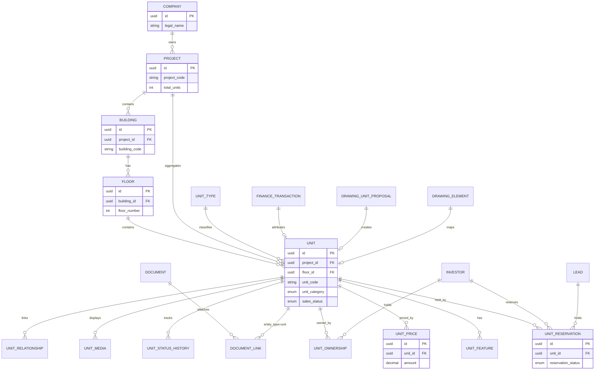

# Units & Inventory Module — Blueprint

**Document version:** 1.0  
**Status:** BLUEPRINT IN PROGRESS  
**Audit date:** 2026-07-15  
**Repository:** `investhome-os`  
**Target migration:** `0014_units_inventory` (planned)

---

## 1. Executive Summary

The **Units & Inventory** module is the canonical inventory layer for Investhome OS. It models the physical and commercial inventory of real estate developments — from building structure through individual sellable or leasable units — and connects that inventory to sales, finance, documents, and architectural drawing intelligence.

Today the platform has **no unit inventory tables or routes**. Projects carry aggregate counters (`total_units`, `residential_units`, `commercial_units` in `apps/api/src/investhome_api/models/project.py`), drawing intelligence produces **placeholder** unit proposals (`DrawingUnitProposal.created_unit_id` set to `proposal.id` on approval in `apps/api/src/investhome_api/api/routes/drawing_intelligence.py`), and global search lists `"unit"` as a **future** entity type (`apps/api/src/investhome_api/config/search_config.py`). Finance transactions link to `project_id` and `investor_id` but not `unit_id` (`apps/api/src/investhome_api/models/finance.py`).

This blueprint defines a full implementation aligned with existing platform patterns: `require_permission`, `activity_recorder`, `DocumentLink`, workspace + detail-drawer UI, TR/EN localization, permission-aware search, and executive dashboard aggregates.

**Recommended delivery:** 8 sprints (S0–S7), starting after migration `0013_company_foundation` is applied and worker runtime gaps are resolved (see `docs/IMPLEMENTATION_STATUS.md`).

---

## 2. Business Goals

| Goal | Success metric |
|------|----------------|
| Single source of truth for unit inventory | 100% of sellable/leasable inventory tracked per project with unique unit codes |
| Sales pipeline visibility | Real-time counts by `sales_status`, `construction_status`, and project |
| Revenue attribution | Sale proceeds and deposits linkable to specific units via `unit_id` on transactions |
| Drawing-to-inventory workflow | Approved `DrawingUnitProposal` records create real `Unit` rows with geometry links |
| Accessory management | Parking, storage, terrace tracked as `unit_category=accessory` with parent unit relationships |
| Executive reporting | Portfolio-level absorption, available inventory, and revenue pipeline on executive dashboard |
| Audit trail | All status changes, price changes, reservations, and ownership transfers logged via activity |

---

## 3. Scope / Non-Scope

### In scope

- Hierarchical domain: **Company → Project → Building → Floor → Unit**
- Accessory units (parking, storage, terrace) as `unit_category=accessory`
- Four independent status dimensions per unit with governed transitions
- 12 core entities (see §6)
- CRUD API, list/filter/stats endpoints, import/export
- 14 UX screens, 12 detail tabs, saved views
- Permissions resource `"units"` with role mappings
- Activity, notifications, search, executive dashboard, finance FK integration
- Document links via existing `DocumentLink` polymorphic pattern
- Drawing intelligence approval → unit creation bridge
- TR/EN labels and enum hooks
- Demo seed data (`is_demo: true`)

### Out of scope (Phase 1 of this module)

- Visual Design Studio / floor-plan coloring (separate Phase 4 roadmap item)
- CRM contract generation and e-signature
- MLS / external listing syndication
- Construction scheduling (Gantt, subcontractor tasks) — reserved under `"construction"` permission resource
- Automated pricing algorithms / AVM integrations
- Lease accounting (ASC 842) — basic `leasing_status` only
- Multi-currency unit pricing beyond project default currency
- Unit-level budget line items (project-level budgets remain in finance module)

---

## 4. Domain Model

### Hierarchy

```
Company (company_profiles — existing)
  └── Project (projects — existing)
        └── Building (buildings — new)
              └── Floor (floors — new)
                    └── Unit (units — new)
                          ├── UnitType (catalog — new)
                          ├── UnitFeature (attributes — new)
                          ├── UnitPrice (history — new)
                          ├── UnitStatusHistory (audit — new)
                          ├── UnitReservation (holds — new)
                          ├── UnitOwnership (buyers — new)
                          ├── UnitAssetLink (documents/media — new)
                          ├── UnitMedia (photos/plans — new)
                          └── UnitRelationship (combine/split/accessory — new)
```

### Unit categories

| `unit_category` | Description | Examples |
|-----------------|-------------|----------|
| `primary` | Main sellable/leasable space | Apartment, retail bay, office suite |
| `accessory` | Attached or sold-with primary | Parking spot, storage locker, terrace |
| `common` | Non-sellable shared area | Lobby, corridor, mechanical (optional Phase 2) |

### Accessory subtypes (`accessory_type`, when `unit_category=accessory`)

| Value | Typical link |
|-------|--------------|
| `parking` | `UnitRelationship` → parent primary unit |
| `storage` | `UnitRelationship` → parent primary unit |
| `terrace` | `UnitRelationship` → parent primary unit |
| `other` | Free-form |

Accessory units inherit project/building context from parent unless explicitly assigned to a building/floor.

### Relationship to existing models

- **Project** (`models/project.py`): retains aggregate counters; computed rollups refresh from unit counts on write (async or trigger).
- **Company** (`models/company_foundation.py`): single-tenant company profile provides default measurement system (`AreaUnit.SQUARE_METERS` / `SQUARE_FEET`) for area fields.
- **Document** (`models/document.py`): `DocumentLink.entity_type="unit"` for attachments; optional direct `unit_id` FK on `documents` table in migration `0014` (mirrors `project_id` pattern).
- **Drawing** (`models/drawing_intelligence.py`): `DrawingUnitProposal.created_unit_id` → `units.id` after approval.

---

## 5. Four Status Dimensions

Each unit maintains **four independent status fields**. Changes to any dimension append a row to `UnitStatusHistory`.

### 5.1 `construction_status`

| Status | Label (EN) | Label (TR) |
|--------|------------|------------|
| `planned` | Planned | Planlandı |
| `foundation` | Foundation | Temel |
| `structure` | Structure | Karkas |
| `envelope` | Envelope | Kabuk |
| `interior` | Interior | İç Mekân |
| `finishing` | Finishing | Bitirme |
| `inspection` | Inspection | Denetim |
| `ready` | Ready | Hazır |
| `delivered` | Delivered | Teslim Edildi |
| `on_hold` | On Hold | Beklemede |

**Allowed transitions**

| From | To |
|------|-----|
| `planned` | `foundation`, `on_hold` |
| `foundation` | `structure`, `on_hold` |
| `structure` | `envelope`, `on_hold` |
| `envelope` | `interior`, `on_hold` |
| `interior` | `finishing`, `on_hold` |
| `finishing` | `inspection`, `on_hold` |
| `inspection` | `ready`, `finishing`, `on_hold` |
| `ready` | `delivered`, `inspection`, `on_hold` |
| `delivered` | *(terminal)* |
| `on_hold` | any prior active stage |

### 5.2 `sales_status`

| Status | Label (EN) | Label (TR) |
|--------|------------|------------|
| `not_released` | Not Released | Satışa Açılmadı |
| `available` | Available | Müsait |
| `reserved` | Reserved | Rezerve |
| `under_contract` | Under Contract | Sözleşme Altında |
| `sold` | Sold | Satıldı |
| `not_for_sale` | Not for Sale | Satılık Değil |

**Allowed transitions**

| From | To |
|------|-----|
| `not_released` | `available`, `not_for_sale` |
| `available` | `reserved`, `under_contract`, `not_for_sale`, `not_released` |
| `reserved` | `available`, `under_contract`, `sold` |
| `under_contract` | `reserved`, `sold`, `available` |
| `sold` | *(terminal — requires admin override)* |
| `not_for_sale` | `not_released`, `available` |

### 5.3 `closing_status`

| Status | Label (EN) | Label (TR) |
|--------|------------|------------|
| `not_started` | Not Started | Başlamadı |
| `in_progress` | In Progress | Devam Ediyor |
| `title_clear` | Title Clear | Tapu Temiz |
| `funding_pending` | Funding Pending | Finansman Bekleniyor |
| `scheduled` | Closing Scheduled | Kapanış Planlandı |
| `closed` | Closed | Kapandı |
| `fallen_through` | Fallen Through | Düştü |

**Allowed transitions**

| From | To |
|------|-----|
| `not_started` | `in_progress` |
| `in_progress` | `title_clear`, `funding_pending`, `fallen_through` |
| `title_clear` | `funding_pending`, `scheduled`, `fallen_through` |
| `funding_pending` | `scheduled`, `title_clear`, `fallen_through` |
| `scheduled` | `closed`, `fallen_through` |
| `closed` | *(terminal)* |
| `fallen_through` | `not_started` |

### 5.4 `leasing_status`

| Status | Label (EN) | Label (TR) |
|--------|------------|------------|
| `not_applicable` | N/A | Uygulanamaz |
| `vacant` | Vacant | Boş |
| `listed` | Listed | Kiralık İlan |
| `application` | Application | Başvuru |
| `leased` | Leased | Kiralandı |
| `notice_given` | Notice Given | İhtar Verildi |
| `off_market` | Off Market | Piyasada Değil |

**Allowed transitions**

| From | To |
|------|-----|
| `not_applicable` | `vacant`, `off_market` |
| `vacant` | `listed`, `leased`, `off_market` |
| `listed` | `application`, `vacant`, `off_market` |
| `application` | `leased`, `listed`, `vacant` |
| `leased` | `notice_given`, `vacant` |
| `notice_given` | `vacant`, `leased` |
| `off_market` | `vacant`, `not_applicable` |

**Cross-dimension rules:** `sales_status=sold` requires `closing_status=closed` or `scheduled`. `sales_status=reserved` requires an active `UnitReservation`. Primary units with `sold` status block parent-level combine operations.

---

## 6. Core Entities — Field Specifications

All entities use `UUID` primary keys, `is_demo`, `archived_at`, `created_at`, `updated_at` unless noted. Money fields use `Numeric(16, 2)` per finance module convention.

### 6.1 Building

| Field | Type | Required | Notes |
|-------|------|----------|-------|
| `id` | UUID | Yes | PK |
| `project_id` | UUID FK → `projects.id` | Yes | |
| `building_code` | String(50) | Yes | Unique per project |
| `building_name` | String(255) | Yes | |
| `building_type` | Enum | Yes | `residential`, `commercial`, `mixed`, `parking_structure`, `amenity`, `other` |
| `total_floors` | Integer | No | Computed or manual |
| `gross_area_sqm` | Numeric(12,2) | No | |
| `net_area_sqm` | Numeric(12,2) | No | |
| `construction_status` | Enum | Yes | Building-level aggregate (optional roll-up) |
| `address_line` | String(500) | No | Override project address |
| `description` | Text | No | |
| `sort_order` | Integer | No | Default 0 |

**Indexes:** `(project_id, building_code)` unique; `project_id`.

### 6.2 Floor

| Field | Type | Required | Notes |
|-------|------|----------|-------|
| `id` | UUID | Yes | PK |
| `building_id` | UUID FK → `buildings.id` | Yes | |
| `floor_number` | Integer | Yes | Negative for basement |
| `floor_label` | String(50) | No | e.g. "P1", "L12" |
| `floor_name` | String(255) | No | |
| `floor_type` | Enum | Yes | `basement`, `parking`, `retail`, `office`, `residential`, `mechanical`, `roof`, `other` |
| `gross_area_sqm` | Numeric(12,2) | No | |
| `net_area_sqm` | Numeric(12,2) | No | |
| `unit_count` | Integer | No | Denormalized |
| `sort_order` | Integer | No | |

**Indexes:** `(building_id, floor_number)` unique.

### 6.3 Unit

| Field | Type | Required | Notes |
|-------|------|----------|-------|
| `id` | UUID | Yes | PK |
| `project_id` | UUID FK → `projects.id` | Yes | Denormalized for query performance |
| `building_id` | UUID FK → `buildings.id` | No | Nullable for unassigned land parcels |
| `floor_id` | UUID FK → `floors.id` | No | |
| `unit_code` | String(50) | Yes | Unique per project |
| `unit_name` | String(255) | No | Marketing name |
| `unit_category` | Enum | Yes | `primary`, `accessory`, `common` |
| `accessory_type` | Enum | No | When accessory: `parking`, `storage`, `terrace`, `other` |
| `unit_type_id` | UUID FK → `unit_types.id` | No | |
| `bedrooms` | Numeric(3,1) | No | |
| `bathrooms` | Numeric(3,1) | No | |
| `interior_area_sqm` | Numeric(12,2) | No | |
| `exterior_area_sqm` | Numeric(12,2) | No | Terrace/balcony |
| `total_area_sqm` | Numeric(12,2) | No | Computed or stored |
| `orientation` | String(20) | No | N, S, E, W, NE, etc. |
| `view_type` | String(80) | No | Sea, city, garden |
| `construction_status` | Enum | Yes | See §5.1 |
| `sales_status` | Enum | Yes | See §5.2 |
| `closing_status` | Enum | Yes | See §5.3 |
| `leasing_status` | Enum | Yes | See §5.4 |
| `list_price` | Numeric(16,2) | No | Current list; canonical price in `UnitPrice` |
| `currency` | String(3) | Yes | Default from project/company prefs |
| `current_price_id` | UUID FK → `unit_prices.id` | No | |
| `active_reservation_id` | UUID FK → `unit_reservations.id` | No | |
| `primary_owner_id` | UUID FK → `investors.id` | No | After closing |
| `drawing_element_id` | UUID | No | Link to `drawing_elements.id` |
| `drawing_proposal_id` | UUID | No | Source `drawing_unit_proposals.id` |
| `notes` | Text | No | |
| `is_combined` | Boolean | Yes | Default false |
| `is_split` | Boolean | Yes | Default false |
| `archived_at` | DateTime | No | Soft delete |

**Indexes:** `(project_id, unit_code)` unique; composite filters on status columns; `building_id`, `floor_id`.

### 6.4 UnitType

| Field | Type | Required | Notes |
|-------|------|----------|-------|
| `id` | UUID | Yes | PK |
| `project_id` | UUID FK | No | Null = company-wide catalog |
| `type_code` | String(50) | Yes | e.g. `2BR-A`, `STUDIO-B` |
| `type_name` | String(255) | Yes | |
| `bedrooms` | Numeric(3,1) | No | Template default |
| `bathrooms` | Numeric(3,1) | No | |
| `default_interior_area_sqm` | Numeric(12,2) | No | |
| `description` | Text | No | |
| `is_active` | Boolean | Yes | |

### 6.5 UnitFeature

| Field | Type | Required | Notes |
|-------|------|----------|-------|
| `id` | UUID | Yes | PK |
| `unit_id` | UUID FK → `units.id` | Yes | |
| `feature_code` | String(80) | Yes | e.g. `balcony`, `smart_home`, `fireplace` |
| `feature_label` | String(255) | Yes | Localized display |
| `feature_value` | String(500) | No | |
| `sort_order` | Integer | No | |

### 6.6 UnitPrice

| Field | Type | Required | Notes |
|-------|------|----------|-------|
| `id` | UUID | Yes | PK |
| `unit_id` | UUID FK → `units.id` | Yes | |
| `price_type` | Enum | Yes | `list`, `asking`, `contract`, `appraisal`, `internal` |
| `amount` | Numeric(16,2) | Yes | |
| `currency` | String(3) | Yes | |
| `effective_date` | Date | Yes | |
| `expires_date` | Date | No | |
| `approved_by_user_id` | UUID | No | |
| `notes` | Text | No | |
| `is_current` | Boolean | Yes | One current per price_type |

### 6.7 UnitStatusHistory

| Field | Type | Required | Notes |
|-------|------|----------|-------|
| `id` | UUID | Yes | PK |
| `unit_id` | UUID FK | Yes | |
| `status_dimension` | Enum | Yes | `construction`, `sales`, `closing`, `leasing` |
| `from_status` | String(50) | No | |
| `to_status` | String(50) | Yes | |
| `changed_by_user_id` | UUID | No | |
| `changed_at` | DateTime | Yes | |
| `reason` | Text | No | |
| `metadata_json` | Text | No | |

### 6.8 UnitReservation

| Field | Type | Required | Notes |
|-------|------|----------|-------|
| `id` | UUID | Yes | PK |
| `unit_id` | UUID FK | Yes | |
| `lead_id` | UUID FK → `leads.id` | No | |
| `investor_id` | UUID FK → `investors.id` | No | |
| `reserved_by_user_id` | UUID | Yes | |
| `reservation_status` | Enum | Yes | `active`, `expired`, `converted`, `cancelled` |
| `deposit_amount` | Numeric(16,2) | No | |
| `deposit_currency` | String(3) | No | |
| `deposit_transaction_id` | UUID FK → `finance_transactions.id` | No | |
| `reserved_at` | DateTime | Yes | |
| `expires_at` | DateTime | No | |
| `notes` | Text | No | |

### 6.9 UnitOwnership

| Field | Type | Required | Notes |
|-------|------|----------|-------|
| `id` | UUID | Yes | PK |
| `unit_id` | UUID FK | Yes | |
| `investor_id` | UUID FK → `investors.id` | Yes | |
| `ownership_type` | Enum | Yes | `buyer`, `co_buyer`, `beneficial`, `lessor`, `lessee` |
| `ownership_percentage` | Numeric(5,2) | No | Default 100 |
| `acquired_at` | Date | No | |
| `released_at` | Date | No | |
| `is_primary` | Boolean | Yes | |

### 6.10 UnitAssetLink

| Field | Type | Required | Notes |
|-------|------|----------|-------|
| `id` | UUID | Yes | PK |
| `unit_id` | UUID FK | Yes | |
| `document_id` | UUID FK → `documents.id` | Yes | |
| `relationship_type` | String(80) | No | `floor_plan`, `contract`, `deed`, `photo` |
| `created_at` | DateTime | Yes | |

*Prefer reusing `DocumentLink` with `entity_type="unit"`; this table is optional if `DocumentLink` suffices.*

### 6.11 UnitMedia

| Field | Type | Required | Notes |
|-------|------|----------|-------|
| `id` | UUID | Yes | PK |
| `unit_id` | UUID FK | Yes | |
| `media_type` | Enum | Yes | `photo`, `render`, `video`, `virtual_tour` |
| `title` | String(255) | Yes | |
| `storage_key` | String(1000) | No | Or FK to document |
| `document_id` | UUID FK | No | |
| `sort_order` | Integer | No | |
| `is_primary` | Boolean | Yes | |

### 6.12 UnitRelationship

| Field | Type | Required | Notes |
|-------|------|----------|-------|
| `id` | UUID | Yes | PK |
| `source_unit_id` | UUID FK → `units.id` | Yes | |
| `target_unit_id` | UUID FK → `units.id` | Yes | |
| `relationship_type` | Enum | Yes | `accessory_of`, `combined_into`, `split_from`, `adjacent`, `stacked` |
| `effective_from` | Date | No | |
| `effective_to` | Date | No | |
| `metadata_json` | Text | No | |

---

## 7. Business Rules

### 7.1 Reservations

- Only one **active** reservation per unit (`active_reservation_id`).
- Creating a reservation requires `sales_status=available` and `units.update` permission.
- Reservation automatically sets `sales_status=reserved` and logs `UnitStatusHistory`.
- Expired reservations (background job or on-read check) revert to `available` unless `under_contract`.
- Deposit linked via `deposit_transaction_id` creates finance transaction with `category="unit_deposit"`.

### 7.2 Pricing

- `list_price` on unit is denormalized cache; authoritative history in `UnitPrice`.
- Price changes require `units.update` or `units.approve` for `price_type=contract`.
- Decrease from list price > 10% requires `units.approve` (configurable threshold).
- All price changes emit activity `units.price_changed`.

### 7.3 Combine / Split

- **Combine:** Two or more `available` primary units → new combined unit; sources archived with `UnitRelationship.combined_into`.
- **Split:** One `available` unit → N new units; source archived with `is_split=true`.
- Blocked if any source unit is `reserved`, `under_contract`, or `sold`.
- Accessory units re-link to combined parent via `UnitRelationship.accessory_of`.

### 7.4 Parking & accessory rules

- Accessory units may exist without `floor_id` (surface parking).
- Selling primary unit optionally includes linked accessories (bundle flag on ownership transfer).
- Parking sold separately requires independent `sales_status` lifecycle.

### 7.5 Drawing approval bridge

- On `POST /documents/{id}/drawing-units/approve`, create `Unit` from proposal fields.
- Set `drawing_proposal_id`, `drawing_element_id`, `interior_area_sqm` from `area_sqm`.
- Match or create `Floor`/`Building` from drawing sheet context when available.

### 7.6 Project rollups

- On unit write, recompute `projects.total_units`, `residential_units`, `commercial_units` (debounced job acceptable).

---

## 8. UX Screens (14)

| # | Screen | Route | Permission | Pattern reference |
|---|--------|-------|------------|-------------------|
| 1 | Units workspace (global) | `/dashboard/units` | `units.view` | `projects-workspace.tsx` |
| 2 | Project units tab | `/dashboard/projects?unit={id}` | `units.view` | Project detail drawer tab |
| 3 | Building list | `/dashboard/units/buildings` | `units.view` | Filtered sub-view |
| 4 | Building detail drawer | — | `units.view` | Drawer pattern |
| 5 | Floor plan grid | `/dashboard/units/floors/{id}` | `units.view` | Matrix/grid view |
| 6 | Unit detail drawer | — | `units.view` | 12 tabs (§9) |
| 7 | Unit create/edit modal | — | `units.create` / `units.update` | Form modal |
| 8 | Unit types catalog | `/dashboard/units/types` | `units.view` | Settings-style list |
| 9 | Reservations board | `/dashboard/units/reservations` | `units.view` | Kanban by status |
| 10 | Pricing manager | `/dashboard/units/pricing` | `units.view` | Bulk edit table |
| 11 | Import wizard | `/dashboard/units/import` | `units.create` | CSV upload |
| 12 | Export dialog | — | `units.export` | Modal |
| 13 | Inventory stats header | Embedded in workspace | `units.view` | Stats cards like projects |
| 14 | Drawing unit approval panel | Document drawer tab | `documents.approve` | Extend drawing tab |

---

## 9. Detail Tabs, List Columns, Filters, Views

### 9.1 Unit detail drawer — 12 tabs

| Tab | Content |
|-----|---------|
| Overview | Status badges, areas, type, orientation, quick actions |
| Status | Four dimensions with transition UI + history timeline |
| Pricing | Current prices, history chart, add price |
| Reservation | Active/past reservations, create hold |
| Ownership | Buyers, percentages, link investor |
| Features | UnitFeature list, add/remove |
| Accessories | Linked parking/storage/terrace |
| Documents | Entity document panel via `DocumentLink` |
| Media | Photos, renders, virtual tour links |
| Finance | Linked transactions (`unit_id` FK) |
| Activity | Entity timeline via activity API |
| Drawing | Source drawing preview + element highlight |

### 9.2 List columns (default)

`unit_code`, `unit_name`, `project_name`, `building_code`, `floor_label`, `unit_category`, `unit_type`, `interior_area_sqm`, `list_price`, `construction_status`, `sales_status`, `closing_status`, `updated_at`

### 9.3 Filters

- Project, building, floor (cascading)
- `unit_category`, `accessory_type`
- Each status dimension (multi-select)
- Price range, area range
- Bedroom/bathroom count
- Has reservation, has owner
- `is_demo`, archived toggle
- Full-text search on `unit_code`, `unit_name`

### 9.4 Saved views

| View key | Filter preset |
|----------|---------------|
| `available_for_sale` | `sales_status=available`, `construction_status=ready` |
| `reserved_pipeline` | `sales_status=reserved` |
| `under_contract` | `sales_status=under_contract` |
| `sold_closed` | `sales_status=sold`, `closing_status=closed` |
| `construction_active` | `construction_status` not in (`delivered`, `planned`) |
| `accessories_unassigned` | `unit_category=accessory`, no parent relationship |
| `expiring_reservations` | Active reservations expiring within 7 days |

---

## 10. Entity Relationship Diagram



---

## 11. API Contracts

All routes under prefix `/units` (and nested resources). Auth via session cookie; each endpoint uses `require_permission("units", action)`.

### 11.1 Buildings

| Method | Path | Permission | Description |
|--------|------|------------|-------------|
| GET | `/buildings` | `view` | List with filters: `project_id`, `building_type`, search |
| GET | `/buildings/{id}` | `view` | Detail |
| POST | `/buildings` | `create` | Create |
| PATCH | `/buildings/{id}` | `update` | Update |
| POST | `/buildings/{id}/archive` | `archive` | Soft archive |
| GET | `/buildings/stats` | `view` | Counts by project/type |

**BuildingCreate:** `project_id`, `building_code`, `building_name`, `building_type`, optional area fields.  
**BuildingListResponse:** `{ items, total, page, pages }`.

### 11.2 Floors

| Method | Path | Permission | Description |
|--------|------|------------|-------------|
| GET | `/floors` | `view` | Filter by `building_id`, `project_id` |
| GET | `/floors/{id}` | `view` | Detail with unit summary |
| POST | `/floors` | `create` | Create |
| PATCH | `/floors/{id}` | `update` | Update |
| POST | `/floors/{id}/archive` | `archive` | Archive |
| GET | `/floors/{id}/units` | `view` | Units on floor (grid data) |

### 11.3 Units

| Method | Path | Permission | Description |
|--------|------|------------|-------------|
| GET | `/units` | `view` | Paginated list, full filter set (§9.3) |
| GET | `/units/{id}` | `view` | Detail with relationships |
| POST | `/units` | `create` | Create unit |
| PATCH | `/units/{id}` | `update` | Update fields |
| POST | `/units/{id}/archive` | `archive` | Archive |
| POST | `/units/{id}/status` | `update` | Change one status dimension with validation |
| POST | `/units/combine` | `update` | Combine units (body: `source_unit_ids`, `new_unit_code`) |
| POST | `/units/{id}/split` | `update` | Split unit (body: `new_units[]`) |
| GET | `/units/stats` | `view` | Portfolio stats |
| GET | `/projects/{project_id}/units` | `view` | Project-scoped list |

**UnitResponse** includes nested summary: `building`, `floor`, `unit_type`, `active_reservation`, `primary_owner`, status labels.

### 11.4 Pricing

| Method | Path | Permission | Description |
|--------|------|------------|-------------|
| GET | `/units/{id}/prices` | `view` | Price history |
| POST | `/units/{id}/prices` | `update` | Add price row |
| POST | `/units/{id}/prices/{price_id}/approve` | `approve` | Approve contract price |
| POST | `/units/pricing/bulk` | `update` | Bulk list price update |

### 11.5 Reservations

| Method | Path | Permission | Description |
|--------|------|------------|-------------|
| GET | `/reservations` | `view` | List with filters |
| GET | `/reservations/{id}` | `view` | Detail |
| POST | `/units/{id}/reservations` | `update` | Create reservation |
| POST | `/reservations/{id}/convert` | `update` | Convert to under_contract |
| POST | `/reservations/{id}/cancel` | `update` | Cancel |
| POST | `/reservations/{id}/extend` | `update` | Extend expiry |

### 11.6 Ownership

| Method | Path | Permission | Description |
|--------|------|------------|-------------|
| GET | `/units/{id}/ownership` | `view` | List owners |
| POST | `/units/{id}/ownership` | `update` | Add owner |
| PATCH | `/units/{id}/ownership/{oid}` | `update` | Update share |
| DELETE | `/units/{id}/ownership/{oid}` | `update` | Release ownership |

### 11.7 Assets & media

| Method | Path | Permission | Description |
|--------|------|------------|-------------|
| GET | `/units/{id}/documents` | `view` | Linked documents |
| POST | `/units/{id}/documents` | `update` | Link existing document |
| GET | `/units/{id}/media` | `view` | Media list |
| POST | `/units/{id}/media` | `update` | Add media |
| DELETE | `/units/{id}/media/{mid}` | `update` | Remove |

### 11.8 Unit types & features

| Method | Path | Permission | Description |
|--------|------|------------|-------------|
| GET/POST/PATCH | `/unit-types` | `view`/`create`/`update` | Catalog CRUD |
| GET/POST/DELETE | `/units/{id}/features` | `view`/`update` | Feature management |

### 11.9 Import / export

| Method | Path | Permission | Description |
|--------|------|------------|-------------|
| POST | `/units/import/validate` | `create` | Validate CSV |
| POST | `/units/import` | `create` | Execute import |
| GET | `/units/export` | `export` | CSV/XLSX export |

**Error shape:** `{ "detail": "units.errors.<code>" }` — consistent with existing modules.

---

## 12. Permissions — Resource `"units"`

Add to `RESOURCES` in `apps/api/src/investhome_api/config/permissions_config.py`:

```python
"units",
```

### Actions

| Action | Description |
|--------|-------------|
| `view` | Read units, buildings, floors, stats |
| `create` | Create inventory records, import |
| `update` | Edit fields, status changes, reservations |
| `archive` | Soft-delete units/buildings |
| `delete` | Hard delete (super_admin only, if enabled) |
| `export` | Export inventory |
| `approve` | Approve price reductions, drawing-created units, override sold status |

### Role mappings (proposed)

| Role | Grants |
|------|--------|
| `super_admin` | All actions |
| `executive` | `view`, `export` |
| `partner` | `view`, `export` |
| `sales` | `view`, `create`, `update`, `export` |
| `investor_relations` | `view`, `update` (ownership/reservations) |
| `finance` | `view`, `export`, `approve` (pricing) |
| `construction` | `view`, `create`, `update` (construction_status) |
| `marketing` | `view`, `export` |
| `operations` | `view`, `update` |
| `assistant` | `view` |
| `read_only` | `view` |

Frontend: gate nav item and workspace with `units.view`; buttons use granular checks matching `projects` module patterns.

---

## 13. Activity Events

Extend `ActivityEntityType` in `apps/api/src/investhome_api/models/activity.py`:

```python
BUILDING = "building"
FLOOR = "floor"
UNIT = "unit"
UNIT_RESERVATION = "unit_reservation"
```

Extend `ENTITY_RESOURCE_MAP` in `apps/api/src/investhome_api/config/activity_config.py`:

```python
ActivityEntityType.BUILDING: "units",
ActivityEntityType.FLOOR: "units",
ActivityEntityType.UNIT: "units",
ActivityEntityType.UNIT_RESERVATION: "units",
```

### Event catalog

| Event key | Action | Entity | Trigger |
|-----------|--------|--------|---------|
| `units.building.created` | CREATED | building | POST building |
| `units.building.updated` | UPDATED | building | PATCH building |
| `units.building.archived` | ARCHIVED | building | Archive |
| `units.floor.created` | CREATED | floor | POST floor |
| `units.unit.created` | CREATED | unit | POST unit, import, drawing approve |
| `units.unit.updated` | UPDATED | unit | PATCH unit |
| `units.unit.status_changed` | STATUS_CHANGED | unit | Status transition |
| `units.unit.archived` | ARCHIVED | unit | Archive |
| `units.unit.combined` | OTHER | unit | Combine operation |
| `units.unit.split` | OTHER | unit | Split operation |
| `units.price_changed` | UPDATED | unit | New UnitPrice |
| `units.reservation.created` | CREATED | unit_reservation | Hold placed |
| `units.reservation.cancelled` | UPDATED | unit_reservation | Cancel |
| `units.reservation.converted` | STATUS_CHANGED | unit_reservation | To contract |
| `units.ownership.added` | CREATED | unit | Ownership row |
| `units.ownership.released` | UPDATED | unit | Ownership end |
| `units.import.completed` | OTHER | unit | Bulk import |

Use `log_entity_created`, `log_entity_updated`, `log_status_changed` from `apps/api/src/investhome_api/services/activity_recorder.py`.

---

## 14. Notifications

Extend `notification_generator.py` rules:

| Rule key | Condition | Audience | Severity |
|----------|-----------|----------|----------|
| `units.reservation_expiring` | Active reservation expires in ≤ 3 days | `reserved_by_user_id`, sales role | attention |
| `units.reservation_expired` | Reservation past `expires_at` | sales | at_risk |
| `units.price_drop` | List price decreased | executive, finance | info |
| `units.sold` | `sales_status` → `sold` | executive, finance | info |
| `units.construction_ready` | `construction_status` → `ready` | sales, marketing | info |
| `units.closing_scheduled` | `closing_status` → `scheduled` | finance | attention |
| `units.closing_fallen_through` | `closing_status` → `fallen_through` | sales, executive | at_risk |

Add `"unit"` to `ENTITY_RESOURCE_MAP` in `apps/api/src/investhome_api/config/notification_config.py` → resource `"units"`.

---

## 15. Search Integration

Update `apps/api/src/investhome_api/config/search_config.py`:

- Move `"unit"` from `FUTURE_SEARCH_ENTITY_TYPES` to `SEARCH_ENTITY_TYPES`.
- Add mappings:

```python
ENTITY_PERMISSION_RESOURCE["unit"] = "units"
ENTITY_LINK_MODULES["unit"] = "units"
```

Search fields: `unit_code`, `unit_name`, `project_name`, `building_code`, `floor_label`, status values.

Highlight matches in results consistent with `apps/api/src/investhome_api/services/search_service.py` patterns.

Frontend: enable unit chip in global search overlay (`en.json` / `tr.json` — remove "coming soon" label).

---

## 16. Executive Dashboard Integration

Extend `apps/api/src/investhome_api/config/executive_config.py` and executive routes:

| Metric | Source |
|--------|--------|
| Total units | Count by project/portfolio |
| Available for sale | `sales_status=available` |
| Reserved / under contract | Status counts |
| Sold YTD | `sales_status=sold` with `updated_at` in year |
| Absorption rate | Sold / released |
| Total list value | Sum `list_price` where available |
| Construction pipeline | Group by `construction_status` |

New endpoint: `GET /executive/units-summary` (permission `executive.view`).

Frontend: add units panel to `executive-workspace.tsx` (reference existing project/finance panels).

---

## 17. Finance Integration

### Schema change (migration `0014`)

Add to `FinanceTransaction` in `apps/api/src/investhome_api/models/finance.py`:

```python
unit_id: Mapped[uuid.UUID | None] = mapped_column(
    ForeignKey("units.id"),
    nullable=True,
)
```

### Transaction categories (extend)

- `unit_deposit` — reservation deposit
- `unit_sale_proceeds` — closing proceeds
- `unit_refund` — fallen-through refund

### UI

- Finance transaction form: optional unit picker (filtered by project).
- Unit detail Finance tab: list linked transactions.
- Sale closing workflow creates `SALE_PROCEEDS` transaction with `unit_id`.

---

## 18. Document & Drawing Integration

### Documents

- Add optional `unit_id` column on `documents` table (mirrors `project_id` in `models/document.py`).
- Use `DocumentLink` with `entity_type="unit"` for many-to-many (preferred for existing document workspace).
- Unit detail Documents tab reuses entity document panel from projects/investors pattern.

### Drawing intelligence

Replace placeholder in `drawing_intelligence.py` route:

```python
# Current (placeholder):
proposal.created_unit_id = proposal.id

# Target:
unit = units_service.create_from_proposal(db, proposal, project_id, user)
proposal.created_unit_id = unit.id
```

Wire `record_unit_proposal_created` in `services/drawing_intelligence/activity.py` to also emit `units.unit.created` when inventory module is live.

Drawing tab in unit detail shows SVG preview from `DrawingAnalysis.preview_storage_key` with element highlight from `geometry_json`.

---

## 19. Localization — TR/EN Labels

Add namespace `units` to `apps/web/messages/tr.json` and `en.json`.

### Navigation

| Key | EN | TR |
|-----|----|----|
| `navigation.units` | Units | Üniteler |

### Status enums

Hook `useUnitLabels()` mirroring `useProjectLabels()` in `apps/web/src/lib/i18n/project-labels.ts`.

Provide labels for all four status dimensions, `unit_category`, `accessory_type`, `reservation_status`, `price_type`, `relationship_type`.

### Search chip

| Key | EN | TR |
|-----|----|----|
| `search.entities.unit` | Units | Üniteler |

Remove "coming soon" suffix from `search.entities.unit` in both locale files.

---

## 20. Import / Export Specification

### Import CSV columns (required marked *)

| Column | Required | Validation |
|--------|----------|------------|
| `project_code`* | Yes | Must exist in `projects` |
| `building_code`* | Yes | Created if missing (optional policy) |
| `floor_number`* | Yes | Integer |
| `unit_code`* | Yes | Unique per project |
| `unit_category`* | Yes | Enum |
| `accessory_type` | If accessory | Enum |
| `unit_type_code` | No | Lookup/create |
| `bedrooms` | No | Numeric |
| `bathrooms` | No | Numeric |
| `interior_area_sqm` | No | Numeric |
| `list_price` | No | Numeric |
| `currency` | No | ISO 4217, default USD |
| `construction_status` | No | Default `planned` |
| `sales_status` | No | Default `not_released` |
| `closing_status` | No | Default `not_started` |
| `leasing_status` | No | Default `not_applicable` |
| `parent_unit_code` | No | For accessories — creates `UnitRelationship` |

**Flow:** `POST /units/import/validate` → preview errors/warnings → `POST /units/import` with `dry_run=false`.

**Activity:** `units.import.completed` with row counts.

### Export

- Format: CSV or XLSX
- Filter params mirror list endpoint
- Include all list columns + ownership summary + active reservation dates
- Permission: `units.export`

---

## 21. Risks, Open Decisions, Sprints, Acceptance Criteria

### 21.1 Risks

| Risk | Impact | Mitigation |
|------|--------|------------|
| Migration dependency chain (0013–0014) | API failures if out of order | Document upgrade path; single linear alembic chain |
| Worker not processing jobs | Drawing approvals stall | Fix worker Redis host before S5 drawing bridge |
| Performance on large inventories (1000+ units) | Slow list/grid | Indexes on status columns; pagination; denormalized counts |
| Combine/split data integrity | Orphan accessories | Transactional operations + relationship audit |
| Duplicate unit codes on import | Data corruption | Validate before insert; project-scoped uniqueness |
| Finance unit_id backfill | Historical transactions unlinked | Optional import mapping; manual link UI |
| Drawing detection accuracy | Wrong unit areas | Human approval gate retained |
| Permission sprawl | Role misconfiguration | Seed defaults in `permissions_config.py`; matrix UI |

### 21.2 Open decisions (8)

| # | Decision | Options | Recommendation |
|---|----------|---------|----------------|
| OD-1 | Single vs multi-building default for small projects | Auto-create `BLD-01` vs require explicit building | Auto-create default building on first unit |
| OD-2 | Unit code format | Free text vs `{project}-{building}-{floor}-{seq}` | Enforce pattern via config, allow override for imports |
| OD-3 | `DocumentLink` only vs `documents.unit_id` FK | Polymorphic only vs direct FK | Both: FK for primary association, DocumentLink for multiples |
| OD-4 | Reservation deposit → finance auto-create | Manual link vs auto transaction | Auto-create draft transaction on deposit amount entry |
| OD-5 | Combined unit pricing | Sum of sources vs new price | New price required; log source sum in metadata |
| OD-6 | Leasing module boundary | Status only vs full lease entity | Status only in v1; defer lease entity to Construction phase |
| OD-7 | Common area units | Track or exclude | Exclude from v1 (`common` category deferred) |
| OD-8 | Real-time rollup vs scheduled | Sync on write vs nightly job | Sync on write for project counters; acceptable latency < 1s |

### 21.3 Sprint plan (S0–S7)

| Sprint | Focus | Deliverables |
|--------|-------|--------------|
| **S0** | Blueprint & schema design | This document approved; ERD reviewed; migration draft |
| **S1** | Core schema + buildings/floors | Migration `0014`; models; building/floor CRUD API; tests |
| **S2** | Units CRUD + statuses | Unit model; status transitions; UnitStatusHistory; list/stats API |
| **S3** | Unit types, features, pricing | Catalog; UnitPrice; bulk pricing; activity hooks |
| **S4** | Reservations + ownership | Reservation lifecycle; investor/lead links; notifications |
| **S5** | Frontend workspace + drawer | 14 screens (core subset); TR/EN; permissions; project tab |
| **S6** | Finance + executive + search | `unit_id` FK; dashboard metrics; search enablement |
| **S7** | Import/export + drawing bridge | CSV pipeline; real `created_unit_id`; acceptance testing |

### 21.4 Acceptance criteria

- [ ] All 12 entities migrated with indexes and FK constraints
- [ ] CRUD APIs pass permission checks via `require_permission("units", ...)`
- [ ] Status transition validation rejects illegal moves with 422
- [ ] Activity log records create/update/status/price/reservation events
- [ ] Unit appears in global search with permission filtering
- [ ] Executive dashboard shows unit summary metrics
- [ ] Finance transaction can link `unit_id`; unit detail shows transactions
- [ ] Document link from unit detail uploads and lists correctly
- [ ] Drawing approval creates real unit; `created_unit_id` ≠ `proposal.id`
- [ ] Import 100-row CSV completes with validation report
- [ ] Export matches filter criteria
- [ ] TR/EN labels render for all enums
- [ ] Demo seed includes sample building/floor/units (`is_demo: true`)
- [ ] Minimum 40 API tests covering CRUD, transitions, permissions, import

---

## 22. Repository Findings & Pattern Alignment

### 22.1 Current state (no inventory module)

| Area | Path | Finding |
|------|------|---------|
| Project aggregates only | `apps/api/src/investhome_api/models/project.py` | `total_units`, `residential_units`, `commercial_units` — manual fields, no unit FK |
| Finance lacks unit link | `apps/api/src/investhome_api/models/finance.py` | `FinanceTransaction` has `project_id`, `investor_id`; no `unit_id` |
| Document entity links | `apps/api/src/investhome_api/models/document.py` | `DocumentLink` supports polymorphic `entity_type` / `entity_id` — ready for `"unit"` |
| Drawing placeholder | `apps/api/src/investhome_api/api/routes/drawing_intelligence.py:255` | `proposal.created_unit_id = proposal.id` — must be replaced |
| Drawing models | `apps/api/src/investhome_api/models/drawing_intelligence.py` | `DrawingUnitProposal`, `DrawingElement` with `element_type=unit` |
| Search future type | `apps/api/src/investhome_api/config/search_config.py:28-33` | `"unit"` in `FUTURE_SEARCH_ENTITY_TYPES` |
| Permissions gap | `apps/api/src/investhome_api/config/permissions_config.py` | No `"units"` resource; `"construction"` exists for future construction module |
| Activity entities | `apps/api/src/investhome_api/models/activity.py:56-72` | No building/floor/unit types |
| Activity resource map | `apps/api/src/investhome_api/config/activity_config.py:28-45` | Extend for unit entities |
| Notifications | `apps/api/src/investhome_api/config/notification_config.py` | No unit rules yet |
| Company prefs | `apps/api/src/investhome_api/models/company_foundation.py` | `AreaUnit`, `MeasurementSystem` for area display |
| Executive config | `apps/api/src/investhome_api/config/executive_config.py` | Project/finance thresholds — extend for units |
| Test baseline | `apps/api/tests/test_architectural_drawing_verification.py:304-336` | Unit proposal approval test expects placeholder ID |

### 22.2 Patterns to reuse

| Pattern | Reference path | Application |
|---------|----------------|-------------|
| `require_permission` | `apps/api/src/investhome_api/api/deps/auth.py` | All unit routes |
| `activity_recorder` | `apps/api/src/investhome_api/services/activity_recorder.py` | CRUD + status logging |
| `snapshot_entity` | `apps/api/src/investhome_api/services/activity_service.py` | Before/after on update |
| Route structure | `apps/api/src/investhome_api/api/routes/projects.py` | List/filter/stats/archive |
| Pydantic schemas | `apps/api/src/investhome_api/schemas/project.py` | `schemas/units.py` |
| Workspace UI | `apps/web/src/app/dashboard/projects/_components/projects-workspace.tsx` | Units workspace |
| Detail drawer | `apps/web/src/app/dashboard/projects/_components/project-detail-drawer.tsx` | Unit detail drawer |
| Entity documents | Documents workspace entity panels | Unit documents tab |
| i18n hooks | `apps/web/src/lib/i18n/project-labels.ts` | `unit-labels.ts` |
| Deep links | `apps/web/src/lib/hooks/use-record-deep-link.ts` | `?unit={id}` |
| Demo seed | `apps/api/src/investhome_api/db/seed.py` | Sample inventory |
| Migration style | `apps/api/alembic/versions/0012_drawing_intelligence.py` | `0014_units_inventory.py` |

### 22.3 Prerequisites before S1

1. Apply migration `0013_company_foundation` (see `docs/IMPLEMENTATION_STATUS.md`)
2. Fix worker entrypoint and Redis host (`apps/api/src/investhome_api/worker/settings.py`)
3. Commit audit fixes on frontend syntax/i18n

---

*This blueprint is the canonical specification for the Units & Inventory module. Update version on scope changes. Implementation tracking: `docs/IMPLEMENTATION_STATUS.md`, phase tracking: `docs/ROADMAP.md`.*
