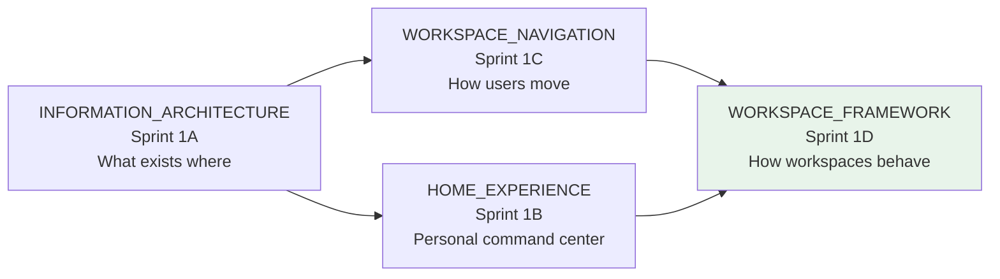
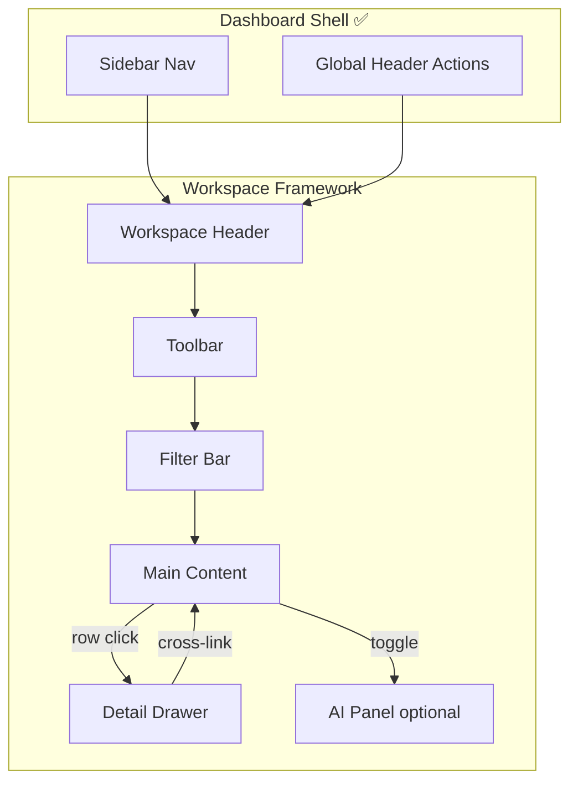
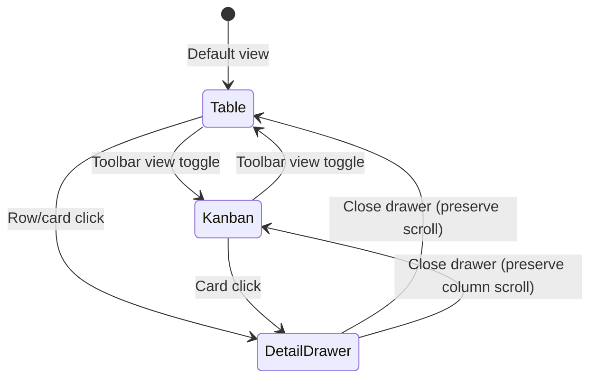
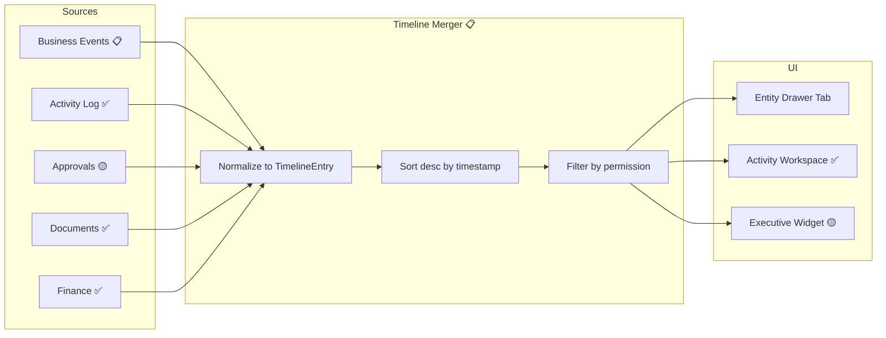
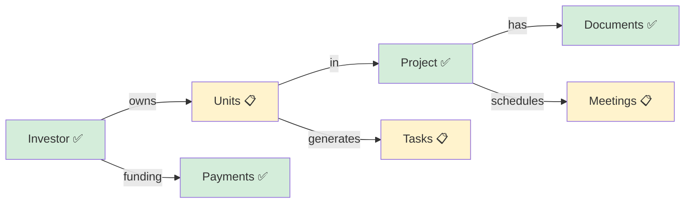
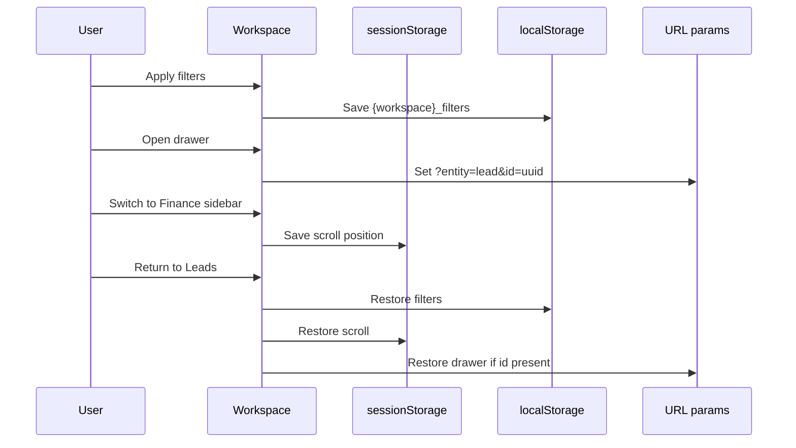
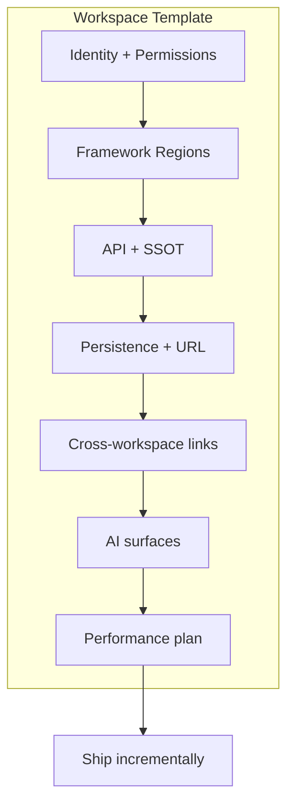
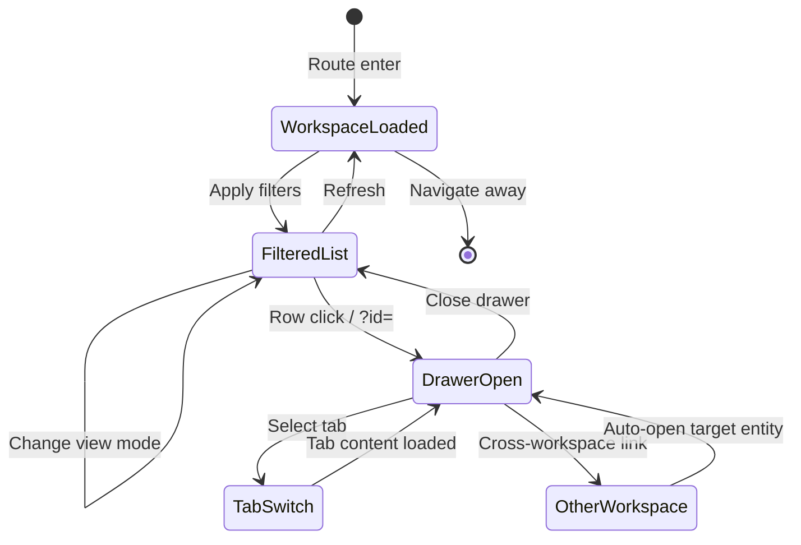
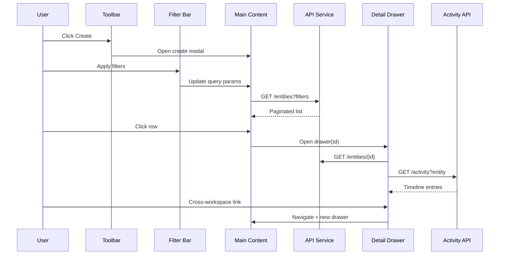
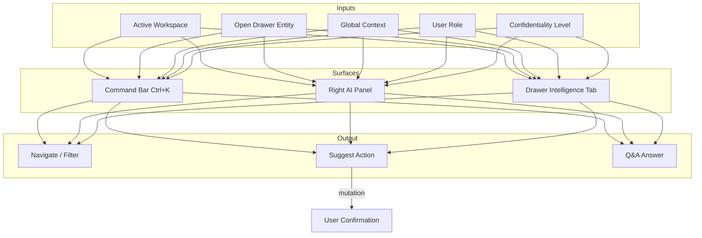

# Investhome OS — Universal Workspace Framework

**Document type:** Product Design Sprint 1D deliverable  
**Last updated:** 2026-07-15  
**Audience:** Product, design, engineering  
**Status:** Target framework spec (with implementation honesty)

**Related governance:** [INFORMATION_ARCHITECTURE.md](./INFORMATION_ARCHITECTURE.md) · [WORKSPACE_NAVIGATION.md](./WORKSPACE_NAVIGATION.md) · [HOME_EXPERIENCE.md](./HOME_EXPERIENCE.md) · [WORKSPACE_ARCHITECTURE.md](./WORKSPACE_ARCHITECTURE.md) · [DOMAIN_MODEL.md](./DOMAIN_MODEL.md) · [EVENT_MODEL.md](./EVENT_MODEL.md) · [AI_PRINCIPLES.md](./AI_PRINCIPLES.md) · [PERMISSION_MODEL.md](./PERMISSION_MODEL.md) · [DATA_OWNERSHIP.md](./DATA_OWNERSHIP.md) · [DESIGN_LANGUAGE.md](./DESIGN_LANGUAGE.md) · [DESIGN_SYSTEM.md](./DESIGN_SYSTEM.md) · [UI_COMPONENT_GUIDELINES.md](./UI_COMPONENT_GUIDELINES.md) · [UI_GUIDELINES.md](./UI_GUIDELINES.md) · [IMPLEMENTATION_STATUS.md](./IMPLEMENTATION_STATUS.md) · [UNITS_INVENTORY_BLUEPRINT.md](./UNITS_INVENTORY_BLUEPRINT.md)

> **Scope:** This document defines the **universal structure and behavior** shared by every workspace. It does not redesign existing screens, implement React components, or specify business logic. It is the blueprint that all current and future workspaces inherit.

---

## Implementation Legend

| Marker | Meaning |
|--------|---------|
| ✅ **Implemented** | Pattern exists in repository today |
| 🟡 **Partial** | Some workspaces or elements follow the pattern; gaps documented |
| 📋 **Target** | Framework specification; not yet standardized across workspaces |

**Repository truth always overrides this document** — see [IMPLEMENTATION_STATUS.md](./IMPLEMENTATION_STATUS.md).

### Current implementation snapshot

| Workspace file | Header | Toolbar | Filters | Stats/KPIs | Drawer | Deep link `?id=` |
|----------------|--------|---------|---------|------------|--------|------------------|
| `executive-workspace.tsx` | ✅ | 🟡 Inline filters | ✅ + localStorage | ✅ | 🟡 Links only | 📋 |
| `leads-workspace.tsx` | ✅ | ✅ | ✅ Apply/reset | ✅ Stats bar | ✅ | ✅ `useRecordDeepLink` |
| `investors-workspace.tsx` | ✅ | ✅ | ✅ | ✅ | ✅ + AI tabs | ✅ |
| `projects-workspace.tsx` | ✅ | ✅ | ✅ | ✅ | ✅ | ✅ |
| `finance-workspace.tsx` | ✅ | 🟡 Tab bar | ✅ Per tab | ✅ Overview | ✅ | ✅ |
| `documents-workspace.tsx` | ✅ | ✅ | ✅ | 🟡 | ✅ + intelligence | ✅ |
| `activity-workspace.tsx` | ✅ | 🟡 | ✅ | — | 🟡 Detail panel | 📋 |
| `settings-workspace.tsx` | ✅ | 🟡 Section nav | — | — | 🟡 Inline panels | 📋 |
| Admin workspaces | ✅ | 🟡 | ✅ | — | 🟡 | 📋 |

Shared primitives today: `DashboardHeaderActions` ✅, `EntityActivityTimeline` ✅, `EntityDocumentsPanel` ✅, `useRecordDeepLink` ✅, `global-search-palette.tsx` ✅.

---

## SECTION 1 — PURPOSE

### Why every workspace follows one common structure

Investhome OS is a workspace-based AI-native operating system ([INFORMATION_ARCHITECTURE.md §1](./INFORMATION_ARCHITECTURE.md#section-1--product-philosophy)). Users navigate by **job responsibility** — Executive, Sales, Finance, Construction — not by database tables. Without a universal workspace framework, each module would reinvent headers, filters, drawers, and AI surfaces — producing inconsistent UX, duplicated frontend logic, and unpredictable behavior for users switching between roles.

The Universal Workspace Framework defines **one composable shell** that every workspace plugs into. Workspaces customize **content and workflows**; the framework owns **structure, interaction patterns, and cross-cutting behavior**.

### Objectives

| Objective | Description | Framework contribution |
|-----------|-------------|------------------------|
| **Consistency** | Users recognize the same layout in Leads, Finance, and Inventory on day one | Fixed region order: Header → Toolbar → Filters → Content → Drawer |
| **Discoverability** | Actions, filters, and entity detail are always in predictable locations | Standard toolbar slots; universal drawer tab order |
| **Scalability** | New workspaces (Marketing, Legal, Property) ship without shell redesign | Workspace Template (Section 16) + expansion checklist |
| **AI integration** | AI is globally available, not bolted per module ([AI_PRINCIPLES.md](./AI_PRINCIPLES.md)) | Right AI Panel slot; drawer Intelligence tab; command bar inheritance |
| **User familiarity** | Operators switching roles (Executive ↔ Finance) retain muscle memory | Shared keyboard model ([WORKSPACE_NAVIGATION.md — Keyboard Model](./WORKSPACE_NAVIGATION.md#deliverable-keyboard-model)); preserved context on switch |

### Relationship to other design sprints



- **IA** defines top-level zones and workspace catalog.
- **Home** defines the personal landing experience (not a workspace).
- **Navigation** defines sidebar, switching, cross-workspace links, keyboard.
- **Framework** (this document) defines **in-workspace anatomy** — the shared skeleton every operational workspace inherits.

---

## SECTION 2 — UNIVERSAL WORKSPACE LAYOUT

Every operational workspace renders inside the dashboard shell (`dashboard-shell` in `globals.css` ✅). Below the global header (Search, Notifications, Language, Profile), the workspace content area follows a **fixed vertical stack**.

### Region diagram

```
┌──────────┬──────────────────────────────────────────────────────────────┬──────────┐
│          │  WORKSPACE HEADER — title, context, primary actions          │          │
│          ├──────────────────────────────────────────────────────────────┤          │
│ Sidebar  │  TOOLBAR — create, import, views, bulk, refresh, saved views │ AI Panel │
│   ✅     ├──────────────────────────────────────────────────────────────┤  (opt)   │
│          │  FILTER BAR — chips, saved filters, global context inherit   │   📋     │
│          ├──────────────────────────────────────────────────────────────┤          │
│          │  MAIN CONTENT — table, kanban, cards, analytics, dashboard   │          │
│          ├──────────────────────────────────────────────────────────────┤          │
│          │  DETAIL DRAWER (slide-over, preserves list scroll)           │          │
│          ├──────────────────────────────────────────────────────────────┤          │
│          │  FOOTER (optional) — pagination, selection summary, status   │          │
└──────────┴──────────────────────────────────────────────────────────────┴──────────┘
```

### Region responsibilities

| Region | Responsibility | Does NOT own | Status |
|--------|----------------|--------------|--------|
| **Workspace Header** | Identity of current workspace; breadcrumb; workspace-scoped context chips; primary CTA | Entity CRUD forms (those live in modals/drawers) | 🟡 |
| **Toolbar** | Batch operations, view switcher, import/export, refresh, saved view picker | Filter field definitions (Filter Bar) | 🟡 |
| **Filter Bar** | Query constraints sent to API; filter chips; clear-all; persistence | Business validation rules | 🟡 |
| **Main Content** | Primary data surface — list, board, chart, explorer | Authoritative data (SSOT in API) | ✅ |
| **Optional Right AI Panel** | Contextual summary, suggested actions, Q&A scoped to open entity | Mutations without approval | 📋 |
| **Timeline** | Merged chronological stream (embedded in drawer or content) | Raw application logs | 🟡 Entity timeline ✅ |
| **Related Records** | Clickable relationship graph — exit ramps to other workspaces | Duplicate entity data | 🟡 |
| **Activity Feed** | Permission-filtered audit entries for scope (entity or workspace) | Business event bus (future) | ✅ |
| **Footer (optional)** | Pagination, row selection count, sync status, last refreshed | Primary navigation | 🟡 Finance pagination ✅ |

### Layout interaction model



**Rule F-L1:** Main Content and Detail Drawer coexist — drawer slides over content; list remains mounted and scroll position preserved ([WORKSPACE_NAVIGATION.md N11](./WORKSPACE_NAVIGATION.md#section-3--navigation-principles)).

**Rule F-L2:** Global overlays (Search, Notifications) render above workspace regions without unmounting workspace state ([INFORMATION_ARCHITECTURE.md G1](./INFORMATION_ARCHITECTURE.md#section-5--global-features)).

---

## SECTION 3 — WORKSPACE HEADER

The Workspace Header is the **workspace-local identity bar** — distinct from the shell global header (`DashboardHeaderActions` ✅).

### Anatomy

```
┌─────────────────────────────────────────────────────────────────────────┐
│ [Eyebrow: module name]                              [Global actions →]  │
│ Workspace Title                                    [Favorite ☆] [?help] │
│ Subtitle / description                                                  │
│ [Breadcrumb: Home › Sales › Lead list]    [Context: Temple Project ▾]   │
│ [Status: 3 pending approvals]              [Primary] [Secondary …]    │
└─────────────────────────────────────────────────────────────────────────┘
```

### Elements and behavior

| Element | Behavior | Status |
|---------|----------|--------|
| **Title** | i18n `navigation.modules.{code}.title` or workspace-specific key; H1 semantic | ✅ |
| **Eyebrow** | Module category label (e.g., "Workspaces", "Administration") | ✅ |
| **Subtitle** | One-line purpose statement; TR/EN | ✅ |
| **Current context** | Global project/building/unit chips inherited from header context bar ([WORKSPACE_NAVIGATION.md §10](./WORKSPACE_NAVIGATION.md#section-10--global-context)) | 📋 |
| **Breadcrumb** | `Home › {Workspace} › {View} › {Entity}` when drawer open; links navigate with context handoff | 📋 |
| **Favorite toggle** | Star workspace or pinned entity; persists to user preferences | 📋 |
| **Quick search** | Workspace-scoped search field (optional); defers to `Ctrl+K` for global | 🟡 Inline filter search only |
| **Primary action** | One prominent CTA — "New Lead", "Upload Document" | ✅ |
| **Secondary actions** | Export, import, settings link — overflow menu when >3 | 🟡 |
| **Status indicators** | Badge row: pending approvals, processing queue, demo data banner | 🟡 Demo banner ✅ |

### Header rules

| # | Rule |
|---|------|
| H-1 | Primary action requires `{resource}.create` or equivalent; hidden if unauthorized |
| H-2 | Breadcrumb never exceeds 4 segments — collapse middle with `…` |
| H-3 | Context chips clear explicitly — never implicit "silent" filter |
| H-4 | Workspace header does not duplicate global Search/Notifications — `DashboardHeaderActions` stays right-aligned ✅ |

**Today:** All workspaces use `dashboard__header` + `DashboardHeaderActions` ✅. Breadcrumb, favorite, and global context chips are **not standardized** 📋.

---

## SECTION 4 — TOOLBAR

The Toolbar sits below the header and above filters. It holds **workspace operations** — not filter fields.

### Standard slots (left → right)

| Slot | Examples | Extensibility | Status |
|------|----------|---------------|--------|
| **Create** | New entity, upload | Workspace registers primary create targets | ✅ |
| **Import** | CSV/XLSX unit import, bulk lead import | Optional; permission-gated | 📋 |
| **Export** | CSV, PDF report, executive export | `{resource}.export` permission | 🟡 Executive export ✅ |
| **Views** | Table / Kanban / Cards / Map toggle | Workspace declares supported `ViewMode` enum | 🟡 Documents table/grid ✅ |
| **Bulk Actions** | Archive, assign, approve — enabled when rows selected | Disabled at 0 selection | 📋 |
| **Refresh** | Re-fetch list without full page reload | Shows last refreshed timestamp on hover | 🟡 Manual reload only |
| **Saved Views** | Named filter + column + sort presets | User prefs API | 📋 |
| **Filters toggle** | Collapse/expand filter bar on small viewports | Remembers preference | 📋 |

### Extensibility model

Workspaces register toolbar actions via a declarative config (target pattern — documentation only):

```typescript
// Target — not implemented
interface WorkspaceToolbarAction {
  id: string;
  labelKey: string;           // i18n
  icon?: string;
  permission?: { resource: string; action: string };
  variant: 'primary' | 'secondary' | 'ghost';
  onClick: () => void;
  disabled?: boolean;
  hidden?: boolean;
}
```

**Extension rules:**

| # | Rule |
|---|------|
| T-1 | Maximum 1 primary button in toolbar (rest secondary/ghost) |
| T-2 | Bulk actions appear only when selection model is supported |
| T-3 | Import/export require explicit permission check before render |
| T-4 | View switcher persists per workspace in user preferences |

**Today:** Toolbars are **inline per workspace** — `leads__toolbar`, executive inline filters, finance tab bar 🟡. No shared `WorkspaceToolbar` component 📋.

---

## SECTION 5 — FILTER BAR

The Filter Bar constrains Main Content queries. Filters map 1:1 to API query parameters per [API_PRINCIPLES.md](./API_PRINCIPLES.md).

### Components

| Component | Behavior | Status |
|-----------|----------|--------|
| **Global/workspace filters** | Fields scoped to workspace (status, date range, project_id) | ✅ |
| **Global context inherit** | When header project chip set, pre-fill `project_id` filter | 📋 |
| **Saved filters** | Named presets stored server-side; dropdown in filter bar | 📋 |
| **Recent filters** | Last 5 applied filter sets per workspace | 📋 |
| **Filter chips** | Active constraints as removable pills above content | 📋 |
| **Clear filters** | Resets to workspace default; explicit button | ✅ Apply/reset pattern |
| **Advanced filter** | Expandable panel for infrequent fields | 📋 |

### Persistence

| Storage | Scope | Today |
|---------|-------|-------|
| `localStorage` key `{workspace}_filters` | Per user, per browser | 🟡 Executive only (`EXECUTIVE_FILTER_STORAGE_KEY`) |
| URL query params | Shareable filter state | 📋 |
| Server saved views | Cross-device | 📋 |

Aligns with [WORKSPACE_NAVIGATION.md §7](./WORKSPACE_NAVIGATION.md#section-7--workspace-switching) context preservation matrix.

### Filter bar rules

| # | Rule |
|---|------|
| FB-1 | Apply vs live-debounce: text search may debounce; discrete fields use Apply button (current leads pattern ✅) |
| FB-2 | Clearing filters must reset pagination to page 1 |
| FB-3 | Filter state survives workspace switch away and back |
| FB-4 | Confidential entities never appear in filter dropdowns user cannot access |

---

## SECTION 6 — CONTENT AREA

Main Content is the **primary data surface**. Workspaces declare one or more view modes; users switch via Toolbar.

### Supported view modes

| View | Best for | Example workspace | Status |
|------|----------|-------------------|--------|
| **Table** | Sortable lists, bulk selection, dense data | Leads, Finance transactions | ✅ |
| **Kanban** | Pipeline stages, workflow columns | Sales (target), Construction approvals | 📋 |
| **Cards** | Visual scan, KPI grids | Executive summary, Documents grid | 🟡 |
| **Timeline** | Chronological audit | Activity workspace | ✅ |
| **Calendar** | Date-driven entities | Meetings, obligations (target) | 📋 |
| **Map** | Geo-distributed projects | Development portfolio (future) | 📋 |
| **Floor Stack** | Building → Floor → Unit hierarchy | Inventory | 📋 [UNITS_INVENTORY_BLUEPRINT.md](./UNITS_INVENTORY_BLUEPRINT.md) |
| **Gallery** | Image/document thumbnails | Documents, Marketing collateral | 🟡 Documents grid |
| **Analytics** | Charts, dashboards | Executive, Marketing | 🟡 Executive sections |

### View switching behavior



| Behavior | Specification | Status |
|----------|---------------|--------|
| **Default view** | Table for entity lists; Analytics for Executive/Finance overview | 🟡 |
| **Persist view mode** | `localStorage` `{workspace}_view_mode` | 📋 Documents viewMode in component state only 🟡 |
| **Empty state** | `EmptyState` / `documents-empty` with guided action | ✅ |
| **Loading** | Skeleton rows matching column layout | 🟡 Executive skeleton ✅ |
| **Error** | Retry button; preserve filters | ✅ |
| **Row click** | Opens Detail Drawer; does not navigate away | ✅ |
| **Pagination** | Footer or inline; server-side page/page_size | 🟡 Finance ✅; Leads client-side list |

### Content rules

| # | Rule |
|---|------|
| C-1 | One canonical list view per entity type per workspace ([IA P3](./INFORMATION_ARCHITECTURE.md#section-13--ia-principles)) |
| C-2 | Demo data badge when `is_demo` records present ✅ |
| C-3 | Permission-aware column visibility — hide sensitive columns entirely |
| C-4 | Sort indicators on table headers; default sort documented per workspace |

---

## SECTION 7 — DETAIL EXPERIENCE

The Universal Detail Drawer is the **standard entity drill-down surface** — preferred over full-page navigation ([IA P13](./INFORMATION_ARCHITECTURE.md#section-13--ia-principles), [WORKSPACE_NAVIGATION.md N11](./WORKSPACE_NAVIGATION.md#section-3--navigation-principles)).

### Why drawers over pages

| Drawers | Full pages |
|---------|------------|
| Preserve list context and scroll position | Lose list state on back navigation |
| Faster perceived navigation (<300ms target) | Full route transition |
| Support cross-entity comparison (close, open adjacent row) | Requires tab juggling |
| Align with desktop-first power-user workflows | Better for mobile full-screen (degraded mode) |
| Enable shareable deep links via `?id=` without unmounting list | URL is canonical but context loss |

Mobile strategy: drawers become full-screen entity pages below 768px ([INFORMATION_ARCHITECTURE.md §11](./INFORMATION_ARCHITECTURE.md#section-11--mobile-strategy)) 📋.

### Universal drawer tab order

| Tab | Content | All entities | Status |
|-----|---------|--------------|--------|
| **Overview** | Core fields, status, primary metadata | Yes | ✅ |
| **Timeline** | Merged business + activity events (Section 9) | Yes | 🟡 Activity tab only |
| **Documents** | `EntityDocumentsPanel` — linked files, upload | Yes | ✅ |
| **Relationships** | Related entity chips + cross-workspace links (Section 10) | Yes | 🟡 Partial fields |
| **AI Summary** | Intelligence tab — analysis, Q&A, recommendations | When AI applicable | 🟡 Documents, Investors |
| **Activity** | `EntityActivityTimeline` — audit log | Yes | ✅ |
| **History** | Field-level change history, version list | When versioned | 🟡 Document versions ✅ |

### Drawer anatomy

```
┌──────────────────────────────────────────────┐
│ [Eyebrow] Entity Type          [···] [✕]    │
│ Entity Title                    [Edit][Act]  │
│ [Status badges] [Demo tag]                   │
├──────────────────────────────────────────────┤
│ [Overview][Timeline][Docs][Relations][AI]…  │
├──────────────────────────────────────────────┤
│                                              │
│  Tab content area (scrollable)               │
│                                              │
├──────────────────────────────────────────────┤
│ [Open in Finance →]  [Pin to Home]           │
└──────────────────────────────────────────────┘
```

### Drawer behavior

| Behavior | Specification | Status |
|----------|---------------|--------|
| Open trigger | Row click, search result, notification deep link, `?id=` param | 🟡 `useRecordDeepLink` ✅ |
| Close | Escape, backdrop click, close button | ✅ |
| URL sync | `?entity=lead&id={uuid}` updates on open; clears on close | 📋 Today: `?id=` only 🟡 |
| Width | 480px default; 640px for document/drawing preview | 🟡 |
| Stacking | One drawer at a time; cross-entity replaces content | ✅ |
| Loading | Skeleton inside drawer; tab lazy load | 🟡 |
| Permissions | Edit/archive actions hidden by `hasPermission` | ✅ |

**Today:** Per-entity drawers (`lead-detail-drawer.tsx`, `project-detail-drawer.tsx`, etc.) ✅ — **not yet unified** into a single composable shell 📋. Lead drawer is single-scroll (overview + documents + activity inline) 🟡 rather than tabbed.

---

## SECTION 8 — RIGHT AI PANEL

The Optional Right AI Panel is a **docked rail** (280–360px) for contextual AI — supplementing drawer Intelligence tabs and global Command Bar.

### Purpose

| Need | Drawer Intelligence tab | Right AI Panel |
|------|------------------------|----------------|
| Deep document analysis | Primary surface | Summary mirror |
| Quick Q&A while browsing list | Requires drawer open | Available with list visible |
| Suggested next actions | Bottom of tab | Persistent action cards |
| Related record discovery | Relationships tab | AI-ranked suggestions |

### Panel sections

| Section | Content | Status |
|---------|---------|--------|
| **Context summary** | "Viewing Lead: Ahmet Y. — Qualified — Temple project" | 📋 |
| **Suggested actions** | Role-appropriate commands ([WORKSPACE_NAVIGATION.md §12](./WORKSPACE_NAVIGATION.md#section-12--workspace-ai)) | 📋 |
| **Related records** | AI-ranked links to projects, documents, units | 📋 |
| **AI recommendations** | Heuristic insights with confidence; never auto-execute | 🟡 In document drawer tabs |
| **Command input** | Mini prompt field; scopes to open entity | 📋 |

### Contextual awareness inputs

Per [AI_PRINCIPLES.md](./AI_PRINCIPLES.md) and [EVENT_MODEL.md](./EVENT_MODEL.md):

- Active workspace route
- Open drawer entity type + id
- Global project/building/unit context
- User role + permissions
- Document confidentiality level (blocks external AI ✅)

### Panel rules

| # | Rule |
|---|------|
| AI-1 | Panel collapses entirely — never forced open |
| AI-2 | Mutations suggested as cards with confirmation — never auto-run |
| AI-3 | Highly confidential context excludes external LLM ([AI_PRINCIPLES.md](./AI_PRINCIPLES.md)) |
| AI-4 | Panel state persists per workspace in session |

**Today:** AI embedded in document/investor drawer tabs 🟡. No docked right rail 📋. Resolve layout decision MD-12 ([INFORMATION_ARCHITECTURE.md](./INFORMATION_ARCHITECTURE.md)).

---

## SECTION 9 — TIMELINE

The Universal Timeline merges **multiple event sources** into one chronological stream — in entity drawers, workspace home widgets, and Activity workspace.

### Event sources (merged)

| Source | Description | Storage | Status |
|--------|-------------|---------|--------|
| **Business Events** | Domain-significant occurrences (`lead.status_changed`, etc.) | `@investhome/events` stub | 📋 [EVENT_MODEL.md §1](./EVENT_MODEL.md#1-business-events-domain-events) |
| **Activity** | Immutable audit — who did what | `activity_logs` | ✅ |
| **Approvals** | Drawing proposals, finance approve, reservation approve | Entity state + activity | 🟡 |
| **Documents** | Upload, version, analysis complete | Activity + document records | ✅ |
| **Communications** | Email, WhatsApp, internal messages | Not implemented | 📋 |
| **Meetings** | Calendar events | Not implemented | 📋 |
| **Construction** | Milestones, drawing approvals, site photos | Partial via documents | 🟡 |
| **Finance** | Transactions, obligations, funding events | Activity + finance records | ✅ |

### Timeline filtering

| Filter | Scope |
|--------|-------|
| Event type | Activity, Approval, Document, Finance, … |
| Actor | User, AI, system, integration |
| Date range | Preset + custom |
| Severity | Critical approvals only |

### Display model



**Today:** `EntityActivityTimeline` ✅ shows activity log only — not merged business events or finance milestones 📋. Activity workspace supports timeline/table views ✅.

---

## SECTION 10 — RELATED RECORDS

The Universal Relationship Component surfaces **navigable entity graphs** — implementing the no-dead-end rule ([IA P12](./INFORMATION_ARCHITECTURE.md#section-13--ia-principles)).

### Example chain

**Investor → Units → Projects → Documents → Payments → Meetings → Tasks**



### Navigation behavior

| Interaction | Result | Status |
|-------------|--------|--------|
| Click related chip | Navigate to owning workspace + open target drawer | 🟡 Manual sidebar today |
| Hover preview | Mini card with key fields | 📋 |
| Count badge | "4 documents" with expand | 🟡 EntityDocumentsPanel ✅ |
| Permission gate | Chip hidden if user lacks target `view` | ✅ Search model |
| Cross-workspace handoff | URL params: `/dashboard/finance?tab=transactions&project_id=` | 📋 |

### Relationship types (from domain model)

Per [DOMAIN_MODEL.md](./DOMAIN_MODEL.md) and [DATA_OWNERSHIP.md](./DATA_OWNERSHIP.md):

| From | Relationship | To |
|------|--------------|-----|
| Lead | interested_in | Project |
| Lead | reserved (future) | Unit |
| Investor | committed_to | Project (FundingCommitment) |
| Investor | owns (future) | Unit (UnitOwnership) |
| Project | contains | Building → Floor → Unit |
| Project | linked | FinancialTransaction, Document |
| Document | attached_to | Any entity via DocumentLink |
| Transaction | attributed_to | Project, Investor, Unit (future) |

### Component specification (target)

```typescript
// Target — documentation only
interface RelatedRecordLink {
  entityType: string;
  entityId: string;
  label: string;
  workspace: string;       // route slug
  href: string;            // with ?id= handoff
  count?: number;
  permission: { resource: string; action: 'view' };
}
```

**Today:** Related entities appear as **inline text fields** (e.g., lead interested project) 🟡 — not as clickable cross-workspace chips 📋.

---

## SECTION 11 — ACTIVITY PANEL

The Activity Panel presents audit entries in **Who / What / When / Result / Link** format — permission-aware at every layer.

### Row schema

| Column | Source field | Example |
|--------|--------------|---------|
| **Who** | `actor_name`, `actor_type` | "Ayşe Kaya" or "AI Service" |
| **What** | `description_key` + i18n metadata | "Updated lead status to Qualified" |
| **When** | `created_at` | "15 Jul 2026, 09:42" |
| **Result** | `action` enum + changed fields | "status_changed: new → qualified" |
| **Link** | Entity reference | → Lead drawer |

### Scopes

| Scope | Component | Status |
|-------|-----------|--------|
| Entity-scoped | `EntityActivityTimeline` in drawers | ✅ |
| Workspace-scoped | Filtered activity feed in workspace home | 📋 |
| Global | Activity workspace `/dashboard/activity` | ✅ |

### Permission model

- Read requires `activity.view` + entity resource permission via `ENTITY_RESOURCE_MAP` ✅
- Sensitive fields redacted per `activity_config.py` ✅
- Confidential document activity filtered by confidentiality tier ✅

Aligns with [EVENT_MODEL.md §2](./EVENT_MODEL.md#2-activity-log-business-audit-trail) — Activity Log is authoritative; panel is a view, not a separate store.

---

## SECTION 12 — WORKSPACE STATE

The framework **remembers user context** so switching workspaces and returning feels continuous ([WORKSPACE_NAVIGATION.md §7](./WORKSPACE_NAVIGATION.md#section-7--workspace-switching)).

### State inventory

| State | Persist? | Storage (target) | Today |
|-------|----------|------------------|-------|
| **Selected project** | Yes — global | `sessionStorage.global_project_id` + URL `?context_project=` | 📋 |
| **Filters** | Yes — per workspace | `localStorage.{workspace}_filters` | 🟡 Executive only |
| **Open drawer** | Yes — per workspace | URL `?entity=&id=` | 🟡 `?id=` via `useRecordDeepLink` |
| **Scroll position** | Yes — per route | `sessionStorage.scroll_{path}` | 📋 |
| **Current view** | Yes — per workspace | `localStorage.{workspace}_view_mode` | 🟡 Component state |
| **Workspace preferences** | Yes | User prefs API (density, column sets) | 📋 |
| **AI panel open** | Optional | Session per workspace | 📋 |
| **Row selection** | Ephemeral | Component state; clear on filter change | 📋 |
| **Sort order** | Yes | Part of saved views / filter state | 🟡 In filter objects |

### State lifecycle



### Rules

| # | Rule |
|---|------|
| S-1 | URL is source of truth for shareable state (drawer, context) |
| S-2 | localStorage keys include `userId` suffix when server sync unavailable |
| S-3 | Unsaved form drafts trigger `beforeunload` warning before workspace switch |
| S-4 | Clearing global project context resets dependent filters explicitly |

---

## SECTION 13 — KEYBOARD MODEL

Keyboard shortcuts align with [WORKSPACE_NAVIGATION.md — Keyboard Model](./WORKSPACE_NAVIGATION.md#deliverable-keyboard-model) and extend with **workspace-local** behaviors.

### Global shortcuts (all workspaces)

| Shortcut | Action | Status |
|----------|--------|--------|
| `Ctrl+K` / `⌘K` | Open global search | ✅ |
| `Ctrl+Shift+K` | AI command mode | 📋 |
| `Escape` | Close drawer / overlay (innermost first) | ✅ |
| `[` | Toggle sidebar collapse | 📋 |
| `?` | Keyboard help overlay | 📋 |
| `G then H` | Go Home | 📋 |
| `G then {letter}` | Go workspace by letter | 📋 |

### Workspace-local shortcuts (target)

| Shortcut | Action | Context |
|----------|--------|---------|
| `N` | New entity (primary create) | When no input focused |
| `F` | Focus filter bar | |
| `/` | Focus workspace quick search | |
| `R` | Refresh list | |
| `↑` `↓` | Navigate table rows | |
| `Enter` | Open drawer for focused row | |
| `E` | Edit open entity | Drawer open + permission |
| `Ctrl+Enter` | Save modal form | Modal open |

### Universal behavior rules

| # | Rule |
|---|------|
| K-1 | Shortcuts never fire when focus is in text input (except Escape) |
| K-2 | `?` help shows context-aware shortcut list (global + workspace) |
| K-3 | Drawer open: `Escape` closes drawer first, not search |
| K-4 | Search overlay: arrow keys navigate results ✅ |

---

## SECTION 14 — PERFORMANCE

Desktop-first performance targets for framework regions. Extends [WORKSPACE_NAVIGATION.md §13](./WORKSPACE_NAVIGATION.md#section-13--navigation-performance).

### Strategies by region

| Strategy | Application | Status |
|----------|-------------|--------|
| **Lazy loading** | Workspace routes code-split (Next.js default) | 🟡 |
| **Virtualization** | Tables >100 rows use virtual scroll | 📋 |
| **Caching** | SWR/React Query for list endpoints; stale-while-revalidate | 🟡 Ad-hoc fetch |
| **Streaming** | Executive sections load independently | 🟡 |
| **Drawer loading** | Open drawer immediately; skeleton tabs; fetch parallel | 🟡 |
| **Prefetch** | Sidebar link hover prefetches route + first page | 📋 |
| **Debounced search** | Filter text fields debounce 300ms | 🟡 Global search ✅ |
| **Tab lazy load** | Intelligence/AI tab fetches on first activate | 🟡 |

### Performance budgets

| Metric | Target | Status |
|--------|--------|--------|
| Workspace shell visible | <200ms | 🟡 |
| List first paint (skeleton) | <500ms | 🟡 |
| Drawer open (cached entity) | <300ms | 🟡 |
| Drawer open (cold fetch) | <800ms | 🟡 |
| Filter apply → results | <400ms | 🟡 |
| View mode switch | <150ms (client only) | 📋 |
| AI panel suggestions | <1s (heuristic) | 📋 |

### Virtualization rule

Tables exceeding **100 rows** should virtualize or use server pagination ✅ (Finance uses pagination). Client-side full lists (Leads) should migrate to paginated API 📋.

---

## SECTION 15 — DESIGN PRINCIPLES

Twenty-five governing principles for the Universal Workspace Framework. Extends IA principles ([INFORMATION_ARCHITECTURE.md §13](./INFORMATION_ARCHITECTURE.md#section-13--ia-principles)) and workspace navigation principles ([WORKSPACE_NAVIGATION.md §14](./WORKSPACE_NAVIGATION.md#section-14--workspace-principles)).

| # | Principle | Implication | Status |
|---|-----------|-------------|--------|
| **WF1** | **One structure** | Every workspace uses the same region stack (Section 2) | 📋 |
| **WF2** | **Context preserved** | Filters, drawer, scroll survive navigation | 🟡 |
| **WF3** | **Everything linkable** | Any displayed entity is clickable → drawer or workspace | 🟡 |
| **WF4** | **AI always available** | Command bar + drawer intelligence + optional AI panel | 🟡 |
| **WF5** | **Progressive disclosure** | Overview first; tabs for depth; advanced filters collapsed | 🟡 |
| **WF6** | **Drawer over page** | Entity detail in slide-over, not route replacement | ✅ |
| **WF7** | **Workspace owns experience, not data** | SSOT in API services ([DATA_OWNERSHIP.md](./DATA_OWNERSHIP.md)) | ✅ |
| **WF8** | **Permission-first UI** | Hide unauthorized actions; never show disabled leaks | ✅ |
| **WF9** | **No dead ends** | Every drawer has related records + activity + escape | 🟡 |
| **WF10** | **Honest loading** | Skeletons, not spinners alone; show stale data with indicator | 🟡 |
| **WF11** | **Filters are contracts** | UI filter maps to API param; no client-only filtering at scale | 🟡 |
| **WF12** | **One primary action** | Single prominent create CTA per workspace | ✅ |
| **WF13** | **Bulk with confirmation** | Multi-select mutations require confirm dialog | 📋 |
| **WF14** | **Export respects permissions** | `{resource}.export` gate on toolbar | 🟡 |
| **WF15** | **Bilingual always** | TR default, EN merge-fallback for all workspace strings | ✅ |
| **WF16** | **Desktop-first** | Design 1280px+; degrade don't redesign for mobile | ✅ |
| **WF17** | **Incremental delivery** | Ship shell before all tabs populated | ✅ |
| **WF18** | **Activity everywhere** | Entity timeline in every drawer | ✅ |
| **WF19** | **Documents attach anywhere** | `EntityDocumentsPanel` in all entity drawers | ✅ |
| **WF20** | **Confidentiality follows the document** | AI and activity respect tiers ([PERMISSION_MODEL.md](./PERMISSION_MODEL.md)) | ✅ |
| **WF21** | **Cross-workspace handoff** | Links pass entity IDs via URL; target opens drawer | 📋 |
| **WF22** | **Keyboard parity** | Every mouse action has keyboard equivalent (target) | 🟡 |
| **WF23** | **Saved state is portable** | URL + prefs enable shareable workspace views | 📋 |
| **WF24** | **Merge timelines** | One chronological stream per entity — not siloed logs | 📋 |
| **WF25** | **Register before UI** | Permissions + search + activity before workspace route ([IA §12](./INFORMATION_ARCHITECTURE.md#section-12--expansion-rules)) | ✅ |

---

## SECTION 16 — WORKSPACE TEMPLATE

Reusable blueprint every future workspace inherits. Engineering checklist derived from [WORKSPACE_ARCHITECTURE.md](./WORKSPACE_ARCHITECTURE.md) and Sprint 1A–1D docs.

### Template checklist

```markdown
## Workspace: {Name}

### Identity
- [ ] IA name vs repo name resolved (e.g., Sales vs Leads)
- [ ] Route: `/dashboard/{slug}`
- [ ] Permission resource: `{resource}.view`
- [ ] i18n: `navigation.modules.{code}.title` TR + EN
- [ ] Sidebar link with hasPermission + "Soon" badge if stub

### Framework regions
- [ ] Workspace Header (title, eyebrow, subtitle, primary action)
- [ ] Toolbar (create, export, views, refresh)
- [ ] Filter Bar (apply/reset, chips target, persistence key)
- [ ] Main Content (default view mode declared)
- [ ] Detail Drawer (tab order: Overview → Timeline → Docs → Relations → AI → Activity)
- [ ] Footer (pagination if list >25 items)
- [ ] Optional AI Panel slot declared yes/no

### Data integration
- [ ] API list endpoint with filter params
- [ ] API detail endpoint for drawer
- [ ] Activity entity type registered
- [ ] Search entity type registered
- [ ] Notification rules (if applicable)
- [ ] DocumentLink entity_type supported

### State
- [ ] Filter persistence key: `{slug}_filters`
- [ ] Deep link: `?entity={type}&id={uuid}`
- [ ] View mode persistence (if multiple views)

### Cross-workspace
- [ ] Related record types documented
- [ ] CrossWorkspaceLink targets listed
- [ ] Global project context filter param

### AI
- [ ] Intelligence tab applicable? (yes/no)
- [ ] Suggested commands list for AI panel
- [ ] Confidentiality rules for external AI

### Performance
- [ ] Pagination or virtualization threshold defined
- [ ] Drawer tab lazy load plan
- [ ] Skeleton layout matches final columns

### Tests & docs
- [ ] API tests for list + detail
- [ ] Update IMPLEMENTATION_STATUS.md
- [ ] Update INFORMATION_ARCHITECTURE.md §4
```

### Template diagram



### Worked example: Sales (Leads) — current vs target

| Template item | Current | Target gap |
|---------------|---------|------------|
| Header | ✅ | Add breadcrumb, favorite |
| Toolbar | ✅ Create | Add export, saved views |
| Filters | ✅ | Add chips, localStorage persist |
| Content | ✅ Table | Add Kanban view |
| Drawer | ✅ Inline sections | Migrate to tabbed universal drawer |
| Deep link | ✅ `?id=` | Extend to `?entity=lead&id=` |
| Cross-workspace | 🟡 Project text only | Clickable chip → Projects drawer |
| AI panel | 📋 | Suggested follow-up actions |

---

## SECTION 17 — FUTURE EXTENSIBILITY

New workspaces fit the framework **without forking the shell**. Process aligns with [INFORMATION_ARCHITECTURE.md §12](./INFORMATION_ARCHITECTURE.md#section-12--expansion-rules) and [WORKSPACE_NAVIGATION.md §16](./WORKSPACE_NAVIGATION.md#section-16--future-expansion).

### Adding a workspace (framework-aware)

1. **Complete Workspace Template** (Section 16) — design review before code
2. **Declare view modes** — which of Table/Kanban/Cards/… apply
3. **Declare drawer tabs** — which universal tabs are populated at launch vs "coming soon"
4. **Register framework state keys** — filter persistence, URL param schema
5. **Implement API first** (SSOT) — workspace is a consumer
6. **Compose regions** from shared primitives (target: `WorkspaceLayout` wrapper)
7. **Add cross-workspace links** to/from existing workspaces
8. **Update framework status** in this document's implementation snapshot

### Extension points

| Extension point | Mechanism | Status |
|-----------------|-----------|--------|
| Toolbar actions | `WorkspaceToolbarAction[]` config | 📋 |
| Filter definitions | `WorkspaceFilterField[]` → API params | 📋 |
| View modes | `ViewModeRegistry` per workspace | 📋 |
| Drawer tabs | `DrawerTab[]` with lazy loader | 📋 |
| Timeline sources | `TimelineProvider` plugins | 📋 |
| AI suggestions | `WorkspaceAiCommand[]` per route | 📋 |
| Related record resolvers | `RelatedRecordProvider` per entity type | 📋 |

### Forking rules — do NOT

| Anti-pattern | Why |
|--------------|-----|
| Custom shell layout per workspace | Breaks user familiarity (WF1) |
| Entity detail as full page (desktop) | Loses list context (WF6) |
| Workspace-local permission system | Must use global RBAC |
| Duplicate entity lists in two workspaces | Violates SSOT (WF7) |
| Hidden AI on "non-AI" workspaces | Violates WF4 |

### Upcoming workspaces — framework notes

| Workspace | Special content mode | Drawer complexity |
|-----------|---------------------|-------------------|
| **Inventory** | Floor Stack + Unit grid | 12 tabs per blueprint |
| **Construction** | Drawing inbox + approval queue | Drawing preview + SVG |
| **Marketing** | Analytics + collateral gallery | Read-mostly |
| **Legal** | Confidential queue | Strict AI gating |
| **Property** | Occupancy dashboard + lease registry | Tenant + unit links |
| **AI** | Queue monitor + approval inbox | Meta-entity (analysis records) |

---

## SECTION 18 — NEXT STEP

### Context: Sprint 2 (IODL) complete

Sprint 1A–1D define **information architecture, home, navigation, and workspace framework**. Sprint 2 delivered the **Investhome Design Language (IODL)** — see [DESIGN_LANGUAGE.md](./DESIGN_LANGUAGE.md), [DESIGN_SYSTEM.md](./DESIGN_SYSTEM.md), and [UI_COMPONENT_GUIDELINES.md](./UI_COMPONENT_GUIDELINES.md). Framework region components (`WorkspaceHeader`, `WorkspaceToolbar`, `FilterBar`, `DetailDrawer`, `ContextChip`) are specified in IODL as 📋 spec-only entries awaiting implementation.

### Recommended Sprint 3: Executive Workspace Blueprint (documentation only)

**Goal:** Produce the reference blueprint for **analytics-style workspaces** — multi-section dashboard layouts that extend the universal framework without breaking list-based workspace patterns. Executive is the most complex implemented workspace today (`executive-workspace.tsx` ✅) and becomes the template for Marketing, Construction home, and AI Brain dashboards.

| Deliverable | Description |
|-------------|-------------|
| **EXECUTIVE_WORKSPACE_BLUEPRINT.md** | Section taxonomy: Summary, Attention, Deadlines, Portfolio, Pipeline, Financial — widget contracts |
| **Analytics content region spec** | How Main Content (Section 6) hosts multi-panel layouts vs single table |
| **Widget grid integration** | Map IODL widget sizes to Executive sections |
| **Cross-section drill-down** | Summary card → target workspace drawer handoff |
| **Filter bar variant** | Period presets + project scope — reference for global context chips |
| **Loading tier model** | Extend HOME_EXPERIENCE T0–T4 to workspace dashboard sections |

### Sprint 3 exit criteria

- Executive blueprint doc with wireframes for all 8 current API sections
- Framework element status matrix updated (Appendix A) with Executive as analytics reference
- Engineering estimate for Sprint 4 framework implementation slice

### Recommended Sprint 4: Framework implementation (first slice)

Documentation-only through Sprint 3; Sprint 4 implements:

1. **`WorkspaceLayout` wrapper** — composable regions per [UI_COMPONENT_GUIDELINES.md](./UI_COMPONENT_GUIDELINES.md)
2. **URL drawer state** — `?entity=&id=` across all entity workspaces ([WORKSPACE_NAVIGATION.md REC-N03](./WORKSPACE_NAVIGATION.md#deliverable-recommendations))
3. **Filter persistence** — extend Executive `localStorage` pattern to Leads, Projects, Finance, Documents
4. **Tabbed universal drawer shell** — migrate Lead drawer as pilot (Section 7)
5. **`CrossWorkspaceLink` component** — Investor → Finance handoff (Section 10)

### IODL alignment note

When implementing framework regions, consume IODL component specs — do not introduce parallel CSS naming. Refactor one workspace per sprint (Leads first — smallest per [DESIGN_SYSTEM.md](./DESIGN_SYSTEM.md) migration plan).

---

## DELIVERABLE: INTERACTION DIAGRAMS

### Primary workspace interaction loop



### Framework region data flow



### AI context stack



---

## DELIVERABLE: RISKS

| # | Risk | Severity | Mitigation |
|---|------|----------|------------|
| RF-01 | **Per-workspace CSS drift** — each module copies `leads__*` patterns differently | High | Sprint 3 `WorkspaceLayout`; IODL component specs |
| RF-02 | **Drawer inconsistency** — lead inline vs document tabbed | Medium | Universal drawer shell; migration per entity |
| RF-03 | **State fragmentation** — localStorage only on Executive | Medium | Standardize persistence keys (Section 12) |
| RF-04 | **URL state vs confidentiality** — shareable links to confidential entities | High | Permission re-check on drawer open; 403 empty state |
| RF-05 | **Timeline merge complexity** — business events stub | Medium | Phase 1: activity only ✅; Phase 2: add sources incrementally |
| RF-06 | **AI panel layout undecided** (MD-12) | Medium | Resolve in Sprint 2 IODL; default collapsed |
| RF-07 | **Performance without virtualization** — Leads loads full list | Medium | Paginate API; virtual scroll threshold 100 rows |
| RF-08 | **Cross-workspace links blocked by Inventory delay** | Critical | Prioritize Units S1; stub links with "Soon" |
| RF-09 | **Framework adoption tax** — retrofitting 8 existing workspaces | Medium | Incremental: new `WorkspaceLayout` for new routes; migrate Leads first (smallest) |
| RF-10 | **Over-tabbed drawers** — 12 tabs on Unit per blueprint | Low | Progressive disclosure; group secondary tabs |

---

## DELIVERABLE: RECOMMENDATIONS

| # | Recommendation | Priority | Rationale |
|---|----------------|----------|-----------|
| REC-F01 | Create IODL docs (Sprint 2) before framework React work | P0 | Tokens + components required for consistent regions |
| REC-F02 | Extract `WorkspaceLayout` wrapper in Sprint 3 | P0 | Enforces WF1 One structure |
| REC-F03 | Adopt `?entity=&id=` URL schema workspace-wide | P1 | Enables shareable links, back button ([WORKSPACE_NAVIGATION.md REC-N03](./WORKSPACE_NAVIGATION.md#deliverable-recommendations)) |
| REC-F04 | Extend filter persistence from Executive to all list workspaces | P1 | WF2 Context preserved |
| REC-F05 | Migrate Lead drawer to tabbed universal shell as pilot | P1 | Smallest entity; validates Section 7 |
| REC-F06 | Build `CrossWorkspaceLink` component | P1 | Completes WF21 handoff chains |
| REC-F07 | Add filter chips above list content | P2 | Visible active constraints |
| REC-F08 | Standardize toolbar slot order (Section 4) | P2 | Reduces per-workspace drift |
| REC-F09 | Paginate Leads API (client loads all today) | P2 | Section 14 performance |
| REC-F10 | Resolve MD-11 and MD-12 in Sprint 2 IODL | P1 | Blocks drawer URL + AI panel |
| REC-F11 | Register Inventory workspace against template before S1 code | P0 | 12-tab drawer needs framework plan |
| REC-F12 | Document Executive as analytics workspace variant in Sprint 2B | P2 | Multi-section layout pattern |

---

## APPENDIX A — FRAMEWORK ELEMENT STATUS MATRIX

| Framework element | Executive | Leads | Investors | Projects | Finance | Documents | Activity | Target spec |
|-------------------|-----------|-------|-----------|----------|---------|-----------|----------|-------------|
| Workspace Header | ✅ | ✅ | ✅ | ✅ | ✅ | ✅ | ✅ | Section 3 |
| Toolbar | 🟡 | ✅ | ✅ | ✅ | 🟡 Tabs | ✅ | 🟡 | Section 4 |
| Filter Bar | ✅ | ✅ | ✅ | ✅ | ✅ | ✅ | ✅ | Section 5 |
| Filter persistence | ✅ | 📋 | 📋 | 📋 | 📋 | 📋 | 📋 | Section 12 |
| Table view | 🟡 | ✅ | ✅ | ✅ | ✅ | ✅ | ✅ | Section 6 |
| Alt views | 📋 | 📋 | 📋 | 📋 | 🟡 Tabs | ✅ Grid | ✅ Timeline | Section 6 |
| Detail Drawer | 🟡 | ✅ | ✅ | ✅ | ✅ | ✅ | 🟡 Panel | Section 7 |
| Drawer tabs | 📋 | 📋 | 🟡 | 🟡 | 🟡 | ✅ | — | Section 7 |
| Entity Activity | 🟡 | ✅ | ✅ | ✅ | ✅ | ✅ | ✅ | Section 11 |
| Entity Documents | 📋 | ✅ | ✅ | ✅ | ✅ | — | 📋 | Section 7 |
| Deep link `?id=` | 📋 | ✅ | ✅ | ✅ | ✅ | ✅ | 📋 | Section 12 |
| Cross-workspace links | 🟡 | 📋 | 📋 | 📋 | 📋 | 📋 | 🟡 | Section 10 |
| Right AI Panel | 📋 | 📋 | 📋 | 📋 | 📋 | 📋 | 📋 | Section 8 |
| Merged Timeline | 📋 | 🟡 | 🟡 | 🟡 | 🟡 | 🟡 | ✅ | Section 9 |
| Pagination footer | 📋 | 📋 | 📋 | 📋 | ✅ | ✅ | ✅ | Section 2 |

---

## APPENDIX B — GOVERNANCE CROSS-REFERENCE

| Topic | Document |
|-------|----------|
| Top-level zones and workspace catalog | [INFORMATION_ARCHITECTURE.md](./INFORMATION_ARCHITECTURE.md) |
| Sidebar, switching, keyboard | [WORKSPACE_NAVIGATION.md](./WORKSPACE_NAVIGATION.md) |
| Home (not a workspace) | [HOME_EXPERIENCE.md](./HOME_EXPERIENCE.md) |
| Workspace concept and checklist | [WORKSPACE_ARCHITECTURE.md](./WORKSPACE_ARCHITECTURE.md) |
| Entity relationships | [DOMAIN_MODEL.md](./DOMAIN_MODEL.md) |
| Activity vs business events | [EVENT_MODEL.md](./EVENT_MODEL.md) |
| AI behavior | [AI_PRINCIPLES.md](./AI_PRINCIPLES.md) |
| Permission gates | [PERMISSION_MODEL.md](./PERMISSION_MODEL.md) |
| SSOT rules | [DATA_OWNERSHIP.md](./DATA_OWNERSHIP.md) |
| CSS tokens and primitives | [DESIGN_SYSTEM.md](./DESIGN_SYSTEM.md) · [UI_GUIDELINES.md](./UI_GUIDELINES.md) |
| Units drawer (12 tabs) | [UNITS_INVENTORY_BLUEPRINT.md](./UNITS_INVENTORY_BLUEPRINT.md) |
| Implementation truth | [IMPLEMENTATION_STATUS.md](./IMPLEMENTATION_STATUS.md) |

---

## APPENDIX C — CURRENT IMPLEMENTATION REFERENCE

| File | Framework relevance |
|------|---------------------|
| `apps/web/src/app/dashboard/layout.tsx` | Shell providers ✅ |
| `apps/web/src/app/dashboard/_components/dashboard-header-actions.tsx` | Global header ✅ |
| `apps/web/src/app/dashboard/_components/sidebar-nav.tsx` | Workspace switcher ✅ |
| `apps/web/src/app/dashboard/_components/entity-activity-timeline.tsx` | Activity panel ✅ |
| `apps/web/src/app/dashboard/_components/entity-documents-panel.tsx` | Documents tab ✅ |
| `apps/web/src/app/dashboard/_components/global-search-palette.tsx` | Command bar foundation ✅ |
| `apps/web/src/lib/hooks/use-record-deep-link.ts` | Drawer URL open 🟡 |
| `apps/web/src/app/dashboard/*/\*-workspace.tsx` | Per-workspace region composition 🟡 |
| `apps/web/src/app/dashboard/*/\*-detail-drawer.tsx` | Detail experience 🟡 |
| `packages/ui/src/components/` | `@investhome/ui` primitives 🟡 |

---

*Product Design Sprint 1D — Universal Workspace Framework v1.0. Documentation only — no UI implementation in this sprint.*
