# Investhome OS — Workspace Navigation System

**Document type:** Product Design Sprint 1C deliverable  
**Last updated:** 2026-07-15  
**Audience:** Product, design, engineering  
**Status:** Target navigation spec (with implementation honesty)

**Related governance:** [INFORMATION_ARCHITECTURE.md](./INFORMATION_ARCHITECTURE.md) · [HOME_EXPERIENCE.md](./HOME_EXPERIENCE.md) · [WORKSPACE_ARCHITECTURE.md](./WORKSPACE_ARCHITECTURE.md) · [PRODUCT_VISION.md](./PRODUCT_VISION.md) · [DOMAIN_MODEL.md](./DOMAIN_MODEL.md) · [PERMISSION_MODEL.md](./PERMISSION_MODEL.md) · [AI_PRINCIPLES.md](./AI_PRINCIPLES.md) · [NAMING_CONVENTIONS.md](./NAMING_CONVENTIONS.md) · [ROADMAP.md](./ROADMAP.md) · [IMPLEMENTATION_STATUS.md](./IMPLEMENTATION_STATUS.md) · [UNITS_INVENTORY_BLUEPRINT.md](./UNITS_INVENTORY_BLUEPRINT.md)

> **Note:** [HOME_EXPERIENCE.md](./HOME_EXPERIENCE.md) is the Sprint 1B Home deliverable. Until it ships, Home widget and landing behavior are defined in [INFORMATION_ARCHITECTURE.md §3](./INFORMATION_ARCHITECTURE.md#section-3--home) and cross-referenced here.

---

## Implementation Legend

| Marker | Meaning |
|--------|---------|
| ✅ **Implemented** | Route, API, and UI exist in repository |
| 🟡 **Partial** | Some surfaces exist; gaps documented |
| 📋 **Planned** | Target spec; no production route yet |
| 🔵 **Blueprint** | Specification complete; zero code |

**Repository truth always overrides this document** — see [IMPLEMENTATION_STATUS.md](./IMPLEMENTATION_STATUS.md).

---

## SECTION 1 — WORKSPACE PHILOSOPHY

### Why workspaces replace ERP modules

Traditional ERP systems organize navigation around **database modules** — Leads table, Projects table, Finance ledger — forcing users to think in schema terms and duplicate screens per department. Investhome OS inverts this: users navigate by **job responsibility**, while all workspaces read and write the **same authoritative domain model** in PostgreSQL ([DOMAIN_MODEL.md](./DOMAIN_MODEL.md), [DATA_OWNERSHIP.md](./DATA_OWNERSHIP.md)).

Workspaces are **derived views**, not data silos. There is no `workspaces` table ([WORKSPACE_ARCHITECTURE.md](./WORKSPACE_ARCHITECTURE.md), IAD-006). Each workspace maps to a permission-gated route under `/dashboard/{slug}` plus a tailored experience layer (filters, KPIs, workflows).

### One Domain Model, Many Experiences, One AI, Shared Data

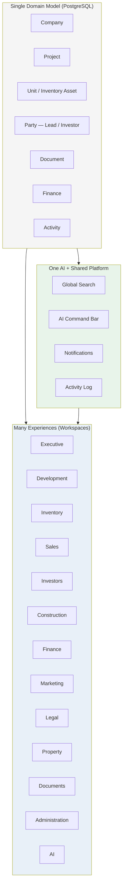

| Principle | Implication |
|-----------|-------------|
| **One Domain Model** | Company → Project → Building → Floor → Unit; Party; Documents; Finance — one SSOT per entity |
| **Many Experiences** | Executive sees portfolio KPIs; Sales sees pipeline; Finance sees treasury — same project, different lens |
| **One AI** | Document intelligence, drawing detection, command bar, morning brief — globally available, permission-gated ([AI_PRINCIPLES.md](./AI_PRINCIPLES.md)) |
| **Shared Data** | A sale in Sales updates inventory status (planned), finance transactions, documents, executive aggregates — **no copying** |

### Users work by responsibility, not DB entities

A Construction Manager thinks in **drawings, approvals, and site progress**. A Sales Rep thinks in **leads, units, and closings**. IA routes users through responsibility lenses; entity detail drawers provide the shared drill-down layer ([INFORMATION_ARCHITECTURE.md §6](./INFORMATION_ARCHITECTURE.md#section-6--entity-navigation)).

### Current implementation honesty

| Aspect | Status |
|--------|--------|
| 5 core module workspaces (Executive, Leads, Investors, Projects, Finance) | ✅ |
| Documents, Activity, Settings, Admin | ✅ |
| 6 future workspaces (Inventory, Construction, Marketing, Legal, Property, AI) | 📋 |
| Sidebar from `MODULE_NAMES` + permission checks | ✅ |
| Collapsible sidebar, favorites, workspace search | 📋 |
| Home as personal command center | 🟡 Module launcher grid today |

---

## SECTION 2 — WORKSPACE HIERARCHY

Thirteen workspaces plus **Home** (personal command center, not a workspace) and **Global** utilities (Search, Notifications, Tasks, etc.) form the navigation hierarchy. Order follows business priority per [INFORMATION_ARCHITECTURE.md §12](./INFORMATION_ARCHITECTURE.md#section-12--expansion-rules).

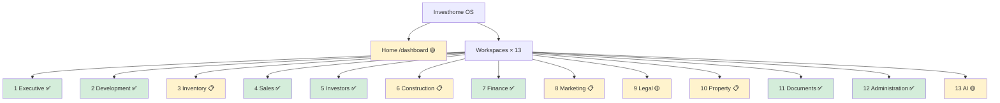

### 2.1 Executive

| Attribute | Value |
|-----------|-------|
| **Purpose** | Strategic portfolio oversight — revenue, pipeline, risk, deadlines |
| **Route** | `/dashboard/executive` ✅ |
| **Permission** | `executive.view` |
| **Primary users** | `executive`, `partner`, `super_admin` |
| **Primary entities** | Project, Investor, Lead, FinancialTransaction, PaymentObligation |
| **Status** | ✅ Implemented — 8 API endpoints, filters, period presets, `localStorage` filter persistence |

### 2.2 Development

| Attribute | Value |
|-----------|-------|
| **Purpose** | Project lifecycle — pipeline through delivery |
| **Route** | `/dashboard/projects` ✅ (IA name: **Development**; repo/sidebar: **Projects**) |
| **Permission** | `projects.view` |
| **Primary users** | `executive`, `construction`, `finance`, `sales`, `marketing` |
| **Primary entities** | Project, Document, Building/Floor (planned) |
| **Status** | ✅ Implemented — list, filters, stats, project detail drawer |

### 2.3 Inventory

| Attribute | Value |
|-----------|-------|
| **Purpose** | Canonical sellable/leasable inventory — buildings, floors, units, pricing, reservations |
| **Route (target)** | `/dashboard/inventory` 📋 |
| **Permission (target)** | `units.view` 📋 — resource not in `RESOURCES` yet |
| **Primary users** | `sales`, `finance`, `construction`, `operations` |
| **Primary entities** | Building, Floor, Unit, UnitPrice, UnitReservation, UnitOwnership |
| **Status** | 🔵 Blueprint — [UNITS_INVENTORY_BLUEPRINT.md](./UNITS_INVENTORY_BLUEPRINT.md); zero production code |

### 2.4 Sales

| Attribute | Value |
|-----------|-------|
| **Purpose** | Lead pipeline and acquisition funnel |
| **Route** | `/dashboard/leads` ✅ (IA name: **Sales**; sidebar: **Leads**) |
| **Permission** | `leads.view` |
| **Primary users** | `sales`, `marketing` |
| **Primary entities** | Lead (Party), Project, Unit/Reservation (planned), Document |
| **Status** | ✅ Implemented |

### 2.5 Investors

| Attribute | Value |
|-----------|-------|
| **Purpose** | Capital partners, funding commitments, investor relations |
| **Route** | `/dashboard/investors` ✅ |
| **Permission** | `investors.view` |
| **Primary users** | `investor_relations`, `executive`, `finance`, `partner` |
| **Primary entities** | Investor, FundingCommitment, Project, Document, FinancialTransaction |
| **Status** | ✅ Implemented — document intelligence + Q&A in drawer |

### 2.6 Construction

| Attribute | Value |
|-----------|-------|
| **Purpose** | Drawing review, approvals, site progress, construction coordination |
| **Route (target)** | `/dashboard/construction` 📋 |
| **Permission** | `construction.view` ✅ (seeded; no route) |
| **Primary users** | `construction` |
| **Primary entities** | Document (drawings), DrawingAnalysis, DrawingUnitProposal, Project, Unit (planned) |
| **Status** | 🟡 Permissions seeded; drawing intelligence in Documents drawer; dedicated workspace not built |

### 2.7 Finance

| Attribute | Value |
|-----------|-------|
| **Purpose** | Treasury, transactions, budgets, obligations, investor funding |
| **Route** | `/dashboard/finance` ✅ |
| **Permission** | `finance.view` |
| **Primary users** | `finance`, `investor_relations`, `executive` |
| **Primary entities** | FinancialAccount, FinancialTransaction, PaymentObligation, FundingCommitment, ProjectBudget |
| **Status** | ✅ Implemented — tabbed workspace (overview, accounts, transactions, obligations, budgets) |

### 2.8 Marketing

| Attribute | Value |
|-----------|-------|
| **Purpose** | Campaign performance, listing collateral, lead source analytics |
| **Route (target)** | `/dashboard/marketing` 📋 |
| **Permission** | `marketing.view` ✅ (seeded; no route) |
| **Primary users** | `marketing` |
| **Primary entities** | Lead (read), Project (read), Document (collateral), Unit (planned) |
| **Status** | 📋 Permissions only; interim path via Leads + Projects + Documents |

### 2.9 Legal

| Attribute | Value |
|-----------|-------|
| **Purpose** | Contract review, compliance, confidentiality governance |
| **Route (target)** | `/dashboard/legal` 📋 |
| **Permission** | `documents.view_confidential`, `documents.view_highly_confidential` |
| **Primary users** | Legal counsel (future role), `executive`, `investor_relations` |
| **Primary entities** | Document, Project, Investor, PaymentObligation |
| **Status** | 🟡 Partial — Documents workspace with confidentiality tiers; no dedicated Legal route |

### 2.10 Property

| Attribute | Value |
|-----------|-------|
| **Purpose** | Post-sale operations — leasing, tenant relations, maintenance, HOA |
| **Route (target)** | `/dashboard/property-management` 📋 |
| **Permission (target)** | `property.view` or extended `units.view` 📋 |
| **Primary users** | `operations`, property managers (future role) |
| **Primary entities** | Unit (`leasing_status`), Party (tenant), Document (leases), Payment (rent) |
| **Status** | 📋 Not implemented — `leasing_status` dimension in Units blueprint |

### 2.11 Documents

| Attribute | Value |
|-----------|-------|
| **Purpose** | Enterprise document center — upload, version, link, intelligence |
| **Route** | `/dashboard/documents` ✅ |
| **Permission** | `documents.view` |
| **Primary users** | All roles (with confidentiality gates) |
| **Primary entities** | Document, DocumentVersion, DocumentLink, DocumentAnalysis, DrawingAnalysis |
| **Status** | ✅ Implemented — 🟡 async processing blocked by worker runtime (TD-01) |

### 2.12 Administration

| Attribute | Value |
|-----------|-------|
| **Purpose** | Org identity, access control, integrations readiness — not daily operational work |
| **Routes** | `/dashboard/settings` ✅ · `/dashboard/admin/users` ✅ · `/dashboard/admin/roles` ✅ · `/dashboard/admin/permissions` ✅ |
| **Permission** | `settings.view` / `company.view` / `canViewAdmin` |
| **Primary users** | `super_admin`, administrators |
| **Status** | ✅ Implemented — Settings 12 sections TR/EN; admin CRUD for users/roles/permissions |

Administration is a **navigation zone**, not an entity workspace. It does not own business data — it configures the platform that all workspaces share.

### 2.13 AI

| Attribute | Value |
|-----------|-------|
| **Purpose** | Centralized AI operations — provider status, usage, approvals, brain dashboard |
| **Route (target)** | `/dashboard/ai` 📋 |
| **Permission** | `documents.analyze`, `ai_providers.manage`, `documents.manage_ai` |
| **Primary users** | `investor_relations`, `super_admin`, power users |
| **Primary entities** | DocumentAnalysis, DrawingAnalysis, AI usage, SystemPreference |
| **Status** | 🟡 Embedded in Documents drawer + Settings AI Providers; no standalone workspace |

---

## SECTION 3 — NAVIGATION PRINCIPLES

Fourteen governing principles for workspace navigation. Extend [INFORMATION_ARCHITECTURE.md §13](./INFORMATION_ARCHITECTURE.md#section-13--ia-principles) IA principles P1–P20 with navigation-specific rules.

| # | Principle | Implication | Status |
|---|-----------|-------------|--------|
| N1 | **Never more than 3 clicks to any entity** | Home → Workspace → List → Drawer = 3; Search → Drawer = 2 | 🟡 Search ✅; Home widgets 📋 |
| N2 | **Workspace owns experience, not data** | Filters/KPIs are workspace-local; mutations hit shared API services | ✅ |
| N3 | **Entities appear in multiple workspaces** | Same project in Executive, Development, Finance, Documents | ✅ |
| N4 | **No duplicate data** | One canonical record; cross-workspace links, not copies | ✅ |
| N5 | **Context preserved on navigation** | Filters, selected project, open drawers survive workspace switches | 🟡 Executive filters in `localStorage`; drawer URL 📋 |
| N6 | **Keyboard-first** | `Ctrl+K` search, arrow navigation, shortcuts for workspace switch | 🟡 Search ✅; workspace shortcuts 📋 |
| N7 | **AI always available** | Command bar + entity AI panels in every workspace | 🟡 Entity tabs ✅; command bar 📋 |
| N8 | **Permission-first visibility** | Hide sidebar items user cannot access; filter search results | ✅ |
| N9 | **Global command before menus** | `Ctrl+K` before hunting sidebar | ✅ |
| N10 | **Home is not a dashboard** | Home = personal command center; Executive = strategic KPIs | 🟡 Home is module grid today |
| N11 | **Drawer-over-navigation** | Entity detail in slide-over; preserve list scroll position | ✅ |
| N12 | **No dead-end screens** | Every drawer links to related entities, activity, documents | 🟡 Most drawers ✅; Unit drawer 📋 |
| N13 | **Honest implementation labels** | "Soon" badge for unimplemented workspaces | ✅ in `sidebar-nav.tsx` |
| N14 | **Bilingual by default** | TR default, EN merge-fallback for all nav labels | ✅ |

### Navigation decision tree

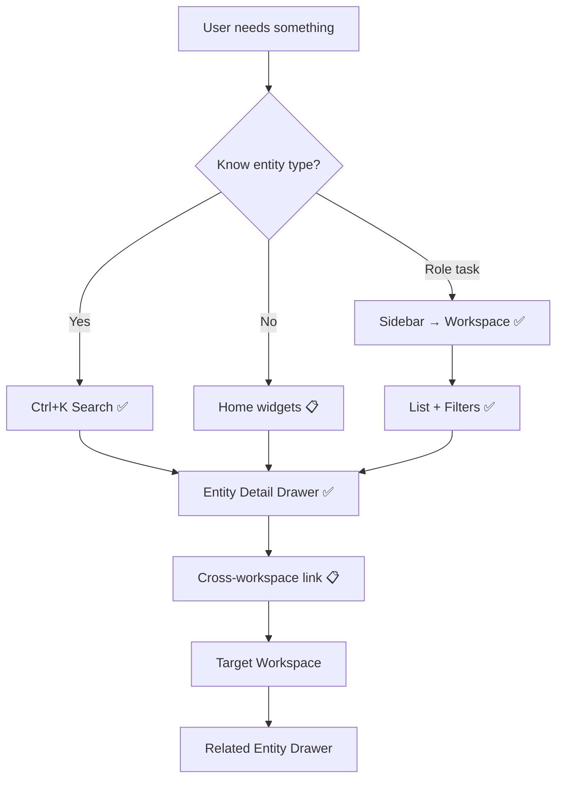

---

## SECTION 4 — SIDEBAR

The sidebar is the primary workspace switcher. Today: `sidebar-nav.tsx` ✅ — permission-gated links, brand header, admin section. Target: collapsible, personalized, searchable.

### 4.1 Layout regions

```
┌─────────────────────────┐
│ Brand (Company name)    │  ← company-context ✅
├─────────────────────────┤
│ Home link (target)      │  📋 — today: brand links to /dashboard
├─────────────────────────┤
│ ★ Favorites (target)    │  📋
│ 📌 Pinned (target)      │  📋
│ ─────────────────────── │
│ Workspaces (ordered)    │  ✅ MODULE_NAMES + Documents + Activity
│ ─────────────────────── │
│ 🕐 Recent (target)      │  📋
├─────────────────────────┤
│ Settings                │  ✅
│ Administration          │  ✅
└─────────────────────────┘
```

### 4.2 Collapsed mode 📋

| State | Width | Behavior |
|-------|-------|----------|
| **Expanded** | 240px | Full labels + badges (target; today always expanded) |
| **Collapsed** | 56px | Icons only; tooltip on hover; toggle via `[` shortcut |
| **Auto-collapse** | 1024–1279px breakpoint | Collapse by default per [INFORMATION_ARCHITECTURE.md §10](./INFORMATION_ARCHITECTURE.md#section-10--desktop-navigation) |

**Implementation today:** Fixed-width sidebar; no collapse toggle. CSS class `dashboard-shell__sidebar` in `globals.css`.

### 4.3 Expanded mode ✅

Full workspace list with:

- Active state from `pathname` ✅
- "Soon" badge for modules in `MODULE_NAMES` without dedicated routes ✅
- Permission filtering via `hasPermission` ✅
- Admin section divider ✅

**Gap:** Only 5 `MODULE_NAMES` entries appear; Inventory, Construction, Marketing, Legal, Property, AI are **not in sidebar** yet (📋 Sprint 2 stub links).

### 4.4 Favorite Workspaces 📋

| Attribute | Spec |
|-----------|------|
| **Storage** | `user_preferences.favorite_workspaces` (server) + localStorage fallback |
| **Max** | 5 favorites |
| **UI** | Star icon on hover; favorites render above main list |
| **Default** | Role-based suggestions on first login (e.g., Sales → Leads, Projects) |

### 4.5 Pinned Workspaces 📋

| Attribute | Spec |
|-----------|------|
| **Difference from favorites** | Pinned = always visible at top; admin can org-pin for all users |
| **Use case** | Company mandates Documents + Finance for all finance team |
| **Max** | 3 user pins + 2 org pins |

### 4.6 Recent Workspaces 📋

| Attribute | Spec |
|-----------|------|
| **Source** | Last 5 workspace routes visited (session + persisted) |
| **Display** | Compact list below favorites; excludes Administration |
| **Clear** | "Clear recent" in profile preferences |

### 4.7 Workspace search 📋

| Attribute | Spec |
|-----------|------|
| **Trigger** | Filter input at top of sidebar when expanded; `Ctrl+Shift+W` focuses it |
| **Scope** | Workspace titles + descriptions (TR/EN) |
| **Behavior** | Fuzzy match; Enter navigates; does not replace global entity search |
| **Relation to Ctrl+K** | Sidebar search = **where to go**; Global search = **what to find** |

### Sidebar interaction diagram

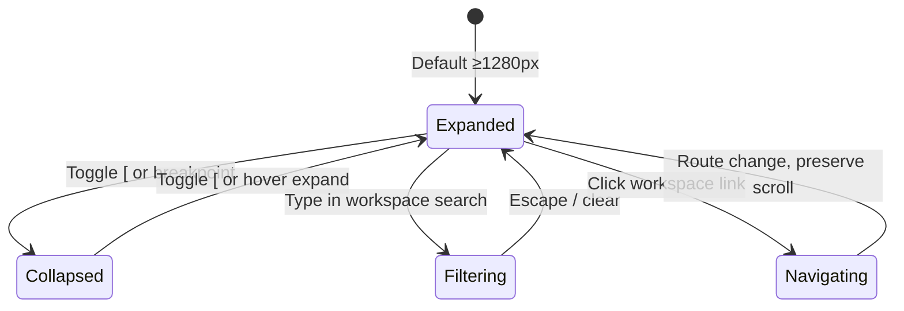

---

## SECTION 5 — WORKSPACE HOME

Each workspace has its own **Home** — a landing view before drilling into lists. Distinct from OS **Home** (`/dashboard`) which is the personal command center ([INFORMATION_ARCHITECTURE.md §3](./INFORMATION_ARCHITECTURE.md#section-3--home), [HOME_EXPERIENCE.md](./HOME_EXPERIENCE.md)).

### 5.1 Pattern

```
/dashboard/{workspace}           → Workspace Home (KPIs + quick actions + recent)
/dashboard/{workspace}/list      → Full list view (optional sub-route)
/dashboard/{workspace}?id={uuid} → List + entity drawer open (target)
```

**Today:** Workspaces render combined home+list in single page (e.g., `executive-workspace.tsx` ✅, `leads-workspace.tsx` ✅). Target: explicit Home tab or default landing section.

### 5.2 Required widgets by workspace

| Workspace | Required Home widgets | Status |
|-----------|----------------------|--------|
| **Executive Home** | Attention required, Deadlines, Summary cards, Period filter bar | ✅ |
| **Development Home** | Projects by status chart, Active count, Recent updates, Quick create project | 🟡 Stats bar ✅; chart 📋 |
| **Inventory Home** | Availability summary, Absorption rate, Expiring reservations, Import status | 📋 Blueprint |
| **Sales Home** | Pipeline funnel, New leads today, Assigned queue, Conversion rate | 🟡 Stats ✅; funnel 📋 |
| **Investors Home** | Total committed, Funding by project, Recent agreements, Commitment deadlines | 🟡 Stats ✅ |
| **Construction Home** | Drawing inbox count, Pending approvals, Projects by construction status | 📋 |
| **Finance Home** | Cash position, Obligations due (7d), Pending approvals, Budget variance | 🟡 Overview tab ✅ |
| **Marketing Home** | Leads by source, Campaign performance, Available units for promo | 📋 |
| **Legal Home** | Confidential queue, Contracts expiring, Pending reviews | 📋 |
| **Property Home** | Occupancy rate, Lease expirations (30d), Open maintenance, Rent collection | 📋 |
| **Documents Home** | Recent uploads, Processing queue, By confidentiality, Pending analysis | 🟡 List + filters ✅ |
| **Administration Home** | System health, User count, Integration status, Recent admin activity | 🟡 Settings sections ✅ |
| **AI Home** | Processing queue depth, Provider health, Approval backlog, Usage (30d) | 📋 |

### 5.3 Workspace Home layout (target)

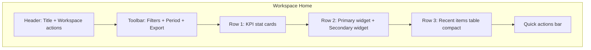

---

## SECTION 6 — WORKSPACE LAYOUT

Standard layout regions shared across all workspaces. Aligns with [INFORMATION_ARCHITECTURE.md §10](./INFORMATION_ARCHITECTURE.md#section-10--desktop-navigation) desktop regions.

### 6.1 Region map

```
┌──────────┬──────────────────────────────────────────────┬──────────┐
│          │  Header: Breadcrumb · Actions · Global bar   │          │
│ Sidebar  ├──────────────────────────────────────────────┤ AI Panel │
│          │  Toolbar: Filters · Search · View toggles    │ (opt) 📋 │
│   ✅     ├──────────────────────────────────────────────┤          │
│          │  Content: Stats · Table · Cards              │          │
│          ├──────────────────────────────────────────────┤          │
│          │  Detail Drawer (slide-over) ✅               │          │
└──────────┴──────────────────────────────────────────────┴──────────┘
```

### 6.2 Region specifications

| Region | Component (today) | Behavior | Status |
|--------|-------------------|----------|--------|
| **Header** | `dashboard__header` + `DashboardHeaderActions` | Title, eyebrow, global search/notifications/lang/profile | ✅ |
| **Toolbar** | Inline in workspace (e.g., executive filters) | Period presets, project filter, export, create | 🟡 Executive ✅; pattern varies |
| **Filters** | Workspace-specific | Persist to `localStorage` (Executive ✅) or URL params (target) | 🟡 |
| **Table** | `.admin-table` / custom lists | Sortable columns, row click → drawer, pagination | ✅ |
| **Detail Drawer** | `*-detail-drawer.tsx` per entity | Slide-over; tabs; related entities; documents; activity | ✅ |
| **Timeline** | `entity-activity-timeline.tsx` | Entity-scoped activity in drawers | ✅ |
| **AI Panel** | Document intelligence tabs | Right rail contextual Q&A (target) | 🟡 In drawer tabs |
| **Right Sidebar** | Future: related entities, notes | Collapsible; mirrors drawer tabs | 📋 |

### 6.3 Drawer tab standard (target)

All entity drawers should converge on:

1. Overview
2. Related entities (chips with cross-workspace links)
3. Documents (`entity-documents-panel.tsx` ✅)
4. Activity (`entity-activity-timeline.tsx` ✅)
5. Intelligence / AI (where applicable)
6. Finance links (where applicable)

### Layout interaction flow

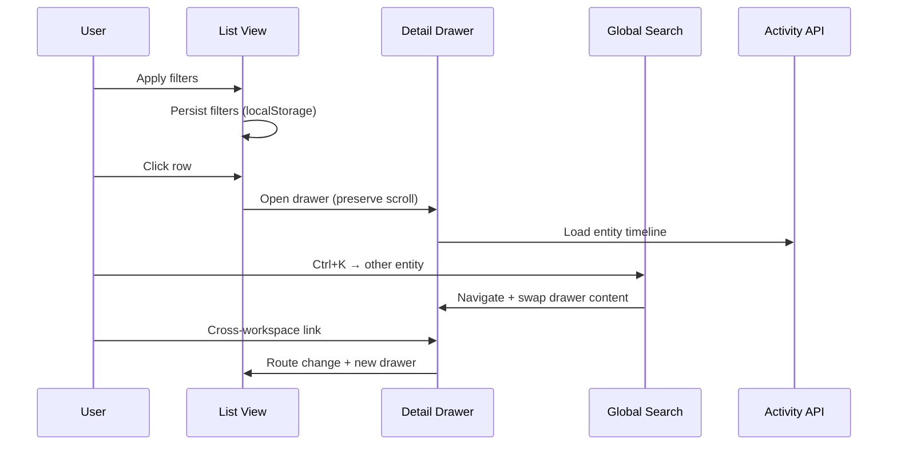

---

## SECTION 7 — WORKSPACE SWITCHING

Switching workspaces must preserve user context where safe and intentional.

### 7.1 Context preservation matrix

| State | Preserve on switch? | Storage (target) | Today |
|-------|---------------------|------------------|-------|
| **Filters** | Yes — per workspace | `localStorage` key `{workspace}_filters` | 🟡 Executive only |
| **Selected Project** | Yes — global context | `sessionStorage.global_project_id` + header chip | 📋 |
| **Selected Unit** | Yes — when Inventory ships | `sessionStorage.global_unit_id` | 📋 |
| **Search query** | Yes — if overlay open | Ephemeral in search context | ✅ |
| **Open Drawers** | Per-workspace stack | URL `?entity=&id=` per workspace | 📋 Component state |
| **Unsaved Drafts** | Warn before leave | `beforeunload` + draft registry | 📋 |
| **Scroll position** | Yes — per workspace route | `sessionStorage.scroll_{path}` | 📋 |
| **Locale / Currency** | Yes — global | Cookie + user prefs | 🟡 Locale ✅ |

### 7.2 Global context bar (target) 📋

Header chip row showing active context:

```
[ Temple Project ▾ ] [ Tower A Building ▾ ] [ TRY ▾ ]
```

Clicking a chip opens scoped filter without losing workspace.

### 7.3 Switching flow

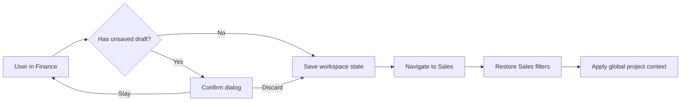

### 7.4 Implementation notes

- `GlobalSearchProvider` wraps dashboard layout ✅ — search overlay survives route changes
- `NotificationProvider` ✅ — drawer state independent of workspace
- Workspace switch via sidebar `Link` — full Next.js navigation (no SPA state bridge yet)

---

## SECTION 8 — CROSS WORKSPACE NAVIGATION

Entities connect across workspaces. Navigation must feel like **one continuous thread**, not app-hopping.

### 8.1 Example chain: Investor → Units → Construction → Documents → Payments → Marketing

| Step | From | Action | To | Status |
|------|------|--------|-----|--------|
| 1 | Investors | Open investor drawer | Investor profile + commitments | ✅ |
| 2 | Investor drawer | "Owned units" link | Inventory → filtered by `owner_id` | 📋 |
| 3 | Unit drawer | "Construction status" | Construction → project dashboard | 📋 |
| 4 | Construction | "Source drawing" link | Documents → drawing drawer | 🟡 Via Documents |
| 5 | Unit/Project drawer | "Payments" tab | Finance → transactions filtered | 🟡 Manual navigation |
| 6 | Project | "Marketing collateral" | Documents → tagged marketing | ✅ |
| 7 | Marketing (target) | "Leads from campaign" | Sales → filtered by source | 📋 |

### 8.2 Cross-workspace link pattern (target)

Every detail drawer exposes **exit ramps**:

```typescript
// Target pattern (documentation only — not implemented)
<CrossWorkspaceLink
  workspace="finance"
  href="/dashboard/finance?tab=transactions&project_id={id}"
  label={t('openInFinance')}
/>
```

**Today:** Manual sidebar navigation; related entity chips in some drawers 🟡.

### 8.3 Cross-workspace flow diagram


### 8.4 Handoff rules

| Rule | Description |
|------|-------------|
| **X1** | Cross-workspace links pass entity IDs via URL params |
| **X2** | Target workspace opens drawer automatically when `?id=` present |
| **X3** | Breadcrumb shows origin: `Investors → Ahmet Y. → Unit 14B → Finance` |
| **X4** | Permission check before link render — hide if target workspace inaccessible |
| **X5** | Activity records cross-workspace navigation as `VIEWED` with metadata |

---

## SECTION 9 — WORKSPACE PERSONALIZATION

Users tailor navigation to their daily workflow without affecting org-wide IA.

### 9.1 Personalization features

| Feature | Description | Storage | Status |
|---------|-------------|---------|--------|
| **Hide widgets** | Collapse/remove Home widgets per workspace | User prefs API | 📋 |
| **Reorder widgets** | Drag-and-drop widget grid | User prefs API | 📋 |
| **Favorite pages** | Star specific list views (e.g., "My assigned leads") | User prefs + URL | 📋 |
| **Default landing page** | Login → Home vs last workspace vs role default | User profile field | 📋 |
| **Saved layouts** | Column sets, filter presets named and saved | User prefs API | 🟡 Executive filters in localStorage |
| **Sidebar order** | Reorder visible workspaces (not org order) | User prefs | 📋 |
| **Density** | Compact vs comfortable table rows | User prefs | 📋 |

### 9.2 Role-based defaults (first login)

| Role | Default landing | Suggested favorites |
|------|-----------------|---------------------|
| `executive` | Home → Executive | Executive, Development, Finance |
| `sales` | Home → Sales | Sales, Development, Documents |
| `finance` | Finance | Finance, Executive, Documents |
| `construction` | Documents (interim) → Construction | Construction, Development, Documents |
| `investor_relations` | Investors | Investors, Finance, Documents, AI |
| `marketing` | Sales (interim) → Marketing | Marketing, Sales, Documents |

### 9.3 Personalization boundaries

- Users **cannot** hide workspaces they lack permission for (already hidden)
- Users **cannot** reorder Administration or override org-pinned workspaces
- Saved layouts are **private** unless shared (future team layouts 📋)

---

## SECTION 10 — GLOBAL CONTEXT

Global context spans all workspaces. Users set scope once; every workspace respects it.

### 10.1 Context dimensions

| Context | UI surface | Scope | Status |
|---------|------------|-------|--------|
| **Current Company** | Brand header / future switcher | All data queries | 🟡 Single-company runtime; schema multi-company ready |
| **Project** | Header chip / filter | Lists, KPIs, search | 🟡 Per-workspace project filter (Executive ✅) |
| **Workspace** | Sidebar active item | Experience layer | ✅ |
| **Building** | Inventory context | Units, floors, drawings | 📋 |
| **Inventory Asset (Unit)** | Unit chip | Sales, Finance, Property | 📋 |
| **Language** | Header selector | All UI strings | ✅ TR/EN |
| **Currency** | Header or filter | Finance, Executive aggregates | 🟡 Executive filter; no FX conversion (TD-14) |

### 10.2 Interaction model

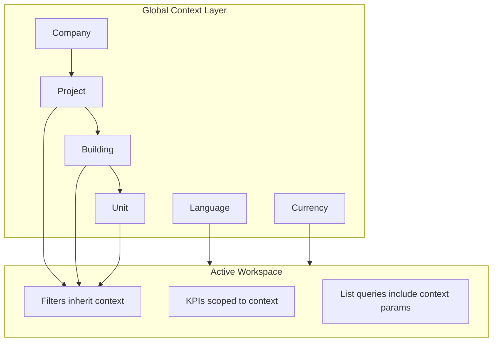

### 10.3 Context propagation rules

| Rule | Behavior |
|------|----------|
| **GC1** | Setting project context in Executive applies to next workspace until cleared |
| **GC2** | Clearing context resets to "All projects" — never implicit filter |
| **GC3** | Global search respects context when "Scoped search" toggle on (target) |
| **GC4** | Context chips persist in URL: `?context_project={uuid}` (target) |
| **GC5** | AI commands inherit context: "Show obligations" = current project |

### 10.4 Multi-company (future)

Per IAD-013: company switcher in header; reload branding via `company-context`; filter all queries by `company_id`. **Not implemented** — design now, ship in Phase F ([PRODUCT_VISION.md](./PRODUCT_VISION.md)).

---

## SECTION 11 — WORKSPACE PERMISSIONS

Workspace visibility and behavior adapt to role grants per [PERMISSION_MODEL.md](./PERMISSION_MODEL.md).

### 11.1 Visibility matrix

| Workspace | Resource | Min action | Sidebar today |
|-----------|----------|------------|---------------|
| Executive | `executive` | `view` | ✅ |
| Development | `projects` | `view` | ✅ |
| Inventory | `units` | `view` | 📋 Not in sidebar |
| Sales | `leads` | `view` | ✅ |
| Investors | `investors` | `view` | ✅ |
| Construction | `construction` | `view` | 📋 Not in sidebar |
| Finance | `finance` | `view` | ✅ |
| Marketing | `marketing` | `view` | 📋 Not in sidebar |
| Legal | `documents` | `view_confidential` | 📋 Via Documents |
| Property | TBD | `view` | 📋 |
| Documents | `documents` | `view` | ✅ |
| Administration | `settings`/`company`/`canViewAdmin` | `view` | ✅ |
| AI | `documents.analyze` + others | composite | 📋 Embedded only |
| Activity (Global) | `activity` | `view` | ✅ In sidebar |

### 11.2 Role adaptation

Workspaces **adapt** UI by role — same route, different affordances:

| Role | Workspace | Adaptation |
|------|-----------|------------|
| `read_only` | All viewable | Hide create/edit/archive buttons |
| `sales` | Sales | Full lead CRUD; no finance approve |
| `finance` | Finance | Show approve actions; hide admin |
| `construction` | Documents/Construction | Drawing approve; no confidential unless granted |
| `super_admin` | All | Full access + Administration |

**Pattern today:** `hasPermission(user, resource, action)` in components ✅.

### 11.3 Confidentiality in navigation

Navigation never bypasses document confidentiality ([PERMISSION_MODEL.md § Document Confidentiality](./PERMISSION_MODEL.md#document-confidentiality-permissions)):

- Legal workspace requires `view_confidential` minimum
- Search filters confidential docs by permission ✅
- AI panel hidden on highly confidential without `view_sensitive_analysis`

### 11.4 Permission flow diagram

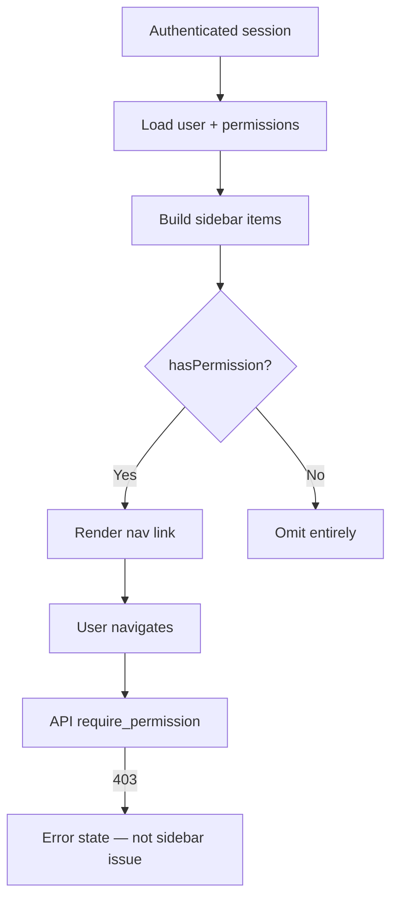

---

## SECTION 12 — WORKSPACE AI

AI is embedded in navigation — not isolated in a single workspace ([AI_PRINCIPLES.md](./AI_PRINCIPLES.md)).

### 12.1 Context awareness

| Context signal | AI use |
|----------------|--------|
| Active workspace | Suggest workspace-relevant commands |
| Open drawer entity | Scope Q&A to entity documents |
| Global project filter | Filter recommendations to project |
| User role | Limit mutation suggestions to permitted actions |
| Confidentiality level | Block external AI on confidential docs ✅ |

### 12.2 Suggested commands by workspace (target)

| Workspace | Example suggestions |
|-----------|---------------------|
| Executive | "Summarize portfolio risks", "What's due this week?" |
| Sales | "Follow up stale leads", "Draft email to {lead}" |
| Investors | "Extract commitment from uploaded agreement" |
| Construction | "Approve pending drawing proposals" |
| Finance | "Show obligations due in 7 days" |
| Documents | "Analyze this contract", "Find similar documents" |
| AI | "Queue health", "Reprocess failed documents" |

### 12.3 Recommended actions

AI surfaces **recommended actions** as cards — never auto-executing mutations:

| Action type | Presentation | Approval |
|-------------|--------------|----------|
| Navigate | Immediate | None |
| Filter/search | Immediate | None |
| Create entity | Preview modal | User confirm + permission |
| Approve workflow | Approval drawer | Explicit click |
| Financial post | Confirmation + `finance.approve` | Required |

### 12.4 AI navigation surfaces

| Surface | Location | Status |
|---------|----------|--------|
| Global Search / Command Bar | `Ctrl+K` overlay | 🟡 Search ✅; NL commands 📋 |
| Entity drawer intelligence tabs | Document, Investor drawers | 🟡 |
| Workspace AI Home widgets | AI workspace | 📋 |
| Right rail AI panel | Docked Q&A | 📋 |
| Morning Brief | OS Home widget | 📋 |

---

## SECTION 13 — NAVIGATION PERFORMANCE

Desktop-first performance targets for navigation responsiveness.

### 13.1 Strategies

| Strategy | Application | Status |
|----------|-------------|--------|
| **Lazy loading** | Workspace pages code-split via Next.js dynamic imports | 🟡 Default Next.js |
| **Caching** | SWR/React Query for list data; stale-while-revalidate | 🟡 Ad-hoc fetch |
| **Prefetching** | Prefetch sidebar link routes on hover | 📋 |
| **Optimistic UI** | Mark notification read before API confirm | ✅ |
| **Skeleton states** | Executive sections use skeleton ✅ | 🟡 |
| **Search debounce** | `SEARCH_DEBOUNCE_MS` ✅ | ✅ |
| **Drawer lazy tabs** | Load intelligence tab on first open | 🟡 |

### 13.2 Performance budgets (target)

| Metric | Target |
|--------|--------|
| Workspace route transition | < 200ms perceived (shell visible) |
| List first paint | < 500ms with skeleton |
| Drawer open | < 300ms with cached entity |
| Search results | < 400ms debounced |
| Sidebar collapse animation | 150ms |

### 13.3 Keyboard shortcuts

See **Keyboard Model** deliverable below and [INFORMATION_ARCHITECTURE.md §8](./INFORMATION_ARCHITECTURE.md#section-8--ai-command-bar).

---

## SECTION 14 — WORKSPACE PRINCIPLES

Twenty principles governing workspace navigation design and implementation.

| # | Principle | Source alignment |
|---|-----------|------------------|
| W1 | Workspaces are views, not databases | [WORKSPACE_ARCHITECTURE.md](./WORKSPACE_ARCHITECTURE.md) |
| W2 | One entity, many workspaces | IA P2 |
| W3 | Workspace owns experience, SSOT owns data | IA P8, P9 |
| W4 | Permission-first sidebar | IA P11, [PERMISSION_MODEL.md](./PERMISSION_MODEL.md) |
| W5 | Global search before menus | IA P6 |
| W6 | AI globally available, never hidden | IA P5 |
| W7 | Drawer-over-full-page for entity detail | IA P13 |
| W8 | No dead-end detail views | IA P12 |
| W9 | Cross-workspace links with context handoff | Section 8 |
| W10 | Filters persist per workspace | Section 7 |
| W11 | Honest "Soon" badges | IA P14 |
| W12 | TR/EN labels ship together | IA P15, [NAMING_CONVENTIONS.md](./NAMING_CONVENTIONS.md) |
| W13 | Desktop-first, mobile-degrades | IA P16 |
| W14 | Incremental workspace delivery | IA P17 |
| W15 | Activity in every entity drawer | IA P18 |
| W16 | Documents attach anywhere | IA P19 |
| W17 | Confidentiality follows the document | IA P20 |
| W18 | Administration is config, not operations | Section 2.12 |
| W19 | Home ≠ Executive dashboard | IA P7 |
| W20 | Register new workspace in permissions + search + activity before UI | [INFORMATION_ARCHITECTURE.md §12](./INFORMATION_ARCHITECTURE.md#section-12--expansion-rules) |

---

## SECTION 15 — NAVIGATION MAP

### 15.1 Complete navigation tree

```
Investhome OS
├── Auth
│   └── /login ✅
│
├── Home (Personal Command Center)
│   └── /dashboard 🟡 (target widgets; today: module launcher grid)
│
├── Workspaces
│   ├── Executive          /dashboard/executive ✅
│   │   └── Workspace Home: Summary · Attention · Deadlines · Portfolio · Export
│   ├── Development        /dashboard/projects ✅
│   │   └── List · Stats · Project drawer · Create/edit
│   ├── Inventory          /dashboard/inventory 📋
│   │   └── Portfolio · Building · Floor · Unit drawer (12 tabs) · Reservations
│   ├── Sales              /dashboard/leads ✅
│   │   └── Pipeline · Stats · Lead drawer · Archive
│   ├── Investors          /dashboard/investors ✅
│   │   └── List · Stats · Investor drawer · Document AI
│   ├── Construction       /dashboard/construction 📋
│   │   └── Drawing inbox · Approval queue · Project construction dashboard
│   ├── Finance            /dashboard/finance ✅
│   │   ├── Overview
│   │   ├── Accounts
│   │   ├── Transactions (+ drawer)
│   │   ├── Payment obligations
│   │   ├── Funding commitments
│   │   └── Budgets
│   ├── Marketing          /dashboard/marketing 📋
│   │   └── Campaign dashboard · Lead sources · Collateral · Available units
│   ├── Legal              /dashboard/legal 📋
│   │   └── Confidential queue · Contract registry · Compliance calendar
│   ├── Property           /dashboard/property-management 📋
│   │   └── Occupancy · Leases · Tenants · Rent roll
│   ├── Documents          /dashboard/documents ✅
│   │   └── List · Upload · Document drawer · Intelligence · Drawing
│   ├── Administration
│   │   ├── Settings       /dashboard/settings ✅ (12 sections)
│   │   ├── Users          /dashboard/admin/users ✅
│   │   ├── Roles          /dashboard/admin/roles ✅
│   │   └── Permissions    /dashboard/admin/permissions ✅
│   └── AI                 /dashboard/ai 📋
│       └── Brain dashboard · Queue · Approvals · Usage · Providers link
│
├── Global
│   ├── Search             Overlay (Ctrl+K) ✅
│   ├── AI Command         Overlay extension 📋
│   ├── Notifications      Header drawer ✅
│   ├── Tasks              /dashboard/tasks 📋
│   ├── Calendar           /dashboard/calendar 📋
│   ├── Messages           /dashboard/messages 📋
│   ├── Reports            /dashboard/reports 📋
│   └── Activity           /dashboard/activity ✅
│
└── Profile
    └── /dashboard/profile ✅
        ├── Identity
        ├── Password
        └── Preferences (target: default workspace, favorites)
```

### 15.2 Mermaid navigation map

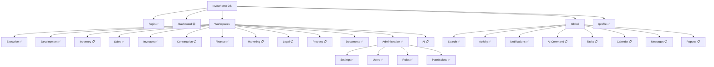

### 15.3 Workspace ↔ route ↔ permission matrix

| # | Workspace | Route | Permission | Impl |
|---|-----------|-------|------------|------|
| — | Home | `/dashboard` | Auth | 🟡 |
| 1 | Executive | `/dashboard/executive` | `executive.view` | ✅ |
| 2 | Development | `/dashboard/projects` | `projects.view` | ✅ |
| 3 | Inventory | `/dashboard/inventory` | `units.view` (planned) | 📋 |
| 4 | Sales | `/dashboard/leads` | `leads.view` | ✅ |
| 5 | Investors | `/dashboard/investors` | `investors.view` | ✅ |
| 6 | Construction | `/dashboard/construction` | `construction.view` | 📋 |
| 7 | Finance | `/dashboard/finance` | `finance.view` | ✅ |
| 8 | Marketing | `/dashboard/marketing` | `marketing.view` | 📋 |
| 9 | Legal | `/dashboard/legal` | `documents.view_confidential` | 🟡 |
| 10 | Property | `/dashboard/property-management` | TBD | 📋 |
| 11 | Documents | `/dashboard/documents` | `documents.view` | ✅ |
| 12 | Administration | `/dashboard/settings`, `/admin/*` | `settings.view`, `canViewAdmin` | ✅ |
| 13 | AI | `/dashboard/ai` | `documents.analyze`, etc. | 🟡 |

---

## SECTION 16 — FUTURE EXPANSION

Adding workspaces without breaking navigation. Canonical checklist: [INFORMATION_ARCHITECTURE.md §12](./INFORMATION_ARCHITECTURE.md#section-12--expansion-rules), [WORKSPACE_ARCHITECTURE.md](./WORKSPACE_ARCHITECTURE.md).

### 16.1 Naming

| Element | Pattern | Example |
|---------|---------|---------|
| Route slug | kebab-case | `/dashboard/property-management` |
| Permission resource | snake_case plural | `units`, `construction` |
| i18n key | `navigation.modules.{code}.title` | `navigation.modules.inventory.title` |
| Sidebar label | User-facing IA name | "Inventory" not "Units" |
| API prefix | Plural resource | `/api/units` |

Resolve open decisions MD-01 through MD-03 ([INFORMATION_ARCHITECTURE.md Missing Decisions](./INFORMATION_ARCHITECTURE.md#deliverable-missing-decisions)).

### 16.2 Icons 📋

| Workspace | Icon metaphor (Lucide-style) |
|-----------|------------------------------|
| Executive | `LayoutDashboard` |
| Development | `Building2` |
| Inventory | `Grid3x3` |
| Sales | `UserPlus` |
| Investors | `Landmark` |
| Construction | `HardHat` |
| Finance | `Wallet` |
| Marketing | `Megaphone` |
| Legal | `Scale` |
| Property | `Home` |
| Documents | `FileText` |
| Administration | `Settings` |
| AI | `Sparkles` |

No icon library standardized today ([DESIGN_SYSTEM.md](./DESIGN_SYSTEM.md)).

### 16.3 Ordering

Insert by **business priority**, not alphabetically:

1. Strategic → 2. Core ops → 3. Capital → 4. Execution → 5. Governance → 6. Platform

### 16.4 Localization

All new workspaces ship **TR + EN** simultaneously:

```json
// messages/tr.json + en.json (target)
"navigation": {
  "modules": {
    "inventory": {
      "title": "Envanter",
      "description": "Satılabilir stok yönetimi"
    }
  }
}
```

### 16.5 Expansion checklist

1. IAD proposal if new domain entity
2. Permission resource in `permissions_config.py`
3. Role grants in `DEFAULT_ROLE_PERMISSIONS`
4. API routes + services (SSOT)
5. Web route under `/dashboard/`
6. Sidebar link with `hasPermission`
7. Search registration in `search_config.py`
8. Activity registration in `activity_config.py`
9. TR/EN labels
10. Update IMPLEMENTATION_STATUS + this document
11. Workspace Home widgets spec
12. Cross-workspace link handlers

---

## SECTION 17 — ACCEPTANCE CRITERIA

Measurable criteria for navigation system "done" (target state).

### 17.1 Sidebar

| # | Criterion | Measure |
|---|-----------|---------|
| AC-01 | All 13 workspaces visible in sidebar (with permission) | Manual QA checklist |
| AC-02 | Unimplemented workspaces show "Soon" badge | Visual + i18n |
| AC-03 | Sidebar collapses at ≤1279px | Responsive test |
| AC-04 | Favorites persist across sessions | API + E2E test |
| AC-05 | Workspace search finds all permitted workspaces | Unit test |

### 17.2 Context & switching

| # | Criterion | Measure |
|---|-----------|---------|
| AC-06 | Filters persist per workspace on switch back | E2E test |
| AC-07 | Global project context applies across workspaces | Integration test |
| AC-08 | Drawer opens from URL `?entity=&id=` | E2E + shareable link test |
| AC-09 | Unsaved draft warns before workspace leave | E2E test |

### 17.3 Cross-workspace

| # | Criterion | Measure |
|---|-----------|---------|
| AC-10 | Every entity drawer has ≥1 cross-workspace link | UI audit |
| AC-11 | Cross-workspace link respects permissions | Permission test |
| AC-12 | Investor → Unit → Finance chain completable in ≤5 clicks | UX test (when Inventory ships) |

### 17.4 Global & AI

| # | Criterion | Measure |
|---|-----------|---------|
| AC-13 | `Ctrl+K` works from every workspace | E2E |
| AC-14 | AI command suggests role-appropriate actions | Manual QA |
| AC-15 | Navigation completes in <200ms perceived | Performance trace |

### 17.5 i18n & accessibility

| # | Criterion | Measure |
|---|-----------|---------|
| AC-16 | All nav labels in TR + EN | i18n audit |
| AC-17 | Sidebar keyboard navigable | a11y audit |
| AC-18 | Screen reader announces workspace change | a11y audit |

---

## SECTION 18 — NEXT SPRINT

### Recommended Sprint 2: Design System (documentation only)

**Goal:** Produce a cohesive visual and interaction design system spec that navigation implementation can consume — **no React UI implementation**.

| Deliverable | Description |
|-------------|-------------|
| **Design tokens spec** | Extract spacing, typography, color, elevation from `globals.css` into documented token table |
| **Icon system decision** | Choose Lucide (recommended) + workspace icon map |
| **Sidebar component spec** | Collapsed/expanded states, favorites, badges, section dividers |
| **Shell layout grid** | Header, toolbar, content, drawer, AI panel breakpoints |
| **Component catalog** | Extend `@investhome/ui` inventory with navigation primitives (NavItem, WorkspaceCard, ContextChip) |
| **Drawer pattern guide** | Standard tabs, cross-workspace links, loading/error states |
| **Widget grid spec** | Home + Workspace Home widget sizes, drag-drop behavior |
| **Motion guidelines** | Drawer slide, sidebar collapse, overlay fade durations |
| **Accessibility checklist** | Focus order, ARIA labels, keyboard map validation |
| **Dark mode readiness** | Token structure for future theme (documentation only) |

### Sprint 2 exit criteria

- Design system doc v1.1 updating [DESIGN_SYSTEM.md](./DESIGN_SYSTEM.md)
- Figma-equivalent wireframes (or structured markdown mocks) for sidebar states + 3 workspace layouts
- Engineering estimate for Sprint 3 (first navigation implementation slice)
- Resolved MD-01 through MD-05 from [INFORMATION_ARCHITECTURE.md](./INFORMATION_ARCHITECTURE.md)

### Recommended Sprint 3 (first implementation — post Sprint 2)

1. Sidebar restructure: all 13 workspace stubs + "Soon" badges
2. Collapsible sidebar + keyboard toggle
3. URL drawer state (`?entity=&id=`)
4. Home widget shell (Continue Working + Critical Alerts)
5. Cross-workspace link component in existing drawers

---

## DELIVERABLE: KEYBOARD MODEL

Global and workspace keyboard shortcuts.

| Shortcut | Action | Scope | Status |
|----------|--------|-------|--------|
| `Ctrl+K` / `⌘K` | Open global search | Global | ✅ |
| `Ctrl+Shift+K` | Open AI command mode | Global | 📋 |
| `Escape` | Close overlay/drawer | Global | ✅ |
| `↑` `↓` | Navigate search results | Search overlay | ✅ |
| `Enter` | Select search result | Search overlay | ✅ |
| `Tab` | Switch search ↔ command mode | Search overlay | 📋 |
| `[` | Toggle sidebar collapse | Global | 📋 |
| `Ctrl+Shift+W` | Focus workspace search | Sidebar | 📋 |
| `Ctrl+1`–`Ctrl+9` | Jump to favorite workspace 1–9 | Global | 📋 |
| `G then H` | Go Home | Global | 📋 |
| `G then E` | Go Executive | Global | 📋 |
| `G then F` | Go Finance | Global | 📋 |
| `?` | Show keyboard help overlay | Global | 📋 |

### Keyboard flow

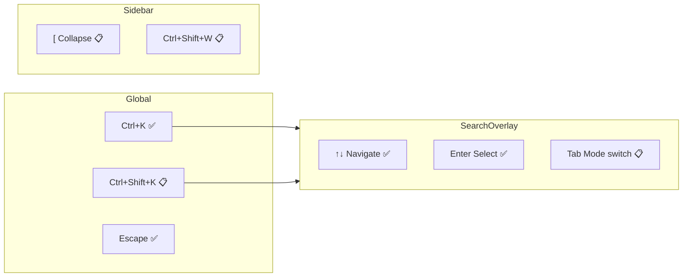

---

## DELIVERABLE: INTERACTION DIAGRAMS

### Primary navigation loop

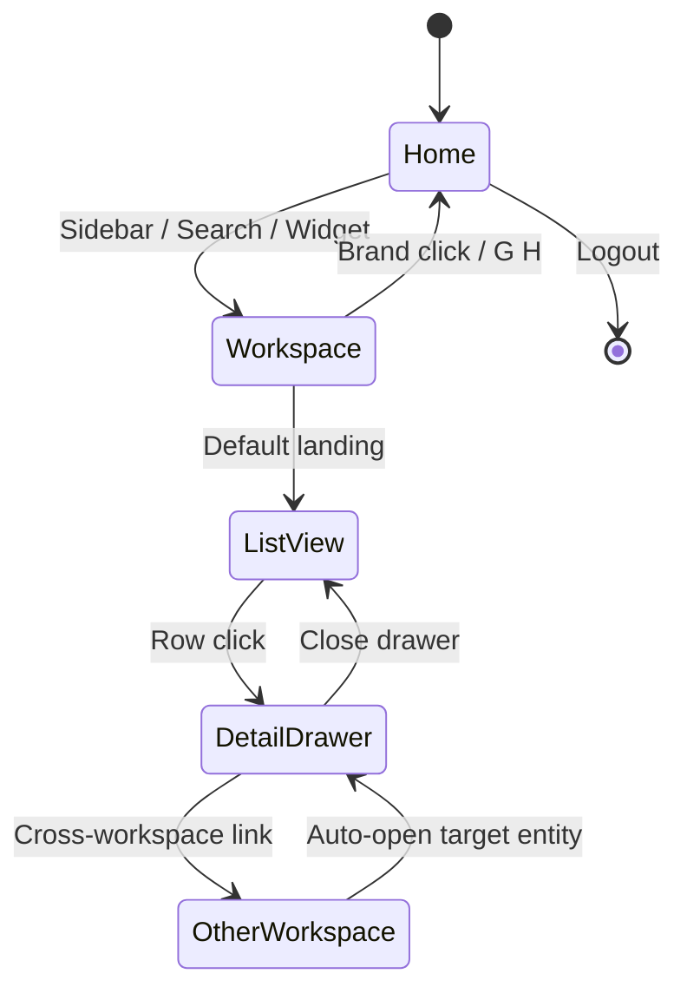

### Global overlay stack

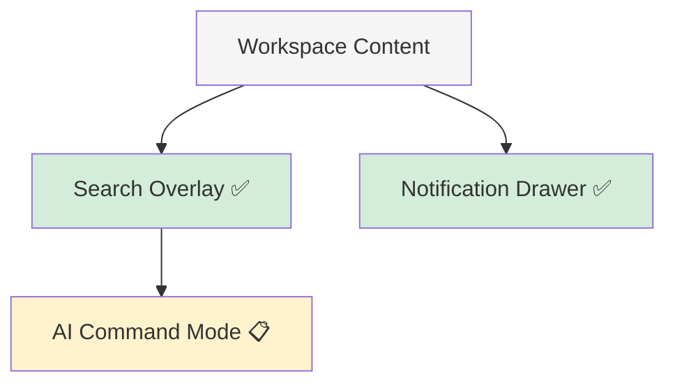

---

## DELIVERABLE: RISKS

| # | Risk | Severity | Mitigation |
|---|------|----------|------------|
| RN-01 | **IA–implementation naming drift** (Leads/Sales, Projects/Development) | High | Resolve MD-02/MD-03; align i18n + routes in Sprint 2 |
| RN-02 | **Sidebar overcrowding** with 13 workspaces | Medium | Collapsible groups; favorites; role-based default visibility |
| RN-03 | **Context preservation complexity** across Next.js navigations | High | URL-first state (`?entity=&id=`, `?context_project=`); sessionStorage bridge |
| RN-04 | **Inventory delay blocks** cross-workspace Sales→Unit flows | Critical | Prioritize Units S1 per [ROADMAP.md](./ROADMAP.md) |
| RN-05 | **Drawer URL state** vs security (shareable confidential links) | Medium | Permission re-check on drawer open; no token in URL |
| RN-06 | **Personalization schema** not in domain model | Medium | Add `user_preferences` JSON column or table in Sprint 3 |
| RN-07 | **Performance** with 13 lazy-loaded workspaces | Low | Prefetch favorites; shared layout shell already loaded |
| RN-08 | **AI command safety** in navigation context | High | Read vs mutation separation; confirmation previews |
| RN-09 | **Mobile navigation divergence** | Medium | Strict desktop-first; document mobile tab bar separately (IA §11) |
| RN-10 | **HOME_EXPERIENCE dependency** — Home widgets undefined in code | Medium | Sprint 1B doc or IA §3 as interim spec |

---

## DELIVERABLE: RECOMMENDATIONS

| # | Recommendation | Priority | Rationale |
|---|----------------|----------|-----------|
| REC-N01 | Resolve naming (MD-02, MD-03) before sidebar restructure | P0 | Unblocks i18n, search, user mental model |
| REC-N02 | Add all 13 workspace stubs to sidebar with "Soon" badges | P1 | Sets expectations; matches permission gates |
| REC-N03 | Adopt `?entity=&id=` URL pattern for drawers | P1 | Enables shareable links, back-button, context preservation |
| REC-N04 | Implement global project context chip in header | P1 | Unblocks cross-workspace filtering |
| REC-N05 | Extract standard WorkspaceLayout wrapper | P2 | Consistent toolbar/filter/drawer regions |
| REC-N06 | Build CrossWorkspaceLink component | P2 | Completes Section 8 chains |
| REC-N07 | Extend filter persistence pattern from Executive to all workspaces | P2 | Executive `EXECUTIVE_FILTER_STORAGE_KEY` as template |
| REC-N08 | Design System Sprint 2 before navigation implementation Sprint 3 | P1 | Tokens + icons required for sidebar collapse |
| REC-N09 | Register `units` permission before Inventory sidebar link | P0 | Required for AC-01 |
| REC-N10 | Move Activity to Global zone in header; retain sidebar shortcut | P2 | Aligns with 5-zone top-level nav (IA §2) |

---

## APPENDIX A — CURRENT IMPLEMENTATION REFERENCE

| File | Purpose | Status |
|------|---------|--------|
| `apps/web/src/app/dashboard/_components/sidebar-nav.tsx` | Sidebar navigation | ✅ |
| `apps/web/src/app/dashboard/layout.tsx` | Shell providers + layout | ✅ |
| `apps/web/src/app/dashboard/page.tsx` | Home module grid | 🟡 |
| `apps/web/src/app/dashboard/_components/global-search-palette.tsx` | Search overlay | ✅ |
| `apps/web/src/app/dashboard/_components/dashboard-header-actions.tsx` | Header global actions | ✅ |
| `packages/shared/src/module-names.ts` | `MODULE_NAMES` constant | ✅ (5 modules) |

---

## APPENDIX B — GOVERNANCE CROSS-REFERENCE

| Topic | Document |
|-------|----------|
| Top-level zones (Home, Workspaces, Global, Admin, Profile) | [INFORMATION_ARCHITECTURE.md §2](./INFORMATION_ARCHITECTURE.md#section-2--top-level-navigation) |
| Home widgets | [INFORMATION_ARCHITECTURE.md §3](./INFORMATION_ARCHITECTURE.md#section-3--home) · [HOME_EXPERIENCE.md](./HOME_EXPERIENCE.md) |
| Workspace catalog | [INFORMATION_ARCHITECTURE.md §4](./INFORMATION_ARCHITECTURE.md#section-4--workspaces) · [WORKSPACE_ARCHITECTURE.md](./WORKSPACE_ARCHITECTURE.md) |
| Entity navigation | [INFORMATION_ARCHITECTURE.md §6](./INFORMATION_ARCHITECTURE.md#section-6--entity-navigation) |
| Desktop layout | [INFORMATION_ARCHITECTURE.md §10](./INFORMATION_ARCHITECTURE.md#section-10--desktop-navigation) |
| Expansion rules | [INFORMATION_ARCHITECTURE.md §12](./INFORMATION_ARCHITECTURE.md#section-12--expansion-rules) |
| Site map | [INFORMATION_ARCHITECTURE.md §14](./INFORMATION_ARCHITECTURE.md#section-14--site-map) |
| Permissions | [PERMISSION_MODEL.md](./PERMISSION_MODEL.md) |
| Units screens | [UNITS_INVENTORY_BLUEPRINT.md](./UNITS_INVENTORY_BLUEPRINT.md) |
| Implementation truth | [IMPLEMENTATION_STATUS.md](./IMPLEMENTATION_STATUS.md) |

---

*Product Design Sprint 1C — Workspace Navigation System v1.0. Documentation only — no UI implementation in this sprint.*
