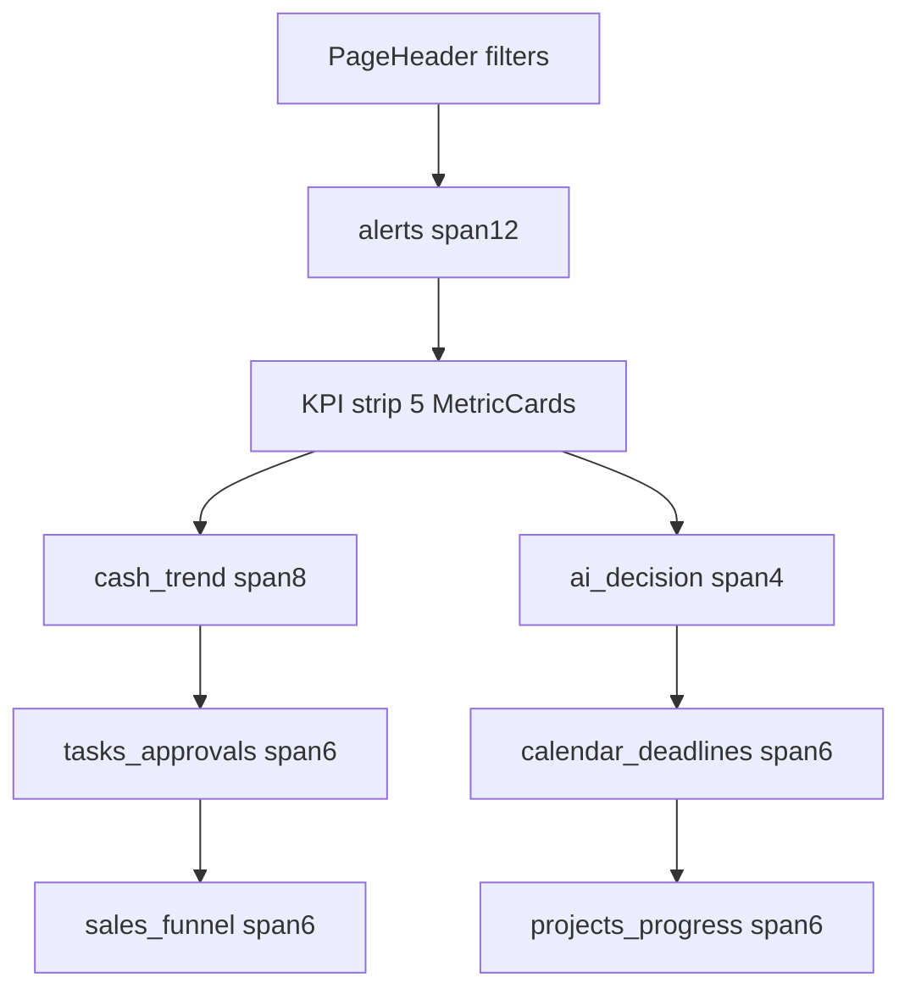
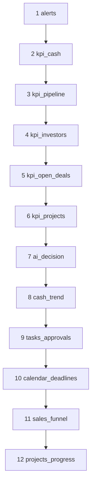

# Executive Dashboard Grid Blueprint (D1B)

**Grid system:** Design System `DashboardGrid` — 12-col desktop / 8-col tablet / 1-col mobile.  
**Gaps:** 24px desktop · 16px mobile.  
**Widget surface:** `WidgetShell` / `MetricCard` with `--shadow-card`, independent borders — never a shared chart canvas.

---

## Widget independence rules

1. Each widget is its own `WidgetShell` (or MetricCard in the KPI strip).  
2. Calendar, Tasks/Approvals, Communications, and AI are **four separate widgets**.  
3. Sales funnel and cash trend never share one chart surface.  
4. Right rail cards do not steal L1/L2 visual priority.  
5. Loading / empty / error are per-widget.  
6. No nested “card inside card” for metrics already in MetricCard.

---

## Desktop 1440 — default 12 widgets

Row structure (12 columns):

```
Row 0 — Chrome: PageHeader (title, period filters, refresh) — full width
Row 1 — L1 Alerts:  [ exec.alerts Span 12 ]
Row 2 — L2 KPIs:    [ cash  ][ pipeline ][ investors ][ open deals ][ projects ]
                    (each ~span 2–3 via WidgetColumn; five MetricCards)
Row 3 — L3/L5 + B:  [ exec.cash_trend Span 8 ][ exec.ai_decision Span 4 ]
Row 4 — L6:         [ exec.tasks_approvals Span 6 ][ exec.calendar_deadlines Span 6 ]
Row 5 — L4/L7:      [ exec.sales_funnel Span 6 ][ exec.projects_progress Span 6 ]
```

### ASCII — 1440

```
+----------------------------------------------------------------------------------------+
| PageHeader · Yönetici Özeti · filters · refresh                                          |
+----------------------------------------------------------------------------------------+
| WidgetShell: Uyarı Merkezi                                              span 12         |
+----------------------------------------------------------------------------------------+
| Metric | Metric | Metric | Metric | Metric                                              |
| Cash   | Pipe   | Inv    | Deals  | Proj                                                |
+---------------------------------------------+------------------------------------------+
| WidgetShell: Nakit akışı (AreaChart)  sp 8  | WidgetShell: Karar / AI      span 4     |
+---------------------------------------------+------------------------------------------+
| Tasks & Approvals              span 6       | Calendar & Deadlines          span 6     |
+---------------------------------------------+------------------------------------------+
| Sales Funnel                   span 6       | Project Progress              span 6     |
+---------------------------------------------+------------------------------------------+
```

### Mermaid — 1440



---

## Desktop 1280 — same IA, tighter spans

```
Row 1: alerts 12
Row 2: KPIs wrap to 3+2 if needed (still one strip semantically)
Row 3: cash_trend 8 | ai 4  (ai may drop description lines)
Row 4: tasks 6 | calendar 6
Row 5: sales 6 | projects 6
```

Avoid introducing a persistent right rail at 1280 if it forces KPI crowding — prefer stacking AI in Row 3.

### ASCII — 1280

```
+--------------------------------------------------------------------+
| Alerts                                                        12   |
+--------------------------------------------------------------------+
| KPI | KPI | KPI | KPI | KPI                                        |
+--------------------------------------+-----------------------------+
| Cash trend                        8  | AI                      4   |
+--------------------------------------+-----------------------------+
| Tasks                           6    | Calendar                  6 |
+--------------------------------------+-----------------------------+
| Sales                           6    | Projects                  6 |
+--------------------------------------+-----------------------------+
```

---

## Tablet (8-col)

CSS maps DS grid to 8 columns. Span mapping:

| Widget | Desktop span | Tablet span |
|--------|-------------:|------------:|
| alerts | 12 | 8 |
| each KPI | 2–3 | 4 (2 per row) or 8 stacked pairs |
| cash_trend | 8 | 8 |
| ai_decision | 4 | 8 (full width under trend) |
| tasks | 6 | 8 |
| calendar | 6 | 8 |
| sales | 6 | 8 |
| projects | 6 | 8 |

### ASCII — tablet

```
+------------------------------------------+
| Alerts                                 8 |
+------------------------------------------+
| KPI | KPI                                |
| KPI | KPI                                |
| KPI                                      |
+------------------------------------------+
| Cash trend                             8 |
+------------------------------------------+
| AI decision                            8 |
+------------------------------------------+
| Tasks                                  8 |
+------------------------------------------+
| Calendar                               8 |
+------------------------------------------+
| Sales funnel                           8 |
+------------------------------------------+
| Projects                               8 |
+------------------------------------------+
```

---

## Mobile (1-col) — exact order by executive priority

| Order | Widget ID | Rationale |
|------:|-----------|-----------|
| 1 | `exec.alerts` | Q1 attention first |
| 2 | `exec.kpi_cash` | Q2 health |
| 3 | `exec.kpi_pipeline` | Q2/Q3 |
| 4 | `exec.kpi_investors` | Q2/Q3 |
| 5 | `exec.kpi_open_deals` | Q3 |
| 6 | `exec.kpi_projects` | Q2 |
| 7 | `exec.ai_decision` | Advisory after facts |
| 8 | `exec.cash_trend` | Financial movement |
| 9 | `exec.tasks_approvals` | Owned work |
| 10 | `exec.calendar_deadlines` | Time-bound (separate) |
| 11 | `exec.sales_funnel` | Commercial depth |
| 12 | `exec.projects_progress` | Portfolio depth |

Secondary (if enabled): communications → investor_pulse → finance_snapshot → activity → marketing_pulse → construction → quick_actions.

### ASCII — mobile

```
+------------------+
| Alerts           |
+------------------+
| KPI Cash         |
| KPI Pipeline     |
| KPI Investors    |
| KPI Open deals   |
| KPI Projects     |
+------------------+
| AI decision      |
+------------------+
| Cash trend       |
+------------------+
| Tasks/Approvals  |
+------------------+
| Calendar         |
+------------------+
| Sales funnel     |
+------------------+
| Projects         |
+------------------+
```

### Mermaid — mobile order



---

## Optional right rail (wide ≥1440 customization)

Only when user enables activity/quick actions without removing defaults:

```
Main 8–9 cols | RightRail 3–4 cols: quick_actions, activity, footnotes
```

AI remains in main grid (or rail) but **never** inside calendar/tasks/communications shells.

---

## Prototype note

Visual demonstration lives at `/dashboard/admin/design-system/executive-dashboard` using the same span intent and mobile `data-mobile-order` attributes for tests. Prototype data is demo-only.

**D1C visual refinement** extends the prototype with investor, marketing, communications, and quick-actions while preserving P0–P1 priority. Final mobile order (including secondary widgets shown in the D1C prototype) is documented in [executive-dashboard-visual-direction.md](./executive-dashboard-visual-direction.md) and [d1c-visual-qa.md](./d1c-visual-qa.md).

---

*Grid blueprint for D1C visual prototype and D1D production implementation.*
